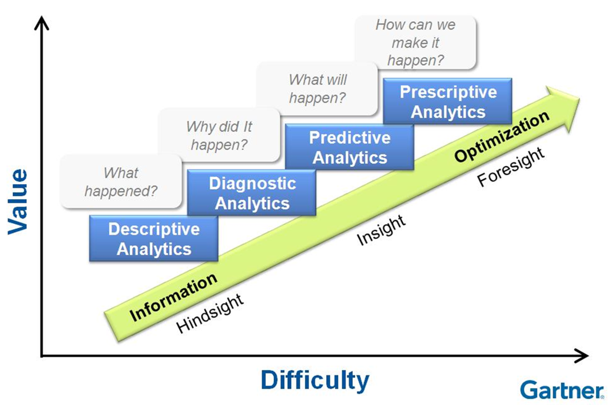
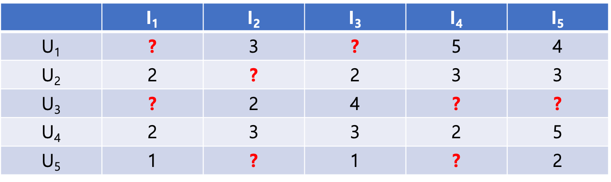
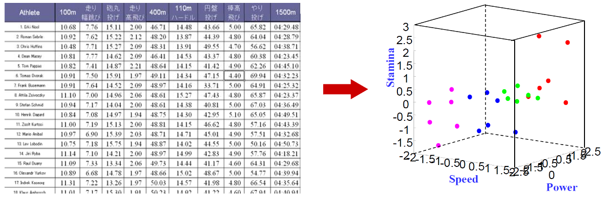
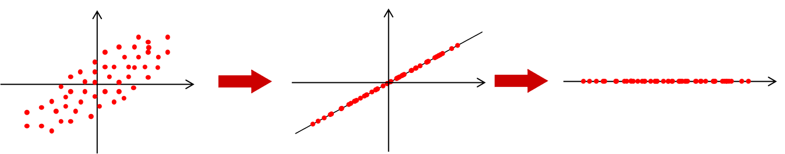
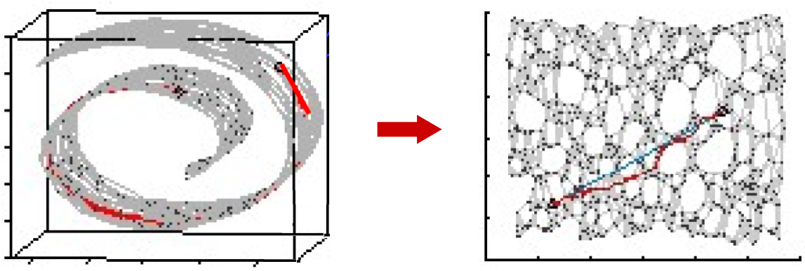

# 기계 학습론 - 데이터 분석Data Analysis 

데이터에서 아래 패턴을 찾아네는 것이 데이터 분석(Data Analysis)이다.  

- Valid(확실)  
- Novel(새로운)  
- Useful(유용한)  
- Understandable(이애할수있는)  

이미 알고있는 것 보단 기존에 알지못했던 새로운 위와 같은 패턴을 찾아내느 것이 데이터 분석의 목적이다.  

많은 기계학습 방식이 있지만 이를 관통하는 기본 컨셉은 모두 동일하다.

## 분석 방법들

**Descriptive Analytics (기술 분석)**
사실 묘사, 데이터를 보고 어떤일이 발생했는지 분석, 과거에 일어난 현상을 분석

**Diagnostic Analytics (진단 분석)**
진단, 데이터를 기반으로 왜 이런일이 일어났는지 판단, 분석 

**Predictive Analytics (예측 분석)**
예측, 수행되지 않은 일의 결과를 예측, 예로 공장내부의 여러 변수(온도, 습도, 전려 등) 으로 인해 불량률이 Dataset 으로 있다면 이를 사용해 앞으로 나올 불량률도 예측할 수 있다.
은행에서도 개인 소비내역을 통해 돈을 빌려주면 갚을수있는지 예측해 신용평가를 결정한다.

**Prescriptive Analytics (처방)**
예측한 일을 일어날 수 있도록 조작 할 수 있다면

## 데이터 분석을 통해 해결하는 다양한 문제들

대부분 **Descriptive Analytics , Predictive Analytics** 2가지 해결 방안으로 나뉜다.

이 문제들을 해결하기 위해 아래와 같은 다양한 분석 기법을 사용한다.  

- linear regression  
- support vector machine  
- decision tree  
- random forest  
- neural network  

## Descriptive Analytics(기술분석)

기술 분석에서는 아래 종류의 스킬들이 포함된다.  

**Clustering**
군집화, 그룹으로 나눔
대부분의 데이터가 여러 칼럼(차원)으로 이루어지기 때문에 단순 그룹화 하기란 쉽지 않다.

**Association**
연관성 찾기, 맥주 와 땅콩, 원숭이와 바나나
동시 같이 발생하는 데이터를 찾는게 일반적, 장바구니에 동시에 같이 존재하는 데이터 셋이 있다면 그로인해 상품의 연관관계를 찾아낼 수 있을 것.

**Dimension Reduction**
차원 감소, 너무 많은 칼럼(차원) 을 사용하고 있다면 낮은 데이터 연산을 위해 차원을 낮춤
어떻게 하면 데이터는 많이 줄이면서 표현은 풍부하게 할 수 있을지 결정해야 한다.

**Hidden Structure Analysis**
구조 탐색, 수많은 데이터들의 일정한 구조를 찾아내는 것

## Predictive Analytics(예측 분석)

`Predictive Analytics` 은 아래 과정으로 이루어 진다.  

데이터 -> 각종 분석기법 -> 데이터 예측 모델

input 과 result 에 대한 리스트를 가지고 있을때 
input 에 대응하는 result 를 출력하는 함수를 `Universal Approximator`(보편적 추정기) 라한다.  

`Universal Approximator` 을 통해 일어날 데이터를 예측하는 것에 기반한다.  

약간의 오차는 있더라도 어느정도 허용범위 안에 있는 함수, 이 함수를 찾아내는 것이 `Predictive Analytics` 에서 사용하는 분석 기법의 목표이다.  

`Universal Approximator` 를 잘 구하면 다음에 새로운 input 이 오면 그로 인해 발생할 result 를 예측할 수 있다.  

$$
f(x_1, x_2, ..., x_n ; w_1, w_2, ..., w_n)
$$

`Universal Approximator` 는 식으로 위와 같이 표현한다. x 는 input 값, $w_n$ 는 함수 그래프의 모양을 결정하는데 사용되는 여러 파라미터값들이다.  

error 는 적고 simplicity(단순함), efficiency(효율) 을 높은 최적의 $w_n$ 을 구하는 것이 좀더 자세한 목적이다.  

`Predictive Analytics` 에서의 문제들은 `Neural Network` 이 효과적으로 사용된다.

**Classification**
분류, 팀을 나누기 위한

**Regression**
값을 추정, 값을 산출하기 위한

**Anomaly Detection**
예외 패턴 찾기, 위조지폐, 스팸메일, 비정상적인 바이트 배열 등을 찾기 위한
하지만 Anomaly 데이터가 지속적으로 쌓이다 보면 더이상 예외데이터가 아니게 되기 때문에 해당하는 데이터는 다른 분류로 지속업데이트가 필요하다.
트레이닝셋을 사용해 확률분포(가우시안) 함수기반 모델을 만들어 내는 방식이 유행했었다.  

**Recommendation**
추천 모델 찾기, `user consumption(사용자 소비)` 데이터셋이 있다면 `preference(선호)` 를 찾아내 `recommendation(추천)` 해주는 시스템이다.  

### Recommendation 

1.Content-based Filtering (컨텐츠 기반 필터링)

컨텐츠 카테고리 $I_n$
사용자 $U_n$ 이 있을때 
`Content-based Filtering` 은 가장 높은 사용률을 보이는 카테고리에 속하는 데이터를 추천해준다.  
$U_3$ 의 경우 $I_3$ 에 해당하는 컨텐츠를 추천해주는 것.  

2.Collaborative Filtering

사용자의 선호도 데이터셋이 충분하지 않을때 그나마 비슷한 구조의 데이터 형식(개인정보 기타 등등)을 가진 사용자를 찾아 해당 사용자의 선호도도 지정해 버리는것.  

## Dimension Reduction (차원축소)

차원축소를 통해 데이터가 눈에 보이게(Observable) 측정(measure) 할 수 있다.  

위 달리기 기록 차원(칼럼)이 10이 넘는데 3차원(힘, 속도, 스테미너)으로 visualization 할 수 있을까?
아래에서 소개하는 여러 접근방법으로 차원축소 방법을 지원한다.  

일단 상관관계(Correlation matrix)가 높은 변수들을 묶어서(공분산:Covariance matrix) 처리한다  
가장 대표적은 차원 축소의 종류가 PCA 이다.  

#### PCA (Principal Component Analysis: 주성분분석)  

아래같은 n차원 데이터를 일차원으로 변경할 수 있을까?

  

분포에 따른 함수축을 만들면서 2차원적으로 어느정도 떨어져 있는지는 알수 없게되지만 어떤 길이에 데이터바 몰려있는지 더 단순하게 알수 있게된다. 중요한(주요 구성) 데이터만을 사용하기에 데이터 로스는 생기지만 단순함과 효율성은 증가한다.  

**ISOMAP**  

nonlinear dimensionality reduction method: 비선형적 차원 감소 함수

isometric: 등축 투영법 이라는 3차월 물체는 2차원 그림으로 표현할 때 사용하는 기법, 중고등학교에서 정육면체 그릴때 자주 사용함.
대부분의 데이터는 2차원같이 단순한 형식의 선형적으로 표현할 수 없다.  

위와 같은 양피지처럼 생긴 3차원 정보를 2차원 정보로 변경할때 고려해야 할 점은 여러가지다
위와 같은 경우 대표적으로 고려할 점은 `Local Distance, Euclidean Distance` 이다.
`Local Distance` 는 양피지를 폈을때 점과 점의 거리
`Euclidean Distance` 는 단순 좌표 `x1,y1,z1` 과 `x2,y2,z2` 의 거리라 할 수 있다.  
위 그림에서 변환된 2차원 데이터는 `Local Distance`를 기반으로 고려해 변환한 것이다.  

Descriptive Analytics 에서 사용하는 분석기법의 목적은 대부분 데이터의 설명 혹은 전처리에 관한 내용이다.
