# Neural Network

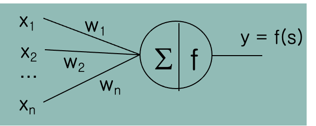

$x$: 입력값
$w$: 가중치

$ s = x_1w_1 + x_2w_2 + ... + x_nw_n = \sum^n_{i=1} x_i w_i $ 

s 의 값이 $threshold$(임계치) 보다 크면 1을 출력, 그렇지 않으면 출력하지 않는다.  

$$ y = \begin{dcases}
    1 : s > threshold \\
    0 : else 
\end{dcases} $$

First Function: 입력의 가중 합 $\sum$ (sum)

Second Function: $Step Function$

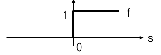

## Perceptron (인공네트워크)

### 초창기 Artificial Neuron(인공 뉴런) 

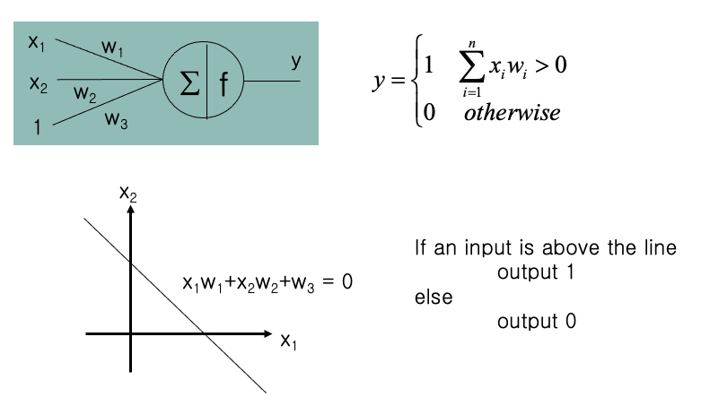

$w_3$ 를 threshold 로 사용, 위처럼 직선의 방정식 $x_1w_1+x_2w_2+w_3 = 0$ 을 사용해 해당 linear 보다 위에있으면 1, 아니면 0을 반환하는 $Second Function$ 정의

# 뉴럴넷(Neural Net) 의 목적

$w$ 가중치를 찾는것이 곧 뉴럴넷 의 목적

입력값 $x$ 가 들어오면 $y$ 를 출력하는 함수 $y=f(\vec{x})$ 를 찾는것이 목표

뉴럴넷 을 구축하여 $o(\vec{w}, \vec{x})$ 를 구성하고 뉴럴넷 출력함수 $o$ 와 목표함수 $f$ 의 출력값이 같도록해야한다.

$o(\vec{w}, \vec{x}) = f(\vec{x})$

그러기 위한 가중치 $\vec{w} = (w_1, w_2, ..., w_n)$ 을 찾는것이 뉴럴넷 의 목적이다.   

다른말로 $\sum_{\vec{x}\in Data} [o(\vec{w}, \vec{x}) - f(\vec{x})]^2$ 값을 최소화 하는 것이다.

위 식을 $Error Function$ - $E(\vec{w})$ 라 한다.  

## Optimizer 경사하강법

$E(\vec{w})$ 이 아래와 같은 그래프로 나타날 경우  

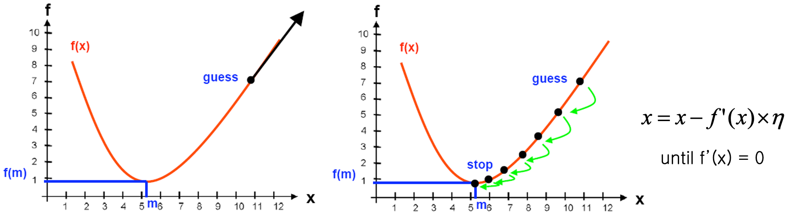

미분방정식을 풀 수있다면 변곡점, 기울기가 0 인 부분을 모두 구해서
가장 값이 작은 $f(m)$ 값을 구하면 된다.  

미분방정식으로 표현할 수 없다면 
$E(\vec{w})$ 을 최소화 하는 방법중 하나로 **경사하강법**이 있다. 위 그림 수식을 좀더 쉽게 설명하며 아래와 같다.   

$x_{i+1} = x_i − step size × Gradient$

기울기의 반대방향으로 계속 $x$ 값을 이동시키기 때문에 $x$ 에 대한 출력값은 작아질 수 밖에 없다.

$local minimum$ 으로 인해 경사하강법 하나만 사용하진 않지만 중요 $Optimizer$ 중 하나이다.  

위처럼 함수의 순간적인 기울기를 구해 사용자가 지정한 $step size$ 인 $\eta$ 와 함께 연산, 
최종적으로 기울기가 0이 되어 $x_{i+1}=x_i$ 값이 나오면 종료된다.  

$\eta$ 가 너무 크면 이동량이 많아 발산하고 너무 작으면 많은 시간이 걸리게 되기에 적당한 $step size$ 를 찾는것도 중요함.

## 시그모이드 미분

우리의 목적은 $Error Function$

$E(\vec{w}) = \sum_{\vec{x}\in Data} [o(\vec{w}, \vec{x}) - f(\vec{x})]^2$

를 최소화 하는 것이다.   

$E(w)$ 의 미분을 하려면 $f(\vec{w})$ 에 대한 미분도 가능해야 하지만 최초의 `Perception` 에서는 `Second Function` 으로 `Step Function` 을 사용하기 때문에 미분이 불가능하다.  

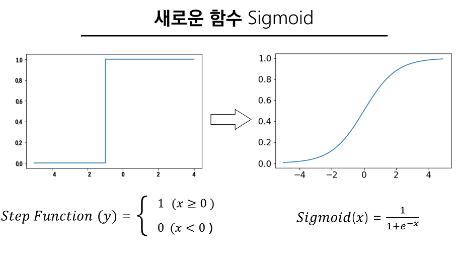

`threshold` 를 넘으면 바로 1로 변경되는 `step function` 과 다르게 완만한 곡선을 띄운다

`sigmoid` 의 미분은 아래와 같다.  

$$ \begin{align}
\frac{d}{dx}sigmoid(x) & = \frac{d}{dx}{(1+e^{-x})^{-1}} \\ 
& = (-1)\frac{1}{(1+e^{-x})^{2}}\frac{d}{dx}(1+e^{-x}) \\ 
& = (-1)\frac{1}{(1+e^{-x})^{2}}(0+e^{-x})\frac{d}{dx}(-x) \\ 
& = (-1)\frac{1}{(1+e^{-x})^{2}}e^{-x}(-1)  \\ 
& = \frac{e^{-x}}{(1+e^{-x})^{2}}  \\ 
& = \frac{1+e^{-x}-1}{(1+e^{-x})^{2}}  \\ 
& = \frac{(1+e^{-x})}{(1+e^{-x})^{2}}-\frac{1}{(1+e^{-x})^{2}}  \\ 
& = \frac{1}{1+e^{-x}}-\frac{1}{(1+e^{-x})^{2}}  \\ 
& = \frac{1}{1+e^{-x}}(1-\frac{1}{1+e^{-x}}) \\ 
& = sigmoid(x)(1-sigmoid(x))
\end{align} $$

아래의 공식이 뉴럴넷에서 `Error Function` 을 찾기 쉽게 만들어주는 중요한 요소중 하나  

시그모이드 미분값의 최대값은 0.25 가 출력된다.  

$$ \frac{d}{dx}sigmoid(x) = sigmoid(x)(1-sigmoid(x)) $$

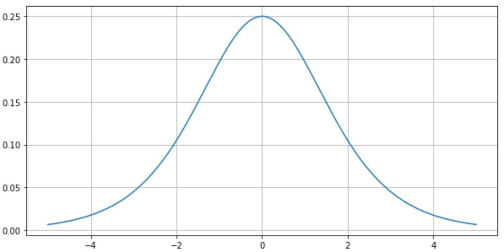

## Forward Propagation (순방향 전파)

임의의 w 를 설정하여 아래와 같은 뉴럴넷 을 구성했을 때  

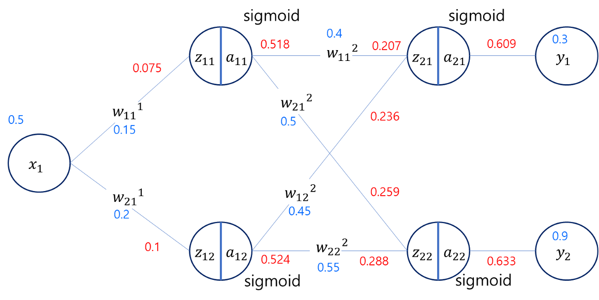
시작값 $x_1=0.5$ 로부터 최종 결과값 $y_1=0.3, y_2=0.9$ 을 예측했지만
각종 가중치와 시그모이드 함수를 통과한 결과는 $y_1=0.609, y_2=0.633$ 이다.  

가중치 $w_n$을 조절하여 $y_1$의 값은 내리고, $y_2$의 값은 올려야 한다.  

## Back Propagation (역방향 전파)

가중치 조절은 역방향 전파의 미분으로 조절된다.  

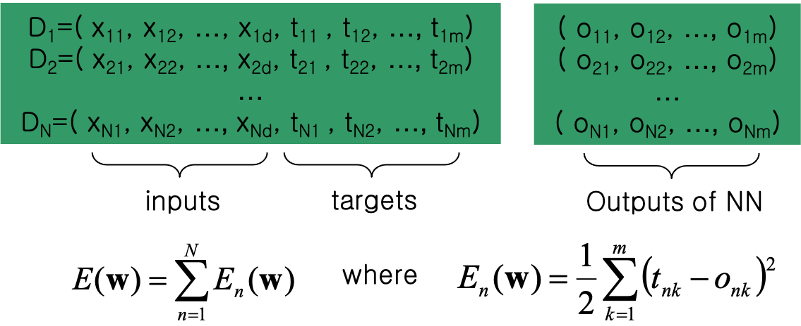

$D$ 는 트레이닝 데이터이다. 
입력값이 $x_{11},...x_{1d}$ - $d$개
출력값이 $t_{11},...t_{1m}$ - $m$개

그림으로 그리면 아래와 같다. 

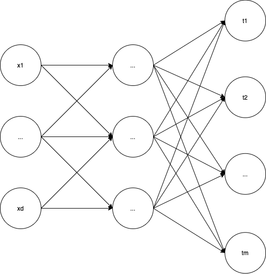

이러한 트레이닝 데이터가 $N$ 개 있다.   

그리고 오차함수 각각의 $m$개의 $(t-o)$ 의 차이값에 제곱하여 $E(w)$ 를 구하고 더하고 이를 `Error Function` 으로 정의한다.  

위 사진과 같은 상황일 때 실제 결과값 $t_{nk}$ 에 매칭되는 예측값 $o_{nk}$에 대한 `Error Function` 에 대입하면 아래와 같이 나온다.  

$$
E_n(w) = \frac{1}{2}\sum_{k=1}^m(t_{nk}-o_{nk})^2
$$

위 `Error Function` 의 값을 $w_i$ 를 변경하면서 최소값을 찾아내는 것이 위에서 말한 뉴럴넷의 목적이다.

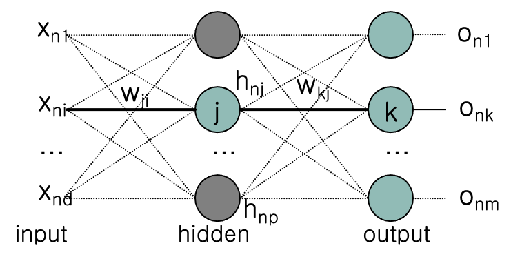

> n 은 n 번째 데이터셋 의미로 생략해도 상관은 없다. 

위 그림처럼 신경망의 깊이가 2개라면, 마지막 신경망($net_k$) 부분만 보았을때 
모든 $h$ 값과 $o_{nk}$ 로 향하는 $w$ 값의 곱을 더하면 $o_ {nk}$ 가 나온다.

$$
o_{nk} = \frac{1}{1+\exp(-(w_{k0} + \sum_{j=1}^p w_{kj}h_{nj}))}
$$

> 여기서 exp 란 exponential 의 약자로 자연상수e에 대한 지수함수를 의미한다, 즉 시그모이드 함수를 뜻한다.

각각의 $h$ 값 또한 마찬가지로 첫번째 신경망($net_j$) 에서 
각 $h$ 로 향하는 $w$ 값의 곱을 더하면 각각의 $h$ 가 나온다.  

$$
h_{nj} = \frac{1}{1+\exp(-(w_{j0} + \sum_{i=1}^d w_{ji}x_{ji}))}
$$

이제 $o_{nk}$ 와 $h_{nj}$ 값을 합쳐서 Error Function 을 구하면 아래와 같은 식이 출력된다.  

$$
E_n(w) = \frac{1}{2}\sum_{k=1}^m\{t_{nk}-\frac{1}{1+\exp[-[w_{k0} + \sum_{j=1}^p w_{kj}(\frac{1}{1+\exp(-(w_{j0} + \sum_{i=1}^d w_{ji}x_{ji}))})]]}\}^2
$$

입력값 $x_{ji}$, 출력값 $t_{nk}$ 는 주어지기 때문에 각 $w$ 값을 변경해가면서 $E_n (w)$ 의 최소값을 찾으면 된다.  

$E_n(w)$ 를 미분하여 도함수를 구하는 일은 굉장히 어렵기에  

각 $w$의 대한 기울기값 $f'(E_n)$ 를 구해 경사하강법을 통해 최소값을 찾아나가야 한다.  

기울기는 각각의 $w$값, $w_{jk}$ 에 대하여 Error Function 의 편미분 값으로 구한다.  

$$
\Delta w_{kj} = -a \frac{\partial E_n}{\partial w_{jk}}
$$

> 원활한 수식보기를 위해 $net_k$ 로 치환 
> $net_k = (w_{k0} + \sum_{j=1}^p w_{kj}h_{nj})$
> $o_{k} = \frac{1}{1+\exp(-net_k)}$

약간의 편법(체인룰)을 사용하여 아래와 같은 식으로 변경 

$$
\frac{\partial E_n}{\partial w_{jk}} = 
\frac{\partial E_n}{\partial net_k} \cdot \frac{\partial net_k}{\partial w_{jk}} = 
\frac{\partial E_n}{\partial o_k} \cdot \frac{\partial o_k}{\partial net_k} \cdot \frac{\partial net_k}{\partial w_{jk}} 
$$

마지막 부분 $\frac{\partial net_k}{\partial w_{jk}}$ 는 다른 $w$ 들은 모두 생략되고 특정 가중치 $w_{jk}$ 만 살아남기 때문에 아래처럼 $h_{nj}$ 로 변경된다.  

$$
\frac{\partial E_n}{\partial w_{jk}} = 
\frac{\partial E_n}{\partial net_k} \cdot \frac{\partial net_k}{\partial w_{jk}} = 
\frac{\partial E_n}{\partial o_k} \cdot \frac{\partial o_k}{\partial net_k} \cdot h_{nj}
$$

$\frac{\partial E_n}{\partial o_k}$, $\frac{\partial o_k}{\partial net_k}$ 에 대해서도 편미분값을 구하면 아래처럼 담백해진다.  

$o_k$ 에 대해서만 남기때문에 `Sumation` 이 사라진다.  
$$ \begin{aligned}
\frac{\partial E_n}{\partial o_k} &= \frac{\partial}{\partial o_k} \frac{1}{2}\sum_{k=1}^m(t_{k}-o_{k})^2 \\&= -(t_k-o_k), \\ \ \\ \ \\
\frac{\partial o_k}{\partial net_k} &= \frac{\partial}{\partial net_k} \frac{1}{1+\exp(-net_k)} \\
&= \frac{-(-\exp(-net_k))}{(1+\exp(-net_k))^2} \\
&= \frac{\exp(-net_k))}{(1+\exp(-net_k))^2} \\
&= \frac{1}{1+\exp(-net_k)} \frac{\exp(-net_k))}{1+\exp(-net_k)} \\
&= o_k(1-o_k)
\end{aligned} $$

최종적으로 $hidden$ 과 $output$ 사이의 $o_k$ 를 향하는 각 $w$ 에 대한 기울기 값과 step size 식을 아래와 같은 식으로 구할 수 있다.  

$$ \Delta w_{kj} = -a \frac{\partial E_n}{\partial w_{kj}} = a \cdot (t_k-o_k) \cdot o_k(1-o_k) \cdot h $$

마찬가지로 $input$과 $hidden$ 의 $w_{ji}$ 에 대해서도 경사하강법을 통해 기울기, step size 식을 구해야 한다.  
$$ \Delta w_{ji} = -a \frac{\partial E_n}{\partial w_{ji}} $$

이전과 같이 식을 편미분 하여 아래와 같이 식 을 간단화 

$$ \begin{aligned}
\frac{\partial E_n}{\partial w_{ji}} &= 
\frac{\partial E_n}{\partial net_j} \frac{\partial net_j}{\partial w_{ji}} \\
&= \frac{\partial E_n}{\partial net_j} x_i 
\\ \ \\
\frac{\partial E_n}{\partial net_j} &= \frac{\partial}{\partial net_j} \frac{1}{2} \sum_{k=1}^m (t_{k}-o_{nk})^2 \\
&= \frac{1}{2} \sum_{k=1}^m \frac{\partial (t_{k}-o_{nk})^2}{\partial net_j}
\end{aligned} $$

$\frac{\partial (t_{k}-o_{nk})^2}{\partial net_j}$ 만 때어놓고 봐 보면 아래처럼 변경 가능하다.  

$$ \begin{aligned}
\frac{\partial (t_{k}-o_{nk})^2}{\partial net_j} &= 
\frac{\partial h_j}{\partial net_j} \cdot
\frac{\partial net_k}{\partial h_j} \cdot
\frac{\partial o_k}{\partial net_k} \cdot
\frac{\partial (t_{k}-o_{nk})^2}{\partial o_k} \\\\
\frac{\partial h_j}{\partial net_j} &= h_j(1-h_j) \\\\
\frac{\partial net_k}{\partial h_j} &= w_{kj} \\\\
\frac{\partial o_k}{\partial net_k} &= o_k(1-o_k) \\ \\
\frac{\partial (t_{k}-o_{nk})^2}{\partial o_k} &= -2(t_k - o_k) \\ 
\end{aligned} $$

최종척으로 아래와 같은 식이 도출된다.  

$$ \frac{\partial (t_{k}-o_{nk})^2}{\partial net_j} = -2h_j(1-h_j) w_{kj} o_k(1-o_k) (t_k - o_k) \\ \ \\
\begin{aligned}
\frac{\partial E_n}{\partial net_j} &= \frac{1}{2} \sum_{k=1}^m \frac{\partial (t_{k}-o_{nk})^2}{\partial net_j} \\
&= -\sum_{k=1}^m h_j(1-h_j) w_{kj} o_k(1-o_k) (t_k - o_k) \\
&= -h_j(1-h_j)\sum_{k=1}^m  w_{kj} o_k(1-o_k) (t_k - o_k) \\
\end{aligned} $$

최종적으로 아래와 같은 식으로 $w_{ji}$ 의 기울기, step size 식을 구할 수 있다.  

$$ \begin{aligned}
\Delta w_{ji} &= -a \frac{\partial E_n}{\partial w_{ji}} 
= \frac{\partial E_n}{\partial net_j} \frac{\partial net_j}{\partial w_{ji}}
= -a \frac{\partial E_n}{\partial net_j} x_i \\
&= -a(-h_j(1-h_j)\sum_{k=1}^m  w_{kj} o_k(1-o_k) (t_k - o_k)) x_i \\
&= ah_jx_i(1-h_j)\sum_{k=1}^m  w_{kj} o_k(1-o_k) (t_k - o_k)
\end{aligned} $$

$hidden$과 $output$ 사이의 $\Delta w_{kj}$, 
$input$과 $hidden$ 사이의 $\Delta w_{ji}$ 를 모두 구하였다.  

1. w 임의 설정
2. 입력 - 은닉 - 출력 층 형성 및 선형 결합
3. 은닉층과 출력층 사이의 $w_{kj}$ 값을 업데이트
4. 입력층과 은닉층 사이의 $w_{ji}$ 값을 업데이트

에러가 충분히 줄어들 때 까지 이를 반복하는 것이 Back Propagation 알고리즘이다.  

위 예제는 데이터 셋 하나에 대하여 각 $w$ 의 경사하강법을 통해 오차값을 줄였지만 
대부분 수많은 데이터셋이 존재함으로 $\sum_{n=1}^N$ 수식이 앞에 하나씩 붙는다 생각하면 된다.  

만약 net 이 하나씩 늘어날때 마다 연산과정도 기하급수적으로 늘어나고 과정도 많이 반복될 것이다.  

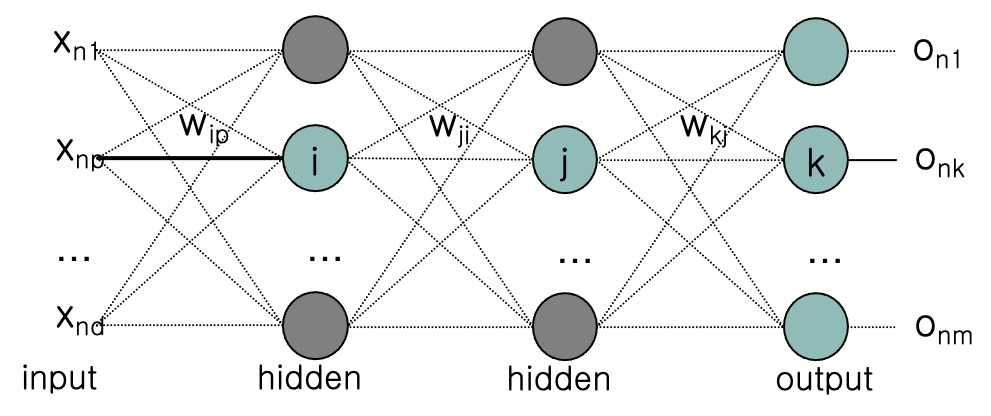

input node 10개, 각 layer node 10개, output 10개 인 네트워크가 위처럼 3개 있다면  

$(10 \times 10) \times 3$ 개 이다
(가중치가 300개)  

> 최근 대부분의 뉴럴넷 모델, CNN, RNN 등은 일반적으로 네트워크 100개 정도로 구성되어 있다.  

## 역전파 알고리즘 실제 계산

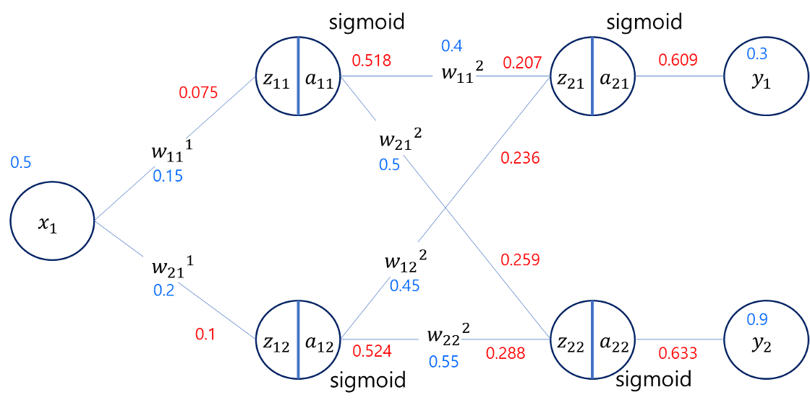

위와같은 뉴럴넷 모델에 임의의 w 값드이 정해져 있다면 Error Function(오차함수)의 결과는 아래와 같다.  
$$
E=\frac{1}{2} \sum(target - output)^2 \\
=\frac{1}{2}[(0.3−0.609)^2+(0.9−0.612)^2]=0.087
$$

우리의 목적은 Error Function 의 결과값을 $w$ 조절을 통해 최대한 줄여나가야 한다.  

$$
\Delta w_{kj} = -a \frac{\partial E_n}{\partial w_{kj}} = 
-a \frac{\partial E_n}{\partial o_k} \cdot \frac{\partial o_k}{\partial net_k} \cdot h_{nj} \\ 
= a \cdot (t_k-o_k) \cdot o_k(1-o_k) \cdot h_{nj}
$$

> $h$ 는 특정 노드의 결과값

위의 경사하강법 공식을 사용해서 $net_2$ 에 해당하는 가중치 $w_{11}^2$ 의 값을 조절해보자.  

위 공식대로라면 $t_k = y_1, o_k = a_{21}, w_{kj} = w_{11}^2, net_k = z_{21}, h_{nj}=a_{11}$ 이라 할 수 있다.  
$net_k$ 에 해당하는 $z_{21}$ 의 값은 

경사하강법 공식에 대입하면

$$
\begin{aligned}
\Delta w_{11}^2 = &a \cdot (y_1 - a_{21}) \cdot a_{21} (1 - a_{21}) \cdot a_{11} \\
= &a \cdot (0.3−0.609)×0.609×(1−0.609)×0.518 \\
= &a \cdot 0.0381
\end{aligned}
$$

만약 학습률 $a=0.5$ 라고 했다면 다음 경사하강법으로 구하게된 다음 $w_{11}^{2+}$ 은 아래와 같다.  

$$
w_{11}^{2+} = w_{11}^{2} - \Delta w_{11}^2 = 0.4 -0.5 \cdot 0.0381 = 0.380
$$

---

이번에는 $w_{11}^1$ 에 대해서 역전파 알고리즘 + 경사하강법 으로 값을 수정해보자.  

$$
\Delta w_{11}^1 = -a \frac{\partial E}{\partial w_{11}^1} = -a \frac{\partial E}{\partial a_{11}} \cdot \frac{\partial a_{11}}{\partial z_{11}} \cdot \frac{\partial z_{11}}{\partial w_{11}^1}
$$

$w_{11}^2$ 의 경우 $y_1$ 에 대해서만 영향을 끼치지만 $w_{11}^1$ 은 $y_1, y_2$ 모두 영향을 끼친다.  

따라서 위의 Error 는 하나가 아닌 두개 에러의 합인 $E = E_1 + E_2$ 로 나타낸다.

$$
\Delta w_{11}^1 = -a \frac{\partial (E_1+E_2)}{\partial w_{11}^1} 
$$

각각의 E 에 대하여 편미분을 구하는 공식을 아래처럼 변경할 수 있다.  

$$
\frac{\partial E_1}{\partial a_{11}} = 
\frac{\partial E_1}{\partial a_{21}} \cdot
\frac{\partial a_{21}}{\partial z_{21}} \cdot 
\frac{\partial z_{21}}{\partial a_{11}} 
$$
$$
\frac{\partial E_2}{\partial a_{11}} = 
\frac{\partial E_2}{\partial a_{22}} \cdot
\frac{\partial a_{22}}{\partial z_{22}} \cdot 
\frac{\partial z_{22}}{\partial a_{11}} 
$$

이 부분도 7주차에 했던 편미분식의 반복이다.  

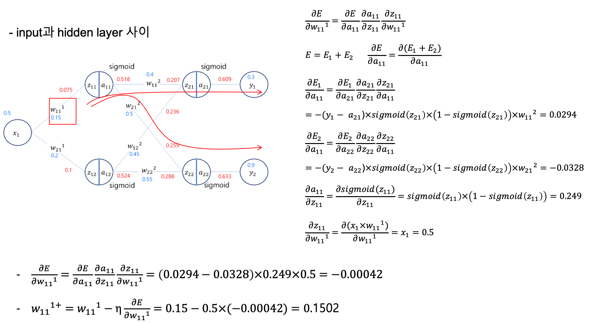
