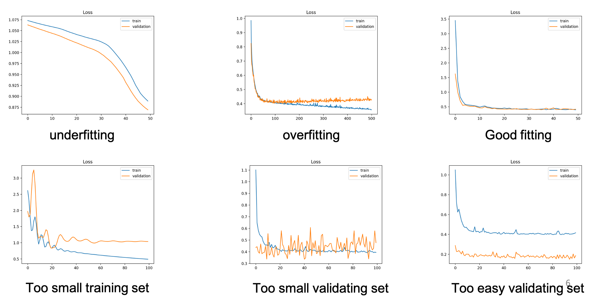
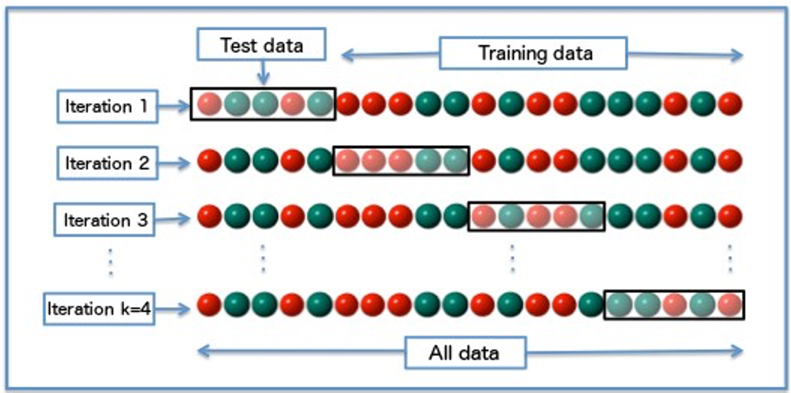
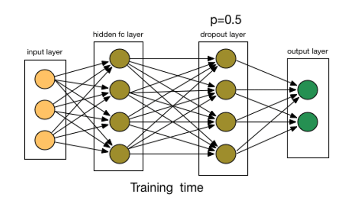
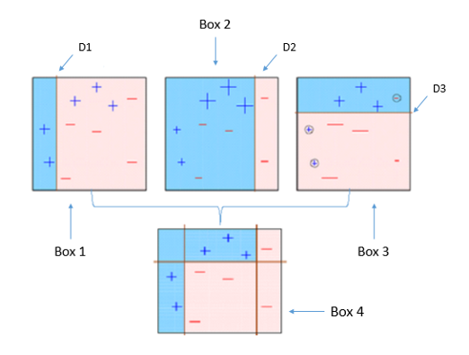
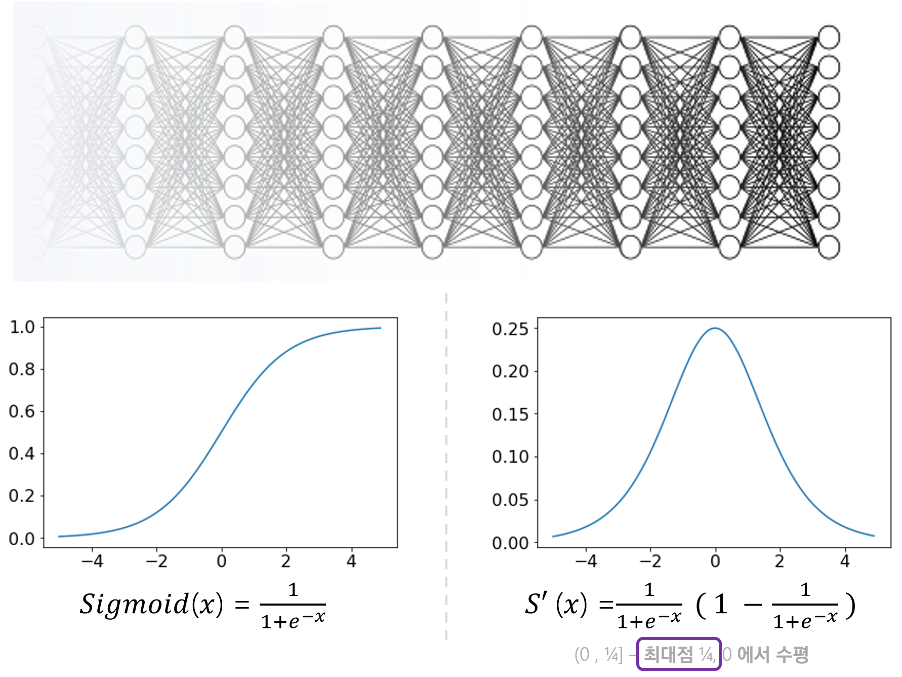
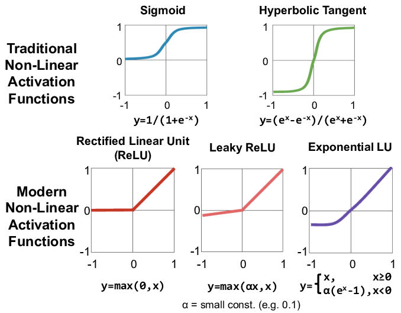

# Batch, Mini Batch

학습의 과정은 아래와 같다.  
순전파 -> Error Function 흭득 -> 역전파 -> 가중치 조절

Epoch: 전체 데이터 셋에 대하여 순전파 후 역전파 한 횟수

일전에는 Epoch 를 여러번 반복하여 가중치를 조절하는 Batch 방식을 사용해 왔다.  
모든 데이터셋 오차함수에 대해 한번에 가중치 조절하는 하게되면 비효율적이라는 생각에서 이런 비효율적인 계산 과정을 줄이고자 Mini Batch 라는 개념이 나왔다. 

Mini Match: 데이터셋을 n 개의 그룹으로 나누어 순전파 하고 역전파 하는 것.  

N 개의 데이터 셋이 있을때 이를 m개수를 가진 n 개의 그룹으로 나눈다면 $n = int(\frac{N}{m})$ 공식일 것  

$$
FP(g_1) \rArr BP(g_1) \\
FP(g_2) \rArr BP(g_2) \\
... \\
FP(g_n) \rArr BP(g_n)
$$

마찬가지로 $g_1 ~ g_n$ 까지 1 Epoch 로 본다.  

Mini Batch 의 경우 그룹화하고 바로바로 역전파가 이루어지기 다음 그룹에선 좀더 좋은 환경? 에서 다시 순전파, 역전파 과정이 이루어 지기 때문에 좀더 빠른 속도로 오차함수를 0으로 수렴하게 할 수 있다.  

Mini Batch 방식에서 중요한 점이 하나 있는데 그룹화 시에 모집단에서 그룹별로 고르게 표본을 그룹화해야 한다.  

## SGD(Stochasitc Gradient Descent: 확률적 경사 하강법)

Mini Batch 의 데이터 수를 1로 설정, 데이터를 random 하게 순회하며 순전파 후 바로 역전파를 수행함.  

수렴 속도가 빨라 질 수 도 있지만 발산되어 버릴 수 도 있음.  

데이터 분포가 좁을 수록 SGD, 넓을 수록 Batch 방식을 사용하는 것을 권장.

# NN - Overfitting

모든 머신러닝 모델에서 그렇듯이 NN 에서도 Overfitting 이 존재한다.  
모든 training data set 에 대하여 Error Function 의 값이 0에 거의 수렴할때 까지 학습을 돌리면
위처럼 제공된 training data set에 대해서는 100% 분류가 가능하다.  

하지만 training data set 과 validation data set 2개로 분기하여 검증을 진행하게 되면
특정 시점부터는 validation data set 의 오차가 커지게 된다.  

해당 시점이 Overfitting 이 생기는 시점이라 볼 수 있다.  

만약 training data set 이 현실세계의 모든 상황의 모집단이라 할 수 있다면 발생된 Overfitting 이 항상 진실이라 할 수 있겠지만
대부분의 training data set 은 모집단의 일부일 뿐, 모든 상황을 대처할 순 없다.  

validation data set 또한 모든 모집단을 표현하는 것이 불가능 하기는 마찬가지이다.  

위 그림처럼 validation data set 의 표본의 분포 편향에 따라서 Overfitting 이 언제 일어날 지 결정된다.  

일반적으로 그나마 정확한 Overfitting 시점을 알아내기 위해 데이터를 3개로 쪼갠다(모든 머신러닝 모델이 비슷함)

1. training data set: 학습용 데이터  
2. validation data set: 검증용 데이터  
3. test data set: 최종 성능 시험 데이터  

모든 data set 의 데이터 분포가 고르게 되도록 노력해야 한다.  

x 축은 epoch 수, y 축은 Error Function 의 결과값이다.  

파랑계열이 traning data set 
주황계열이 valiation data set 

각각의 그래프를 보고 data set 이 잘못되었는지 epoch 수를 조절하는 것을 결정(early stop)할 수 있다.  

Good Fitting 이 최적의 traning data set 과 validation data set 의 그래프,
어느정도 같이 0에 수렴하는 형태

출렁이는(fluxation) 그래프는 일반적으로 데이터 셋이 부족하다는 뜻.  

## Overfitting 방지

인공지능 모델 생성시  데이터를 수집하고 pre processing 하는 데 90% 이상의 자원이 사용된다.

Overfitting 이 일어나는 대부분의 경우는 데이터 부족으로 인해 모집단의 분포가 기울어져 있기 때문이다.  

Overfitting을 막기위한 여러가지 방법론들이 개발되어 있다.

### Cross Validation

Epoch 마다 validation, traning 데이터 셋을 서로 교차해가면서 학습시키는 것  

작은 데이터 셋에 너무 익숙해지지 않도록 계속 validation, traning 데이터 셋을 변경해가면서 진행하고 데이터 셋이 적을때 더욱 유용하다.  

### Early Stop

Overfitting 되기전에 멈추어 버리는것, 굉장이 많이 사용됨

### Prunning

 
데이터 분류에 크게 관여하지 않는 노드들을 삭제

가중치가 매우 작다면 없애버리는 식으로 진행할 수 도 있다.  

하드웨어적으로 뉴럴 링크 모델을 구현한 칩을 만들때 라인 하나하나가 모두 비용임으로 단순 Overfitting 만을 위한 것이 아닌 비용절감을 위해서도 사용하기도 한다.  

### Regularization (규제)

$$
E = \sum E_n + \lambda\sum w^2
$$

기존에는 $E_n$ 에 합을 줄이기 위해서만 Epoch 를 반복했지만  
여기에 모든 가중치 제곱의 합또한 더하여 Error Function 을 구성한다.  

w 의 값도 너무 커지지 않도록 조절(규제)하면서 Error Function 값을 줄어나간다.  

### Droup Out

랜덤하게 노드를 선택하여 삭제

droupout layer 를 두고 $p = 0.5$ 랜덤하게 절반은 삭제후 weight 값을 업데이트 해 나간다. 

데이터 셋에 익숙해지지 못하도록 모델을 바꾸어 버린다.  

데이터를 바꾸거나, 모델을 바꾸는 방법으로 Overfiting 을 방지한다.  

현재 Overfitting 방법론중 가장 많이 사용되는 방법이다.  

### Remove Features

분류에 크게 기여하지 못하는 feature 들을 제외

### Ensembling(조합)

#### Bagging(Bootstrap Aggregation)

여러개의 데이터넷을 별도로 학습하여 독립적으로 출력된 모델들을 조합하여 사용하는 것.    

여러개의 데이터셋으로 하나의 모델을 만드는 것이 아닌

여러개의 데이터셋으로 여러개의 모델을 만들고 각 모델의 결과를 조합(평균, 과반수) 하여 최종 결과를 도출하는 것.  

#### Bosting

여러개의 모델을 별도로 학습하여 직렬적으로 조합하여 분류결과를 출력하는 것.  

Bagging 과 다르게 각 모델을 직렬적으로 합쳐서 최종 분류결과를 도출한다.  

## Vanishing Gradiant 방지

sigmoid activate function 를 사용하면 Vanishing Gradiant 문제가 발생한다.  

역전파 과정에서 가중치값들을 수정해 나가다 보면
input 노드에 가까워 질 수 록 미분을 지속적으로 해주어야 한다.  

시그모이드 함수의 미분은 $sigmoid \cdot (1-sigmoid)$ 값인데 위 그래프처럼 미분 그래프의 maximum 값은 0.25 이다.  

input 노드에 가까운 가중치는 거의 모든 output 노드에 영향을 끼치는 중요한 값인데 sigmoid 의 미분을 통해 경사하강법의 기울기값이 너무 적어지는 Vanishing Gradiant 문제가 발생한다.  

### Rectified Linear Unit(ReLU: 정류 선형 유닛)

Vanishing Gradiant 문제를 해결하기 위한 activate function 이 여러가지 있다.  

0 이하의 경우 모든 미분값은 0, 그 이외에는 모든 미분값은 1이다.  

ReLU 를 사용하면 Vanishing Gradiant 는 해결되지만 모든 노드가 activation 되지 않는 단점이 있다.  

sigmoid 의 경우 어떠한 $(input * w)$ 값이 들어와도 0 이상의 값이지 0 이 되진 않기에 모든 노드가 작은 값이긴 하더라도 항상 active 상태이다.

반면 ReLU 는 0 이하라면 바로 unactive 되기 때문에 굉장히 빠른 계산속도를 제공한다.  
하지만 Knock out problem 이 존재한다.  

이전 iteration보다 매우 큰 입력 값이 들어올 경우 대부분의 노드에서 ReLU activated 
역전파 과정에서 큰 업데이트(감소방향으로) 발생 
다음 iteration에서 많은 노드가 activate되지 않음
역전파 과정에서 update 되지 않음
학습과정에서 다시는 업데이트 되지 않음

Vanishing Gradiant 을 해결하기 위한 다른 activate function 또한 많이 개발되어있다.  

데이터, 모델의 성격에 따라 여러가지 activation function 을 사용할 수 있다.  

