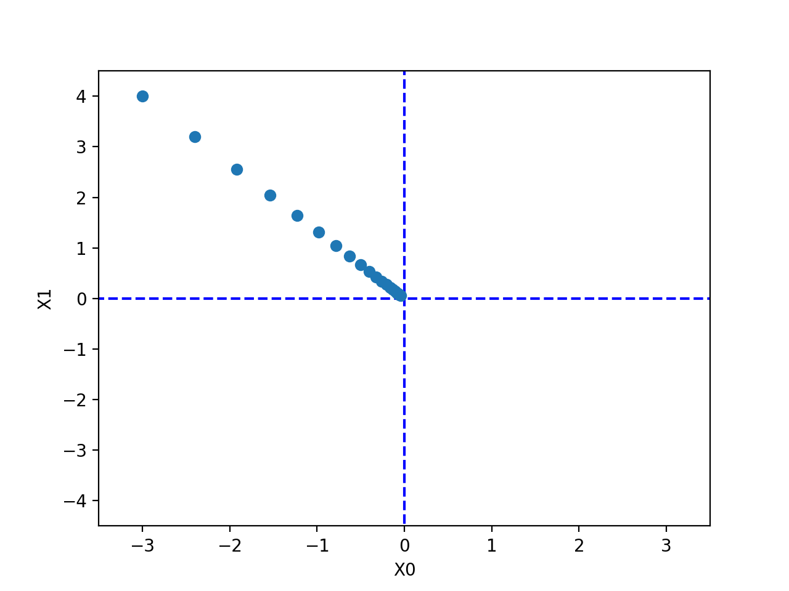
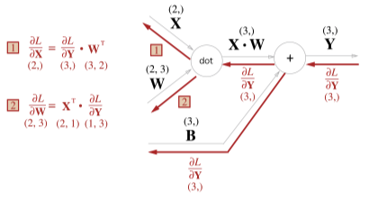

# 신경망 순방향 전파  

신경망의 순방향 전파는 실전에서 input 에 대한 예측 output 을 반환하기 위한 계산으로  

이미 만들어진 예측모델에서 결과값을 얻기위해 사용된다.  

## 활성화 함수  

활성화 함수로 `sigmoid`, `ReLU` 함수를 사용하며 python 으로는 아래처럼 구현 가능하다.  


```py
import numpy as np

def relu(x):
    return np.maximum(0, x)

def sigmoid(x):
    return 1 / (1 + np.exp(-x))
```

활성화 함수의 특징은 **비선형 함수** 만을 사용한다는 것  

만약 선형함수 $y=cx$ 를 활성화 함수로 사용할 경우 
3층 신경망을 구축하여 최종 출력값은 아래와 같은식이 된다.  

$y(x) = h(h(h(x))) \\ y(x) = c \cdot c \cdot c \cdot x$

이는 다르게 보면 아래 식과 똑같은 식. 

$y(x) = ax \\ a=c^3$

사실상 은닉층의 미세한 조정이 결과로서 나타나지 않는, 쓸모가 없는 식이다.  

 
## 신경망에서 순방향 전파  

입력값 $x$ 와 가중치 $w$ 의 신경망 연산은 행렬곱으로 쉽게 표현할 수 있다.  


```py
X = np.array([1, 2])
print(X.shape) # (2,)
W = np.array([[1, 3, 5], [2, 4, 6]])
print(W)
# [[1 3 5]
# [2 4 6]]
print(W.shape) # (2, 3), 2행 3열
Y = np.dot(X, W)
print(Y) # [5 11 17]
```

코드처럼 
$x_1 = 1, x_2 = 2$  
$w_1=1, w_2=2, w_3=3, w_4=4, w_5=5, w_6=6$
$y_1=5, y_2=11, y_3=17$ 

로 쉽게 나타낼 수 있다.  

$$
\begin{bmatrix}
    1 & 2
\end{bmatrix} \cdot
\begin{bmatrix}
    1 & 3 & 5 \\
    2 & 4 & 6
\end{bmatrix} = 
\begin{bmatrix}
    5 & 11 & 17
\end{bmatrix}
$$

층이 늘어난다 하더라고 행렬곱을 사용하면 간결하게 표현가능하다.  

아래 그림과 같은 3층 NN도 넘파이과 행렬곱, 활성화 함수로 몇줄 안되게 출력할 수 있음 (for, if 문같은걸 사용하지 않는다)


```py
def predict(network, x): # 순방향 전파 계산
    W1, W2, W3 = network['W1'], network['W2'], network['W3']
    b1, b2, b3 = network['b1'], network['b2'], network['b3']
    a1 = np.dot(x, W1) + b1
    z1 = sigmoid(a1)
    a2 = np.dot(z1, W2) + b2
    z2 = sigmoid(a2)
    a3 = np.dot(z2, W3) + b3
    y = sigma(a3)
    return y
```

# 신경망 학습  

신경망 학습은 곧 오차를 줄이는 것.  
손실함수의 출력값을 줄이는 것이다.  
**오차제곱합(Sum of Squares for Error,SSE)** 를 예제로 자주 사용하며 식은 아래와 같다.  

$$
E = \frac{1}{2}\sum_{k=1}^m(t_k-o_k)^2
$$

0~9 숫자를 판별하는 문제에서  
`soft-max` 의 결과물이 아래처럼 출력되었다면  

```py
y = [0.1, 0.05, 0.6, 0.0, 0.05, 0.1, 0.0, 0.1, 0.0, 0.0] 
t = [0, 0, 1, 0, 0, 0, 0, 0, 0, 0]
```

이런식으로 정답만 1, 오답은 모두 0 으로 표현하는 방식이 **원-핫 인코딩**이다.

$t_k$ 는 `t` 값을, $o_k$ 는 `y` 값을 사용하여 오차 제곱합을 구하고  
하나의 데이터셋마다 위의 오차제곱합 값이 나올 것이다. 

데이터셋이 $N$ 개 있다면 최종적으로 아래와 같은 식이 나오게 된다.  

$$
E = \frac{1}{2}\sum_{k=1}^m(t_k-o_k)^2 \\
E_N = \sum_{n=1}^N E
$$

## Cross Entropy 

오차제곱합 외에도 손실 함수로서 **교차 엔트로피 오차(Cross Entropy Error, CEE)** 도 자주 이용한다.  

| status  | 강아지 | 고양이 | 토끼 |
| ------- | ------ | ------ | ---- |
| 실제(t) | 1      | 0      | 0    |
| 예측(o) | 0.59   | 0.26   | 0.15 |

`Cross Entropy` 를 사용한 에러함수는 아래와 같다.  

$$
E = -\sum_k t_k \log o_k
$$

`Cross Entropy` 를 사용하게 되면 실제 결과값은 1 아니면 0 이기 때문에 
오차를 줄이기 위한 계산횟수가 굉장이 줄어든다.  

## 미분

신경망을 통해 정확한 데이터를 얻는다는 것은 손실함수의 결과를 최대한 낮춘다는 뜻이다.  

이때 미분연산이 필요한데

$$
\frac{df(x)}{dx} = \lim_{h\rarr0} \frac{f(x+h)-f(x)}{h}
$$

식을 그대로 python 코드로 옮길 수 있으면 좋겠지만 h에 너무 작은값을 사용하면 반올림 오차가 발생함으로  

```py
def numerical_diff(f, x):
    h = 1e-4 # 0.0001
    return (f(x+h) - f(x-h)) / (2*h)
```

위 와 같이 적당한 h 값에 중앙차분을 사용해 기울기를 계산한다.  

### 편미분

편미분은 데이터의 개수(차원)이 여러개일 경우 기울기를 구할때 사용한다.  
만약 $f(x_0, x_1) = x_0^2 + x_1^2$ 식을 그림으로 그리면 아래 그림과 같을 것이다.  


위 식에서 $x_0=3, x_1=4$ 일 때 기울기를 구하려면  
아래와 같은 코드를 통해 편미분을 할 수 있다.  

```py
def function_tmp1(x0):
    return x0*x0 + 4.0**2.0


def function_tmp2(x1):
    return 3.0**2.0 + x1*x1

print(numerical_diff(function_tmp1, 3.0)) 
# 6.00000000000378
print(numerical_diff(function_tmp2, 4.0)) 
# 7.999999999999119
```

각 $x_1$, $x_2$ 에 대한 편미분값을 구할 수 있다.  

아래 코드는 동시에 두 변수에 대한 편미분을 계산하기 위한 코드  

```py
def numerical_gradient(f, x):
    h = 1e-4  # 0.0001
    grad = np.zeros_like(x)

    for idx in range(x.size):
        tmp_val = x[idx]
        x[idx] = tmp_val + h
        fxh1 = f(x)  # f(x+h)

        x[idx] = tmp_val - h
        fxh2 = f(x)  # f(x-h)
        grad[idx] = (fxh1 - fxh2) / (2*h)
        x[idx] = tmp_val  # 원복
    return grad

def function_2(x):
    if x.ndim == 1: # 배열의 차원수 , 제곱하여 반환
        return np.sum(x**2)
    else:
        return np.sum(x**2, axis=1)

print(numerical_gradient(function_2, np.array([3.0, 4.0]))) 
# [6. 8.]
```

여기서 기울기값 `[6. 8.]` 이 나왔다.  

아래 그림은 z 축에서 아래로 바라보았을때 방향을 가진 벡터로 그린 화면이다.  


> 편의상 벡터가 0(최소값)을 향하도록 그림을 그림

즉 입력값이 `[3, 4]` 일때 해당 백터의 기울기는 `[6, 8]` 로 향한다고 보면 된다.  

## 경사하강법  

기울기 방향으로 학습률(`learning rate`:$\eta$) 만큼 빼서 값을 줄여나가는 방법  

$f(x_0, x_1) = x_0^2 + x_1^2$ 함수의 초기값을 `[3,4]` 로 설정해 경사하강법으로 줄여나가는 코드이다.  

```py
import numpy as np
import matplotlib.pylab as plt

def gradient_descent(f, init_x, lr=0.01, step_num=100):
    x = init_x
    x_history = []

    for i in range(step_num):
        x_history.append( x.copy() )
        grad = numerical_gradient(f, x) # x 의 기울기
        x -= lr * grad
    return x, np.array(x_history)


def function_2(x):
    return x[0]**2 + x[1]**2

init_x = np.array([-3.0, 4.0])    

lr = 0.1
step_num = 100
x, x_history = gradient_descent(function_2, init_x, lr=lr, step_num=step_num)
print(x) # [-6.11110793e-10  8.14814391e-10]
plt.plot( [-5, 5], [0,0], '--b')
plt.plot( [0,0], [-5, 5], '--b')
plt.plot(x_history[:,0], x_history[:,1], 'o')

plt.xlim(-3.5, 3.5)
plt.ylim(-4.5, 4.5)
plt.xlabel("X0")
plt.ylabel("X1")
plt.show()
```



최종출력된 x 의 값은 거의 `[0,0]` 에 가까운값이 출력된다.  

## 신경망 기울기  

손실함수에서 가중치 값 편미분으로 구한 기울기와 경사하강법을 사용해 신경망 학습이 이루어 진다.  

$$
W = \begin{bmatrix}
w_{11} & w_{12} &  w_{13} \\
w_{21} &  w_{22} &  w_{23} \\
\end{bmatrix}
$$

위와 같이 6개의 가중치 매개변수가 존재할 때 손실함수에 대한 가중치 기울기는 아래 헹렬식으로 표현가능하다.  

$$
\frac{\partial L}{\partial W} = \begin{bmatrix}
\frac{\partial L}{\partial w_{11}} & \frac{\partial L}{\partial w_{12}} &  \frac{\partial L}{\partial w_{13}} \\\\
\frac{\partial L}{\partial w_{21}} & \frac{\partial L}{\partial w_{22}} &  \frac{\partial L}{\partial w_{23}} \\
\end{bmatrix}
$$


```py
class simpleNet:
    def __init__(self):
        self.W = np.random.randn(2, 3) 
        # 정규분포 초기화. 2행 3열 행렬 생성, 
        # input 2, output 3 인 뉴럴넷 생성

    def predict(self, x):
        return np.dot(x, self.W)

    def loss(self, x, t):
        z = self.predict(x) # 예측(행렬곱) 
        y = softmax(z)
        loss = cross_entropy_error(y, t)
        return loss


net = simpleNet()
x = np.array([0.6, 0.9])  # 입력값
t = np.array([0,0,1]) # 정답 레이블
print(net.loss(x, t)) # 1.8804553689014925, 
# 크로스 엔트로피를 사용한 로스함수 결과

```

각 가중치가 조금 변할때의 loss 값의 기울기를 알고 싶다면   

```py
def numerical_gradient(f, x):
    h = 1e-4  # 0.0001
    grad = np.zeros_like(x)

    it = np.nditer(x, flags=['multi_index'], op_flags=['readwrite'])
    while not it.finished:
        idx = it.multi_index
        tmp_val = x[idx]
        x[idx] = tmp_val + h
        fxh1 = f(x)  # f(x+h)

        x[idx] = tmp_val - h
        fxh2 = f(x)  # f(x-h)
        grad[idx] = (fxh1 - fxh2) / (2*h)

        x[idx] = tmp_val 
        it.iternext()
    return grad
```

기울기 함수를 재정의할 필요가 있는데 `2x3` 개의 가중치에 모두 접근해야 하기에 `iterator` 형식으로 접근한다.  

```py
def f(w): return net.loss(x, t)
dW = numerical_gradient(f, net.W)
print(dW)
# [[ 0.05311223  0.48115629 -0.53426851]
#  [ 0.07966834  0.72173443 -0.80140277]]
```

`loss` 에 대한 기울기를 알아야 하기에 `numerical_gradient` 전달 함수로 `loss` 함수 사용  
기울기를 구했으니 학습률을 사용해 가중치를 빼주면 된다.  

## 역전파, 연쇄법칙  


역전파는 편미분 공식을 통해 이루어진다.  
$z=xy$ 라는 식이 있다면  


곱셉의 편미분에서 재미있는 점은 $z=xy$ 라는 식에 대해서 $x, y$ 으로 각각 편미분한 결과

$\frac{\partial z}{\partial x} = y \ \ \frac{\partial z}{\partial y} = x$

처럼 입력 신호를 서로 바꾸어 곱한 후 내보낸다.  
값이 변화할때 마다 상대방과 곱해져서 결과로 출력되기 때문에
본인이 변화하면 상대 값만큼 출력물에 영향을 끼치게 된다.   

역전파의 궁극적목표는 $x$ 값이 얼마나 변하는지(기울기)에 따라 최종 출력 $L$ 의 변화를 알기 위한 것이다.  

해당 변화율을 바로 알순 없고 체인룰에 따라 위와같이 $x$ 변화에 따른 $L$ 의 변화를 알수 있다.  

$\frac{\partial L}{\partial x} = \frac{\partial L}{\partial z} \cdot \frac{\partial z}{\partial x}$


좀더 직관적으로 아래 그래프를 통해 확인할 수 있다.  


사과 2개를 사는데 위 그래프와 같이 계산이 이루어져 220 원을 내야할 때  
우측에서 입력되는 값에 의해 편미분하면 빨간 화살표와 같은 숫자가 출력된다.  


### ReLU 역전파  

활성화 함수 `ReLU` 의 식은 아래와 같다.  
$$
y = \begin{cases}
    x & (x > 0) \\
    0 & (x \le 0)
\end{cases}
$$

0보다 클때만 단순한 1차식이기 때문에 아래와 같은 편미분 결과를 가진다.  

$$
\frac{\partial y}{\partial x} = \begin{cases}
    1 & (x > 0) \\
    0 & (x \le 0)
\end{cases}
$$


코드로 나타내면 아래와 같이 순방향, 역방향 전파한다.  

```py
class Relu:
    def __init__(self):
        self.mask = None

    def forward(self, x):
        self.mask = (x <= 0)
        out = x.copy()
        out[self.mask] = 0
        return out

    def backward(self, dout): # dout 은 상위에서 들어온 dx
        dout[self.mask] = 0
        dx = dout
        return dx
```

### sigmoid 역전파  

지금은 잘 사용하지 않지만 과거에 활성화 함수로 많이 사용한 `sigmoid` 함수는 아래와 같다.  

$$
sigmoid(x) = \frac{1}{1 + e^{-x}}
$$

자연상수 e 의 지수형식으로 형성되어 있어 편미분 과정은 생략하고 최종적인 편미분 과정말 보면 아래와 같다.  
$$
\frac{d}{dx}sigmoid(x) = sigmoid(x)(1-sigmoid(x))
$$


코드로 나타내면 아래와 같이 순방향, 역방향 전파한다.  

```py
class Sigmoid:
    def __init__(self):
        self.out = None

    def forward(self, x):
        out = sigmoid(x)
        self.out = out
        return out

    def backward(self, dout): # dout 은 상위에서 들어온 dx
        dx = dout * (1.0 - self.out) * self.out
        return dx
```


### 행렬 역전파  

실제 신경망에서 입력값과 가중치의 곱은 행렬곱을 통해 이루어진다.  


역전파는 행렬의 전치행렬로 변환되어 이루어지는데  



행렬의 곱셈 법칙을 잘 생각해보면 위처럼 변환되는 과정을 자연스럽게 알 수 있다.  

행렬 $X$ 에 대한 역전파를 구한다는 것은 행렬의 각 원소에 대한 미분 $\frac{\sigma L}{\sigma x_i}$ 를 구하는 것  

$$
\frac{\sigma L}{\sigma x_i} = \sum_j \frac{\sigma L}{\sigma y_j} \frac{\sigma y_j}{\sigma x_i}
$$

원소 $x_i$ 를 조금 변화했을때 $y$ 의 모든 원소가 가 영향을 받고  
최종적으로 $x$ 로 인해 $L$ 이 어떻게 변화하는지 연쇄법칙으로 알 수 있음  

또한 x 에 대한 y 의 변화량은 $\frac{\sigma y_j}{\sigma x_i} = W_{ij}$  임으로 아래와 같이 식을 변환할 수 있다.  

$$
\frac{\sigma L}{\sigma x_i} = \sum_j \frac{\sigma L}{\sigma y_j} W_{ij} \\
\frac{\sigma L}{\sigma x} = \frac{\sigma L}{\sigma y}\cdot W^T
$$

최종적으로 $W_{ij}$ 의 행백터 내적으로 변환하여 단순 행렬곱으로 $\frac{\sigma L}{\sigma x}$ 구할 수 있다.  

반대로 $W$ 행렬에 대한 역전파는 아래처럼 변경된다.  

$$
\frac{\sigma L}{\sigma W} = X^T\cdot\frac{\sigma L}{\sigma y}
$$


단순하게 표현한 입력값(x), 가중치(w) `dot` 연산을 풀어서 표현하면 아래 그림과 같다.  


입력값 2개(2차원)와 `2x3` 행렬을 사용해 값 3개(3차원)를 만들어 내었는데  
역전파의 경우 역으로 값 3개(3차원)와 `3x2` 행렬을 사용해 값 2개(2차원)를 만들어 내야 한다.  

$$
W = \begin{bmatrix}
    1 & 3 & 5 \\ 
    2 & 4 & 6
\end{bmatrix} \\ \ \\
W^T = \begin{bmatrix}
    1 & 2 \\ 
    3 & 4 \\
    5 & 6 
\end{bmatrix}
$$

이를 위해 위와 같이 전치행렬을 만들어 3차원 입력값을 2차원으로 변환한다.  

위 행렬 곱셈 및 `bias` 덧셈을 코드로 표현하면 아래와 같다.  

```py
class Affine:
    def __init__(self, W, b):
        self.W =W
        self.b = b
        self.x = None
        self.dW = None
        self.db = None

    def forward(self, x):
        self.x = x
        out = np.dot(self.x, self.W) + self.b
        return out

    def backward(self, dout):
        dx = np.dot(dout, self.W.T)
        self.dW = np.dot(self.x.T, dout)
        self.db = np.sum(dout, axis=0)
        return dx
```

### softmax with loss 계층

뉴럴넷의 끝에 해당하는 부분의 함수이다.  


입력값(사진)을 통해 출력할 수 있는 가능성이 10가지라면  
최종 `Affine` 으로 출력된 모든 값을 더하여 백분율로 나타낼 수 있다.  
출력된 정답 값을 백분율로 나타내는 과정을 `softmax` 과정이라 한다.  

출력된 `softmax` 결과값을 통해 손실함수(loss) `Cross Entropy` 를 사용해 학습을 진행한다.  

순전파는 행렬의 곱을 뒤 계층에 전달하고  
역전파는 뒤 계층으로부터 온 값을 편미분을 통해 앞 계층으로 전달한다. 

뒤 계층으로부터 온 값은 오차값인데 `softmax` 이 구해놓은 값을 통해 오차값을 바로 만들어 낼 수 있다.  


`loss function` 에서 `Cross Entropy` 를 `loss` 값을 구하는 과정이 뉴렬넷의 순전파의 끝  

출력값 $y$ 와 정답값 $t$ (0 또는 1) 을 뺀 값 $y_n - t_n$ 을 앞계층에 전달하는 것이 역전파의 시작이다

```py
class SoftmaxWithLoss:
	def __init__(self):
    	self.loss = None #손실
        self.y = None # Softmax 출력(예측값)
        self.t = None # 정답 레이블(원핫 벡터)
	
    def forward(self, x, t):
    	self.t = t
        self.y = softmax(x)
        self.loss = cross_entropy_error(self.y, self.t) # 출력과 정답의 오차
        return self.loss

    def backward(self, dout=1):
    	batch_size = self.t.shape[0] # 정답 차원 수
        dx = (self.y - self.t)/ batch_size # 백분율로 계산
        return dx
```
