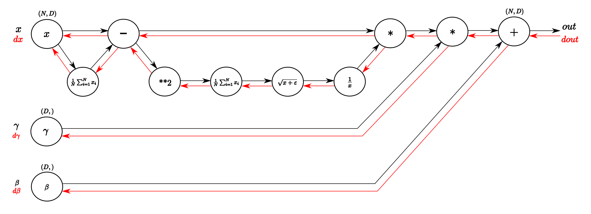

# Optimizer 

## 확률적 경사 하강법 (SGD: Stochastic Gradient Descent)  

$$ W \lArr W - \eta \frac{\partial L}{\partial W} $$

$W$ 는 가중치 행렬, $\eta$ 는 학습률, $\frac{\partial L}{\partial W}$ 은 손실함수의 기울기  

학습률만큼 기울기방향으로 이동하여 가중치를 업데이트하는 가장 간단한 방식   
기울기가 0에 가까워질 때 까지(손실함수의 기울기가 없어질 때 까지) 반복하는 방식이다.  

```py
class SGD:
    def __init__(self, lr=0.01):
        self.lr = lr # 학습률
    
    def update(self, params, grads): # params: 뉴럴넷 가중치 계층 list
        for key in params.key():
            params[key] -= self.lr * grads[key] # 각 계층별 W 를 업데이트
```

## SGD 단점  

$$ f(x,y) = \frac{1}{20}x^2 + y^2 $$


위 함수를 그래프로 나타내면 위와 같다.  
등고선으로 나타내면 우측과 같이 타원형으로 표현되며  
$y=0$ 일 때 가장 낮은 기울기를 가진다.  

$x, y$ 모두 0 일 때가 가장 낮은 기울기라고 할 경우 
SGD 를 사용해 학습을 진행하면 아래 그림과 같이 진행된다.  


좀더 효울적으로 $(0,0)$ 으로 탐색해 나가는 방식(`Momentom, AdaGrad, Adam`)이 많다.  

## Momentom  

$$ v \lArr av - \eta \frac{\partial L}{\partial W} \\ \ \\
W \lArr W + v $$

여기서 $v$ 는 veolocity(속도) 를 뜻하며 SDG 에 가속도를 더한 개념이다.  

기존 `SDG` 와 비교하면 뒤에 $av$ 를 추가로 더한 수식과 같다.  

$$ W \lArr W - \eta \frac{\partial L}{\partial W} + av $$

아래 그림과 같은 방향으로 경사하강을 하기 위해 만들어졌다.  


```py
class Momentum:
    def __init__(self, lr=0.01, momentum=0.9):
        self.lr = lr #η
        self.momentum = momentum #α
        self.v = None
        
    def update(self, params, grads):
	# update()가 처음 호출될 때 v에 매개변수와 같은 구조의 데이터를 딕셔너리 변수로 저장
        if self.v is None:
            self.v = {}
            for key, val in params.items():                                
                self.v[key] = np.zeros_like(val)
                
        for key in params.keys():
            self.v[key] = self.momentum*self.v[key] - self.lr*grads[key] 
            params[key] += self.v[key]
```


## AdaGrad

학습률 $\eta$ 를 효율적으로 정하는 것이 학습속도에 영향을 크게 끼치기에  
해당 학습률을 점차 줄여가는(learning rate decay) 방식이 AdaGrad 이다.  

$$ h \lArr h + \frac{\partial L}{\partial W} \odot \frac{\partial L}{\partial W} \\ \ \\
W \lArr W - \eta \frac{1}{\sqrt{h}} \frac{\partial L}{\partial W} $$


손실함수 기울기를 제곱한 변수 $h$ 를 사용해 학습률을 하락시킨다.  


```py
class AdaGrad:
    def __init__(self, lr=0.01):
        self.lr = lr
        self.h = None
        
    def update(self, params, grads):
        if self.h is None:
            self.h = {}
            for key, val in params.items():
                self.h[key] = np.zeros_like(val)
            
        for key in params.keys():
            self.h[key] += grads[key] * grads[key]
            params[key] -= self.lr * grads[key] / (np.sqrt(self.h[key]) + 1e-7) # 분모가 0이 되는것을 방지  

```


$h$값은 학습이 진행될 수록 계속 커짐으로 $\frac{1}{\sqrt{h}}$ 값이 0에 가까워 지기때문에 오히려 학습 진행속도가 늦어지는데 이를 개선한 `RMSProp` 방법이 있다.  

## Adam

`Momentom` 과 `AdaGrad` 기법을 융합한 방식, Adam(http://arxiv.org/abs/1412.6980v8) 에서 논문 확인 가능  


```py
class Adam:


    def __init__(self, lr=0.001, beta1=0.9, beta2=0.999):
        self.lr = lr
        self.beta1 = beta1
        self.beta2 = beta2
        self.iter = 0
        self.m = None
        self.v = None
        
    def update(self, params, grads):
        if self.m is None:
            self.m, self.v = {}, {}
            for key, val in params.items():
                self.m[key] = np.zeros_like(val)
                self.v[key] = np.zeros_like(val)
        
        self.iter += 1
        lr_t  = self.lr * np.sqrt(1.0 - self.beta2**self.iter) / (1.0 - self.beta1**self.iter)         
        
        for key in params.keys():
            #self.m[key] = self.beta1*self.m[key] + (1-self.beta1)*grads[key]
            #self.v[key] = self.beta2*self.v[key] + (1-self.beta2)*(grads[key]**2)
            self.m[key] += (1 - self.beta1) * (grads[key] - self.m[key])
            self.v[key] += (1 - self.beta2) * (grads[key]**2 - self.v[key])
            
            params[key] -= lr_t * self.m[key] / (np.sqrt(self.v[key]) + 1e-7)
            
            #unbias_m += (1 - self.beta1) * (grads[key] - self.m[key]) # correct bias
            #unbisa_b += (1 - self.beta2) * (grads[key]*grads[key] - self.v[key]) # correct bias
            #params[key] += self.lr * unbias_m / (np.sqrt(unbisa_b) + 1e-7)
```

`SGD`, `Momentom`, `AdaGrad`, `Adam` 4가지 알고리즘을 `mnist` 예제를 사용해 학습진도를 비교하면 아래 그림과 같다.  


# 가중치 초기값  

가중치의 초기값은 학습률에 큰 영향을 끼치는데 활성화 함수에 따라 요구하는 가중치 범위가 다르다.  

활성화 함수에 맞지 않은 가중치 초기값을 가질경우 아래와 같이 `Gradient Vanishing (기울기 소실)` 이 발생하는데 

각 활성화 함수별로 가중치의 초기값을 고르게 분포하기 위해 표준분포의 분산값을 사용한다.  

## Gradient Vanishing (기울기 소실)

```py
input_data = np.random.randn(1000, 100)  # 입력데이터(100set) 1000개 생성, 표준정규분포로 가중치 생성
node_num = 100  # 노드개수 100개
hidden_layer_size = 5  # 은닉층 5개
activations = {}  # 저장할 활성화값
x = input_data

for i in range(hidden_layer_size):
    if i != 0: x = activations[i-1]
    w = np.random.randn(node_num, node_num) * 1 # 표준정규분포 랜덤값 생성
    a = np.dot(x, w) # (1000, 100) det (100, 100) = (1000, 100)
    z = sigmoid(a) # 활성화 값 계산 (1000, 100)
    activations[i] = z # 다음 입력값으로 사용 (1000, 100)

# 히스토그램 생성
for i, a in activations.items(): # (1000, 100) x 5
    plt.subplot(1, len(activations), i+1)
    plt.title(str(i+1) + "-layer")
    if i != 0: plt.yticks([], [])
    plt.hist(a.flatten(), 30, range=(0,1))
plt.show()
```

`sigmoid` 의 활성화값이 `0 ~ 1`사이에 고르게 분포하려면 입력값이 `-2 ~ 2` 사이여야 한다.  

표준정규분포로 구한 입력값과 가중치의 행렬곱과정을 거치면 `-2` 보다 작거나 `2` 보다 큰 극단값으로 출력된다.  


그러다 보니 위 그림처럼 시그모이드 과정을 거치면서 `0` 혹은 `1` 로 치우치게 된다.  

표준편차를 `0.01` 로 바꿔 대부분의 가중치값을 `0` 가까운 수들로 배치하면  

```py
w = np.random.randn(node_num, node_num) * 0.01
```


순전파 마저도 0을 전파하면서 가중치 상관없이 `sigmoid(0)=0.5` 인 값이 대부분을 차지하게 된다.  

## Xavier 초깃값

노드개수 $n$을 사용해 표준편차가 $\sqrt{\frac{1}{n}}$ 인 정규분포로 초기값을 설정  

```py
w = np.random.randn(node_num, node_num) / np.sqrt(node_num)
```


행렬의 행렬곱을 통해 순전파가 이루어지다 보니 가중치를 무조건 작은 값으로 변화시키는 것이 아닌 형렬곱 결과가 적절히 `-2 ~ 2` 에 배치되도록  
노드의 수에 맞게 작은값으로 초기값을 설정한다.  


## He 초깃값

`Kaiming He` 의 이름을 딴 초기값으로 `ReLU` 활성화 함수에 적합한 초기값이다.  


노드개수 $n$을 사용해 표준편차가 $\sqrt{\frac{2}{n}}$ 인 정규분포로 초기값을 설정  
$n=100$ 일경우 `Xavier` 초깃값이 $\sqrt{\frac{1}{n}}=0.1$ 이라면 $\sqrt{\frac{2}{n}}=0.141$ 정도 된다.   

```py
for i in range(hidden_layer_size):
    if i != 0: x = activations[i-1]
    # w = np.random.randn(node_num, node_num) * np.sqrt(1.0 / node_num)
    w = np.random.randn(node_num, node_num) * np.sqrt(2.0 / node_num)
    a = np.dot(x, w)
    z = ReLU(a)
    activations[i] = z

# 히스토그램 그리기
for i, a in activations.items():
    plt.subplot(1, len(activations), i+1)
    plt.title(str(i+1) + "-layer")
    if i != 0: plt.yticks([], [])
    plt.hist(a.flatten(), bins=30)
plt.show()

```

분포값이 `0.1` 일 때  
  

분포값이 `0.141` 일 때  
  

입력값이 `0` 이하일 경우 활성화값이 `0` 이 되는 `ReLU` 특성상 `0` 이 가장 많고 그외에는 분포값이 생성될 확률에 따라 계단형식으로 활성화값이 형성된다.  

분포값이 `0.1`일때 보단 `0.141` 일때 좀더 고르게 분포됨으로 더 낫다고 할 수 있다.  
 
`MNIST` 를 통해 학습률을 체크해보면 확실히 ReLU 와 He 초기값을 사용한 경우 학습률이 훨씬 더 빠르다.  


# 배치 정규화 Batch Normalization

각 층의 활성화값이 적당히 분포되도록 **강제조정** 하는것.  


출력된 행렬곱(affine) 결과가 $B=\{x_1, x_2, ... , x_m\}$ 일 때 평균과 분산은 다음공식과 같다.  

$$ \begin{aligned}
m_B &\larr \frac{1}{n} \sum_{i=1}^n x_i \\ \ \\
\sigma_B &\larr \frac{1}{n} \sum_{i=1}^n (x_i - m_B)^2 
\end{aligned} $$

위 그림처럼 출력된 행렬곱(affine) 결과와 활성화 함수 사이에 를
$ m=0, \ \sigma=1 $ 
되도록 정규화(Normalization) 하는것이 배치 정규화이다.  

정규화된 데이터는 $\{\hat{x_1}, \hat{x_2}, ... , \hat{x_m}\}$ 으로 표시할 수 있는데 각 $\hat{x_n}$ 을 구하는 공식은 아래와 같다.  

$$ \hat{x_i} \larr \frac{x_i - m_B}{\sqrt{\sigma_b^2 + \epsilon}} $$

$\epsilon$ 은 0으로 나누지 않기 위한 매우작은값

이렇게 정규화된 값은 사용자 입맛에 따라 scale 확장과 이동이 가능하다. 
확장은 $\gamma$, 이동은 $\beta$ 을 통해 이루어진다. 

$$ y_i \larr \gamma \hat{x_i} + \beta$$

$\gamma=1, \beta=0$ 으로 시작하며 학습하면서 적합한 값으로 조정된다.  

계산그래프로 표현하면 아래와 같다.  



> 역전파는 https://kratzert.github.io/2016/02/12/understanding-the-gradient-flow-through-the-batch-normalization-layer.html 참고 

배치정규화를 사용하면 가중치의 초기값을 원하는 범위에 분포시킬 수 있고 
이전처럼 초기값때문에 학습진행이 아예 안되는 상황을 피할 수 있다.  


대부분 정규화를 사용하는것이 학습률에 좋은 영향을 끼침으로 뉴럴넷에서 많이 사용되는 분야이다.  

# 오버피팅

오버피팅이란 신경망이 훈련 데이터에 만 지나치게 적응되어 그 외의 데이터에는 제대로 대응하지 못하는 상태이다.  

일반적으로 훈련데이터가 적거나 너무 넓은 범위를 해결하기 위한 모델에서 이런 문제가 발생한다.  

## 가중치 감소(weight decay)  

이를 방지하는 방법으로 가중치 감소(weight decay) 방법이 있다.  

신경망 학습이란 역전파를 통해 가중치값을 변형시켜 손실함수의 값을 줄이는 것을 말하는데 
학습으로 인해 너무 큰 가중치값이 생기지 못하도록 페널티를 부여하는 방법이다.  

손실함수에 가중치의 L2노름을 더하는 방식으로 가중치의 상승을 막는다. 

$\frac{1}{2} \lambda W^2$ 를 손실함수에 더한다. $\lambda$ 를 통해 가중치 감소 비율을 기정할 수 있다.  


가중치 감소를 추가했을경우와 하지 않았을 경우 학습데이터와 테스트용 데이터간의 정확도 간극이 줄어든 것을 확인 가능하다.  

## 드롭아웃(Dropout)

신경망 모델이 복잡해지면 가중치 감소만으로는 대응하기 어렵다.  
오버피팅을 방지하기 위해 드롭아웃(Dropout) 이라는 기법도 사용한다.  


뉴런을 임의로 삭제하면서 학습하는 방법입니다. 훈련 때 은닉층의 뉴런을 무작위 로 골라 삭제하는 방식이다.  

> http://arxiv.org/abs/1207.0580

```py
class Dropout:
    def __init__(self, dropout_ratio=0.5):
        self.dropout_ratio = dropout_ratio
        self.mask = None

    def forward(self, x, train_flg=True):
        if train_flg:
            self.mask = np.random.rand(*x.shape) > self.dropout_ratio
            return x * self.mask
        else:
            return x * (1.0 - self.dropout_ratio)

    def backward(self, dout):
        return dout * self.mask
```

`self.mask` 초기화를 통해 `False` 일 경우 0으로 forward 시킨다.  
backward 시에도 저장해둔 `self.mask` 로 역전파 여부 결정  


학습진행률이 더디지만 train 과 test 사이에 간격이 더욱 줄어들었다.  

### 앙상블

앙상블 학습은 개별적으로 학습시킨 여러 모델의 출력을 평균 내어 추론하는 방식.

같거나 비슷한 구조 의 네트워크를 5 개 준비하여 따로따로 학습시키고, 5 개의 출력을 평균 내어 답하는 것.

드롭아웃은 학습이 진행될 때 마다 랜덤한 뉴런을 삭제해 새로운 모델로 학습하는 것과 같기 때문에 앙상블 학습과 비슷한 효과를 낸다고 볼수 있다.  

## 하이퍼파라미터

각층의 뉴런 수, 배치 크기, 학습률, 가중치감소계수 등을 **하이퍼파라미터** 라 하며 적절히 설정하지 않으면 모델의 성능이 크게 떨어지며 많은 시행착오를 통해 값을 찾을 수 있다.  

하이퍼파 라미터의 성능을 평가할 때는 **검증 데이터(validation data)** 를 별도로 만들어 사용한다.  
시험데이터만을 사용해 하이퍼파라미터를 수정하지 않는 이유는 오버피팅 때문이다.  

데이터를 수집하면 훈련 데이터, 시험 데이터, 검증 데이터 3종류로 나누어 두는 경우도 있다.  

- 훈련(Train) 데이터 : 매개변수 학습  
- 시험(Test) 데이터 : 신경망의 범용 성능 평가  
- 검증(Validation) 데이터 : 하이퍼파라미터 성능 평가  


일반적으로 Train 과 Test를 `7:3` 이나 `8:2` 로 나누고 Train 에서 `20%` 정도를 검증데이터로 사용한다.  


### 하이퍼파라미터 최적화  

하이퍼파라미터의 범위는 "대략적으로" 지정후 범위를 좁혀간다.  
어떤 하이퍼파라미터이든 $10^{-3}$ ~ $10^3$ 10의 거듭제곱(로그스케일)을 사용해 지정한다.  

하이퍼파라미터중 학습률과 가중치감소계수를 최적화하는 코드    

```py
# coding: utf-8
import sys, os
import numpy as np
import matplotlib.pyplot as plt
sys.path.append(os.pardir)
from dataset.mnist import load_mnist
from common.multi_layer_net import MultiLayerNet
from common.util import shuffle_dataset
from common.trainer import Trainer

(x_train, t_train), (x_test, t_test) = load_mnist(normalize=True)

# 결과를 빠르게 얻기 위해 훈련 데이터를 줄임
x_train = x_train[:500]
t_train = t_train[:500]

# 20%를 검증 데이터로 분할
validation_rate = 0.20
validation_num = int(x_train.shape[0] * validation_rate)
x_train, t_train = shuffle_dataset(x_train, t_train)
x_val = x_train[:validation_num]
t_val = t_train[:validation_num]
# 나머지는 학습용 데이터로 사용
x_train = x_train[validation_num:]
t_train = t_train[validation_num:]


def __train(lr, weight_decay, epocs=50):
    network = MultiLayerNet(input_size=784, hidden_size_list=[100, 100, 100, 100, 100, 100],
                            output_size=10, weight_decay_lambda=weight_decay)
    trainer = Trainer(network, x_train, t_train, x_val, t_val,
                      epochs=epocs, mini_batch_size=100,
                      optimizer='sgd', optimizer_param={'lr': lr}, verbose=False)
    trainer.train()

    return trainer.test_acc_list, trainer.train_acc_list


# 하이퍼파라미터 무작위 탐색======================================
optimization_trial = 100
results_val = {}
results_train = {}
for _ in range(optimization_trial):
    # 탐색한 하이퍼파라미터의 범위 지정===============
    weight_decay = 10 ** np.random.uniform(-8, -4)
    lr = 10 ** np.random.uniform(-6, -2)
    # ================================================

    val_acc_list, train_acc_list = __train(lr, weight_decay)
    print("val acc:" + str(val_acc_list[-1]) + " | lr:" + str(lr) + ", weight decay:" + str(weight_decay))
    key = "lr:" + str(lr) + ", weight decay:" + str(weight_decay)
    results_val[key] = val_acc_list
    results_train[key] = train_acc_list

# 그래프 그리기========================================================
print("=========== Hyper-Parameter Optimization Result ===========")
graph_draw_num = 20
col_num = 5
row_num = int(np.ceil(graph_draw_num / col_num))
i = 0

for key, val_acc_list in sorted(results_val.items(), key=lambda x:x[1][-1], reverse=True):
    print("Best-" + str(i+1) + "(val acc:" + str(val_acc_list[-1]) + ") | " + key)

    plt.subplot(row_num, col_num, i+1)
    plt.title("Best-" + str(i+1))
    plt.ylim(0.0, 1.0)
    if i % 5: plt.yticks([])
    plt.xticks([])
    x = np.arange(len(val_acc_list))
    plt.plot(x, val_acc_list)
    plt.plot(x, results_train[key], "--")
    i += 1

    if i >= graph_draw_num:
        break

plt.show()
```


```
=========== Hyper-Parameter Optimization Result ===========
Best-1(val acc:0.78) | lr:0.00953658839299552, weight decay:2.7311023737016235e-07
Best-2(val acc:0.78) | lr:0.009175214879331735, weight decay:6.877082011271197e-05
Best-3(val acc:0.75) | lr:0.008490280051161187, weight decay:5.723403726569213e-06
Best-4(val acc:0.72) | lr:0.007903651666486558, weight decay:4.528910075933648e-06
Best-5(val acc:0.71) | lr:0.005107687866173356, weight decay:5.49423537644538e-08
```

학습률 상승 순번으로 상위 1 ~ 5 까지의 가중치 감소계수를 보면 학습률은 $0.001 \sim 0.01$, 가중치감소계수는 $10^{-8} \sim 10^{-5}$ 일때 가장 일치율이 높음  

