> Computer Vision
Resolution(해상도) 에 따른 연산 횟수
1800x1600 해상도를 갖는 경우 픽셀당 3개의 광원 RGB 값이 각각 8bit 씩 차지함으로
하나의 이미지는 (24x1800x1600)bit 크기를 갖는다. 대략 8.6MB 이다.  
1분 영상의 경우 일반적으로 1초에 30FPS 임으로 (60x30x8.6)MB 크기를 갖는다. 대략 15.5GB 이다. 당연히 다양한 압축 방법으로 데이터를 최소한 줄이기에 실제 그렇진 않다.  


# CNN (Convolution Neural Network: 합성곱 신경망)

CNN 의 시초는 고양이 뇌 전극 실험에서 시작됬다.  
막대그림의 기울기에 따라 자극의 강도, 자극의 부위가 달리지는 것에서 

선과 점 과 같은 가장 단순현 형태의 구조에서 
문자, 그림과 같은 고차원 적인 구조를 이해하는 과정을

저수준 뉴런에서 고수준 뉴런으로의 이동과정이 있을거라고 연구결과로부터 예측하였고

컴퓨터도 형태(feature) 를 판단할 수 있지 않을까 란 호기심에서 시작됬다.  

> 여기서 feature 란 크기, 방향, 위치, 모든것을 다 object 의 feature 라 한다.  


이러한 아이디어가 바로 CNN으로 점차 진화되어 왔으며, 1998년 Yann Lecn et al.의 논문에서 손글씨 숫자를 인식하는데 사용한 LeNet-5가 소개 되면서 CNN이 등장하게 되었다.

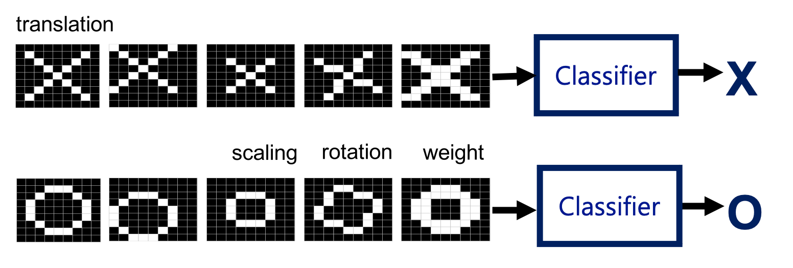

O, X 를 구분하는 신경망을 구성할 때 어떤식으로 구분할 수 있을까?  
그림마다 다양한 크기(scaling), 각도(rotation), 두께(weight) 를 갖는데 사람이 판단하기에는 모두 구분 가능하다.  

컴퓨터로 구분하게 하려면 어떻게 해야하는가? 
NN 으로 픽셀 기반으로 분류하려면 어떻게 해야하는가?

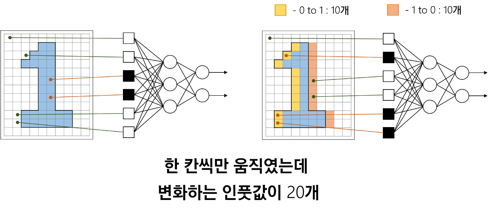

만약 위 그림처럼 픽셀 하나를 input 노드로 두고 그림을 숫자 `1` 로 분류하려면 픽셀 개수만큼의 input 노드가 필요하다.  

또한 위 그림처럼 오른쪽으로 shift 해버리면 변화되는 픽셀값이 20 개 이며 
단순 shift 인데 값이 너무 많이 변경되어 버리기 때문에 NN 에서 이와 같은 문제는 처리하기 매우 까다롭다.

1024X768 해상도의 사진의 경우 786,432개의 노드가 필요하다.  


## Convolution 

그러한 문제때문에 사진 전체를 사용해 feature 를 판단, Object 를 분류하지 않고 
일부, 지역적으로 판단하여 최종적으로 Object 를 분류한다.  
컴퓨터 뿐 아니라 사람 또한 위와 같은 방식으로 구분한다.  

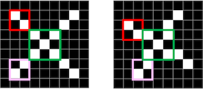

특정 지역의, 부분적인 `feature` 가 똑같을 경우, 그리고 동일한 `feature` 가 여러개 발견된다면 같은 Object 라 판단할 수 있을것.  

실제 고양이 사진을 사용해 분류하려면 아래와 같은 단계를 거쳐서 고양이로 판단 할 수 있을것.  


위와 같이 *컴퓨터가* 특징(feature) 만을 구하기 위해선 행렬곱(Convolution) 연산을 수행해야한다. 

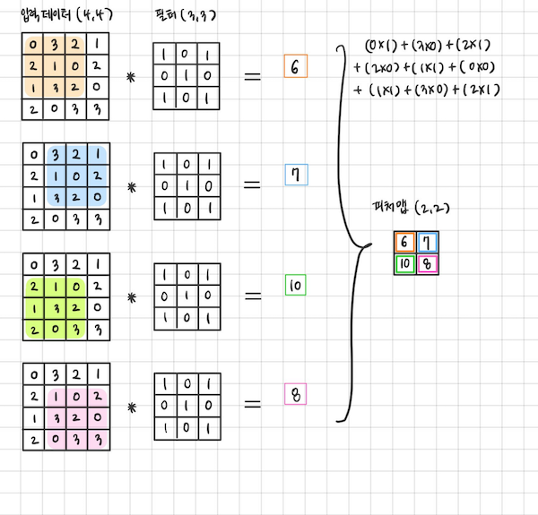


햅렬곱을 사용하면 아래와 같은 방식으로 어떤 특징(feature)이 강한지, 어디 부분에서 특징이 많은지 map 을 만들어 낼 수 있다.  

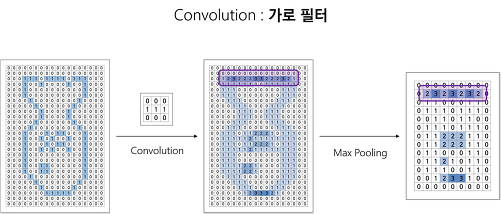

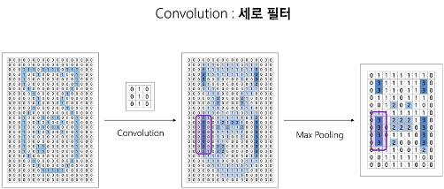


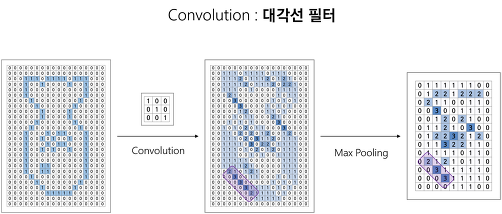

### Stride(보폭), Padding(패딩)

stride = 1, padding = 0


stride = 1, padding = 2


stride = 2, padding = 1


이미지의 크기가 클수록 필터의 크기도 커지고 stride 로 커지는 편이다.  

큰 이미지에서 작은 stride 로 움직여서 검출될 feature 라면
큰 stride 로 움직여도 feature 가 어느정도 검출 되기 때문,
연산량을 줄이기 위해 stride 를 크게하느 것이 좋음.

합성곱 연산 특징상 모서리에 있는 픽셀은 연산에 참여할 기회가 다른 픽셀보다 현저히 적다.  
따라서 모서리부분에 feature 가 있다면 놓지게 됨으로 padding 을 통해 모서리부분의 pixel 또한 합성곱 연산에 동일한 횟수로 참여할 수 있도록 한다.  

한번에 전체 사진에서 합성곱을 통해 feature 를 찾아내지 않고 작은 단위로 나누기 때문에 작은 사이즈의 필터 에서 큰 사이즈의 필터, stride 로 이동해 나간다.   

### Pooling  

합성곱 연산만으로 이미지의 feature 를 단정짖지 않고 하나의 과정을 추가로 거친다. 
Pooling 연산을 추가로 feature map 을 구할 수 있다.  
 
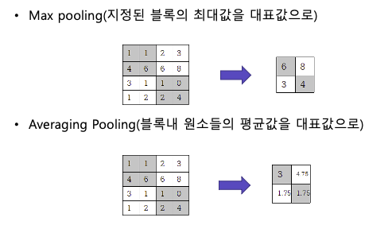

Pooling 의 장점은 이미지가 shift 되어도 출력되는 feature map 의 변화가 거의 없다는 것.  

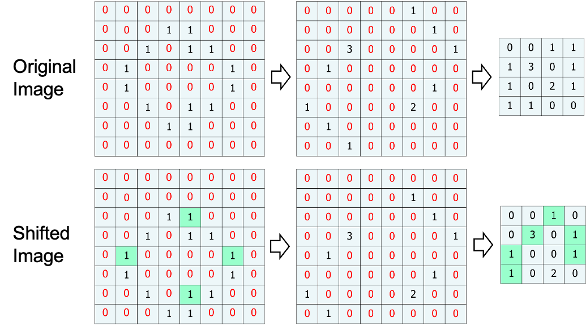

Origin Image 과 Shifted Image 를 Convolution 하고 Max Pooling 한 결과를 보면
0이 아닌 부분에서 동일한 부분이 많다.  

Pooling 할 블록의 크기는 사용자의 판단이다.  


### feature map (특징지도)

합성곱 필터 적용 후 thresholding 결과로 만들어지는 2차원 행렬을 featuer map 이라 하며
일반적으로 수직, 수평, 대각 등 여러가지 합성곱 필터를 사용하기에 feature map 도 많이 생성된다.


이미지의 feature map 을 출력하는 단계는 아래와 같다.  

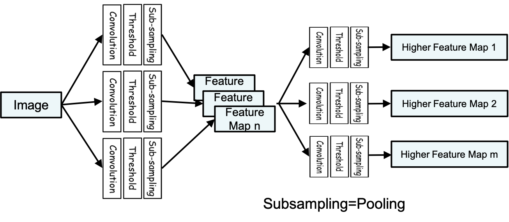

첫번째 단계에서 아래와 같은 과정을 거친다.  

1. `Convolution`: 합성곱
1. `Thresholding`: ReLu 와 같은 activation Function
1. `sub-sampling`: Pooling 

하나의 convolution 만으로 feature 를 구하지 않기 때문에 n 개의 feature map 이 생성될 수 있다.  

첫번째 convolution 필터는 매우 세세한 필터로 고양이의 수염, 원 등을 찾고
그 다음엔 얼굴, 발, 단계적으로 고차원적인 feature 를 구해내서 최종적으로 고양이 라는 object 를 판단하게 된다.  

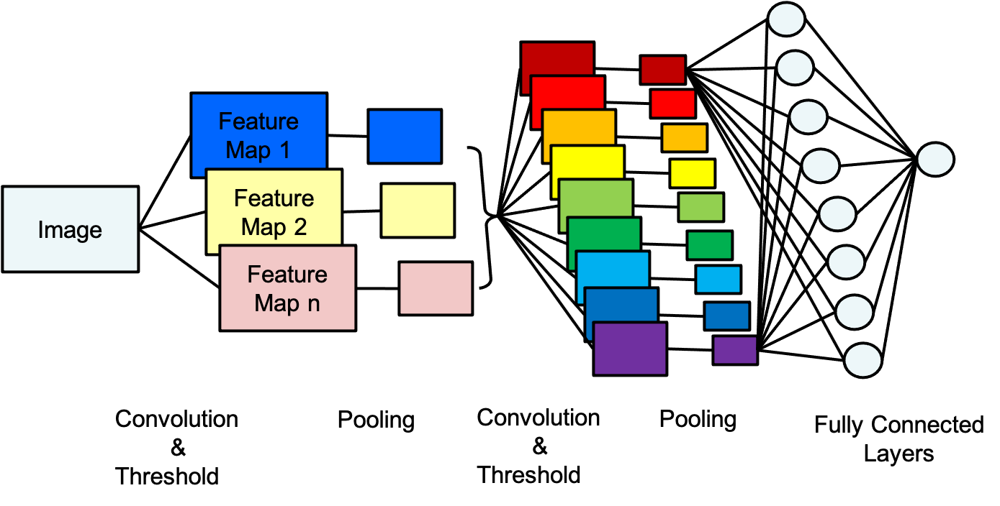

위 그림처럼 이미지에서 사람 얼굴을 찾으려면 `Convolution, Thresholding, sub-sampling` 을 통해 feature 를 먼저 찾고 작아진 pixel 을 기반으로 object detect 를 NN 을 통해 진행한다.  

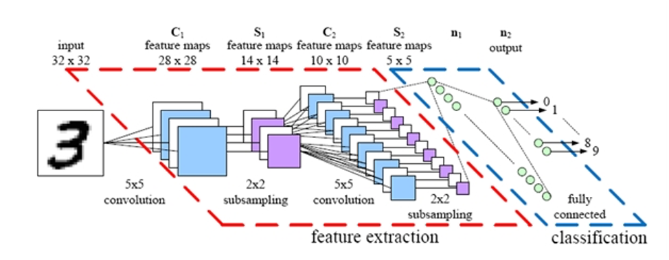
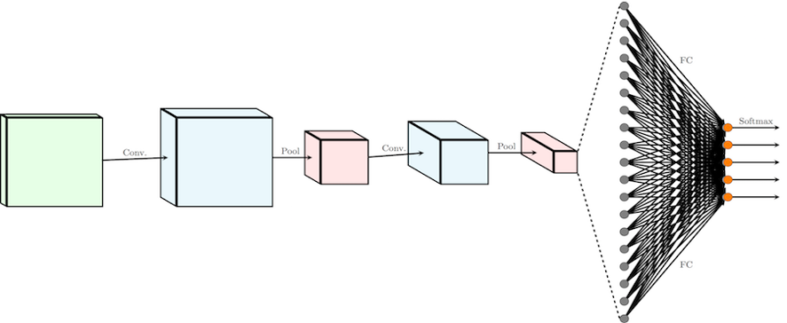


CNN 에 관한 여러 그림, 다양해 보이지만 전달하는 것은 위에서 설명한 내용과 똑같다.  
`Convolution, Thresholding, sub-sampling` 을 통해 feature map 을 구하고 NN 을 통해 classification 하는 것이다.  

Convolution 의 크기, activation function 종류, stride, pooling 여부, layer 개수, NN 노드개수, NN layer 수 모두 개발자가 정해야 한다.  

## Softmax Classification

이미지를 통해 10가지 동물로 분류하는 모델을 만들 경우
출력값을 어떤식으로 설정해야 하는가?

지금까진 0 ~ 1사이의 실수값을 기반으로 역전퐈 과정을 통해 오차를 줄여 나갔는데

여러 종류의 객체로 레이블링 하려면 생각이 많아진다.  


`Logistic Regression` 와 같이 분류가 2개일 경우 `activation function` 를 통해 `yes or no` 로 분류했다면
`Multinomial Classification` 는 분류가 n개 이상일 경우 사용되며 `Softmax Function` 을 사용한다.   


`Softmax Function` 의 수식은 아래와 같이 표현한다.  

출력노드 k, k 개로 분류할 경우  
모든 출력노드의 합과 특정 출력노드의 합의 비율로 나타낸다.  

$$ f_j(z) = \frac{e^{z_j}}{\sum_ke^{z_k}} $$

> $e^{z_j}$ 는 자연상수 $e$ 의 $j$째 출력노를 지수로 설정한 값이다.   

위 그림에서 모든 출력노드의 `Softmax Function` 을 적용한 수식은 아래와 같다.  


$$ \begin{aligned}
o_j &= \frac{e^{z_j}}{\sum_ke^{z_k}} \\
&\rArr (
    \frac{e^{2.2}}{e^{2.2}+e^{1.39}+e^{0.85}},
\frac{e^{1.39}}{e^{2.2}+e^{1.39}+e^{0.85}},
\frac{e^{0.85}}{e^{2.2}+e^{1.39}+e^{0.85}}) \\
& \rArr(0.59, 0.26, 0.15)
\end{aligned} $$

`Softmax Function` 은 단순히 각 값을 백분율로 나타내기 위하기 위한 함수이다.  
$0.59 + 0.26 + 0.15 = 1$

각 출력노드의 합을 분모로 갖기에 각 출력노드의 비율로 출력값을 변경한다. 

그리고 `One Hot Encoding` 함수를 거쳐 n 개의 결과중 1개의 결과만 1로 변경하는 과정을 거친다.  

실제 학습 데이터를 구성할 최 우측과 같이 개발자가 사진별로 레이블링 해둔 데이터를 기반으로 학습을 진행할 것이기 때문에 
해당 사진이 강아지 `100%` 이고 그 외에는 `0%` 임을 알고 있다.  

출력된 `Softmax Function` 결과값과 레이블링된 데이터를 사용해 역전파 과정을 거쳐 가중치를 업데이트해 나간다.  

## Softmax Function Error function - Cross Entropy

기존 `Logistic Regression` 에서의 `MSE(Mean squared Error)` 방식의 에러함수는 사용해 왔다.  

$$
E_n(w) = \frac{1}{2}\sum_{k=1}^m(t_{nk}-o_{nk})^2
$$


`Multinomial Classification` 에서는 `MSE` 방식의 `Error function` 을 사용하지 않고 `KL divergence` 을 사용한다.  

`Softmax Function` 을 통해 출력되는 값은 확률값으로 
`KL divergence` 을 통해 에러를 줄여 나가는 것이 더 효율적이다.  


`KL divergence` 의 공식 $D_{KL}(P||Q)$ 는 아래와 같다.  


`KL divergence` 의 값 $D_{KL}(P||Q)$ 이 작을 수록 실제확률의 분포와 예측확률의 분포가 유사하고,
클 수록 2개의 분포 차이가 크다.  

status|강아지|고양이|토끼
|---|---|---|---|
실제(t)|1|0|0
예측(o)|0.59|0.26|0.15

`KL divergence` 를 사용한 에러함수는 아래와 같다.  

$$ E_n(\vec{w}, \vec{x}) = -\sum_k \vec{t_{nj}} \log \vec{o_{nk}} $$

`KL divergence` 를 사용하게 되면 실제 확률은 1 아니면 0 이기 때문에 계산횟수가 굉장이 줄어든다.  

## Convolution Filter 생성

위에서 `feature map` 을 뽑아내기 위해 `Convolution Filter` 를 사용해 
`Convolution + Threshold + Pooling` 과정을 반복적으로 거치는데 

수많은 `Convolution Filter` 는 누가 만들어야 하는가?  

NN 이 학습을 통해 `Convolution Filter` 를 생성해준다. (필터 크기는 개발자가 정한다)


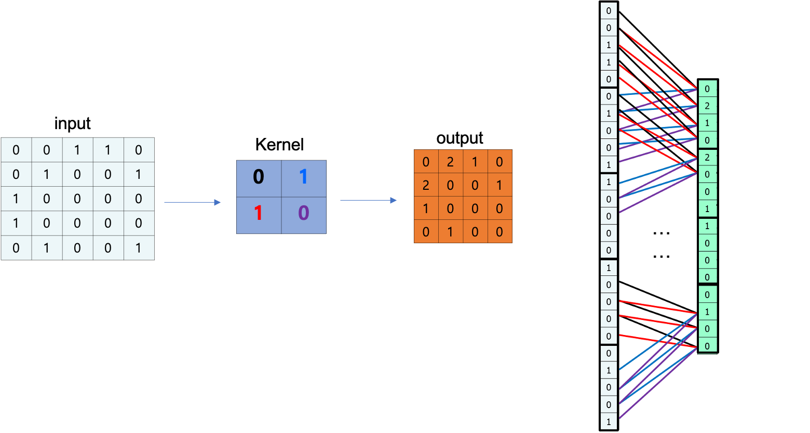

위와 같이 `input` 값이 `Convolution Filter(kernel)` 을 통해 `output` 으로 출력하는 경우를
1차원으로 펴서 표현한 그림이다.  

자세히 1열로 펴진 `output` 에 각각 선이 4개씩 1열로 펴진 `input`에 연결되어 있다.  
생긴것이 꼭 Neural Network 처럼 생겼다.  

`CNN` 은 `합성곱필터(Convolution Filter)` 를 노드간의 `가중치(weight)` 로 전환하는 이론이다.  
합성곱필터 내부의 값은 역전파 과정(`gradient decent`) 를 통해 결정한다.  

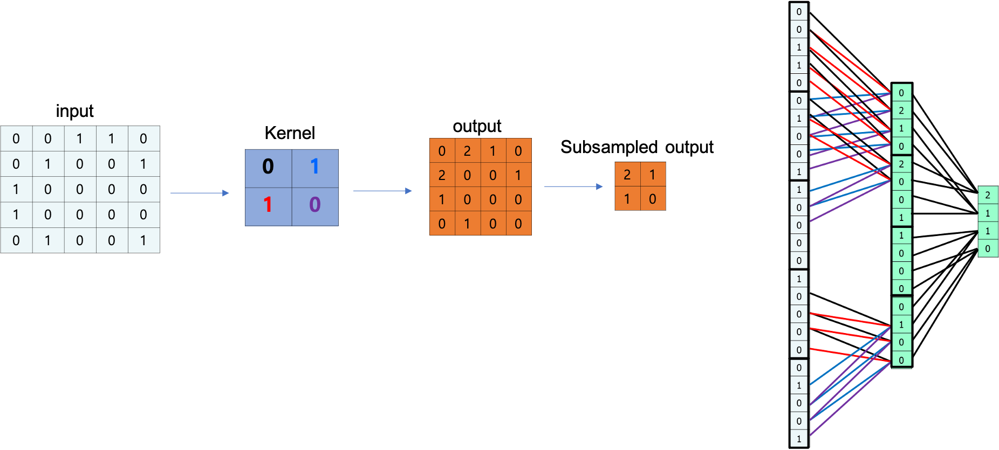

여기에 `pooling` 과정이 추가된다 하더라도 마찬가지로 `NN` 개념을 도입할 수 있다.  

위 그림의 경우 4칸 마다 가장 큰 값에 `1`을 곱하는 `Max Pooling` 방식을 사용했으며 `NN` 개념을 계속 이어나갈 수 있다.  

전체적인 그림으로 보면 아래와 같다.  


최종 출력된 `feature map` 은 분류하는 작업은 `fully connected NN`으로 표현하고
이전단계는 모두 `partially connected NN` 으로 표현한다.

이렇게 학습된 Convolution filter 를 visualization 하면 아래와 같이 나타난다.  

각 레이어별로 생성된 filter 를 사용해 feature map 을 생성하면 아래와 같이 나타난다.   

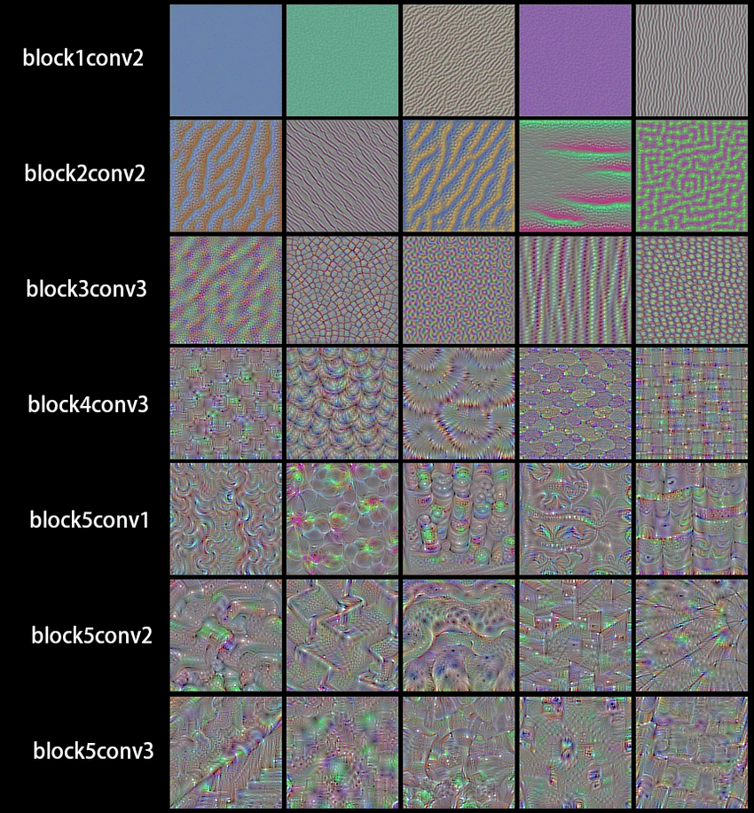


아래는 AlexNet 모델로 첫번째 레이어에서는 단순한 질감, 패턴 등이 filter 로 사용되지만 레이어를 반복할 수록 object 에서 나타날 수 있는 고차원적인 패턴이 나타난다.  

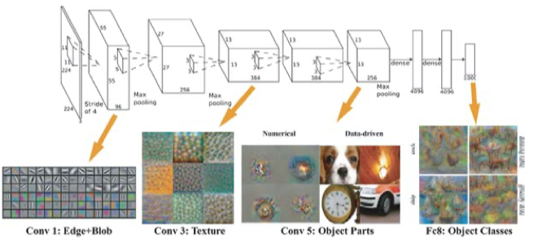

첫번째 layer 에서는 Edge+blob(직선,색,경계)과 같은 가장 단순한 패턴이 강조되어 feature map 으로 출력되고  
고차원으로 갈 수록 사람 눈으로도 판단할 수 있을 판금 고차원적인 패턴이 강조되어 feature map 으로 출력된다.  

### 예제 

최종출력노드가 1000개 인 `Multinomial Classification` 가능한 모델이다.  
이미지에 대해 1000 종류로 `Classification` 가능하다.  


계산량을 표로 표현하면 아래와 같다.

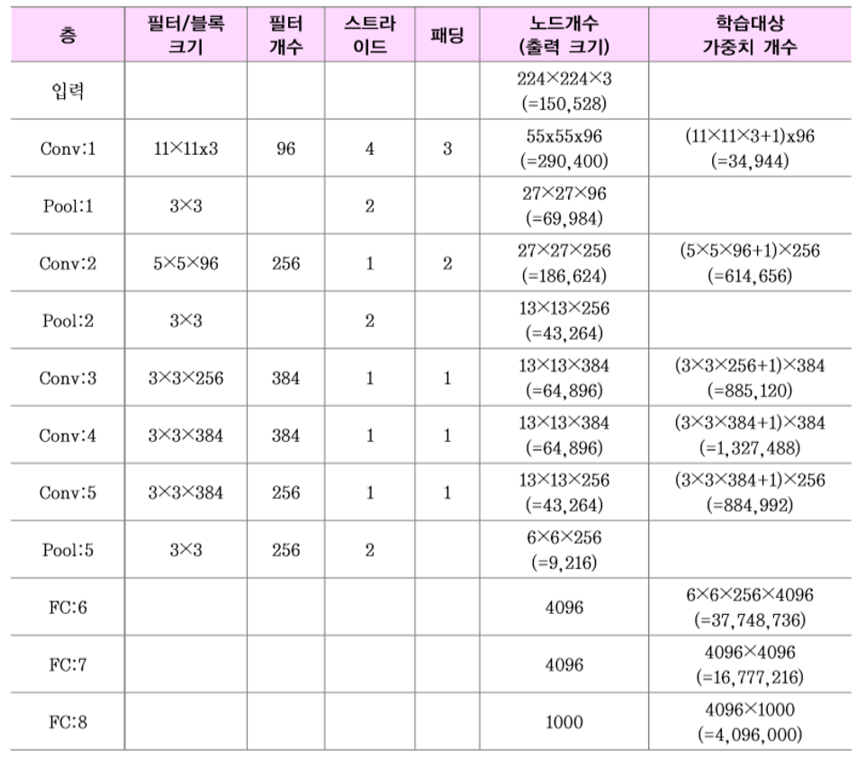

입력으로 들어온 3장의 사진 `RGB` 를 연산하기 위한 `11x11 3중` 필터를 96개 사용해 `Convolution Filter` 를 거치면
`55x55` 사진이 96장 생기고 `55x55x96` 출력노드가 생성된다.  

출력노드의 개수가 연산되는 공식이다.  

$$ output = int(\frac{(N-F)}{stride}) + 1 $$

Padding 이 존재할 경우 

$$ output = int(\frac{(N-F+2P)}{stride}) + 1 $$

$N$: image size  
$F$: filter size  
$P$: padding size

위의 경우 $N=224, F=11$ 이고 $P=3$, $stride=4$ 가정했을 때 

$$ output = int(\frac{(224-11+2*3)}{4}) + 1 = int(54.75) + 1 = 55 $$

그리고 `3x3 pooling` 필터를 거치면 아래와 같다.  
마찬가지로 위에서 사용하는 연산공식을 사용한다.  

$$ output = int(\frac{(55-3)}{2}) + 1 = int(26) + 1 = 27 $$

따라서 `27x27x96` 개의 `output node` 가 출력된다.

`Conv:2` 에서는 들어오는 사진수가 96자이기에 `5x5 96중` 필터 256개를 사용해 연산을 진행한다.  

최종 `fully connected NN` 에서는 각각 4096 개의 노드를 사용한다.

출력된 가중치의 개수를 보면 대략 600만개이다.  

## 3차원 합성곱  


입력데이터와 필터의 채널마다 합성곱연산 후 결과를 더해 하나의 출력을 얻는다.  

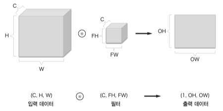

채널 개수는 입력데이터와 필터 모두 같아야 하고 출력데이터는 하나의 채널로 출력된다.  

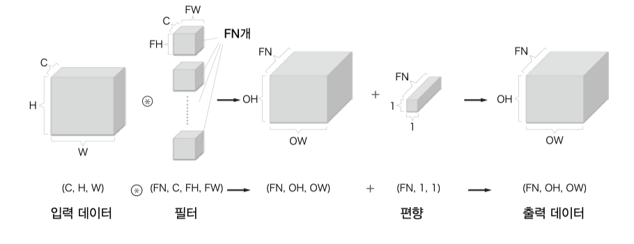

대부분 CNN 에서 하나의 필터만 사용하지 않고 여러개의 필터를 사용하기에 출력 데이터의 채널도 필터개수만큼 늘어난다.  

일반적인 신경망처럼 CNN 에도 편향이 추가될 수 있다.  

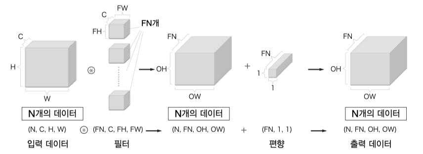

여기에 처리 효율을 위해 미니배치 방식의 학습 처리를 사용한다면 4차원 배열을 사용하게 된다.  

예를 들어 데이터의 형상이 `(10, 1, 28, 28)` 이라면, 이는 높이 28, 너비 28, 채널 1 인 데이터가 10개라는 이야기.

## 구현

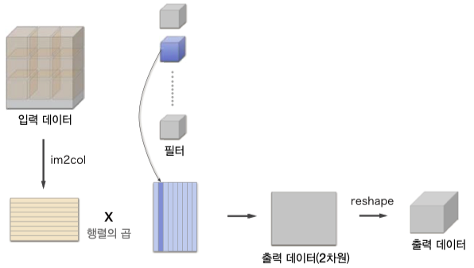

스트라이드와 패딩의 크기를 코려해 다수의 이미지(4차원)을 입력받아 2차원으로 변환하는 함수  

```py
def im2col(input_data, filter_h, filter_w, stride=1, pad=0):
    """다수의 이미지를 입력받아 2차원 배열로 변환한다(평탄화).
    
    Parameters
    ----------
    input_data : 4차원 배열 형태의 입력 데이터(이미지 수, 채널 수, 높이, 너비)
    filter_h : 필터의 높이
    filter_w : 필터의 너비
    stride : 스트라이드
    pad : 패딩
    
    Returns
    -------
    col : 2차원 배열
    """
    N, C, H, W = input_data.shape
    out_h = (H + 2*pad - filter_h)//stride + 1
    out_w = (W + 2*pad - filter_w)//stride + 1

    img = np.pad(input_data, [(0,0), (0,0), (pad, pad), (pad, pad)], 'constant')
    col = np.zeros((N, C, filter_h, filter_w, out_h, out_w))

    for y in range(filter_h):
        y_max = y + stride*out_h
        for x in range(filter_w):
            x_max = x + stride*out_w
            col[:, :, y, x, :, :] = img[:, :, y:y_max:stride, x:x_max:stride]

    col = col.transpose(0, 4, 5, 1, 2, 3).reshape(N*out_h*out_w, -1)
    return col
```

```py
x1 = np.random.rand(1, 3, 7, 7) * 10 // 1
col1 = im2col(x1, 5, 5, stride=1, pad=0)
print(col1.shape) # (9, 75)
```

총원소수 `147(1, 3, 7, 7)`개짜리 행렬이 원소수 `675(9, 75)`개짜리 행렬로 변환하였다.  
필터와 행렬곱이 가능한 행렬로 변환하다보니 중복된 원소수가 많이 생기지만 
행렬연산의 빠른 속도를 위해 메모리를 포기하고 `im2col` 과 같은 함수를 사용하게 되었다.  


```py
class Convolution:
    # W: 가중치(필터), 편향, 스트라이드, 패드
    def __init__(self, W, b, stride=1, pad=0):
        self.W = W
        self.b = b
        self.stride = stride
        self.pad = pad
        
        # 중간 데이터（backward 시 사용）
        self.x = None   
        self.col = None
        self.col_W = None
        
        # 가중치와 편향 매개변수의 기울기
        self.dW = None
        self.db = None

    def forward(self, x):
        FN, C, FH, FW = self.W.shape # N개의 필터
        N, C, H, W = x.shape # N개의 입력데이터
        out_h = 1 + int((H + 2*self.pad - FH) / self.stride)
        out_w = 1 + int((W + 2*self.pad - FW) / self.stride)
        # image to column 이미지에서 행렬로
        # 필터와 행렬곱할 수 있는 형태로 변환  
        col = im2col(x, FH, FW, self.stride, self.pad)
        # 필터를 행렬곱할수 있는 형태로 변환  
        col_W = self.W.reshape(FN, -1).T
        out = np.dot(col, col_W) + self.b

        self.x = x
        self.col = col
        self.col_W = col_W

        # 다시 N, C, H, W 형태의 행렬로 변환  
        out = out.reshape(N, out_h, out_w, -1).transpose(0, 3, 1, 2)
        return out

    def backward(self, dout):
        FN, C, FH, FW = self.W.shape
        dout = dout.transpose(0,2,3,1).reshape(-1, FN)

        self.db = np.sum(dout, axis=0)
        self.dW = np.dot(self.col.T, dout)
        self.dW = self.dW.transpose(1, 0).reshape(FN, C, FH, FW)

        dcol = np.dot(dout, self.col_W.T)
        dx = col2im(dcol, self.x.shape, FH, FW, self.stride, self.pad)

        return dx
```

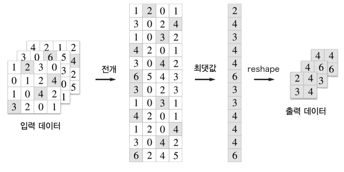

```py
class Pooling:
    def __init__(self, pool_h, pool_w, stride=1, pad=0):
        self.pool_h = pool_h
        self.pool_w = pool_w
        self.stride = stride
        self.pad = pad
        
        self.x = None
        self.arg_max = None

    def forward(self, x):
        N, C, H, W = x.shape
        out_h = int(1 + (H - self.pool_h) / self.stride)
        out_w = int(1 + (W - self.pool_w) / self.stride)

        col = im2col(x, self.pool_h, self.pool_w, self.stride, self.pad)
        col = col.reshape(-1, self.pool_h*self.pool_w)

        arg_max = np.argmax(col, axis=1)
        out = np.max(col, axis=1)
        out = out.reshape(N, out_h, out_w, C).transpose(0, 3, 1, 2)

        self.x = x
        self.arg_max = arg_max

        return out

    def backward(self, dout):
        dout = dout.transpose(0, 2, 3, 1)
        
        pool_size = self.pool_h * self.pool_w
        dmax = np.zeros((dout.size, pool_size))
        dmax[np.arange(self.arg_max.size), self.arg_max.flatten()] = dout.flatten()
        dmax = dmax.reshape(dout.shape + (pool_size,)) 
        
        dcol = dmax.reshape(dmax.shape[0] * dmax.shape[1] * dmax.shape[2], -1)
        dx = col2im(dcol, self.x.shape, self.pool_h, self.pool_w, self.stride, self.pad)
    
        return dx
```

```py
# coding: utf-8
import sys, os
sys.path.append(os.pardir)  # 부모 디렉터리의 파일을 가져올 수 있도록 설정
import pickle
import numpy as np
from collections import OrderedDict
from common.layers import *
from common.gradient import numerical_gradient

class SimpleConvNet:
    """단순한 합성곱 신경망

    Parameters
    ----------
    input_size : 입력 크기（MNIST의 경우엔 (1, 28, 28) -> 784）
    hidden_size_list : 각 은닉층의 뉴런 수를 담은 리스트（e.g. [100, 100, 100]）
    output_size : 출력 크기（MNIST의 경우엔 10）
    activation : 활성화 함수 - 'relu' 혹은 'sigmoid'
    weight_init_std : 가중치의 표준편차 지정（e.g. 0.01）
        'relu'나 'he'로 지정하면 'He 초깃값'으로 설정
        'sigmoid'나 'xavier'로 지정하면 'Xavier 초깃값'으로 설정
    """
    def __init__(self, input_dim=(1, 28, 28), # 1층 28 x 28 사이즈
                 conv_param={'filter_num':30, 'filter_size':5, 'pad':0, 'stride':1},
                 hidden_size=100, output_size=10, weight_init_std=0.01):
        filter_num = conv_param['filter_num']
        filter_size = conv_param['filter_size']
        filter_pad = conv_param['pad']
        filter_stride = conv_param['stride']

        # CNN 네트워크 구축을 위해 미리 합성곱 출력사이즈, 풀링 출력사이즈 연산 
        input_size = input_dim[1]
        conv_output_size = (input_size - filter_size + 2*filter_pad) / filter_stride + 1
        pool_output_size = int(filter_num * (conv_output_size/2) * (conv_output_size/2))

        # 가중치 초기화
        self.params = {}
        self.params['W1'] = weight_init_std * np.random.randn(filter_num, input_dim[0], filter_size, filter_size)
        self.params['b1'] = np.zeros(filter_num)
        self.params['W2'] = weight_init_std * np.random.randn(pool_output_size, hidden_size)
        self.params['b2'] = np.zeros(hidden_size)
        self.params['W3'] = weight_init_std * np.random.randn(hidden_size, output_size)
        self.params['b3'] = np.zeros(output_size)

        # conv - relu - pool - affine - relu - affine - softmax
        # 계층 생성
        self.layers = OrderedDict()
        self.layers['Conv1'] = Convolution(self.params['W1'], self.params['b1'],
                                           conv_param['stride'], conv_param['pad'])
        self.layers['Relu1'] = Relu()
        self.layers['Pool1'] = Pooling(pool_h=2, pool_w=2, stride=2)
        self.layers['Affine1'] = Affine(self.params['W2'], self.params['b2'])
        self.layers['Relu2'] = Relu()
        self.layers['Affine2'] = Affine(self.params['W3'], self.params['b3'])

        self.last_layer = SoftmaxWithLoss()

    def predict(self, x):
        for layer in self.layers.values():
            x = layer.forward(x)

        return x

    def loss(self, x, t):
        """손실 함수를 구한다.

        Parameters
        ----------
        x : 입력 데이터
        t : 정답 레이블
        """
        y = self.predict(x)
        return self.last_layer.forward(y, t)

    def accuracy(self, x, t, batch_size=100):
        if t.ndim != 1 : t = np.argmax(t, axis=1)
        
        acc = 0.0
        
        for i in range(int(x.shape[0] / batch_size)):
            tx = x[i*batch_size:(i+1)*batch_size]
            tt = t[i*batch_size:(i+1)*batch_size]
            y = self.predict(tx)
            y = np.argmax(y, axis=1)
            acc += np.sum(y == tt) 
        
        return acc / x.shape[0]

    def numerical_gradient(self, x, t):
        """기울기를 구한다（수치미분）.

        Parameters
        ----------
        x : 입력 데이터
        t : 정답 레이블

        Returns
        -------
        각 층의 기울기를 담은 사전(dictionary) 변수
            grads['W1']、grads['W2']、... 각 층의 가중치
            grads['b1']、grads['b2']、... 각 층의 편향
        """
        loss_w = lambda w: self.loss(x, t)

        grads = {}
        for idx in (1, 2, 3):
            grads['W' + str(idx)] = numerical_gradient(loss_w, self.params['W' + str(idx)])
            grads['b' + str(idx)] = numerical_gradient(loss_w, self.params['b' + str(idx)])

        return grads

    def gradient(self, x, t):
        """기울기를 구한다(오차역전파법).

        Parameters
        ----------
        x : 입력 데이터
        t : 정답 레이블

        Returns
        -------
        각 층의 기울기를 담은 사전(dictionary) 변수
            grads['W1']、grads['W2']、... 각 층의 가중치
            grads['b1']、grads['b2']、... 각 층의 편향
        """
        # forward
        self.loss(x, t)

        # backward
        dout = 1
        dout = self.last_layer.backward(dout)

        layers = list(self.layers.values())
        layers.reverse()
        for layer in layers:
            dout = layer.backward(dout)

        # 결과 저장
        grads = {}
        grads['W1'], grads['b1'] = self.layers['Conv1'].dW, self.layers['Conv1'].db
        grads['W2'], grads['b2'] = self.layers['Affine1'].dW, self.layers['Affine1'].db
        grads['W3'], grads['b3'] = self.layers['Affine2'].dW, self.layers['Affine2'].db

        return grads
        
    def save_params(self, file_name="params.pkl"):
        params = {}
        for key, val in self.params.items():
            params[key] = val
        with open(file_name, 'wb') as f:
            pickle.dump(params, f)

    def load_params(self, file_name="params.pkl"):
        with open(file_name, 'rb') as f:
            params = pickle.load(f)
        for key, val in params.items():
            self.params[key] = val

        for i, key in enumerate(['Conv1', 'Affine1', 'Affine2']):
            self.layers[key].W = self.params['W' + str(i+1)]
            self.layers[key].b = self.params['b' + str(i+1)]
```

```py
# coding: utf-8
import numpy as np
import matplotlib.pyplot as plt
from simple_convnet import SimpleConvNet

def filter_show(filters, nx=8, margin=3, scale=10):
    """
    c.f. https://gist.github.com/aidiary/07d530d5e08011832b12#file-draw_weight-py
    """
    FN, C, FH, FW = filters.shape
    ny = int(np.ceil(FN / nx))

    fig = plt.figure()
    fig.subplots_adjust(left=0, right=1, bottom=0, top=1, hspace=0.05, wspace=0.05)

    for i in range(FN):
        ax = fig.add_subplot(ny, nx, i+1, xticks=[], yticks=[])
        ax.imshow(filters[i, 0], cmap=plt.cm.gray_r, interpolation='nearest')
    plt.show()


network = SimpleConvNet()
# 무작위(랜덤) 초기화 후의 가중치
filter_show(network.params['W1'])

# 학습된 가중치
network.load_params("params.pkl")
filter_show(network.params['W1'])
```
