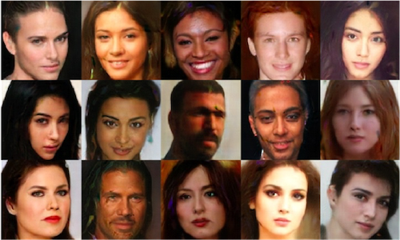
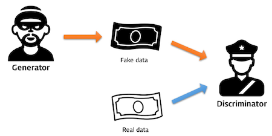
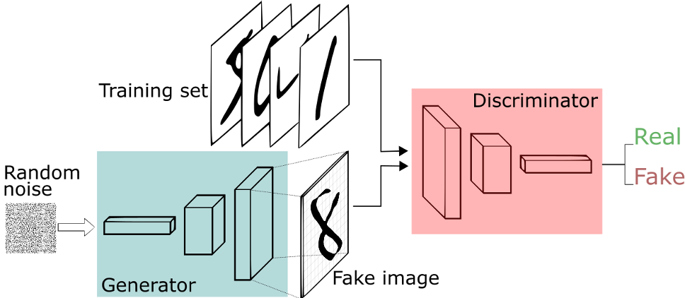
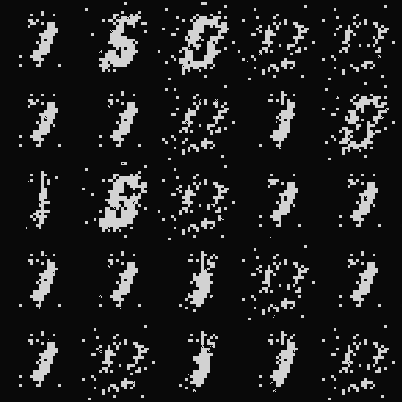
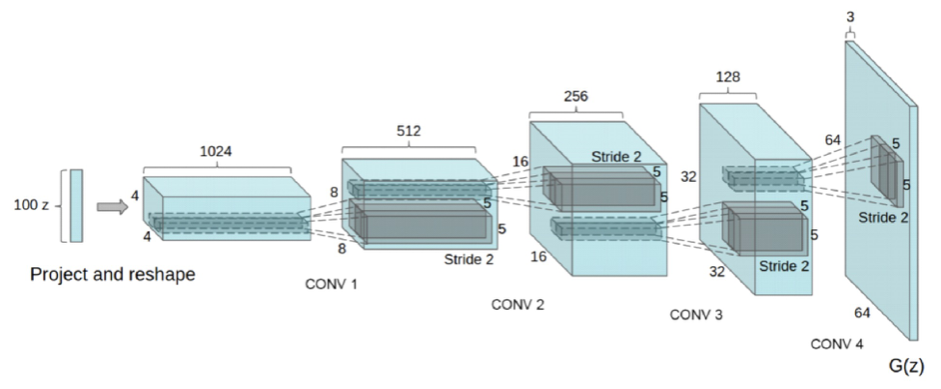
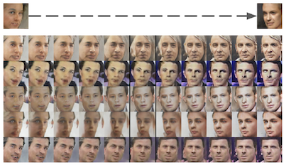
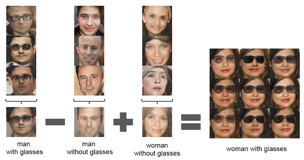
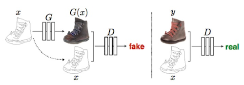
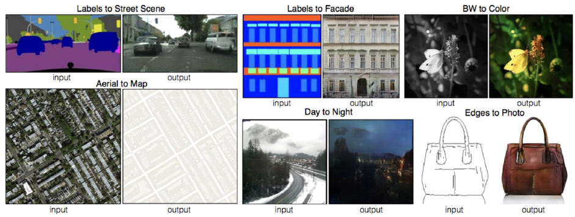

# GAN (Generative Adversarial Network: 생산적 적대 신경망)

Unsupervised Learning 모델중 하나로 **그럴듯한 가짜 데이터** 를 만들어 내는 모델이다.  

> GAN 모델이 스스로 생성한 가짜 얼굴들  

`256x256` 크기의 컬러 얼굴 이미지를 만들어낼때 
`256x256x3` 변수 조합의 사람 얼굴 이미지들이 생성 가능하다.  

이 조합중에서 얼굴 이미지와 픽셀 조합이 유사할 경우 **그럴듯한 가짜 데이터** 라 할 수 있다.  

> 그럴듯한 가짜 데이터
> 실제 데이터 분포와 유사한 데이터 분포를 말한다. 
> 예를들어 사람의 키와 몸무게 조합을 사용해 그럴듯한 가짜 데이터를 생성할때  
> 표준 체중을 구하는 계산법 `[신장(cm) - 100] * 0.9` 을 사용하면 수많은 그럴듯한 가짜 데이터 생성이 가능하다.  
> 이를 크게 벗어난다면 키/몸무게 데이터라 보기 힘들다.  

가장 유명한 예제로 경찰과 위조지폐범 예제를 들 수 있다.  

위조지폐범은 경찰을 속이기 위해 점점 위조지폐기술을 발전시켜 나가고
경찰은 위조지폐범을 잡기 위해 점점 위조지폐감지기술을 반전시켜 나간다.  
시간이 계속 흐르면 둘의 기술이 매우 비슷해져 50%(반반) 확률 결과를 갖는다.  

여기서 위조지폐범을 `Generator(생성자)` 라 하고 경찰을 `Discriminator(구분자)` 라 한다.  

디테일하게 설명하면 
`Generator` 는 데이터 분포를 학습하고 가짜 데이터를 만들어내고 
`Discriminator` 는 평균 분포를 가지고 해당 데이터가 분포에 속해있는지, 몇 퍼센트에 속하는지를 검사한다.    

위 방법을 사용하기 위해 Network 를 2개 사용한다.  

`Discriminator` 는 Real Images 부터 학습을 일정수준 이상 진행한다.  
그리고 `Generator` 는 Random noise 로부터 이미지를 생성해 `Discriminator` 에게 전달한다.  

처음엔 당연히 분포에서 굉장치 먼, 차이가 있는 이미지가 생성될 것임으로 fake 가 많이 출력 될것이다.  

`Generator` 의 네트워크롤 보면 `CNN` 를 거꾸로 뒤집어 둔 모양새와 같다.  
`Transposed Convolution` 이라 하며 해당 연산을 통해 정상적인 이미지를 만들어 내려 노력한다.  

`Discriminator` 의 경우 해당 이미지를 받아서 `CNN` 모델을 통해 백분율로 Real인지 Fake인지 구분해내고 
만약 `88% fake, 12% real` 일 경우 `100% fake` 로 만들기 위해 가중치를 조절한다.  

`Generator` 역시 `88% fake, 12% real` 데이터를 받아서 역으로 `0% fake` 로 만들기 위해 가중치를 조절한다.  

어느 순간 `Generator` 의 판별율이 50% 에 급접하게 될 경우 학습을 완료한 것으로 생각할 수 있다.  

## DCGAN (Deep Convolutional Generative Adversarial Network)

`Transposed Convolution` 은 최종출력된 `feature map` 을 원래 이미지 단계로 되돌리기 위해 사용하는 `CNN` 을 역으로 계산하는 기법이다.  
처음 `GAN` 은 `Convolution` 기반의 `Generator` 가 아니였다. 
이제서야 `DCGAN` 이라는 모델이 논문으로 발표되며 `Transposed Convolution` 라는 기법을 사용해 안정적인 가짜 데이터를 생성할 수 있었게 되었다.  

`Transposed Convolution` 일반적인 `CNN` 과 다른점은 Pooling 단계는 사용해선 안된다.  
Pooling 이 진행되면 max 이건 average 이건 특정 픽셀범위를 대표값으로 압축해버리기에 
손실픽셀이 생기면서 `CNN` 을 Reverse 하는 의미가 퇴색되어 버린다.  

`DCGAN` 의 특징은 `Transposed Convolution` 에서 첫 입력되는 `feature map` 은 사람의 특징만 모아놓은 데이터이고 이를 사용해 특징을 변경해 새로운 이미지를 만들 수 있다는 것.  

안경착용 여부, 동양인 서양인, 머리색, 수염여부 등 모두 얼굴의 `feature` 이다.  

만약 최초 사용하는 `feature map` 의 특정 데이터(백터) 가 사람 얼굴의 어떤 특징인지 알 수 있다면  
해당 값만 살짝 바꾸면 쉽게 생성되는 얼굴의 특징을 변경할 수 있다.  

위 그림처럼 사람 얼굴 방향을 결정짖는 특정 데이터를 알고 있다면 해당 값만 변경함으로서 얼굴 방향을 변경할 수 있다.  

안경특징, 남자특징, 여자특징 이 `feature map` 데이터 어딘가인지 알 고 있다면  
위처럼 특징들을 서로 연관지어서(빼거나 더해서) 안경을 쓴 여자 이미지를 생성해낼 수 있다.  

## 학습 구조  

1. `Discriminator` 선행 학습  
2. `Discriminator` 와 `Generator` 학습수준 유진  
  - `Discriminator` 성능이 너무 좋아 0과 1에 너무 가까운 gradient 를 반환할 경우 `Generator` 의 학습 속도가 늦어지고, 
  `Discriminator` 성능이 너무 좋을 경우 `Discriminator` 가 진짜 데이터를 가짜 테이터로 판달할 확률이 증가한다.  
3. recurrent 모델은 적용하기 힘들다 (글짖기 와 같은)

## CGAN (Conditional Gan)

`Generator`가 처음에 랜덤 노이즈를 `feature map` 으로 사용하여 이미지를 생성해 내는데  
노이즈를 사용하지 말고 조건있는 사진을 사용하는 기법  

`Generator` 입력 `feature map` 으로 외곽선만 강조된 데이터를 넣는다면  
해당 조건에 따라 생성되는 이미지가 한정적이게 된다.  

위 그림과 같이 입력 `feature map` 으로 노이즈가 아닌 기본적인 구조가 있는 이미지를 넣는다면  
해당 `feature map` 에 극도로 유사한 이미지들이 출력되게 된다.  