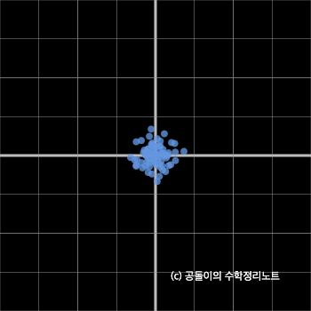
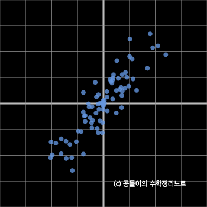

# PCA (Principal Component Analysis: 주요 구성 요소 분석)

차원의 수가 너무 많아 데이터 분석이 어렵다면 가장 큰 특성을 가지는 feature 만을 가지고 분석하겠다는 것. 차원 축소를 위한 방법론이다.  

예로 국어점수, 영어점수가 있는 2차원 데이터를 1차원 직선으로 분석하고 싶다면  
우리가 가장 nomal 하게 생각할 수 있는 것은 국어점수와 영어점수를 더해 평균을 내는것.  

만약 시험 난이도에 따라 가중치를 부여하할 수 도있을것이다.  

아래 사진의 경우 빨간선이 모두 같은 가중치를 부여했을때 평균을 내는 선  
파란선이 각 점수에 영어에 0.6, 수학에 0.4 가중치를 줄 경우 나타내는 선  

만약 점수를 그래프상의 백터로 나타낸다면 백터의 `projection` 으로도 볼 수 있다.  

> projection, 특정 방향으로의 단위백터와 내적

$(국어점수, 영어점수) \cdot (가중치1, 가중치2)$  

우리의 목표는 데이터를 백터에 정사영 했을때 가장 큰 분산값을 가질 수 있는 백터를 찾는 것이다.  

projection 하기위한 그래프로 평균그래프나 가중치 그래프는 좋지 못하다.  
현재 그래프는 중심축이 0,0 우측 상방 에 모든 데이터가 출력되는 형식인데
데이터들의 중간에 중심축을 가지는 벡터를 찾는것이 가장 좋은 방법일 것이다.
아니면 데이터를 중심축쪽으로 끌어 내리던가  

뭐가 되었든 데이터 구조를 바꾸기 위해선 공분산 행렬을 사용해야 한다.  

## Covariance Matrix(공분산 행렬)

공분산 행렬의 기하학적 의미는 아래 사진과 같다. 

해당 행렬과 데이터(백터) 를 곱해 선형변환을 해주면 

위처럼 공모양의 데이터가 공분산 행렬 값에 의해 펼쳐지게 된다.  

## 공분산 구하기

수식으로 표현하면 아래와 같다.  

$$
\sum = \frac{1}{n} X^TX
$$

X 라는 n개의 행, d개의 열로 구성되는 행렬
$n$ 는 데이터의 개수
$d$ 는 feature(속성) 개수이다.  

모든 feature 의 각 데이터는 mean(평균) 값을 빼주었기에 feature 별 각 열백터 평균은 0이다. 
즉 feature 의 편차들만 모아 다시 열백터로 구성한것

키와 몸무게를 예로 들면  아래처럼 

$$
X = D - mean(D) = 
\begin{bmatrix}
170 & 70 \\
150 & 45 \\
160 & 55 \\
180 & 60 \\
172 & 80
\end{bmatrix} -
\begin{bmatrix}
166 & 62 \\
166 & 62 \\
166 & 62 \\
166 & 62 \\
166 & 62
\end{bmatrix} = 
\begin{bmatrix}
4 & 8 \\
-16 & -17 \\
-6 & -7 \\
14 & -2 \\
6 & 18
\end{bmatrix}
$$

위 그림을 보면 속성의 편차들을 모은 백터를 서로 내적시킨다.  
feature 간 내적을 통해 

대각선에 있는 내적값은 같은 편차집합백터를 내적(제곱)한 것이기에 feature의 분산값이다.

$$
X^TX = 
\begin{bmatrix}
4 & -16 & -6 & 14 & 6 \\
8 & -17 & -7 & -2 & 18
\end{bmatrix}
\begin{bmatrix}
4 & 8 \\
-16 & -17 \\
-6 & -7 \\
14 & -2 \\
6 & 18
\end{bmatrix} = 
\begin{bmatrix}
540 &426 \\
426 & 730
\end{bmatrix}
$$
