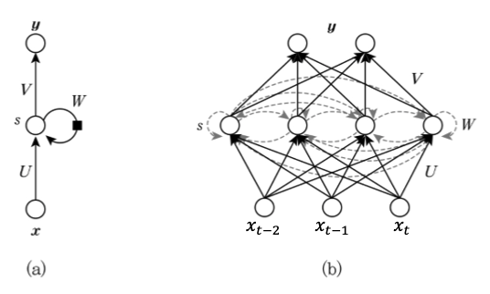
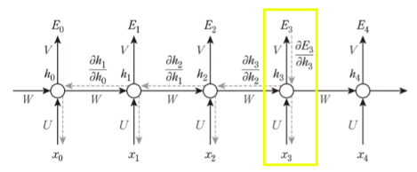

# RNN (Recurrent Neural Network: 순환 신경망)

**Sequence data** 
구성요소가 순차적으로 발생하거나 구성요소 간에 순서가 있는 데이터 
ex) 음성, 자연어 문장, 동영상, 주가 변동 등의 데이터,

`Sequence data` 의 분류, 예측에서는 현재 시점의 값과 이전 시점의 값들을 고려해야 하고
기계 번역, 음성 인식, 필기체 인식, 영상 주석달기, 동영상에서 행동 인식, 작곡 및 작사 등 과 같은 응용분야에서 사용될 수 있다.  

$x$: 입력값, $U, W, V$: 가중치, $y$: 출력값, $b$: 편향
여러 가중치와 편향 값은 모든 노드에서 동일한 변수이다. 
따라서 그림(b) 를 (a) 처럼 한번에 그릴 수 있다.  

RNN 또한 다른 NN 과 크게 다를 점은 없다.  

메모리 셀 이라 부르는 중간부분 (hidden layer) 가 추가된고 그 다음시점에도 영향을 끼치는 가중치가 생긴점이 다를 뿐이다.  

문장, 영상, 음성 등 입력값 $x_t$ 이 시간에 따라 변화하고 그 이전상태, 현재상태, 다음상태에 모든 영항을 끼칠 때 사용하는 것이 RNN 알고리즘이고  

그것에 대한 출력값 $y$ 를 좀더 수식적을 표현한 그림이다.  

그림(a) 는 중간의 hidden node 가 1개이지만  
그림(b) 는 입력노드 3, 은닉노드 4, 출력노드 1 인 구조이다.  

메모리셀, 출력값은 각각의 각각의 `activation function` $f$ 함수와 $g$ 함수 가 있고
계산식은 아래와 같다. 

$$
\begin{aligned}
h_t &= f(Ux_t + Wh_{t-1} + b_s) \\
y_t &= g(Vh_t + b_z)
\end{aligned}
$$

## RNN 입력 출력 대응형태

데이터 종류에 따라 입력과 출력, RNN 의 구조를 다르게 사용한다.  

(a). 각 시점에 들어온 데이터를 바로 출력값으로 나오는 것.

(b). 모든 시점의 입력이 끝난 후 출력값으로 나오는 것
- 기계 번역: ‘이것은 책이다’ → ‘This is a book’  

(c). 앞 시점의 입력이 끝난 후 하나의 출력값으로 나오는 것
- 감성 분석: ‘이 책은 내용이 알차게 구성되어 있다’ → ‘긍정적’  

(d). 하나의 입력에 대해 일련의 출력 이 나오는 것  
- 영상 주석달기: 영상→ 설명하는 문장  

## RNN 학습 구조

단어 추천 시스템을 RNN 을 통해 학습할 경우 아래와 같은 구조를 가진다.

h만 입력하면 다음에 들어올 알파벳을 출력한다.  
이때 사용되는 $U, W, V$ 가중치에 대해 역전파를 통해 수정이 이루어진다.  

### BPTT (Back Propagation Through Time)

RNN 역시 경사하강법을 에러함수의 값을 줄이기 위해 주로 사용한다.  

$$
W = W - rate \cdot \frac{\partial E}{\partial W}
$$

만약 위에서 $E_3$ 에 대한 에러함수를 구하기 위해 $\frac{\partial E_3}{\partial W}$ 을 구해야 한다면 식은 아래와 같다.  

$$
\begin{aligned}
\frac{\partial E_3}{\partial W} = 
&\frac{\partial E_3}{\partial h_3} * \frac{\partial h_3}{\partial U} \\
+&\frac{\partial E_3}{\partial h_3} * \frac{\partial h_3}{\partial h_2} * \frac{\partial h_2}{\partial U} \\
+&\frac{\partial E_3}{\partial h_3} * \frac{\partial h_3}{\partial h_2} * \frac{\partial h_2}{\partial h_1} * \frac{\partial h_1}{\partial U} \\
+&\frac{\partial E_3}{\partial h_3} * \frac{\partial h_3}{\partial h_2} * \frac{\partial h_2}{\partial h_1} * \frac{\partial h_1}{\partial h_0} * \frac{\partial h_1}{\partial U}
\end{aligned}
$$

만약 h 의 개수가 매우 커저 sequence 데이터가 늘어나게 된다면 
미분값이 1 이하로 줄어든 순간부터는 계속 0에 가까운 기울기를 연산하게 되어 Vanishing Gradiant문제가 발생하게 된다.  
반대로 미분값이 1 이상이 되면 값이 계속 커져 Exploding Gradiant 문제가 발생한다.  

역전파를 통해 경사하강이 불가능한건 매우 비효율적이고
Sequence 데이터가 커질수록 과거시점의 입력값이 현제 예측값에 대해서 영향력이 옅어지고 
이후에 출력될 예측값은 더욱 얻어내기가 힘들어지는 문제가 발생한다.  

`I grew up in France… I speak fluent ...` 라는 문장에서 `...` 에 해당하는 문자를 `French` 리거 예측해야 하는데  

과거의 `France` 라는 문자로부터 가져와야 하는데 시간범위단위로 평균을 구할 경우 
위 문제는 해결 못할 가능성이 크다.  

이런 문제를 해결하기 위한 알고리즘이 LSTM 이다.  

### LSTM (Long Short Term Memory)

사람의 뇌와 같이 중요한 정보는 장기기억보관소에
중요하지 않은 정보는 단기기억보관소에 저장하듯이

RNN 도 정보의 중요성을 기준으로 `Long Short Term Memory` 로 나눈다.  

이러한 알고리즘을 위해 `Forget Gate(좌측)`, `Input Gate(아래)`, `Output Gate(위)` 를 사용한다.  

우측 그림을 보면 각 가중치마다 Gate 가 있고 게이트가 열려있을 경우 출력에 큰 영향을
닫혀있을 경우 출력에 작은 영향을 끼치도록 설계하였다.  

LSTM 에 사용할 gate 를 유지하기 위해 아래와 같은 구조와 수식을 사용한다.   

컨베이어벨트처럼 생긴 $C_t$ 라인이 새로 생겼으며 Gate 의 개폐 여부를 결정짖는다.  

이전단계에서 항상 $C_{t-1}, h_{t-1}$ 값이 들어오고 출력값에 영향을 끼친다.  

$$
\begin{aligned}
f_t &= \sigma (U_f x_t + W_f h_{t-1} + b_f) \\ 
i_t &= \sigma (U_i x_t + W_i h_{t-1} + b_i) \\ 
g_t &= \tanh (U_g x_t + W_g h_{t-1} + b_g) \\ 
o_t &= \sigma (U_o x_t + W_o h_{t-1} + b_o) \\ 
c_t &= f_t \cdot c_{t-1} + i_t \cdot g_t \\ 
h_t &= o_t \cdot \tanh (c_t) \\
y_t &= z(V h_t)
\end{aligned}
$$

맨 처음 그림에서는 입력노드, 히든노드, 출력노드의 가중치 $U, W, V$ 단 3개만을 사용했지만
LSTM 에서는 gate마다 $U, W$ 가중치가 존재하여 입력노드에 대해서는 추가중치가 붙어 9 개의 가중치, 4개의 편향(bias) 값을 가지고 

> 여기서 $\sigma$ 는 sigmoid 함수를 뜻한다.  tanh 는 아래 함수

