# Reinforcement Learning(강화 학습) 

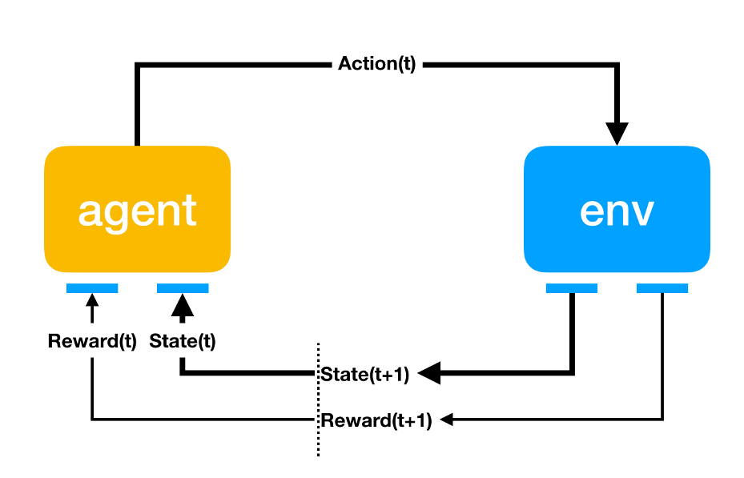

어떤 **env(환경)** 안에서 정의된 **agent** 가 현재의 **State(상태)** 를 인식, 
선택 가능한 **Action(행동)** 들 중 **Reward(보상)** 을 최대화하는 행동 혹은 행동 순서를 선택하는 방법  

> 게임 이론, 제어이론, 정보이론, 최적화, 통계학, 유전 알고리즘 등 다양한 분야 활용

> 어떤 경우에는 Reward 가 패널티가 될 수 도 있다  

## Markov Property (마르코프 속성)

*현재를 알면 미래는 과거와 무관하다는 특성*

아래 수식이 성립하는 경우 **Markov Property** (마르코프 속성) 이라 한다.

$$
P[S_{t+1} | S_t] = P[S_{t+1} | S_1,\cdots,S_t]
$$

> $S_t$ 은 현재 State,  
> $S_{t+1}$ 은 바로 앞으로 일어날 미래 State  

$S_1$ 부터 $S_t$ 까지 모든 상황이 일어난 상황에서 $S_{t+1}$ 이 일어날 확률과  

$S_t$ 가 일어난 상황에서 $State_{t+1}$ 이 일어날 확률이 같을경우 Markov Property 이라 함   

## Markov Process

`Markov Property` 를 가지는 상태가 이어지는 상황을 `Markov Process` 라 한다.  

ex) `Markov Process` 인 예 
$S_t$ 상황에서 `$10` 를 가지고 있을 때 매번 `$1` 을 걸고 동전던지기 게임 진행할 경우  
$S_{t+1}$ 상황은 `$11` 이 되거나 `$9` 가 될것으로 예측할 수 있다.  
여기서 $S_{t+1}$ 를 예측하기 위해 왜 $S_t$ 상황이 `$10` 가 되었는지 이유는 전혀 알 필요가 없다.  


ex) `Markov Process` 가 아닌 예
보자기에서 동전뽑기 같은 경우는 `Markov Process` 가 아니다.  
100원 5개, 50원 5개, 10원 5개중 랜덤하게 6개를 뽑아 최종 가격을 예측할 때에는 과거에 어떤 동전을 뽑았는지 예측해야 정확한 결과를 얻을 수 있다.  

`Markov Process`는 `상태(State, S)`와 상태 `이행 확률(Probability, P)`로 구성되며  

$P$는 상태 $s$에서 $s'$으로 전이될 확률을 뜻한다.  

### Markov Property with Matrix

행렬로 간단하게 각 단계별 Markov Property 를 표현할 수 있다.  

$$
P = from\begin{bmatrix}
    p_{11} & \cdots & p_{1m} \\
    p_{21} & \cdots & p_{2m} \\
    & \cdots &  \\
    p_{n1} & \cdots & p_{nm}
\end{bmatrix}
$$

초기상태 $p_{11} \cdots p_{n1}$ 에서 
최종 상태의 예측값 $p_{1m}\cdots p_{nm}$ 까지의 
단계별 `Markov Property` 를 행렬로 표기할 수 있다.  

ex) 

실제 예를 그래프와 행렬로 표현하였다.  

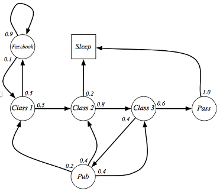
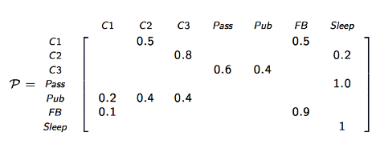

$p(C1|C1)$ 부터 $p(Sleep|Sleep)$ 까지 행렬이 있으며 
state 가 이어진 여러개의 episode 가 생성될 수 있다.  

- C1 C2 C3 Pass Sleep  
- C1 FB FB C1 C2 Sleep  
- C1 C2 C3 Pub C2 C3 Pass Sleep  
- C1 FB FB C1 C2 C3 Pub C1 FB FB  
- FB C1 C2 C3 Pub C2 Sleep  


## Markov Reward Process 

기존 Markov Process 는 $S$ 와 $P$ 만 있었다면  
Markov Reward Process 는 튜플로 구성되며 아래 4가지 요소가 존재한다.  
**tuple: $<S, P, R, \gamma>$**

또한 각 요소별로 알아야할 수식들이 몇가지 존재한다.  

- **probability matrix**: $P_{ss'} = P[S_{t+1}=s'|S_t]$  
  현재상태 $s$ 가 $s'$ 로 전이될 확률 (위의 matrix에서 구할수 있다)
- **Reward Function**: $R_s = E[R_{t+1} | S_t = s]$
  현재상태에서 얻을 수 있는 모든 Reward 의 평균(expactation)
- **discount factor(감쇠비)**: $\gamma \in [0,1]$ 

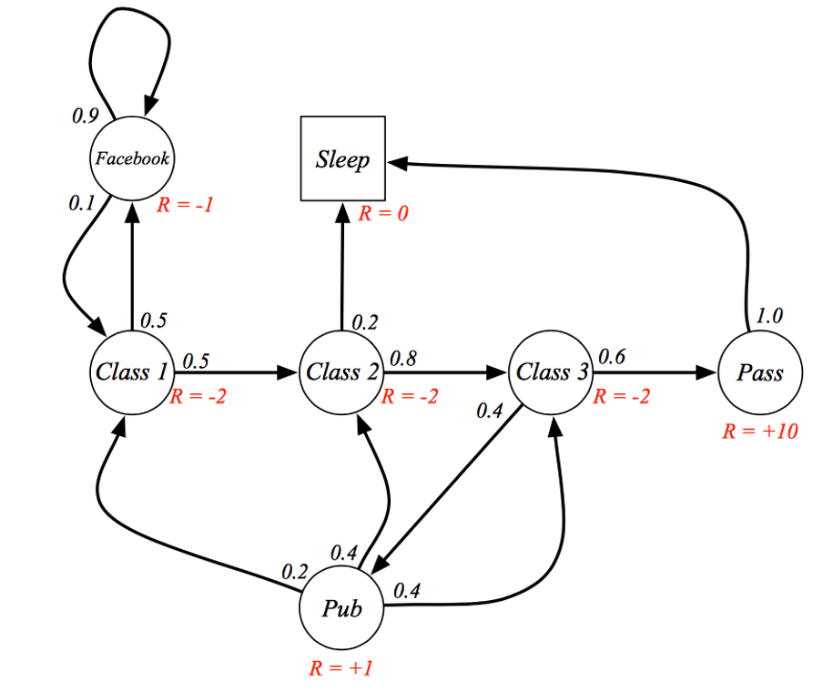

각 State 로 가는 단계에 Reward 를 추가

현 시점 $S_t$ 에서 받을수 있는 Reward 의 총합 Discounted Return($G_t$)은 아래와 같다.  

$$G_t = \sum_{k=0}^{\infty} \gamma^k R_{t+k+1} = R_{t+1} + \gamma^1 R_{t+2} + \gamma^2 R_{t+3} + \cdots $$

process 가 언제 끝날 지 모르기 때문에 k 는 무한히 증가한다.  
(위 경우도 cycle 이 구성되어 있기 때문에 무한대꼴이 나올 수 있음)

감쇠비 $\gamma$ 의 존재 이유는 현시점의 Reward 와 미래시점의 Reward 수치가 같더라도 가치는 다르기 때문  

만약 위 그래프에서 모든 Reward 의 양수값이라면 $G_t$ 는 무한대가 되기에 이를 방지하기 위해서라도 감쇠비은 필요함  

### MRP Value Function (Bellman equation)

위 그래프에서 $G_t$ 는 어떤 프로세스로 흐르냐에 따라 달라지게 된다.  

현 상태에서의 `Discounted Return` 의 평균(expactation)을 
`Value Function (Bellman equation)`으로 부르며 
아래와 같은 수식으로 표현한다.      

$$ v(s)=E[G_t|S_t=s] $$

> `state` $s$ 에서 시작했을 때 얻을 수 있는 `return` 의 평균, 아래와 같이 재귀적으로 구성 가능하다.  

식을 조금 더 풀어쓰면 아래와 같다.  

여기서 $s$ 는 현상태, $s'$ 는 연결된 다음상태를 가리킨다.  
$$
\begin{aligned}
v(s)&=E[G_t|S_t=s] \\
&=E[R_{t+1} + \gamma R_{t+2} + \gamma^2R_{t+3} + \cdots|S_t=s] \\
&=E[R_{t+1} + \gamma (R_{t+2} + \gamma R_{t+3} + \cdots)|S_t=s] \\
&=E[R_{t+1}+\gamma G_{t+1}|S_t=s] \\
&=R_s + \gamma \sum_{s' \in S} P_{ss'}v(s') \\
\end{aligned}
$$

> 다음 상황으로 이동할 확률 $P_{ss'}$ 과 해당 확률에서의 평균(기대값)을 재귀적으로 더한다.  

재귀형식으로 구성되기 때문에 아래 그림처럼 트리로도 표현할 수 있다.  

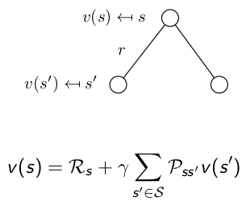

아래와 같이 행렬로도 표현할 수 있다.  
$$
\begin{bmatrix}
    v(s_1) \\ \cdots \\ v(s_n)
\end{bmatrix} =
\begin{bmatrix}
    R(s_1) \\ \cdots \\ R(s_n)
\end{bmatrix} + 
\begin{bmatrix}
    p(s_1|s_1) & \cdots & p(s_n|s_1) \\
    \cdots & \cdots & \cdots \\
    p(s_1|s_1) & \cdots & p(s_n|s_n) \\
\end{bmatrix}
\begin{bmatrix}
    v(s_1) \\ \cdots \\ v(s_n)
\end{bmatrix}
$$

value function 은 MRP 외에도 다른 value 기반 방법론에서도 계속 사용되니 숙지 필수  

## Markov Decision Process (MDP)

`Markov Reward Process` 애 `Action` 이 추가된 process

**tuple: $<S, A, P, R, \gamma>$**

기존에는 $s$ 에서 $s'$ 로 가는확률이 단순하게 지정되어 있었지만
`Markov Decision Process` 에서는 어떠한 `Action` 을 취해야 해당 $s'$ 으로 갈수 있는지도 정해져 있다.  

`Markov Decision Process` 역시 알아야할 수식이 몇가지 있다.  

- **probability matrix**: $P^a_{ss'} = P[S_{t+1}=s'|S_t, A_t]$  
  현재상태 $s$ 가 $s'$ 로 전이될 확률 행렬
- **Reward Function**: $R_s = E[R_{t+1} | S_t = s, A_t=a]$
  현재상태에서 얻을 수 있는 모든 Reward 의 평균(expactation)
- **Policy**: $\pi(a|s) = P[A_t=a|S_t=s]$
  현재상태 $s$ 에서 액션 $a$ 를 취할 확률

### MDP Value Function  

아래 2가지 value function 이 존재한다.  

#### State Value Function  

$s$ 상태에서 특정 Policy $\pi$ 를 따라 고정된 $a$ 를 선택했을 때 Discounted Return 의 평균  
$$
\begin{aligned}
v_\pi(s) &= E_\pi[G_t|S_t=s] \\
    &= E_\pi[R_{t+1} + \gamma v_\pi(S_{t+1})|S_t=s]
\end{aligned}
$$

#### Action Value Function (Q function)  

$s$ 상태에서 모든 액션집합을 선택했을 때 발생가능한 Discounted Return 의 평균  

$$
\begin{aligned}
q_\pi(s,a) &= E_\pi[G_t|S_t=s, A_t=a] \\
    &= E_\pi[R_{t+1} + \gamma q_\pi(S_{t+1}, A_{t+1})|S_t=s, A_t=a]
\end{aligned}
$$

#### Optimal State Value Function & Optimal Action Value Function  

`Action Value Function` 의 경우 `Action` 선택에 따라 `Value Function` 의 값도 변화할 것이다.  

그때 선택된 최대값의 `Value Function` 을 **Optimal State Value Function, Optimal Action Value Function** 이라 한다.  

$$
v_*(s) = \max_\pi v_\pi(s) \\
q_*(s) = \max_\pi q_\pi(s)
$$

각 상태에서 `Optimal Value Function` 을 알 수 있다면 MDP 문제를 해결한 것 과 같다.  
물론 이 최적화 함수를 찾기 위해 학습을 진행해야 한다.  

## Dummy Q Learning  

Frozon Lake 라는 MDP 문제를 해결하는 유명한 예제  

> S: Start  
F: 얼어붙은 호수 (이동 가능)  
H: Hole (이동 불가능)  
G: Gole  

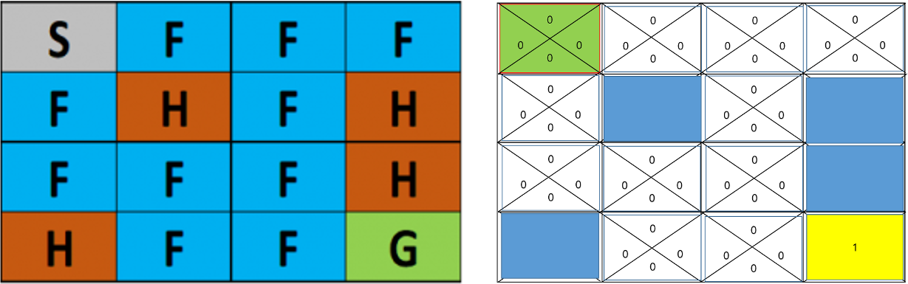

만약 누군가가 각 Action 마다 가장 큰 Reward 를 얻을 수 있는지 알려준다면  

각 상황 $s$ 에서의 **Optimal Action Value Function** 를 알려준다면  
$\pi_s(s)=argmax_a q(s,a)$

아래 그림과 같이 수월하게 길을 찾아갈 수 있다.  


> **Environment** 를 정확히 알 수 있다면 각 상황에서 **Optimal Action Value Function** 를 구할 수 있다.  
> 여기서 Environment 는 (`deterministic`, `finite states`) 라고 표현하며 어떤 Action 을 했을때 어떤 Reward 가 오는지를 명확히 알 수 있는 것을 뜻한다.   

1. select and execute action $a$ - 특정 액션 선택
2. receive immediate reward $r$ - 액션에 대한 보상 흭득
3. observe the new state $s'$ - 새로운 상태로 이동
4. Update the table entry for $\hat{q}_*(s,a)$ as follows - 현재 상태의 추정 최적함수 수정, 수식은 아래와 같다.  
    $\hat{q}_*(s,a) \larr r+\max_{a'}\hat{q}⁡_*(s',a')$ 

`Bellman equation` 을 참고하여 수식을 수정한다.  

내용을보면 알겠지만 무식한 방법으로 계속 반복하면서 본인 앞의 연결된 상태중 가장 높은 `Optimal Action Value` 를 가진 쪽으로 이동하는 방식이다.  

현재 구한 최적함수 $q_*(s,a)$ 보다 더 나은 **추정(hat)** 최적함수 $\hat{q}_*(s,a)$ 를 찾는 과정은 아래의 반복이다.  

### Exploit, Exploration (공적, 탐사) 알고리즘  

문제는 위처럼 모든 `Optimal Action Value` 이 아직 정해지지 않아 0인 경우 랜덤하게 이동하면서 얻어 걸린 `Action Value` 가 `Optimal Action Value` 가 되버린다.  

새로운 길을 `Exploration` 했을때 좀더 많은 `Reward` 가 얻어질 수 도 있지만 
한번 정해진 `Optimal Action Value` 를 벗어나는 것은 불가능하게 된다.  

#### E-greedy(Epsilon-Greedy)

이런 문제를 방지하기 위해 E-greedy 방법을 사요한다.  


$\epsilon$ 값을 정하고 랜덤값이 해당 값보다 작으면 랜덤
아니라면 기존의 `Optimal Action Value` 를 따름으로서  
새로운 길을 찾을 수 있는 `Exploration` 기회를 주는 방식이다.  

```py
# ϵ=0.1
if rand < ϵ
    a = random
else
    a = argmax(q(s,a))
```

#### Decaying E-greedy (감쇠 E-greedy)

반복횟수가 많아질 수록 기존 E-greedy 보다 `Exploration` 기회가 많아지는 방식  

```py
# ϵ=0.1
for i in ragne(1000)
    ϵ=0.1/(i+1) # 반복될 수록 감쇠
    if rand < ϵ
        a = random
    else
        a = argmax(q(s,a))
```

`try` 수가 많아질 수록 `Exploit < Exploration` 로 변하게 된다.  

### Discount Factor (감쇠율)

위와 같은 길찾기 알고리즘에선 많은 길을 탐색할 수록 손해이다.  
따라서 감쇠율을 지정해주는데 

$\hat{q}_*(s,a) \larr r+\gamma\max_{a'}\hat{q}⁡_*(s',a')$ 

$\gamma=0.9$ 라고 한다면 아래 그림처럼 `Optimal Action Value` 가 설정된다.  

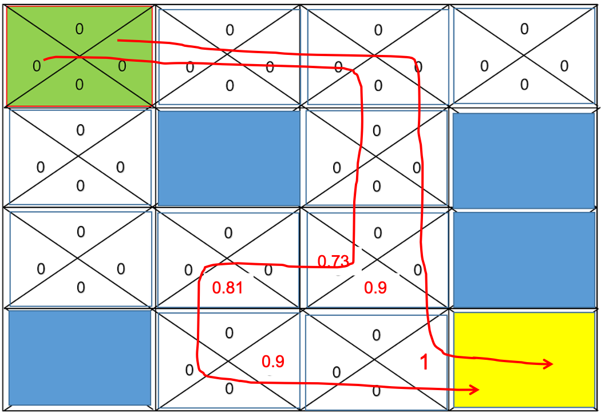

### Stochastic Environment (확률적 환경)

> Stochastic: 확률적인  

위 예제는 State 에 대한 Reward 가 명확했지만  
그렇지 않은경우도 있다.  
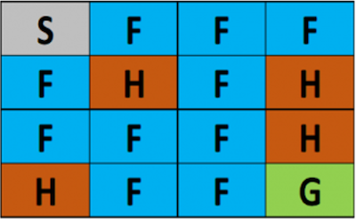

예를들어 F 를 밝게되면 미끌어지는 확률이 추가되어, 미끄러져서 3칸을 강제이동 된다면  

같은 행위를 해도 확률에 다라 Reward 가 달라질 수 있다면 `Optimal Action Value` 를 어떻게 구할 것인가  

`Law of Large Numbers`(큰 수의 법칙: 여러번 반복 수행해서 같은 값을 반환하는 쪽으로 기우는 방식) 방법을 사용하면 된다.  

#### Monte Carlo Simulation (MC Simulation)

> s: Episode 
a: Action
G: Return Reward
Q: Action Value

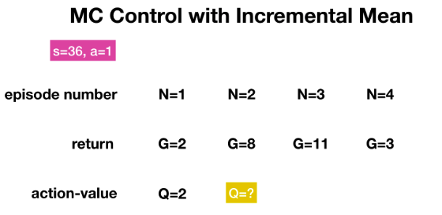

위 그림과 같이 에피소드별 Return Value 를 테이블로 정의했을 때  
강 상황마다 Action Value 가 업데이트 된다.  

`Action Value Function` 으로 `Reward` 에 해당하는 `G(goal)` 값의 평균값을 사용하는 방식으로 수식을 나타내면 아래와 같다.  

$$
\mu_n = \frac{1}{n}[\sum^n_{i=1} x_i]
$$

$\mu$ 기호를 사용해 평균(`mean` or `expactation`) 을 나타낸다.
수식을 조금더 확장하면 조금 더 수월한 공식(Incremental Mean
: 증분평균)으로 표현할 수 있다.  
$$
\begin{aligned}
\mu_n &= \frac{1}{n}(\sum^n_{i=1} x_i)  \\
&= \frac{1}{n}(x_n + \sum^{n-1}_{i=1} x_i) \\
&= \frac{1}{n}(x_n + (n-1)\mu_{n-1}) \\
&= \mu_{n-1} +\frac{1}{n}(x_n + \mu_{n-1}) \\
\end{aligned}
$$

Monte Carlo Simulation 의 문제점이 몇가지 있다.  

에피소드가 늘어날수록 $\frac{1}{n}$ 에서 n 값이 0에 가까워지기 때문에 학습 속도가 줄어든다는 문제점이 발생한다.  

> 그래서 총합 x 학습률로 Action Value 을 구성하기도 한다.  
$$
Q_n \larr Q_{n-1} + \alpha(G_n - Q_{n-1})
$$

그리고 에피소드가 늘어나면 많은 연산이 필요하게 된다.  
위의 경우 에피소드의 수가 36 에 선택 가능한 액션이 1개이지만  
에피소드의 수, 액션의 수가 늘어나면 계산량도 급격히 많아진다.   

또한 마리오게임과 같이 연속된 액션이 계속 이어지는 Continuous task 에도 Monte Carlo Simulation 방식을 사용하지 못한다.

Action Value 가 Incremental Mean 로 구해질 뿐 
Q Function 은 기존 MDP 의 Q Function 과 같다.  


$$
\begin{aligned}
q_\pi(s,a) &= E_\pi[G_t|S_t=s, A_t=a] \\
    &= E_\pi[R_{t+1} + \gamma q_\pi(S_{t+1}, A_{t+1})|S_t=s, A_t=a]
\end{aligned}
$$


#### Temporal Difference Methods(TD Method)


Continuous task 에서 Monte Carlo Simulation 를 사용하지 못함으로 만들어진 방법  
**time step** 마다 Action Value Function 을 업데이트한다.  

Action Value Function 은 MC 방식과 비슷하다.  
$$
Q_n=Q_{n-1} + \alpha(G_n - Q_{n-1})
$$


$$
\begin{aligned}
q(S_t,A_t) &\larr q(S_t,A_t) + \alpha(R_{t+1} + \gamma q(S_{t+1}, A_{t+1})-q(S_t,A_t)) \\  
&= (1-\alpha)q(S_t,A_t) + \alpha(R_{t+1}+\gamma q(S_{t+1},A_{t+1}))
\end{aligned}
$$

# Deep Q Learning  

지금까지 Q Function 을 구하기 위해 어떤 방식이 되었건 상태별 Action 선택시 최적의 Action Value 를 저장해둔 행렬을 사용하였다.  

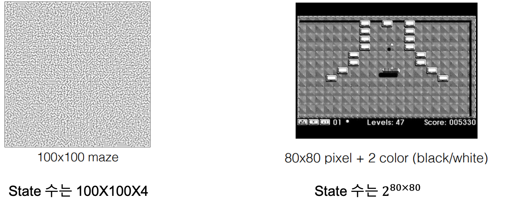

문제는 위와 같이 너무 많은 state 를 가질때 터무니 없는 용량의 Matrix 를 가져야 한다는 것.  
(maze 는 각 픽셀위치에 따른 상하좌우 action, video game 의 경우 80x80 픽셀에서 표현 가능한 모든 이미지 수)
 
이와 같은 상황에서 Action Value 를 **예측** 하기위해 Nueral Network 를 사용한다.  


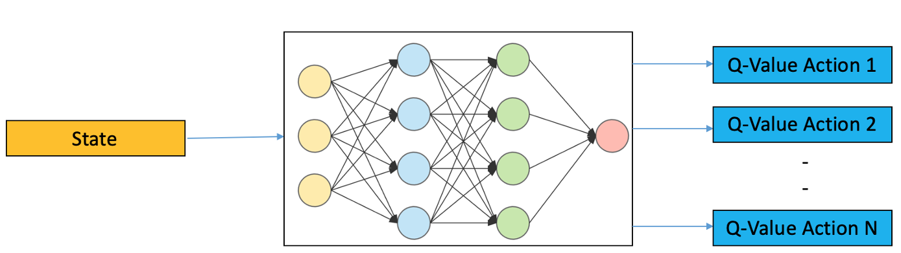

input 으로 state, output 의로 q-value 가 나온다.  


$\gamma$ : discount factor, between(0, 1)
$r$ : reward
$a$ : current action
$s$ : current state
$a'$ : action after time t
$a'$ : state after time t

