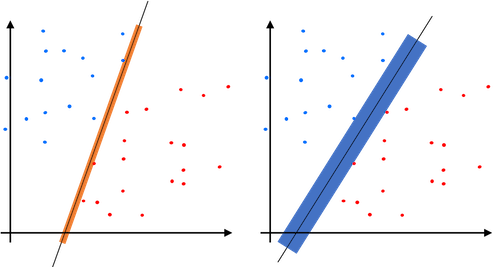
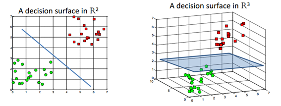
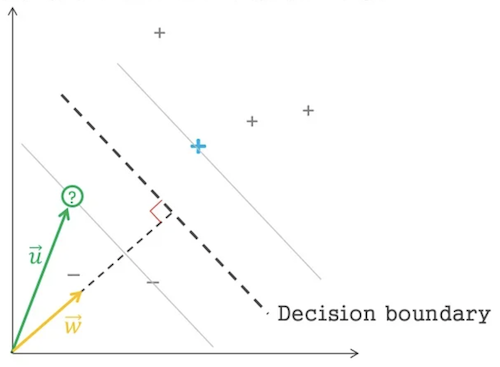
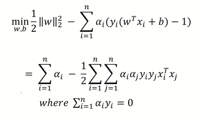
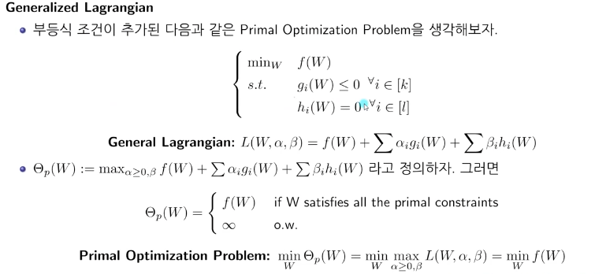
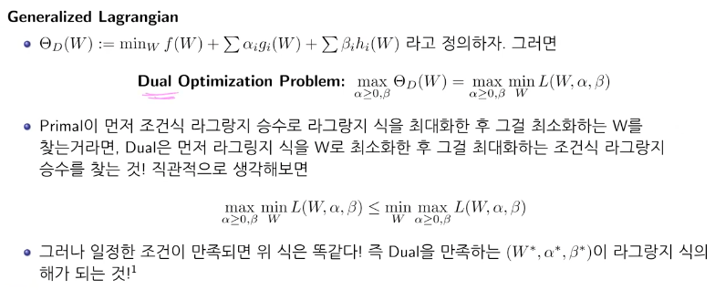
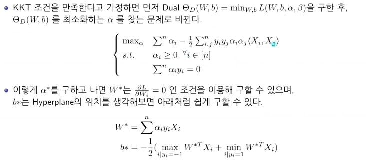
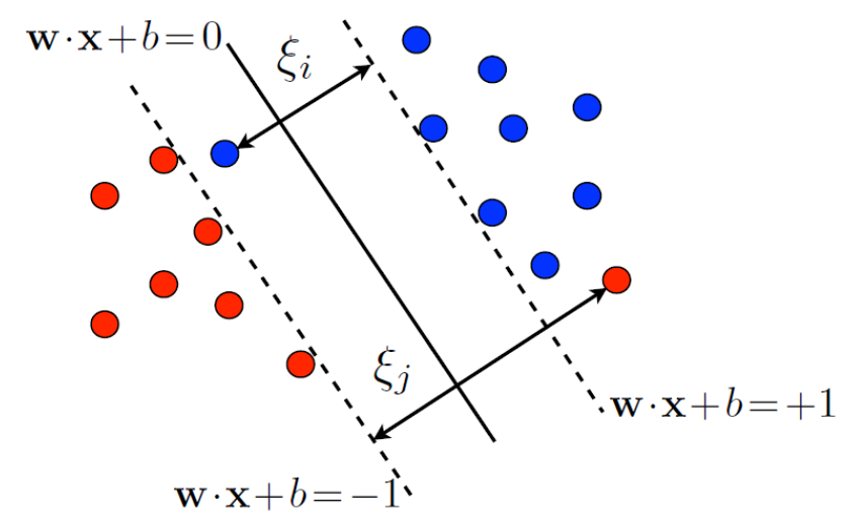

## Support Vector Machine(SVM) 개요

> <https://angeloyeo.github.io/2020/09/30/SVM.html>
> <https://www.youtube.com/watch?v=qFg8cDnqYCI>

뉴럴넷이 활성화 되기 전 가장 유명하고 자주 사용되었던 기계학습 이론

뉴럴넷에 비해 SVM 은 수학적으로 설명 가능한 모델이다.  
최적의 솔루션 결과를 도출하기 위한 수학적 설명, 입증이 가능하다.  

**classify** 에서 2가지 방법으로 나누었을때 어떤 방식이 더 잘 나눈 방식인지 물어본다면 우측이라 할 수 있다.  

분리선의 boundary 를 늘릴 수 있을 때 더 넒은 범위를 가지는 모델이 더 좋다 말할 수 있다.  

SVM 기본컨셉이 바로 더 **넓은 범위의 폭(max-margin)** 을 가지는 분리선을 구하는 것이다.  

## Hyperplan 

데이터를 두개의 집단으로 나누는 모형  
데이터의 차원(n)보다 낮은(n-1) 차원의 평면을 이용해 classify  

max-margin 을 가지는 최적의 Hyperplane 을 찾는다는 것이 목표이다.  

이미 **Hyperplane 과 수직인 벡터 $\mathrm{\vec{w}}$ 을 알고 있을 때**  
데이터를 `[+, -]` 로 classify 하는 조건식을 **내적의 길이를 특정상수와 비교하는 식**으로 표현할 수 있다.  

$\mathrm{\vec{w} \cdot \vec{u} > c}$

식을 약간 변경해서 아래처럼 변경한다.  

$\mathrm{\vec{w} \cdot \vec{u} +b \ge 0 }$

> 참일경우 `-`, 거짓일 경우 `+`

이것이 HyperPlane 의 기본 식이라 할 수 있다.   

Hyperplane 앞뒤 plane 을 Plusplane, Minusplane 으로 표현하여 아래 그림처럼 표기할 수 있는데  

  

궁극적인 목표는 `max-margin` 을 가지는 **법선벡터 $\mathrm{\vec{w}}$, 그에따른 상수 $b$ 를 찾는것**이다.  

> `1 , -1` 는 bias 를 조절해 다른값으로 만들 수 있기 때문에 편의상 `1, -1` 로 설정하였음  
> 내적은 두 백터의 행렬 곱셉으로 식을 표현  

각 데이터들의 관계식을 Plusplane, Minusplane 으로도 표기할 수 있다.  

$$
\vec{w} \cdot \vec{x}^+ + b \ge 1 \\
\vec{w} \cdot \vec{x}^- + b \le 1
$$

> $x^+$ 는 Plusplane 위에 존재하는 Support vectors  
> $x^-$ 는 Minusplane 위에 존재하는 Support vectors  

함수 $y_i$ 는 $\vec{x_i}$ 에 따라 `+1` 혹은 `-1` 을 출력한다 했을 때  
함수 $y_i$ 를 사용해서 각 데이터들의 관계식을 하나만으로 표현할 수 있다.  

$$
y_i=\begin{cases}
+1 &&\text{for } \vec{x}^+ \\
-1 && \text{for } \vec{x}^-
\end{cases}
$$

음수를 곱하여 비교 표현식을 통일할 수 있다.  

$$
y_i (\vec{w} \cdot \vec{x_i} + b) \ge 1
$$

두식을 합친 식이 0이 될 때 Hyperplane 식이라 할 수 있다.  

$$ 
y_i (\vec{w} \cdot \vec{x_i} + b) -1 = 0 
$$

### MaxMargin

`minus plane` 에서 $\vec{w}$ 방향으로 실수$\lambda$ 배 만큼 이동한게 `plus plane` 이라 할 수 있다.  

$$
\vec{x}^+ =  \vec{x}^- + \lambda \vec{w} 
$$

$\lambda$ 식을 $\vec{w}$ 관계식으로 표현할 수 있다.  

$$
\begin{aligned}
w^T x^+ + b &= 1 \\
w^T (x^- + \lambda w) + b &= 1 \\
(w^T x^- + b)+\lambda { w }^{ T }w &= 1 \\
-1 + \lambda w^T w &= 1 \\
\lambda =\frac{2}{w^T w} \\
\end{aligned}
$$

Margin 을 구하는 공식역시 $\vec{w}$ 관계식으로 표현할 수 있다.  

$$
\begin{aligned}
\mathrm{Margin}&=\mathrm{distance}(x^+, x^-) \\
&= \|x^+ - x^-\|_2 \\
&= \|(x^- + \lambda w) - x^-\|_2 \\
&= \| \lambda w \|_2 \\
&= \lambda \sqrt{w^T w} \\
&= \frac{2}{w^T w} \sqrt{w^T w} \\
&= \frac{2}{\sqrt{w^T w}} \\
&= \frac{2}{\|w\|_2}
\end{aligned}
$$

우리가 구해야 할 것은 가장 큰 $\mathrm{Margin_{max}}$ 이기에  
반대로 역수를 만들어 가장 작게 하는것 과 동일하다.  

$$
\max\frac{2}{\|w\|_2} \to \min\frac{1}{2}{\|w\|_2}
$$

나중에 라그랑주 승수법에서 미분진행시 수학적 편의를 위해 제곱을 취해준다.  

$$
\min \frac{1}{2}{\|w\|_2^2}
$$

## 라그랑주 승수법

위에서 구한 HyperPlane 과 Margin 을 조건식과 목적식으로 사용

$$
\begin{cases}
    \min & \frac{1}{2}{\|w\|_2^2} \\
    \mathrm{s.t} & y_i (\vec{w} \cdot \vec{x_i}^+ + b) -1 = 0
\end{cases}
$$

라그랑주 승수법을 사용해 최적화 문제를 해결할 수 있게 되었다.  

$$
L_p(\vec{w},b,a_i) = \frac{1}{2}{\|w\|_2^2} - \sum_{i=1}^n a_i(y_i(\vec{w} \cdot \vec{x}_i +b)-1)
$$

> 라그랑주 승수 $\lambda$ 를 $a$ 로 표현

라그랑주공식에 따라 두 변수에 대한 편미분을 진행  

$$
\frac{\partial L}{\partial w} = 0 \\
\|w\|_2 - \sum_{i=1}^n a_i(y_i(\vec{x}_i)) = 0 \\
\|w\|_2  = \sum_{i=1}^n a_i(y_i(\vec{x}_i)) \\
\|w\|_2  = \sum_{i=1}^n a_i y_i \vec{x}_i
$$
$$
\frac{\partial L}{\partial b} = 0 \\
-\sum_{i=1}^n a_i(y_i) = 0 \\
\sum_{i=1}^n a_i y_i = 0
$$

그리고 라그랑주 공식에 대입하여 정리해나가면  

$$ 
\begin{aligned}    
&\frac{1}{2}{\|w\|_2^2} - \sum_i a_i(y_i(\vec{w} \cdot \vec{x}_i +b)-1) \\
&\to \frac{1}{2}w^Tw - \sum_i a_i y_i (w^T x_i +b) + \sum_i a_i \\
&\to \frac{1}{2}w^T \sum_i a_i y_i x_i - \sum_i a_i y_i w^T x_i - b\sum_i a_i y_i + \sum_i a_i \\
&\to \frac{1}{2} \sum_i a_i y_i w^T x_i - \sum_i a_i y_i w^T x_i - b\sum_i a_i y_i + \sum_i a_i \\ 
&\to -\frac{1}{2} \sum_i a_i y_i w^T x_i + \sum_i a_i \\
\end{aligned}
$$

> $\sum_{i=1}^n a_i y_i = 0$ 임으로 상수 b 는 생략된다.  

$$
\to -\frac{1}{2} \sum_i a_i y_i w^T x_i + \sum_i a_i \\
\to -\frac{1}{2} \sum_i a_i y_i (\sum_j a_j y_j x_j^T) x_i + \sum_i a_i \\
\to -\frac{1}{2} \sum_i \sum_j a_i y_i a_j y_j x_j^T x_i + \sum_i a_i \\
\to \sum_i a_i -\frac{1}{2} \sum_i \sum_j a_i y_i a_j y_j x_j^T x_i
$$

### 라그랑주 Primal

> <https://www.youtube.com/watch?v=O6Ha_XyA9ys>

라그랑주 Primal 은 라그랑주식을 maxmize 하고 minimize 한 것.

최종적으로 라그랑지안 승수식을 maxmize 하고 minimize 한 식이 
$f(W)$ 를 minimize 한 값과 일치하게 된다.  
실제 우리가 구해야할 $\min\frac{1}{2}{(\|w\|_2)^2}$ 를 구하는 것과 같음으로 라그랑주 Duality 를 사용해 식을 변형한다.  

라그랑주 Dual 은 라그랑주 식을 minimize 하고 maxmize 한 것.  

TTK 조건이 성립하면 라그랑주 Primal 과 라그랑주 Dual 의 결과가 일치한다.  

## 정리

또 $a_i$ 에 대한 조건이 하나 더 붙는데 $y_i(\vec{w} \cdot \vec{x}_i +b) -1$ 은 항상 0보다 크다 
따라서 $L$ 을 minimize 하려면 $a_i$ 역시 항상 0보다 커야한다.  

라그랑주 승수법에 조건에 따라 제약조건과 $\min$ 함수의 기울기 백터 뺄샘이 영백터가 되어야 함으로  
$L$함수에서 $w$ 와 $b$ 에 대한 편미분의 결과가 모두 0 이 되어야 한다.  

$$
\frac{\partial L}{\partial w} = 0 \\
\rArr \vec{w} - \sum_{i=1}^na_iy_ix_i = 0 \\
\rArr \vec{w} = \sum_{i=1}^na_iy_ix_i
$$
$$
\frac{\partial L}{\partial b} = 0 \\ 
\rArr \sum_{i=1}^na_iy_i=0
$$

이제 제약조건상에서 $\vec{w}$ 에 대한 값과 $\sum_{i=1}^na_iy_i=0$ 이라는 사실을 알아냈다.  

우리의 최종목표 $\min f(w) = \min\frac{1}{2}{(\|w\|_2)^2}$ 하는 값이 a 라그랑주 duality 와 ttk 조건하에 $a$ 이차식에서 $a$ 를 maxmize 하는 식으로 변경되었기 때문에 a 의 최대값을 구하는 문제로 변경된다. 

a 의 최대값을 구했다면 이제 a 를 사용해

# SVM Soft Margin

## Non Linear SVM

