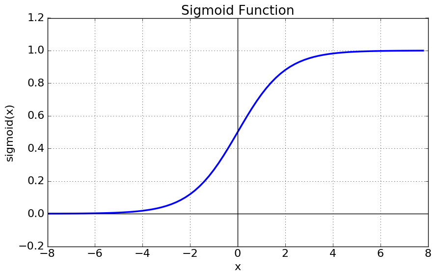

## 기계학습 개요 - Data Analysis 

데이터에서 아래 패턴을 찾아네는 것이 데이터 분석(Data Analysis)이다.  

- Valid(확실)  
- Novel(새로운)  
- Useful(유용한)  
- Understandable(이애할수있는)  

이미 알고있는 것 보단 기존에 알지못했던 새로운 위와 같은 패턴을 찾아내느 것이 데이터 분석의 목적이다.  

많은 기계학습 방식이 있지만 이를 관통하는 기본 컨셉은 모두 동일하다.

### 분석 방법들


**Descriptive Analytics (기술 분석)**
사실 묘사, 데이터를 보고 어떤일이 발생했는지 분석, 과거에 일어난 현상을 분석

**Diagnostic Analytics (진단 분석)**
진단, 데이터를 기반으로 왜 이런일이 일어났는지 판단, 분석 

**Predictive Analytics (예측 분석)**
예측, 수행되지 않은 일의 결과를 예측, 예로 공장내부의 여러 변수(온도, 습도, 전려 등) 으로 인해 불량률이 Dataset 으로 있다면 이를 사용해 앞으로 나올 불량률도 예측할 수 있다.
은행에서도 개인 소비내역을 통해 돈을 빌려주면 갚을수있는지 예측해 신용평가를 결정한다.

**Prescriptive Analytics (처방)**
예측한 일을 일어날 수 있도록 조작 할 수 있다면


### 데이터 분석을 통해 해결하는 다양한 문제들

대부분 **Descriptive Analytics , Predictive Analytics** 2가지 해결 방안으로 나뉜다.

이 문제들을 해결하기 위해 아래와 같은 다양한 분석 기법을 사용한다.  

- linear regression  
- support vector machine  
- decision tree  
- random forest  
- neural network  

### Descriptive Analytics(기술분석)

기술 분석에서는 아래 종류의 스킬들이 포함된다.  

**Clustering**
군집화, 그룹으로 나눔
대부분의 데이터가 여러 칼럼(차원)으로 이루어지기 때문에 단순 그룹화 하기란 쉽지 않다.

**Association**
연관성 찾기, 맥주 와 땅콩, 원숭이와 바나나
동시 같이 발생하는 데이터를 찾는게 일반적, 장바구니에 동시에 같이 존재하는 데이터 셋이 있다면 그로인해 상품의 연관관계를 찾아낼 수 있을 것.

**Dimension Reduction**
차원 감소, 너무 많은 칼럼(차원) 을 사용하고 있다면 낮은 데이터 연산을 위해 차원을 낮춤
어떻게 하면 데이터는 많이 줄이면서 표현은 풍부하게 할 수 있을지 결정해야 한다.


**Hidden Structure Analysis**
구조 탐색, 수많은 데이터들의 일정한 구조를 찾아내는 것


### Predictive Analytics(예측 분석)


`Predictive Analytics` 은 아래 과정으로 이루어 진다.  

데이터 -> 각종 분석기법 -> 데이터 예측 모델

input 과 result 에 대한 리스트를 가지고 있을때 
input 에 대응하는 result 를 출력하는 함수를 `Universal Approximator`(보편적 추정기) 라한다.  

`Universal Approximator` 을 통해 일어날 데이터를 예측하는 것에 기반한다.  

약간의 오차는 있더라도 어느정도 허용범위 안에 있는 함수, 이 함수를 찾아내는 것이 `Predictive Analytics` 에서 사용하는 분석 기법의 목표이다.  

`Universal Approximator` 를 잘 구하면 다음에 새로운 input 이 오면 그로 인해 발생할 result 를 예측할 수 있다.  


$$
f(x_1, x_2, ..., x_n ; w_1, w_2, ..., w_n)
$$

`Universal Approximator` 는 식으로 위와 같이 표현한다. x 는 input 값, $w_n$ 는 함수 그래프의 모양을 결정하는데 사용되는 여러 파라미터값들이다.  

error 는 적고 simplicity(단순함), efficiency(효율) 을 높은 최적의 $w_n$ 을 구하는 것이 좀더 자세한 목적이다.  

`Predictive Analytics` 에서의 문제들은 `Neural Network` 이 효과적으로 사용된다.

**Classification**
분류, 팀을 나누기 위한


**Regression**
값을 추정, 값을 산출하기 위한


**Anomaly Detection**
예외 패턴 찾기, 위조지폐, 스팸메일, 비정상적인 바이트 배열 등을 찾기 위한
하지만 Anomaly 데이터가 지속적으로 쌓이다 보면 더이상 예외데이터가 아니게 되기 때문에 해당하는 데이터는 다른 분류로 지속업데이트가 필요하다.
트레이닝셋을 사용해 확률분포(가우시안) 함수기반 모델을 만들어 내는 방식이 유행했었다.  


**Recommendation**
추천 모델 찾기, `user consumption(사용자 소비)` 데이터셋이 있다면 `preference(선호)` 를 찾아내 `recommendation(추천)` 해주는 시스템이다.  


#### Recommendation 

1.Content-based Filtering (컨텐츠 기반 필터링)


컨텐츠 카테고리 $I_n$
사용자 $U_n$ 이 있을때 
`Content-based Filtering` 은 가장 높은 사용률을 보이는 카테고리에 속하는 데이터를 추천해준다.  
$U_3$ 의 경우 $I_3$ 에 해당하는 컨텐츠를 추천해주는 것.  

2.Collaborative Filtering

사용자의 선호도 데이터셋이 충분하지 않을때 그나마 비슷한 구조의 데이터 형식(개인정보 기타 등등)을 가진 사용자를 찾아 해당 사용자의 선호도도 지정해 버리는것.  


### Generative Model vs Discriminative Model

앞으로 나올 각종 AI 모델은 2가지로 나눌 수 있는데 `Generative Model` 과 `Discriminative Model` 이다.  

  

`Generative Model` 은 class 의 **분포도**를 통해 분류하고  
`Discriminative Model` 은 class 간 **피쳐비교**를 통해 분류한다.  


## Linear Regression (선형 회귀)


**`Linear Regression` 이란 위와같은 데이터들이 분포한 그래프에서 각 데이터별 오차가 제일 적은 선형함수 $y=wx+w_0$ 를 찾는것이다.**

이때 찾을 선형함수를 가설로 새운다 하여 **가설함수(Hypothesis function)** 라 하며 $H(W,b)$ 로 표기하기도 한다.  

> $w_0$ 는 bias 로 $b$ 로 주로 표기하지만 여기선 $w_0$ 키워드를 사용한다.  


위에선 2차원 $(x, y)$ 의 데이터를 예로 들었지만 실제 데이터를 다룰때 $n$ 차원 데이터일경우가 많고  
이때 만들어질 선형함수를 아래처럼 표기할 수 있다.  

$$
f(x) = w_0 + w_1x_1 + w_2x_2 + \cdots + w_nx_n = w_o + \sum_{j=1}^dw_jx_j
$$

위 선형함수에서 각 데이터간의 거리값을 구하는 것이다.  

**실데이터와 학습데이터간의 오차, 혹은 거리를 Cost 라 부르며** 값을 구하는 식을 `Cost Function` 혹은 `에러 함수` 라 한다.  

$$
Cost(w,b) = \sum_{(x,y)\in Data} (y - f(x))^2
$$

실 데이터 $(x,y)$ 의 $y$ 값에서 가설함수 $f(x)$ 의 오차 제곱의 총 합이다.  

우리는 가장 작은 값을 가지는 에러함수를 찾기 위해 입력 데이터가 $n$ 차원일 경우 `bias` 를 포함하여 $w_0$ ~ $w_n$ 의 데이터를 찾아내면 된다.

### 예제

  
위처럼 $(0,0), (1,1), (1, 2)$ 3개의 데이터를 가진 그래프에서 선형함수를 구하려면 어떻게 해야하는지 알아보자. 

**기계의 경우 $w_n$ 값을 조절해가며 경사 하강법**을 이용하여 최적의 `Cost function` 구하겠지만  
위 그림처럼 단순한 2차원 데이터의 경우 **편미분 공식**으로도 최적의 `Cost function` 을 구할 수 있다.  

2차원임으로 구해야할 가설함수는 $f(x)=w_0 + w_1x$ 으로 나타낼 수 있고  
`Cost Function` 에 대입하면 아래처럼 표기할 수 있다.  

$$ \begin{aligned}
Cost(w,b) &= \sum_{(x,y)\in Data} (y - f(x))^2 \\
 &= (0 - f(0))^2 + (1 - f(1))^2 + (2 - f(1))^2 \\
 &= (0 - w_0)^2 + (1 - (w_0 + w_1x))^2 + (2 - w_0 + w_1x))^2 \\
 &= 2w_1^2 + 3w_0^2 - 6w_1 - 6w_0 + 4w_1w_0 + 5 
\end{aligned} $$


`Cost Function` 증가율이 가장 작은 $w_0, w_1$ 를 구하려면 편미분을 사용하면 좋다.  


$$
{\partial Cost(w,b) \over \partial w_1} = 4w_1 + 4w_0 -6 \\ \ \\
{\partial Cost(w,b) \over \partial w_0} = 4w_1 + 6w_0 -6
$$

위의 편미분식이 모두 0이 되는 경우는 $w_0=0, w_1=1.5$ 일때 이다.  

지금까지는 사람이 공식을 이용하여 선형회귀 문제를 풀었지만  
차원이 늘어날 경우 더이상 위와같은 방식으로는 문제를 해결할 수 없다.  

특히 딥러닝과 같은 뉴럴넷에서는 사용할 수 없는 방법이기에 주로 **경사하강법**을 사용하여 선형회귀문제를 해결한다.  

## Logistic Regression (로지스틱 회귀)

선형회귀로 여러 차원의 데이터의 변화률을 기반으로 관계를 찾는(에러함수 최소화) 문제를 해결할 수 있다면    
로지스틱 회귀는 데이터가 어떤 집단에 속하는지를 찾는 문제를 해결하는 방법이다.  


위와 같은 데이터가 있을때 새로운 데이터가 들어오면 해당 데이터 그룹을 어디에 속해야 할지  
분류하기 위한 함수를 만들기 위해선 어떻게 해야할까?

`Logistic Regression` 는 이진분류를 위한 방법론이다. 
어떤 함수가 되었든간데 `input` 에 대한 `output` 은 `0` 혹은 `1` 일 것이다.  

이런점때문에 모든 결과값이 `0 ~ 1` 사이에서 출력되는 sigmoid 함수를 주로 사용한다.  




$$ f(x) = {1 \over 1 + e^{-x}} $$

> 복잡한 수식을 간결히 하기위해 $\exp$ 함수로 표현하기도 함 ${1 \over 1 + \exp(-x)}$ 

어떤 데이터이든 간에 $x$ 에다가 집어넣으면 `0 ~ 1` 사이값이 나오며  
`0.5` 를 경계로 설정해 클래스분류를 할 수 있다.  

어쨋건 위의 예제 $f(x) = w_0 + w_1x_1$ 함수를 구하는건 변하지 않는다.  
위 sigmoid 함수를 통해 최적의 $w_o$ 와 $w_1$ 을 구해야한다.  

다시한번 아래 그림에서 $f(x)$ 를 찾으려면 어떻게 해야하는지 생각해보자.  


위 그림의 경우 빨강, 파랑으로 표기된 좌표데이터를 $(x, y)$ 로 표기했을때 위 그림에서 

빨강으로 분류할 데이터 $(x, y)$ 값을 넣었을때 가설함수의 값이 0.5 이상  
파랑으로 분류할 데이터 $(x, y)$ 값을 넣었을때 가설함수의 값이 0.5 이하  

로 나오도록 최적의 $w_0, w_1$ 를 구해야 한다.  

`Logistic Hypothesis` 가설 함수는 이 `sigmoid` 함수 형태로 구성되며 아래와 같다.  

$$ h(x) = {1 \over 1 + \exp(-W^TX)} $$

마찬가지로 입력데이터가 n차원일 경우가 많음으로 $W^TX$ 의 형태는 아래와 같다.  

$$ W^TX = w_0 + w_1x_1 + w_2x_2 + \cdots + w_nx_n = w_o + \sum_{j=1}^dw_jx_j $$


`Logistic Hypothesis` 은 가설함수가 `sigmoid` 함수형식으로 구성될 뿐 
`Cost Function` 구하는 방법은 `Linear Regression` 과 동일하다.  

가설함수를 기준으로 오차가 가장 작은 값일때의 $w_n$ 를 구하도록 에러함수를 구성하고  

$$ Cost(x) = \sum_{(x,y)\in Data} (y - h(x))^2 $$

편미분 ${\partial Error \over \partial w_n}$ 을 통해 각각의 $w_n$ 를 구할 수 있다.  

실데이터 $y$ 는 0 과 1밖에 없을것임으로  
예측된 결과 $h(x)$ 가 최대한 0 혹은 1 에 가깝도록 $w_n$ 를 구한다.  

## 경사하강법  

> <https://www.youtube.com/watch?v=ve6gtpZV83E&t=917s>
> 더욱 자세한 내용은 위 유튜브에서 학습 가능  

 
## K-Nearest Neighbors(k-NN)

새로운 데이터가 들어왔을때 해당 데이터의 그룹을 설정하기 위한 방법론.


그림처럼 새로 위의 주황색 데이터를 추가했을때 반경(원하는 주위 데이터수) $k$ 를 지정하고 
$k$ 값에 따른 `majority voting`(다수결) 을 통해 새로 추가된 데이터의 그룹이 지정된다.  

$k=1, \mathrm{class(Red)}$  
$k=3, \mathrm{class(Blue)}$  
$k=5, \mathrm{class(Blue)}$  


기존 데이터가 아래 그림과 같을때  


데이터가 추가될때 어떤 진영으로 설정될지 $k$ 값의 변화에 따른 경계선을 표현한 그림이다.  

### 예제


각 과일별로 당도, 아삭함 이라는 칼럼(차원)을 두고 종류별 그룹화 한다.  

위와같이 표를 사용해 토마토(당도:6, 아삭함: 4)가 추가되었을때 k 에 따른 토마도가 어떤 그룹에 속할지 결정할 수있다.

당연히 토마토는 채소이지만 `majority voting` 에 의해 과일 혹은 단백질로 지정되어 버렸다\cdots

만약 가까울 수록 가중치가 높다고 생각된다면 일반적으로 k 값을 4 이하로 설정해야 한다.  

### Regression using k-NN

`Regression` 예측에서도 선형함수를 찾아다니지 않고 `k-NN` 방법을 통해서도 바로 구할 수 있을까 ? 


x 반경 k 만큼의 데이터를 구해 평균값을 구해서  
x 에 출력될 y 를 예측해버린다.  

아래는 k 에 따른 그래프 그림이다.  


제일 적절한 `k=3`일 때 `fluctuation`(변동) 이 덜하다.  

- `k` 의 결정은 오로지 개발자에게 맞긴다.  
- `k` 가 작을 수록 변동성이 높아지고 (higher variance)  
- `k` 가 높을 수록 주위 데이터에 의해 편향된다.(higher bias)  

적절한 k 를 구하는 방법  

- 데이터를 잘 분석한다.  
- 교차검증을 거친다.  

> **교차 검증**: 이미 검증된 데이터 N 을  m, n 으로 쪼개고, 학습에 m, 검증엔 n 을 사용하는 것이다.  

### 장단점

장점  

1. 트레이닝이 필요 없다, 이미 주어진 주위 데이터와 연산만 하면 됨
2. 목표함수가 너무 간단하다(주위 데이터 몇개만 사용하면 됨)
3. 데이터 손실이 없다.

단점

1. 데이터가 추가될 때 마다 주위 모든 데이터를 읽어 메모리에 저장해두어야 한다.  
2. 데이터 편향에 영향을 받음(이건 다 똑같을듯)
3. 차원이 커질수록 계산량이 배로 늘어남

## Naive Bayes(완화된 베이즈 이론)

**베이즈 이론**을 사용하는 방법론이다.  

원래 베이즈 이론의 공식은 아래와 같다.  

$$
P(H \mid E) = {P(H)P(E \mid H) \over P(E)} \\ \ \\
H: Hypothesis (가설)   \\
E: Evidence (새로운 정보)  
$$

$E$ 가 발생했을 때 $H$ 가 일어날 확률은?

$P(H)$ 는 $P(E)$ 를 몰랐을때 발생할 확률(사전확률)
$P(H \mid E)$ 는 $P(E)$ 를 알게되고 **업데이트**된 $P(H)$ 의 확률이다(사후확률).  

`Naive Bayes`(완화된 베이즈)는 모든 확률을 다 독립이라고 가정한다. 아래식이 성립함.  

$P(A \mid B) = P(A)$   

즉 B 발생후 업데이트된 A가 발생할 확률이 A가 그냥 일어나는 확률이나 같다는 것.

기존 베이즈 이론보다 계산할 양이 훨씬 적기에 기계학습에 접목 시킬수 있게되었다.  

### 예제 1 


- `Outlook`: 3가지의 날씨   
- `Temp`: 3가지의 온도 상, 중, 하  
- `Humidity`: 습도, 2가지  
- `Wind`: 바람, 2가지  

4 차원 데이터를 사용해 `play=yes or no` 라는 결과를 도출

오늘 `Sunny, Mild, High, Strong` 일 때 `play=yes or no` 예측하고 싶다면 베이즈 이론을 사용할 수 있다.  

$$ \mathrm{
    P(Yes \mid Sunny, Mild, High, Strong) =  
    \frac{P(Sunny, Mild, High, Strong \mid Yes)P(Yes)}{P(Sunny, Mild, High, Strong)}
} $$

$$ \mathrm{
    P(No \mid Sunny, Mild, High, Strong) = 
    \frac{P(Sunny, Mild, High, Strong \mid No)P(No)} {P(Sunny, Mild, High, Strong)}
} $$

분모가 서로 같음으로 생략고 아래식중 높은 값(확률)을 가진것에 따라 결과를 출력하면 된다.  

$$ 
\mathrm{P(Sunny, Mild, High, Strong \mid Yes)P(Yes)} \\ \ \\
\mathrm{P(Sunny, Mild, High, Strong \mid Yes)P(No)}
$$

위의 조건부 확률을 모두 구하러면 식이 엄청 늘어나기에 위에서 말한대로 기계학습에선 `Naive Bayes` 를 사용한다.  
모두 독립사건으로 본다.  

$$
\mathrm{P(Sunny \mid Yes)P(Mild \mid Yes)P(High \mid Yes)P(Strong \mid Yes)P(Yes)} \\ \ \\
\mathrm{P(Sunny \mid No)P(Mild \mid No)P(High \mid No)P(Strong \mid No)P(No)}
$$

$$
\mathrm{P(Yes) = \frac{9}{14}} \\
\mathrm{P(Sunny \mid Yes) = \frac{2}{9}} \\
\mathrm{P(Mild \mid Yes) = \frac{4}{9}} \\
\cdots
$$

이런식으로 Yes, No 에서 발생할 각 날씨의 확률을 구해 연산해서 더 높은 값으로 의사결정하면 된다.  

$$ \mathrm{P(Yes \mid Sunny,Mild,High,Strong) = 
\frac{P(Yes)P(Sunny \mid Yes)P(Mild \mid Yes)P(High \mid Yes)P(Strong \mid Yes)}{P(Sunny,Mild,High,Strong)}} \\ \ \\
= \frac{9}{14} \times \frac{2}{9} \times \frac{4}{9} \times \frac{3}{9} \times \frac{3}{9} \times \frac{1}{a} = 0.0071 \frac{1}{a} $$

$$ \\ \ \\ $$

$$ \mathrm{P(No \mid Sunny,Mild,High,Strong) = 
\frac{P(No)P(Sunny \mid No)P(Mild \mid No)P(High \mid No)P(Strong \mid No)}{P(Sunny,Mild,High,Strong)}} \\ \ \\
= \frac{5}{14} \times \frac{3}{5} \times \frac{2}{5} \times \frac{4}{5} \times \frac{3}{5} \times \frac{1}{a} = 0.0411 \frac{1}{a} $$

$\mathrm{P(Sunny,Mild,High,Strong)}$ 은 위에서 상수취급됨으로 제거하면 $\mathrm{Play=Yes}$  확률이 더 높다할 수 있다.  

### 예제 2


앞으로 입력될 영화 감상평이 부정(-) 평가인지 긍정(+) 평가인지 판단하기 위해선 어떻게 판단할 수 있을까?

$C1$-부정
$C2$-긍정

새로운 문장 $d$ 가 들어오면 $C_1$ or $C_2$ 카테고리를 분리해보자. 확률은 아래 공식으로 계산한다.

$$ P(C_1 \mid d) = \frac{P(C_1)P(d \mid C_1)}{P(d)} $$

$$ P(C_2 \mid d) = \frac{P(C_2)P(d \mid C_2)}{P(d)} $$

쓸모없는 분모는 제외하고 문장 $d$ 를 단어 $w$ 로 나눈다.

$$
P(C_1 \mid w_1, w_2, \cdots, w_n) = {P(C_1)P(w_1, w_2, \cdots, w_n \mid C_1)} \\
P(C_2 \mid w_1, w_2, \cdots, w_n) = {P(C_2)P(w_1, w_2, \cdots, w_n \mid C_2)}
$$

`Naive Bayes` 이름처럼 단어간의 연관성을 짖지 않고 판단한다.  

위의 학습데이터를 보면 부정 3개, 긍정 2개임으로 

$P(C_1) = \frac{3}{5} \quad P(C_2) = \frac{2}{5}$


이번 예제의 경우 단어의 개수를 기반으로 확률을 구하기 때문에 카테고리별 단어의 개수를 구하면  

$C_1$ 의 긍정 후기의 단어의 개수 14,  
$C_2$ 의 부정 후기의 단어의 개수 9이다.

총 23개의 단어의 출력될 확률 카테고리별로 구한다.  

$$
\mathrm{P(predictable \mid C_1) = \frac{1}{14}, P(no \mid C_1) = \frac{1}{14}, P(fun \mid C_1) = \frac{0}{14}}
$$

$$
\mathrm{P(predictable \mid C_2) = \frac{0}{9}, P(no \mid C_2) = \frac{0}{9}, P(fun \mid C_1) = \frac{1}{9}}
$$

모두 곱하여 높은값을 가지는 카테고리로 분류하면 된다.

> `with` 단어는 학습데이터 없음으로 생략됨

$\mathrm{P(predictable \mid C_2)}$ 의 확률값이 0임으로 서로 곱하면 0이 되어버리기에  
작은 상수값 $k$ 를 분자와 분모에 더해준다 (오차는 무시)

$$P(w_n \mid C_i) = {k + count(w_n \mid C_i) \over k + \sum count(W_n \mid C_i)}$$

분모는 카테고리 $C_i$ 에 대한 모든 단어의 개수  
분자는 카테고리 $C_i$ 에 대한 특정 단어의 개수  

## 결론 

모든 알고리즘이 각각의 다양한 복잡성을 가지고 다양한 오차율, 정확도를 출력한다.  
문제에 따라 알고리즘을 잘 선택해야하며 단순한 문제의 경우 가장 간단한 `Linear Regression` 으로 처리하는 것도 방법이다.

Linear Model -> K-NN -> NaiveBaise -> Decistion Tree -> Forest -> SVM -> Nueral Net

오른쪽으로 갈수록 높은 정확도와 많은 리소스를 요구한다.  

## K-means

데이터 클러스터링 방법론중 하나  


모델 설계시 개발자가 정하는 파라미터로 K는 클러스터의 개수를 의미한다.  

집합 V 와 K 의 개수가 input 으로 들어오면
클래스터 개수만큼의 집합 A 가 output 으로 나와야 한다.  
각 클러스터의 거리간의 합이 minimize 한


### 방법

k 개의 랜덤한 객체를 선택하여 센터로 설정

그리고 집합 V 의 모든 객체 p 에게 가장 가까운 센터를 선택하여 클러스터 구성
그리고 클러스터 안의 각 객체의 평균위치을 새로운 센터로 잡아 다시 클러스터를 구성한다
더이상 센터 이동이 이뤄지지 않을때까지 이를 반복, 


## Decision Tree  

의사 결정 트리  


위 그림도 테니스 관련 표이다.
마찬가지로 `A,B,C` 3차원 데이터로 `Play` 를 할지말지 결정하는데
모든 차원 데이터가 다 `T, F` 로 결정된다.  

`A` 와 `Play` 를 비교하면 3번 외에는 거의 일치한다.
`B` 와 `Play` 를 비교하면 모두 일치한다.  
`C` 와 `Play` 를 비교하면 1,3번 외에는 모두 반대된다.  

$A=F, B=T, C=T \rarr Play = T or F$?
$A=T, B=F, C=F \rarr Play = T or F$?
 
가장 강하게 연관성(correlate)이 있는 데이터가 B 임으로  
B 에 대해 가중치를 높게 설정해서 결과값을 찾아간다.  

데이터가 크고, 차원이 많다면 어떻게 연관성을 선명하게 분리할 수 있는가?  


### Entropy

데이터를 분리하려면 Entropy 에 대한 이해가 필요하다.  

```
Data Set1: 1, 1, 1, 1, 1, 1, 1, 1, 1, 1
Data Set2: 0, 0, 0, 0, 0, 0, 0, 0, 0, 0
Data Set3: 1, 1, 1, 1, 1, 0, 0, 0, 0, 0
Data Set4: 1, 1, 1, 0, 0, 0, 0, 0, 0, 0
```

데이터 셋의 순도(`impurity`)가 어떤가?  
`Data Set1, Data Set2` 이 가장 불순도가 낮고  
`Data Set3` 가 가장 불순도가 가장 높다 할 수 있다.  

`Entropy Function`를 통해 `impurity` 를 측정할 수 있는있다.  

만약 집합을 구성하는 요소가 자연수 $n$ 가지 라면 아래 수식으로 표기

$$
Entropy = - P_n\log_2{P_n} - ... - P_1\log_2{P_1} - P_0\log_2{P_0}  \\
= -\sum_{i=0}^n  P_i \log_2{P_i}
$$

> $P_n$ : 집합에서 n 이 나타날 가능성  
> log 밑변이 2 인 이유는 컴퓨터 바이너리 특성때문에며 굳이 2가 아니여도 상관 없음.

위 Dataset 의 경우 요소가 `1, 0` 2가지로만 이루어지기에 `Entropy Function` 은 아래와 같다.  

$Entropy = - P_1\log_2P_1 - P_0\log_2P_0 $

`Dataset1, Dataset2` 의 경우 `Entropy Function = 0` 이다.


가장 안정된 상태가 함수 값이 0
가장 혼잡한 상태가 함수 값이 1

엔트로피가 높을 수 록 *불순,엑티브* 하다  라고 할 수 있다.

위의 테니스 play 에서 

$play_T = 3/5$
$play_F = 2/5$

$$
Entropy = - P_T\log_2P_T - P_F\log_2P_F = 0.9...
$$

#### Information - Defree of Suprise(놀람의 정도)


중국과 브라질이 축구 승부확률은 1대 99이다.
아래와 같은 식으로 놀람의 정도를 구할 수 있다.  

$h(Brazil win) = -\log_2⁡ 0.99 = 0.01$ 

$h(China win) = −\log_2⁡ 0.01 = 6.64$ 

이때 `Defree of Suprise` 를 6.64 라고 하며 중국이 브라질을 이기는 것이 664배 더 놀랍다 라고 표현한다.  

두 `Defree of Suprise` 의 차이(6.63)를 는 정보량으로 표기하기도 하며  
정보량이 높을 수록 엔트로피 는 낮다 할 수 있다.  

실제 엔트로피를 구하면 아래와 같다.  

중국과 브라질의 경기 승부 결과는 1:99
아르헨티나와 브라질의 경기 승부결과 5:5 일때 

중국과 브라질 결과 set 의 불순도는 매우 pure 하고
아르헨티나와 브라질 결과 set 의 불순도는 가장 높은 수치이다.  

$Entropy(C \ vs \  B) = - 0.99 \times \log_2 \times 0.99 - 0.01 \times \log_2 \times 0.01 = 0.08$ 

$Entropy(A \ vs \ B) = - 0.5 \times \log_2 \times 0.5 - 0.5 \times \log_2 \times 0.5 = 1$  

### Corss Entorpy - 실제확률분포와 예측확률분포의 비교

`Corss Entorpy` 공식은 아래와 같다.  
실제 확률분포, 예측 확률분포가 얼마나 유사한지 알기위한 수식이다.

$$
Corss Entorpy = -\sum_{i=0}^n  P_i \log_2^{Q_i}
$$

기존 `Entorpy` 공식과 다르게 로그의 윗변이 동일하지 않은 다른 확률값이다.  

만약 보자기 안에 빨강, 초록, 파랑 공이 총 10개 들어있을 때
실제값과 사용자가 예측한 값은 아래 표와 같다.  

status|R | G | B
|---|---|---|---|
실제|7|2|1
예측|6|3|1

`Corss Entorpy` 공식에 따른 값은 아래와 같다.

$$
Corss Entorpy = 0.7 \log_2^{0.6} + 0.2 \log_2^{0.3} + 0.1 \log_2^{0.1}
$$


#### KL divergence(Kullback–Leibler divergence: 쿨백-라이블러 발산)

`relative entropy(상대적 엔트로피)` 는 두개의 확률분포를 비교하기 위한 공식으로
아래 두개의 확률분포를 비교한다.  

$P(i)$= 실제확률 - 실제 일어난 일 을 가지고 만든 확률분포   
$Q(i)$= 예측확률 - 이벤트가 일어날 예측 확률분포

`KL divergence` 의 공식 $D_{KL}(P||Q)$ 는 아래와 같다.  


`KL divergence` 의 값 $D_{KL}(P||Q)$ 이 작을 수록 실제확률의 분포와 예측확률의 분포가 유사하고,
클 수록 2개의 분포 차이가 크다.  


위 공식에서 $H$ 는  `-` 기호가 붙은 `Entropy` 공식을 뜻하며
$H(P, Q)$ 를 `Corss Entorpy` 로 칭한다.  

`Corss Entorpy` 와 기존 `Entropy`  
공식을 비교하면 많이 다르게 생겼다.  

$-\sum_{i}  P_i \log P_i : Entropy$
$-\sum_i P(i) log Q(i) : Cross Entropy$ 

$D_{KL}(P||Q)$ 의 공식을 보면 $P(i)$ 의 엔트로피, $P(i)|Q(i)$ 의 대한 크로스 엔트로피 값을 비교한 것이며  
두 엔트로피의 차이가 작을수록 실제확률과 예측확률이 비슷하다 할 수 있으며  
곧 `Predictive Analytics` 의 목적이다.

예측확률$Q(i)$의 크로스 엔트로피 값을 죄대한 실제확률$P(i)$ 엔트로피와 유사하게 만들어야 하는데 아래 `Error Function` 으로 

$E_n(\vec{w}, \vec{x}) = - \sum_k \vec{t_{nj}} \log \vec{o_{nj}}$

$t(true)$ 는 실제 값의 분포,
$o(output)$ 는 예측 값의 분포 

### 분할의 정도  

여떤 조건의 2진 결과가 아래 집합처럼 나왔을때

$P = \{1,1,1,1,0,0,0,0\}$

만약 위 결과가 어떤 속성에 의해 아래처럼 쪼갤 수 있다 할때
분할된 정도가 높은 집합은 어느것인가? 
이는 곧 어떤 속성으로 쪼개진 집합의 엔트로피가 더 낮다 할 수 있나? 와 같다.  

$p_1 = \{\{1,1,0,0,0\},\{1,1,0\}\}$
$p_2 = \{\{1,1,1,1,0\},\{0,0,0\}\}$


각 집합의 엔트로피를 구하고 평균을 구하면 각 $P$ 에 대한 엔트로피를 구할 수 있다.  


각 집합에 대한 엔트로피를 수식으로 표현하면 아래와 같다.  

$E(S,P) = \sum_{p\in P} \frac{|p|}{|S|}Entropy(p)$

$p_2$ 가 impurity(불순물)이 더 낮다.  
만약 다음 결과를 예측하고 싶다면 $p_2$ 에서 사용한 속성으로 다시 2진결과를 분할하는 것이 효율적이라 할 수 있다.  

아래 예제를 통해 분할의 정도가 의사결정 트리에 어떤 영향을 끼치는지 알아보자.

### 예제 1 

다시 테니스 예제로 돌아가서 `A,B,C` 에 따른 `play` 결과에 따른 확률로 엔트로피를 구해보자.  
마찬가지로 아래 공식을 사용한다.  
$E(S,P) = \sum_{p\in P} \frac{|p|}{|S|}Entropy(p)$

헝상 S에 대한 $Entorpy$ 는 구해야 한다. 


보나마나 B 속성을 통해 분할하는 것이 더 예측이 뛰어나다. 
이는 속성의 요소가 단 2개 `T,F` 일 경우의 이야기고 요소가 가질수 있는 수가 많아지면
아래 예제처럼 노드로 쪼개진다.  

### 예제 2


어떤 속성을 기반으로 play 여부를 나누어야 정확한지 알아내야 한다.  

`outlook, temp, humidity, wind` 4가지 속성에 대해 엔트로피를 구해보자.  

yes를 +, no를 - 로 두었을때 위 사진 집합처럼 나누니다.  

위의 집합 표현식으로 나누면 
$S = \{0,0,1,1,1,0,1,0,1,1,1,1,1,0\} \\(총 14개)$

$p^{sunny} = \{1,1,0,0,0\}$
$p^{rain} = \{1,1,1,0,0\}$
$p^{overcast} = \{1,1,1,1\}$

당연이 가장 낮은 엔트로피를 가지는건 `overcast`

각 집합의 $Entropy(p)$ 를 구하고  


$E(S,P) = \sum_{p\in P} \frac{|p|}{|S|}Entropy(p)$ 공식을 사용해 평균을 구한다.  

$\frac{5}{14} \times 0.971 + \frac{4}{14} \times 0 + \frac{5}{14} \times 0.971 = 0.694$

기존의 Split 하기 전의 Play 의 엔트로피 $Entropy(S)$가 0.940 인데 
두 엔트로피의 차이를 `Gain` 함수라 하고 아래와 같다.   

$Gain(S, outlook) = 0.940 - 0.694 = 0.246$

마찬가지로 `temp, humidity, wind` 의 `Gain` 함수의 결과는 아래와 같다.  

$$
Gain(S, outlook) = 0.246 \\
Gain(S, humidity) = 0.151 \\
Gain(S, wind) = 0.048 \\
Gain(S, temp) = 0.029 \\
$$

$Gain$ 함수가 클 수록 해당 속성의 엔트로피가 낮은것이고  
예측확률이 높기때문에 가장 먼저 분할조건이 되는 속성은 `outlook` 이다.  


결과(output)인 `play` 의 엔트로피가 Pure 하게 맞춰진 `Overcast` 의 경우 제외시키고 다음 두 집합에 대해 다음 우선순위의 분할조건인 `humidity`로 다시 쪼갠다.  

모든 `play` 의 엔트로피가 `Pure` 할때 까지 나누는 과정을 `Recursive` 하게 반복한다.  

마지막 우선순위인 temp 까지 분할했음에도 결과가 `Pure` 하지 않을 경우 다수결(majority voting) 으로 모델을 생성한다.  

결국 생성된 모델은 아래와 같다.  


temp 는 결과에 포함되지 않았다.
temp 로 가기전에 모두 pure 하게 맞춰졌기 떄문  

## Overfitting 

너무 잘 맞춰진 데이터 케이스  

위의 테니스 예제의 경우 속성4개, 각 속성마다 나올수 있는 타입이 3, 3, 2, 2 였다.
나올수 있는 경우의 수가 36... 주어진 데이터셋은 14... (14 < 36 이기에 subset 이라 한다)
나머지 22 개의 경우를 예측해야 하는데 

Subset 과 Dataset 이 비슷한 개수의 비슷한 분포일 경우 학습 Accuracy(정확도) 는 높아질 것.

대부분의 학습용 데이터는 subset 만약 너무 pure 하게 나누어 떨어진다면...
위의 `outlook=Overcast -> play=yes` 로 결정되는데 실제 결과는 아닐 수 있다.  

너무 학습용 데이터에 맞춰지면 오히려 나머지 22 개의 경우를 예측하는데 Accuracy 가 더 떨어질 수 있다.  

이러한 문제점은 많은 기계학습 방법에서 발생하며 막을 수 있는 방법도 다양하다.  

### 예방방법1 - 학습 데이터 분리

n 개의 Dataset 이 주어질때 모든 데이터를 학습용 데이터로 사용하는 것이 아니라  
`trainning : validation : test` 3가지로 나누며
`7 : 2 : 1` `6 : 3 : 1` 정도의 비율로 나누어 진행한다.
데이터가 없다면 `validation`, `test` 를 하나로 합쳐 `7:3`, `8:2` 정도로도 사용하기도 한다.  

데이터를 나눌때에는 최대한 `Overfitting` 을 피하기 위해 데이터 고르기를 평평하게 펴서 나누어야 한다.  

`trainning` - 학습용
`validation` - 검증용(정상적인 모델이 나왔는지)
`test` -  모델 성능 측정용
물론 데이터가 충분이 많을때 얘기

### 예방방법2 - 가지치기(Node prunning)

`Decision Tree` 의 고질적인 `Overfitting` 문제점이 있다.  


node(요소의 데이터종류)의 수 가 많아질 수록 `training data` 에 대해선 정확한 분류를 하지만
실제 `validation data` 로 검증시엔 성능이 더 저하된다.  

실선(tranning)과 점선(valid) 의 교착지점부터 `Overfitting` 문제가 발생하고 있다 보면 된다.  

과도한 노드구조는 

1. 결정트리를 사용한 모델 생성
2. 검증
3. 말단노드 제거후 다수결(majority voting) 적용후 validation dataset으로 재검증,
4. Accuracy 변화 없다면 말단노드 삭제
5. 1~5번 반복


Outlook-Rain 시에는 5번중 3번은 Yes 임으로 voting 에 따라 Yes 로 지정 후 노드를 삭제해버렸다.  


### 예방방법2-2 가지치기2(Rule Prunning)

결정트리를 노드형식이 아닌 `if, else, and, or` 문으로 변경
그리고 말단의 조건문 한문단을 삭제, 사실 Node Prunning 과 유사하다.  

### 예방방법3 


`conitnuous value` (온도, 습도 0~33) 의 요소를 가질 수 있다면
결정트리를 사용할 수 있는가?  

먼저 분기할 차원을 정렬한다.  
각 온도별 이하, 초과 일 경우의 PLAY 확률을 모두 구하고  


각 TEMP 별 엔트로피를 계산, 가장 작은값(minimum) 한 값을 가져와 노드 작성 에 사용한다.  


그리고 Gain 값을 가져온다.  

Hunidity 역시 마찬가지로 엔트로피를 계산하고 가장 min한값을 가져와 Gain 값을 구한다.  

하지만 속성이 너무 많기 때문에 분기를 위한 연산이 너무 많이 필요하다.  

행이 n 개 있을경우 열이 d 개 라면 d(n-1) 번 해야 1회 분기를 할 수 있다.  

## Random Forest

결정트리를 여러개로 만든 버전이다.  

하나의 데이터셋이 주어지면 `Nonexclusive`(비독점) 하게 랜덤하게 나눠 여러개의 데이터셋(서브셋)을 만든다  
즉 서브셋은 중첩될 수 있다.  

만약 `A, B, C, D` 총 4 개속성(차원)을 가진 표를 가지고 `Random Forest` 한다면

```
subset1 = ABC
subset2 = ABD
subset3 = BCD
...
```

이런식으로 서브셋을 만들어 하나의 데이터셋을 사용해 여러개의 결정트리를 생성한다.  
> `bagging(Bootstrap Aggregation): 표본집단 추출모음` 이라 한다.  

생성된 여러개의 결정트리를 사용하는데  
값을 예측하는 경우라면 `Averaging`  
결정하는 경우라면 `Majority Voting`  
방법을 통해 Random Forest 로 결합하여 결과를 출력한다.  

### 장점

- 학습데이터가 변경되기 때문에 **Overfitting 예방**
- **데이터 결함에 강하다**, 나중에 valid 시에 결함이 있는 결정트리는 제외하고 forest 를 구성하면 된다.
- **노이즈에 강하다**. 갑자기 튀거나 꺼진 데이터(누락 가능성, 오류 가능성이 높은)에도 대응할 수 있다.  
