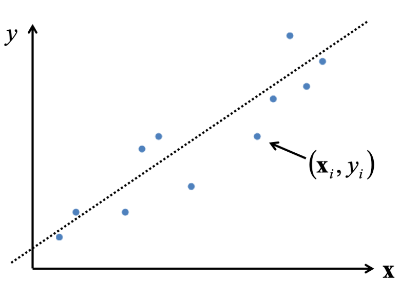
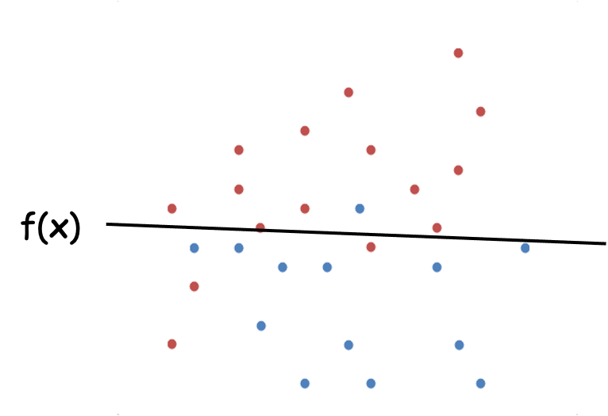
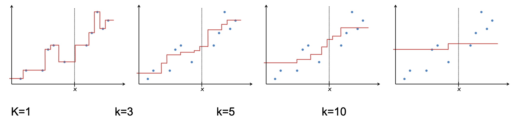

## Linear Regression (선형 회귀)

**`Linear Regression` 이란 위와같은 데이터들이 분포한 그래프에서 각 데이터별 오차가 제일 적은 선형함수 $y=wx+w_0$ 를 찾는것이다.**

이때 찾을 선형함수를 가설로 새운다 하여 **가설함수(Hypothesis function)** 라 하며 $H(W,b)$ 로 표기하기도 한다.  

> $w_0$ 는 bias 로 $b$ 로 주로 표기하지만 여기선 $w_0$ 키워드를 사용한다.  

위에선 2차원 $(x, y)$ 의 데이터를 예로 들었지만 실제 데이터를 다룰때 $n$ 차원 데이터일경우가 많고  
이때 만들어질 선형함수를 아래처럼 표기할 수 있다.  

$$
f(x) = w_0 + w_1x_1 + w_2x_2 + \cdots + w_nx_n = w_o + \sum_{j=1}^dw_jx_j
$$

위 선형함수에서 각 데이터간의 거리값을 구하는 것이다.  

**실데이터와 학습데이터간의 오차, 혹은 거리를 Cost 라 부르며** 값을 구하는 식을 `Cost Function` 혹은 `에러 함수` 라 한다.  

$$
Cost(w,b) = \sum_{(x,y)\in Data} (y - f(x))^2
$$

실 데이터 $(x,y)$ 의 $y$ 값에서 가설함수 $f(x)$ 의 오차 제곱의 총 합이다.  

우리는 가장 작은 값을 가지는 에러함수를 찾기 위해 입력 데이터가 $n$ 차원일 경우 `bias` 를 포함하여 $w_0$ ~ $w_n$ 의 데이터를 찾아내면 된다.

### 예제

  
위처럼 $(0,0), (1,1), (1, 2)$ 3개의 데이터를 가진 그래프에서 선형함수를 구하려면 어떻게 해야하는지 알아보자. 

**기계의 경우 $w_n$ 값을 조절해가며 경사 하강법**을 이용하여 최적의 `Cost function` 구하겠지만  
위 그림처럼 단순한 2차원 데이터의 경우 **편미분 공식**으로도 최적의 `Cost function` 을 구할 수 있다.  

2차원임으로 구해야할 가설함수는 $f(x)=w_0 + w_1x$ 으로 나타낼 수 있고  
`Cost Function` 에 대입하면 아래처럼 표기할 수 있다.  

$$ \begin{aligned}
Cost(w,b) &= \sum_{(x,y)\in Data} (y - f(x))^2 \\
 &= (0 - f(0))^2 + (1 - f(1))^2 + (2 - f(1))^2 \\
 &= (0 - w_0)^2 + (1 - (w_0 + w_1x))^2 + (2 - w_0 + w_1x))^2 \\
 &= 2w_1^2 + 3w_0^2 - 6w_1 - 6w_0 + 4w_1w_0 + 5 
\end{aligned} $$

`Cost Function` 증가율이 가장 작은 $w_0, w_1$ 를 구하려면 편미분을 사용하면 좋다.  

$$
{\partial Cost(w,b) \over \partial w_1} = 4w_1 + 4w_0 -6 \\ \ \\
{\partial Cost(w,b) \over \partial w_0} = 4w_1 + 6w_0 -6
$$

위의 편미분식이 모두 0이 되는 경우는 $w_0=0, w_1=1.5$ 일때 이다.  

지금까지는 사람이 공식을 이용하여 선형회귀 문제를 풀었지만  
차원이 늘어날 경우 더이상 위와같은 방식으로는 문제를 해결할 수 없다.  

특히 딥러닝과 같은 뉴럴넷에서는 사용할 수 없는 방법이기에 주로 **경사하강법**을 사용하여 선형회귀문제를 해결한다.  

## Logistic Regression (로지스틱 회귀)

선형회귀로 여러 차원의 데이터의 변화률을 기반으로 관계를 찾는(에러함수 최소화) 문제를 해결할 수 있다면    
로지스틱 회귀는 데이터가 어떤 집단에 속하는지를 찾는 문제를 해결하는 방법이다.  

위와 같은 데이터가 있을때 새로운 데이터가 들어오면 해당 데이터 그룹을 어디에 속해야 할지  
분류하기 위한 함수를 만들기 위해선 어떻게 해야할까?

`Logistic Regression` 는 이진분류를 위한 방법론이다. 
어떤 함수가 되었든간데 `input` 에 대한 `output` 은 `0` 혹은 `1` 일 것이다.  

이런점때문에 모든 결과값이 `0 ~ 1` 사이에서 출력되는 sigmoid 함수를 주로 사용한다.  

$$ f(x) = {1 \over 1 + e^{-x}} $$

> 복잡한 수식을 간결히 하기위해 $\exp$ 함수로 표현하기도 함 ${1 \over 1 + \exp(-x)}$ 

어떤 데이터이든 간에 $x$ 에다가 집어넣으면 `0 ~ 1` 사이값이 나오며  
`0.5` 를 경계로 설정해 클래스분류를 할 수 있다.  

어쨋건 위의 예제 $f(x) = w_0 + w_1x_1$ 함수를 구하는건 변하지 않는다.  
위 sigmoid 함수를 통해 최적의 $w_o$ 와 $w_1$ 을 구해야한다.  

다시한번 아래 그림에서 $f(x)$ 를 찾으려면 어떻게 해야하는지 생각해보자.  

위 그림의 경우 빨강, 파랑으로 표기된 좌표데이터를 $(x, y)$ 로 표기했을때 위 그림에서 

빨강으로 분류할 데이터 $(x, y)$ 값을 넣었을때 가설함수의 값이 0.5 이상  
파랑으로 분류할 데이터 $(x, y)$ 값을 넣었을때 가설함수의 값이 0.5 이하  

로 나오도록 최적의 $w_0, w_1$ 를 구해야 한다.  

`Logistic Hypothesis` 가설 함수는 이 `sigmoid` 함수 형태로 구성되며 아래와 같다.  

$$ h(x) = {1 \over 1 + \exp(-W^TX)} $$

마찬가지로 입력데이터가 n차원일 경우가 많음으로 $W^TX$ 의 형태는 아래와 같다.  

$$ W^TX = w_0 + w_1x_1 + w_2x_2 + \cdots + w_nx_n = w_o + \sum_{j=1}^dw_jx_j $$

`Logistic Hypothesis` 은 가설함수가 `sigmoid` 함수형식으로 구성될 뿐 
`Cost Function` 구하는 방법은 `Linear Regression` 과 동일하다.  

가설함수를 기준으로 오차가 가장 작은 값일때의 $w_n$ 를 구하도록 에러함수를 구성하고  

$$ Cost(x) = \sum_{(x,y)\in Data} (y - h(x))^2 $$

편미분 ${\partial Error \over \partial w_n}$ 을 통해 각각의 $w_n$ 를 구할 수 있다.  

실데이터 $y$ 는 0 과 1밖에 없을것임으로  
예측된 결과 $h(x)$ 가 최대한 0 혹은 1 에 가깝도록 $w_n$ 를 구한다.  

## 경사하강법  

> <https://www.youtube.com/watch?v=ve6gtpZV83E&t=917s>
> 더욱 자세한 내용은 위 유튜브에서 학습 가능  

 
## K-Nearest Neighbors(k-NN)

새로운 데이터가 들어왔을때 해당 데이터의 그룹을 설정하기 위한 방법론.

그림처럼 새로 위의 주황색 데이터를 추가했을때 반경(원하는 주위 데이터수) $k$ 를 지정하고 
$k$ 값에 따른 `majority voting`(다수결) 을 통해 새로 추가된 데이터의 그룹이 지정된다.  

$k=1, \mathrm{class(Red)}$  
$k=3, \mathrm{class(Blue)}$  
$k=5, \mathrm{class(Blue)}$  

기존 데이터가 아래 그림과 같을때  

데이터가 추가될때 어떤 진영으로 설정될지 $k$ 값의 변화에 따른 경계선을 표현한 그림이다.  

### 예제

각 과일별로 당도, 아삭함 이라는 칼럼(차원)을 두고 종류별 그룹화 한다.  

위와같이 표를 사용해 토마토(당도:6, 아삭함: 4)가 추가되었을때 k 에 따른 토마도가 어떤 그룹에 속할지 결정할 수있다.

당연히 토마토는 채소이지만 `majority voting` 에 의해 과일 혹은 단백질로 지정되어 버렸다\cdots

만약 가까울 수록 가중치가 높다고 생각된다면 일반적으로 k 값을 4 이하로 설정해야 한다.  

### Regression using k-NN

`Regression` 예측에서도 선형함수를 찾아다니지 않고 `k-NN` 방법을 통해서도 바로 구할 수 있을까 ? 

x 반경 k 만큼의 데이터를 구해 평균값을 구해서  
x 에 출력될 y 를 예측해버린다.  

아래는 k 에 따른 그래프 그림이다.  

제일 적절한 `k=3`일 때 `fluctuation`(변동) 이 덜하다.  

- `k` 의 결정은 오로지 개발자에게 맞긴다.  
- `k` 가 작을 수록 변동성이 높아지고 (higher variance)  
- `k` 가 높을 수록 주위 데이터에 의해 편향된다.(higher bias)  

적절한 k 를 구하는 방법  

- 데이터를 잘 분석한다.  
- 교차검증을 거친다.  

> **교차 검증**: 이미 검증된 데이터 N 을  m, n 으로 쪼개고, 학습에 m, 검증엔 n 을 사용하는 것이다.  

### 장단점

장점  

1. 트레이닝이 필요 없다, 이미 주어진 주위 데이터와 연산만 하면 됨
2. 목표함수가 너무 간단하다(주위 데이터 몇개만 사용하면 됨)
3. 데이터 손실이 없다.

단점

1. 데이터가 추가될 때 마다 주위 모든 데이터를 읽어 메모리에 저장해두어야 한다.  
2. 데이터 편향에 영향을 받음(이건 다 똑같을듯)
3. 차원이 커질수록 계산량이 배로 늘어남

## Naive Bayes(완화된 베이즈 이론)

**베이즈 이론**을 사용하는 방법론이다.  

원래 베이즈 이론의 공식은 아래와 같다.  

$$
P(H \mid E) = {P(H)P(E \mid H) \over P(E)} \\ \ \\
H: Hypothesis (가설)   \\
E: Evidence (새로운 정보)  
$$

$E$ 가 발생했을 때 $H$ 가 일어날 확률은?

$P(H)$ 는 $P(E)$ 를 몰랐을때 발생할 확률(사전확률)
$P(H \mid E)$ 는 $P(E)$ 를 알게되고 **업데이트**된 $P(H)$ 의 확률이다(사후확률).  

`Naive Bayes`(완화된 베이즈)는 모든 확률을 다 독립이라고 가정한다. 아래식이 성립함.  

$P(A \mid B) = P(A)$   

즉 B 발생후 업데이트된 A가 발생할 확률이 A가 그냥 일어나는 확률이나 같다는 것.

기존 베이즈 이론보다 계산할 양이 훨씬 적기에 기계학습에 접목 시킬수 있게되었다.  

### 예제 1 

- `Outlook`: 3가지의 날씨   
- `Temp`: 3가지의 온도 상, 중, 하  
- `Humidity`: 습도, 2가지  
- `Wind`: 바람, 2가지  

4 차원 데이터를 사용해 `play=yes or no` 라는 결과를 도출

오늘 `Sunny, Mild, High, Strong` 일 때 `play=yes or no` 예측하고 싶다면 베이즈 이론을 사용할 수 있다.  

$$ \mathrm{
    P(Yes \mid Sunny, Mild, High, Strong) =  
    \frac{P(Sunny, Mild, High, Strong \mid Yes)P(Yes)}{P(Sunny, Mild, High, Strong)}
} $$

$$ \mathrm{
    P(No \mid Sunny, Mild, High, Strong) = 
    \frac{P(Sunny, Mild, High, Strong \mid No)P(No)} {P(Sunny, Mild, High, Strong)}
} $$

분모가 서로 같음으로 생략고 아래식중 높은 값(확률)을 가진것에 따라 결과를 출력하면 된다.  

$$ 
\mathrm{P(Sunny, Mild, High, Strong \mid Yes)P(Yes)} \\ \ \\
\mathrm{P(Sunny, Mild, High, Strong \mid Yes)P(No)}
$$

위의 조건부 확률을 모두 구하러면 식이 엄청 늘어나기에 위에서 말한대로 기계학습에선 `Naive Bayes` 를 사용한다.  
모두 독립사건으로 본다.  

$$
\mathrm{P(Sunny \mid Yes)P(Mild \mid Yes)P(High \mid Yes)P(Strong \mid Yes)P(Yes)} \\ \ \\
\mathrm{P(Sunny \mid No)P(Mild \mid No)P(High \mid No)P(Strong \mid No)P(No)}
$$

$$
\mathrm{P(Yes) = \frac{9}{14}} \\
\mathrm{P(Sunny \mid Yes) = \frac{2}{9}} \\
\mathrm{P(Mild \mid Yes) = \frac{4}{9}} \\
\cdots
$$

이런식으로 Yes, No 에서 발생할 각 날씨의 확률을 구해 연산해서 더 높은 값으로 의사결정하면 된다.  

$$ \mathrm{P(Yes \mid Sunny,Mild,High,Strong) = 
\frac{P(Yes)P(Sunny \mid Yes)P(Mild \mid Yes)P(High \mid Yes)P(Strong \mid Yes)}{P(Sunny,Mild,High,Strong)}} \\ \ \\
= \frac{9}{14} \times \frac{2}{9} \times \frac{4}{9} \times \frac{3}{9} \times \frac{3}{9} \times \frac{1}{a} = 0.0071 \frac{1}{a} $$

$$ \\ \ \\ $$

$$ \mathrm{P(No \mid Sunny,Mild,High,Strong) = 
\frac{P(No)P(Sunny \mid No)P(Mild \mid No)P(High \mid No)P(Strong \mid No)}{P(Sunny,Mild,High,Strong)}} \\ \ \\
= \frac{5}{14} \times \frac{3}{5} \times \frac{2}{5} \times \frac{4}{5} \times \frac{3}{5} \times \frac{1}{a} = 0.0411 \frac{1}{a} $$

$\mathrm{P(Sunny,Mild,High,Strong)}$ 은 위에서 상수취급됨으로 제거하면 $\mathrm{Play=Yes}$  확률이 더 높다할 수 있다.  

### 예제 2

앞으로 입력될 영화 감상평이 부정(-) 평가인지 긍정(+) 평가인지 판단하기 위해선 어떻게 판단할 수 있을까?

$C1$-부정
$C2$-긍정

새로운 문장 $d$ 가 들어오면 $C_1$ or $C_2$ 카테고리를 분리해보자. 확률은 아래 공식으로 계산한다.

$$ P(C_1 \mid d) = \frac{P(C_1)P(d \mid C_1)}{P(d)} $$

$$ P(C_2 \mid d) = \frac{P(C_2)P(d \mid C_2)}{P(d)} $$

쓸모없는 분모는 제외하고 문장 $d$ 를 단어 $w$ 로 나눈다.

$$
P(C_1 \mid w_1, w_2, \cdots, w_n) = {P(C_1)P(w_1, w_2, \cdots, w_n \mid C_1)} \\
P(C_2 \mid w_1, w_2, \cdots, w_n) = {P(C_2)P(w_1, w_2, \cdots, w_n \mid C_2)}
$$

`Naive Bayes` 이름처럼 단어간의 연관성을 짖지 않고 판단한다.  

위의 학습데이터를 보면 부정 3개, 긍정 2개임으로 

$P(C_1) = \frac{3}{5} \quad P(C_2) = \frac{2}{5}$

이번 예제의 경우 단어의 개수를 기반으로 확률을 구하기 때문에 카테고리별 단어의 개수를 구하면  

$C_1$ 의 긍정 후기의 단어의 개수 14,  
$C_2$ 의 부정 후기의 단어의 개수 9이다.

총 23개의 단어의 출력될 확률 카테고리별로 구한다.  

$$
\mathrm{P(predictable \mid C_1) = \frac{1}{14}, P(no \mid C_1) = \frac{1}{14}, P(fun \mid C_1) = \frac{0}{14}}
$$

$$
\mathrm{P(predictable \mid C_2) = \frac{0}{9}, P(no \mid C_2) = \frac{0}{9}, P(fun \mid C_1) = \frac{1}{9}}
$$

모두 곱하여 높은값을 가지는 카테고리로 분류하면 된다.

> `with` 단어는 학습데이터 없음으로 생략됨

$\mathrm{P(predictable \mid C_2)}$ 의 확률값이 0임으로 서로 곱하면 0이 되어버리기에  
작은 상수값 $k$ 를 분자와 분모에 더해준다 (오차는 무시)

$$P(w_n \mid C_i) = {k + count(w_n \mid C_i) \over k + \sum count(W_n \mid C_i)}$$

분모는 카테고리 $C_i$ 에 대한 모든 단어의 개수  
분자는 카테고리 $C_i$ 에 대한 특정 단어의 개수  

## 결론 

모든 알고리즘이 각각의 다양한 복잡성을 가지고 다양한 오차율, 정확도를 출력한다.  
문제에 따라 알고리즘을 잘 선택해야하며 단순한 문제의 경우 가장 간단한 `Linear Regression` 으로 처리하는 것도 방법이다.

Linear Model -> K-NN -> NaiveBaise -> Decistion Tree -> Forest -> SVM -> Nueral Net

오른쪽으로 갈수록 높은 정확도와 많은 리소스를 요구한다.  

## K-means

데이터 클러스터링 방법론중 하나  

모델 설계시 개발자가 정하는 파라미터로 K는 클러스터의 개수를 의미한다.  

집합 V 와 K 의 개수가 input 으로 들어오면
클래스터 개수만큼의 집합 A 가 output 으로 나와야 한다.  
각 클러스터의 거리간의 합이 minimize 한

### 방법

k 개의 랜덤한 객체를 선택하여 센터로 설정

그리고 집합 V 의 모든 객체 p 에게 가장 가까운 센터를 선택하여 클러스터 구성
그리고 클러스터 안의 각 객체의 평균위치을 새로운 센터로 잡아 다시 클러스터를 구성한다
더이상 센터 이동이 이뤄지지 않을때까지 이를 반복, 

