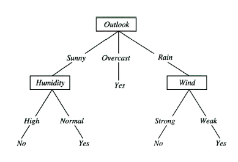
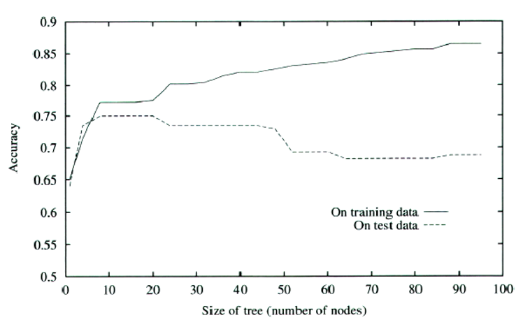
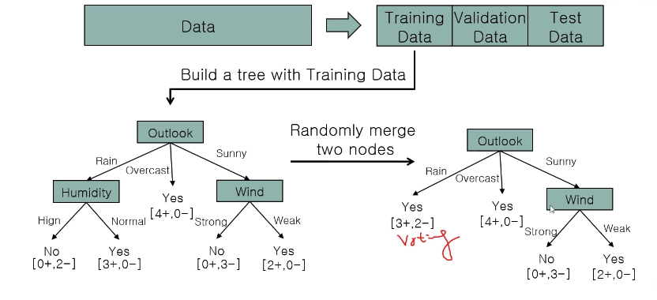
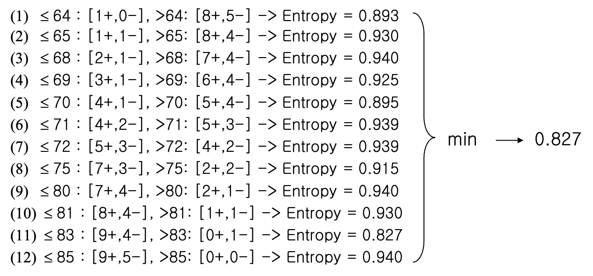

## Decision Tree  

의사 결정 트리  


위 그림도 테니스 관련 표이다.
마찬가지로 `A,B,C` 3차원 데이터로 `Play` 를 할지말지 결정하는데
모든 차원 데이터가 다 `T, F` 로 결정된다.  

`A` 와 `Play` 를 비교하면 3번 외에는 거의 일치한다.
`B` 와 `Play` 를 비교하면 모두 일치한다.  
`C` 와 `Play` 를 비교하면 1,3번 외에는 모두 반대된다.  

$A=F, B=T, C=T \rarr Play = T or F$?
$A=T, B=F, C=F \rarr Play = T or F$?
 
가장 강하게 연관성(correlate)이 있는 데이터가 B 임으로  
B 에 대해 가중치를 높게 설정해서 결과값을 찾아간다.  

데이터가 크고, 차원이 많다면 어떻게 연관성을 선명하게 분리할 수 있는가?  


### Entropy

데이터를 분리하려면 Entropy 에 대한 이해가 필요하다.  

```
Data Set1: 1, 1, 1, 1, 1, 1, 1, 1, 1, 1
Data Set2: 0, 0, 0, 0, 0, 0, 0, 0, 0, 0
Data Set3: 1, 1, 1, 1, 1, 0, 0, 0, 0, 0
Data Set4: 1, 1, 1, 0, 0, 0, 0, 0, 0, 0
```

데이터 셋의 순도(`impurity`)가 어떤가?  
`Data Set1, Data Set2` 이 가장 불순도가 낮고  
`Data Set3` 가 가장 불순도가 가장 높다 할 수 있다.  

`Entropy Function`를 통해 `impurity` 를 측정할 수 있는있다.  

만약 집합을 구성하는 요소가 자연수 $n$ 가지 라면 아래 수식으로 표기

$$
Entropy = - P_n\log_2{P_n} - ... - P_1\log_2{P_1} - P_0\log_2{P_0}  \\
= -\sum_{i=0}^n  P_i \log_2{P_i}
$$

> $P_n$ : 집합에서 n 이 나타날 가능성  
> log 밑변이 2 인 이유는 컴퓨터 바이너리 특성때문에며 굳이 2가 아니여도 상관 없음.

위 Dataset 의 경우 요소가 `1, 0` 2가지로만 이루어지기에 `Entropy Function` 은 아래와 같다.  

$Entropy = - P_1\log_2P_1 - P_0\log_2P_0 $

`Dataset1, Dataset2` 의 경우 `Entropy Function = 0` 이다.


가장 안정된 상태가 함수 값이 0
가장 혼잡한 상태가 함수 값이 1

엔트로피가 높을 수 록 *불순,엑티브* 하다  라고 할 수 있다.

위의 테니스 play 에서 

$play_T = 3/5$
$play_F = 2/5$

$$
Entropy = - P_T\log_2P_T - P_F\log_2P_F = 0.9...
$$

#### Information - Defree of Suprise(놀람의 정도)


중국과 브라질이 축구 승부확률은 1대 99이다.
아래와 같은 식으로 놀람의 정도를 구할 수 있다.  

$h(Brazil win) = -\log_2⁡ 0.99 = 0.01$ 

$h(China win) = −\log_2⁡ 0.01 = 6.64$ 

이때 `Defree of Suprise` 를 6.64 라고 하며 중국이 브라질을 이기는 것이 664배 더 놀랍다 라고 표현한다.  

두 `Defree of Suprise` 의 차이(6.63)를 는 정보량으로 표기하기도 하며  
정보량이 높을 수록 엔트로피 는 낮다 할 수 있다.  

실제 엔트로피를 구하면 아래와 같다.  

중국과 브라질의 경기 승부 결과는 1:99
아르헨티나와 브라질의 경기 승부결과 5:5 일때 

중국과 브라질 결과 set 의 불순도는 매우 pure 하고
아르헨티나와 브라질 결과 set 의 불순도는 가장 높은 수치이다.  

$Entropy(C \ vs \  B) = - 0.99 \times \log_2 \times 0.99 - 0.01 \times \log_2 \times 0.01 = 0.08$ 

$Entropy(A \ vs \ B) = - 0.5 \times \log_2 \times 0.5 - 0.5 \times \log_2 \times 0.5 = 1$  

### Corss Entorpy - 실제확률분포와 예측확률분포의 비교

`Corss Entorpy` 공식은 아래와 같다.  
실제 확률분포, 예측 확률분포가 얼마나 유사한지 알기위한 수식이다.

$$
Corss Entorpy = -\sum_{i=0}^n  P_i \log_2^{Q_i}
$$

기존 `Entorpy` 공식과 다르게 로그의 윗변이 동일하지 않은 다른 확률값이다.  

만약 보자기 안에 빨강, 초록, 파랑 공이 총 10개 들어있을 때
실제값과 사용자가 예측한 값은 아래 표와 같다.  

status|R | G | B
|---|---|---|---|
실제|7|2|1
예측|6|3|1

`Corss Entorpy` 공식에 따른 값은 아래와 같다.

$$
Corss Entorpy = 0.7 \log_2^{0.6} + 0.2 \log_2^{0.3} + 0.1 \log_2^{0.1}
$$


#### KL divergence(Kullback–Leibler divergence: 쿨백-라이블러 발산)

`relative entropy(상대적 엔트로피)` 는 두개의 확률분포를 비교하기 위한 공식으로
아래 두개의 확률분포를 비교한다.  

$P(i)$= 실제확률 - 실제 일어난 일 을 가지고 만든 확률분포   
$Q(i)$= 예측확률 - 이벤트가 일어날 예측 확률분포

`KL divergence` 의 공식 $D_{KL}(P||Q)$ 는 아래와 같다.  


`KL divergence` 의 값 $D_{KL}(P||Q)$ 이 작을 수록 실제확률의 분포와 예측확률의 분포가 유사하고,
클 수록 2개의 분포 차이가 크다.  


위 공식에서 $H$ 는  `-` 기호가 붙은 `Entropy` 공식을 뜻하며
$H(P, Q)$ 를 `Corss Entorpy` 로 칭한다.  

`Corss Entorpy` 와 기존 `Entropy`  
공식을 비교하면 많이 다르게 생겼다.  

$-\sum_{i}  P_i \log P_i : Entropy$
$-\sum_i P(i) log Q(i) : Cross Entropy$ 

$D_{KL}(P||Q)$ 의 공식을 보면 $P(i)$ 의 엔트로피, $P(i)|Q(i)$ 의 대한 크로스 엔트로피 값을 비교한 것이며  
두 엔트로피의 차이가 작을수록 실제확률과 예측확률이 비슷하다 할 수 있으며  
곧 `Predictive Analytics` 의 목적이다.

예측확률$Q(i)$의 크로스 엔트로피 값을 죄대한 실제확률$P(i)$ 엔트로피와 유사하게 만들어야 하는데 아래 `Error Function` 으로 

$E_n(\vec{w}, \vec{x}) = - \sum_k \vec{t_{nj}} \log \vec{o_{nj}}$

$t(true)$ 는 실제 값의 분포,
$o(output)$ 는 예측 값의 분포 

### 분할의 정도  

여떤 조건의 2진 결과가 아래 집합처럼 나왔을때

$P = \{1,1,1,1,0,0,0,0\}$

만약 위 결과가 어떤 속성에 의해 아래처럼 쪼갤 수 있다 할때
분할된 정도가 높은 집합은 어느것인가? 
이는 곧 어떤 속성으로 쪼개진 집합의 엔트로피가 더 낮다 할 수 있나? 와 같다.  

$p_1 = \{\{1,1,0,0,0\},\{1,1,0\}\}$
$p_2 = \{\{1,1,1,1,0\},\{0,0,0\}\}$


각 집합의 엔트로피를 구하고 평균을 구하면 각 $P$ 에 대한 엔트로피를 구할 수 있다.  


각 집합에 대한 엔트로피를 수식으로 표현하면 아래와 같다.  

$E(S,P) = \sum_{p\in P} \frac{|p|}{|S|}Entropy(p)$

$p_2$ 가 impurity(불순물)이 더 낮다.  
만약 다음 결과를 예측하고 싶다면 $p_2$ 에서 사용한 속성으로 다시 2진결과를 분할하는 것이 효율적이라 할 수 있다.  

아래 예제를 통해 분할의 정도가 의사결정 트리에 어떤 영향을 끼치는지 알아보자.

### 예제 1 

다시 테니스 예제로 돌아가서 `A,B,C` 에 따른 `play` 결과에 따른 확률로 엔트로피를 구해보자.  
마찬가지로 아래 공식을 사용한다.  
$E(S,P) = \sum_{p\in P} \frac{|p|}{|S|}Entropy(p)$

헝상 S에 대한 $Entorpy$ 는 구해야 한다. 


보나마나 B 속성을 통해 분할하는 것이 더 예측이 뛰어나다. 
이는 속성의 요소가 단 2개 `T,F` 일 경우의 이야기고 요소가 가질수 있는 수가 많아지면
아래 예제처럼 노드로 쪼개진다.  

### 예제 2


어떤 속성을 기반으로 play 여부를 나누어야 정확한지 알아내야 한다.  

`outlook, temp, humidity, wind` 4가지 속성에 대해 엔트로피를 구해보자.  

yes를 +, no를 - 로 두었을때 위 사진 집합처럼 나누니다.  

위의 집합 표현식으로 나누면 
$S = \{0,0,1,1,1,0,1,0,1,1,1,1,1,0\} \\(총 14개)$

$p^{sunny} = \{1,1,0,0,0\}$
$p^{rain} = \{1,1,1,0,0\}$
$p^{overcast} = \{1,1,1,1\}$

당연이 가장 낮은 엔트로피를 가지는건 `overcast`

각 집합의 $Entropy(p)$ 를 구하고  


$E(S,P) = \sum_{p\in P} \frac{|p|}{|S|}Entropy(p)$ 공식을 사용해 평균을 구한다.  

$\frac{5}{14} \times 0.971 + \frac{4}{14} \times 0 + \frac{5}{14} \times 0.971 = 0.694$

기존의 Split 하기 전의 Play 의 엔트로피 $Entropy(S)$가 0.940 인데 
두 엔트로피의 차이를 `Gain` 함수라 하고 아래와 같다.   

$Gain(S, outlook) = 0.940 - 0.694 = 0.246$

마찬가지로 `temp, humidity, wind` 의 `Gain` 함수의 결과는 아래와 같다.  

$$
Gain(S, outlook) = 0.246 \\
Gain(S, humidity) = 0.151 \\
Gain(S, wind) = 0.048 \\
Gain(S, temp) = 0.029 \\
$$

$Gain$ 함수가 클 수록 해당 속성의 엔트로피가 낮은것이고  
예측확률이 높기때문에 가장 먼저 분할조건이 되는 속성은 `outlook` 이다.  


결과(output)인 `play` 의 엔트로피가 Pure 하게 맞춰진 `Overcast` 의 경우 제외시키고 다음 두 집합에 대해 다음 우선순위의 분할조건인 `humidity`로 다시 쪼갠다.  

모든 `play` 의 엔트로피가 `Pure` 할때 까지 나누는 과정을 `Recursive` 하게 반복한다.  

마지막 우선순위인 temp 까지 분할했음에도 결과가 `Pure` 하지 않을 경우 다수결(majority voting) 으로 모델을 생성한다.  

결국 생성된 모델은 아래와 같다.  



temp 는 결과에 포함되지 않았다.
temp 로 가기전에 모두 pure 하게 맞춰졌기 떄문  

## Overfitting 

너무 잘 맞춰진 데이터 케이스  

위의 테니스 예제의 경우 속성4개, 각 속성마다 나올수 있는 타입이 3, 3, 2, 2 였다.
나올수 있는 경우의 수가 36... 주어진 데이터셋은 14... (14 < 36 이기에 subset 이라 한다)
나머지 22 개의 경우를 예측해야 하는데 

Subset 과 Dataset 이 비슷한 개수의 비슷한 분포일 경우 학습 Accuracy(정확도) 는 높아질 것.

대부분의 학습용 데이터는 subset 만약 너무 pure 하게 나누어 떨어진다면...
위의 `outlook=Overcast -> play=yes` 로 결정되는데 실제 결과는 아닐 수 있다.  

너무 학습용 데이터에 맞춰지면 오히려 나머지 22 개의 경우를 예측하는데 Accuracy 가 더 떨어질 수 있다.  

이러한 문제점은 많은 기계학습 방법에서 발생하며 막을 수 있는 방법도 다양하다.  

### 예방방법1 - 학습 데이터 분리

n 개의 Dataset 이 주어질때 모든 데이터를 학습용 데이터로 사용하는 것이 아니라  
`trainning : validation : test` 3가지로 나누며
`7 : 2 : 1` `6 : 3 : 1` 정도의 비율로 나누어 진행한다.
데이터가 없다면 `validation`, `test` 를 하나로 합쳐 `7:3`, `8:2` 정도로도 사용하기도 한다.  

데이터를 나눌때에는 최대한 `Overfitting` 을 피하기 위해 데이터 고르기를 평평하게 펴서 나누어야 한다.  

`trainning` - 학습용
`validation` - 검증용(정상적인 모델이 나왔는지)
`test` -  모델 성능 측정용
물론 데이터가 충분이 많을때 얘기

### 예방방법2 - 가지치기(Node prunning)

`Decision Tree` 의 고질적인 `Overfitting` 문제점이 있다.  



node(요소의 데이터종류)의 수 가 많아질 수록 `training data` 에 대해선 정확한 분류를 하지만
실제 `validation data` 로 검증시엔 성능이 더 저하된다.  

실선(tranning)과 점선(valid) 의 교착지점부터 `Overfitting` 문제가 발생하고 있다 보면 된다.  

과도한 노드구조는 

1. 결정트리를 사용한 모델 생성
2. 검증
3. 말단노드 제거후 다수결(majority voting) 적용후 validation dataset으로 재검증,
4. Accuracy 변화 없다면 말단노드 삭제
5. 1~5번 반복



Outlook-Rain 시에는 5번중 3번은 Yes 임으로 voting 에 따라 Yes 로 지정 후 노드를 삭제해버렸다.  


### 예방방법2-2 가지치기2(Rule Prunning)

결정트리를 노드형식이 아닌 `if, else, and, or` 문으로 변경
그리고 말단의 조건문 한문단을 삭제, 사실 Node Prunning 과 유사하다.  

### 예방방법3 


`conitnuous value` (온도, 습도 0~33) 의 요소를 가질 수 있다면
결정트리를 사용할 수 있는가?  

먼저 분기할 차원을 정렬한다.  
각 온도별 이하, 초과 일 경우의 PLAY 확률을 모두 구하고  



각 TEMP 별 엔트로피를 계산, 가장 작은값(minimum) 한 값을 가져와 노드 작성 에 사용한다.  


그리고 Gain 값을 가져온다.  

Hunidity 역시 마찬가지로 엔트로피를 계산하고 가장 min한값을 가져와 Gain 값을 구한다.  

하지만 속성이 너무 많기 때문에 분기를 위한 연산이 너무 많이 필요하다.  

행이 n 개 있을경우 열이 d 개 라면 d(n-1) 번 해야 1회 분기를 할 수 있다.  

## Random Forest

결정트리를 여러개로 만든 버전이다.  

하나의 데이터셋이 주어지면 `Nonexclusive`(비독점) 하게 랜덤하게 나눠 여러개의 데이터셋(서브셋)을 만든다  
즉 서브셋은 중첩될 수 있다.  

만약 `A, B, C, D` 총 4 개속성(차원)을 가진 표를 가지고 `Random Forest` 한다면

```
subset1 = ABC
subset2 = ABD
subset3 = BCD
...
```

이런식으로 서브셋을 만들어 하나의 데이터셋을 사용해 여러개의 결정트리를 생성한다.  
> `bagging(Bootstrap Aggregation): 표본집단 추출모음` 이라 한다.  

생성된 여러개의 결정트리를 사용하는데  
값을 예측하는 경우라면 `Averaging`  
결정하는 경우라면 `Majority Voting`  
방법을 통해 Random Forest 로 결합하여 결과를 출력한다.  

### 장점

- 학습데이터가 변경되기 때문에 **Overfitting 예방**
- **데이터 결함에 강하다**, 나중에 valid 시에 결함이 있는 결정트리는 제외하고 forest 를 구성하면 된다.
- **노이즈에 강하다**. 갑자기 튀거나 꺼진 데이터(누락 가능성, 오류 가능성이 높은)에도 대응할 수 있다.  


