## RNN (Recurrent Neural Network: 순환 신경망)

`CNN`, `word2Vec` 등 지금까지 배운 신경망은 `Feed Forward(단방향)` 유형의 신경망이다. 

구성이 단순해 구조를 이해하기 쉽고 많은 문제에 사용가능하지만 **시계열 데이터(Sequence data)** 를 잘 다루지 못하는 단점이 있다.  

> **Sequence data**  
> 구성요소가 순차적으로 발생하거나 구성요소 간에 순서가 있는 데이터  
> 음성, 자연어 문장, 동영상, 주가 변동 등을 예로들 수 있다.  

`RNN` 의 특징은 순환하는 경로가 있다는 것, 해당 시계열 데이터 문제를 쉽게 해결 가능하다.  
기계 번역, 음성 인식, 필기체 인식, 영상 주석달기, 동영상에서 행동 인식, 작곡 및 작사 같은 응용분야에서 사용될 수 있다.  

시계열 데이터의 `[분류, 예측]` 에서는 **현재 시점, 이전 시점의 값들을 고려** 해야 한다.  

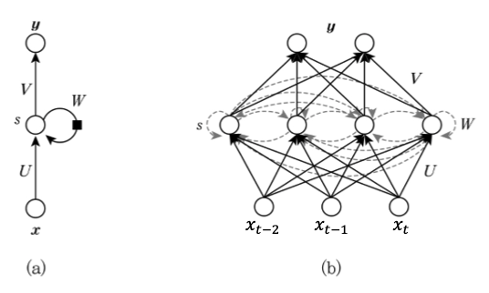

$x$: 입력값  
$y$: 출력값  
$U, W, V$: 가중치  
$b$: 편향  

여러 가중치와 편향 값은 모든 노드에서 동일한 변수이다.  
따라서 그림(b) 를 그림(a) 처럼 한번에 그릴 수 있다.  

**메모리셀 이라 부르는 hidden layer** 가 추가되고 다음시점에도 영향을 끼치는 가중치가 생긴점이 다를 뿐,  
입력값 $x_t$ 가 시간에 따라 변화하고 [이전상태, 현재상태, 다음상태] 에 모든 영항을 끼칠 때 사용하는 것이 RNN 알고리즘이다.  

위 그림을 좀더 수식적을 표현하면 아래와 같다.  

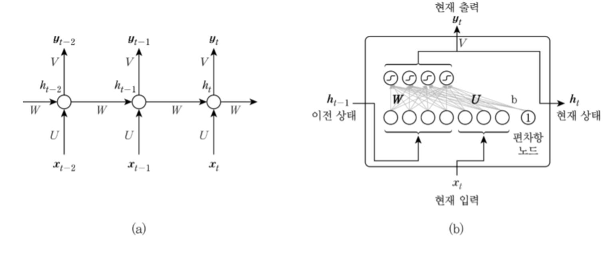

그림(a) 는 `hidden layer` 를 동그라미 1개로 간략하게 표기했고  
그림(b) `hidden layer` 내부의 구조를 상세하게 표기했다.  
입력노드, 은닉노드를 별도의 가중치에서 입력받아 출력노드 내보내도록 하는 구조이다.  


메모리셀, 출력값 각각의 계산식은 아래와 같다. 

$$
\begin{aligned}
h_t &= \tanh(Wh_{t-1} + Ux_t + b_s) \\
y_t &= Vh_t + b_z
\end{aligned}
$$

RNN 은 이전 시각의 출력값 $h_{prev}$ 가 현재 출력값 $h$ 그리고 다음 출력값 $h_{next}$ 에 영향을 끼칠뿐
다른 딥러닝 모델과 큰 차이는 없다.  

바로 직전 값을 계속 전달받기에 RNN 을 First Order Markov Model 이라고도 부른다.  

> 만약 두단계의 정보를 전달받을 경우 Second Order Markov Model

### RNN 입력 출력 대응형태

데이터 종류에 따라 입력과 출력, RNN 의 구조를 다르게 사용한다.  

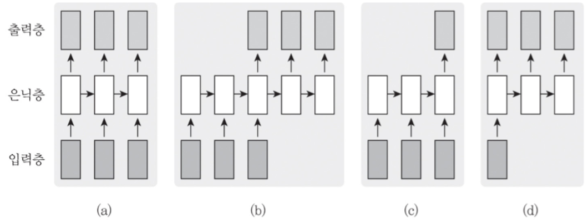

- (a): 각 시점에 들어온 데이터를 바로 출력값으로 나오는 것  
- (b): 모든 시점의 입력이 끝난 후 출력값으로 나오는 것  
  기계번역: 이것은 책이다 → This is a book  
- (c): 앞 시점의 입력이 끝난 후 하나의 출력값으로 나오는 것  
  감성분석: ‘이 책은 내용이 알차게 구성되어 있다 → 긍정적  
- (d). 하나의 입력에 대해 일련의 출력 이 나오는 것  
  영상 주석달기: 영상→ 설명하는 문장  

`[many-to-many, many-to-one, one-to-many]` 라 말하기도 한다.  

## BPTT

시간 방향으로 펼친 신경망의 오차역전파법이라 하여 **Back propagation Through Time(시간방향 오차연전파)** 라 부른다.  

`RNN` 의 역전파를 보면 `tanh` 와 `Matmul` 연산을 통해 기울기를 전달하는데  
`RNN` 특성상 동일한 가중치($W_h$)를 지속적으로 연산하기 때문에 발산하거나 0으로 수렴하게된다.  

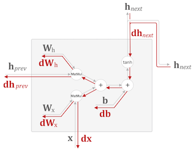  


가중치 행렬을 역전파 할 때도 $W_h^T$ 행렬을 반복하여 전파하는데  
$W_h$ 초기값이 높게 혹은 작게 형성될 경우 **기울기 폭발 혹은 기울기 소실**이 일어날 수 있다.  

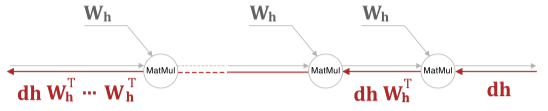

아래 그림은 시간에 따른 $Wh$ 의 `L2 Norm` 값으로 표현하여 기울기의 크기를 그래프로 표기한 것.  

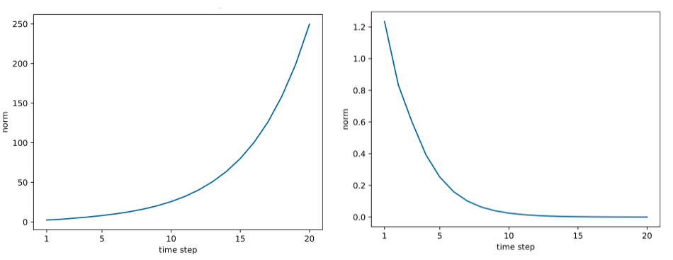
**기울기 폭발의 대첵**으로 기울기의 `L2 Norm` 값이 `threshold` 를 넘으면 기울기 값을 조정시키는 **기울기 클리핑** 기법을 사용한다.  

$$
\mathrm{if \ \|\hat{g}\| \ge {threshold}} :
$$

$$
\mathrm{\hat{g} = \frac{threshold}{\|\hat{g}\|}\hat{g}}
$$

```py
dW1 = np.random.rand(3, 3) * 10
dW2 = np.random.rand(3, 3) * 10
grads = [dW1, dW2]
max_norm = 5.0

# grads: 기울기 list
# max_norm: threshold
def clip_grads(grads, max_norm):
    total_norm = 0
    for grad in grads:
        total_norm += np.sum(grad ** 2)
    total_norm = np.sqrt(total_norm)

    rate = max_norm / (total_norm + 1e-6)
    if  1 > rate: 
        for grad in grads:
            grad *= rate
```

RNN 은 기울기 소실, 기울기 폭발 문제 외에도 **장기 의존성(Long-Term Dependency)** 문제가 있다.  

가중치 W 에 대해 BPTT 한것을 수식적으로 포현하면 아래와 같은데  

$$
W = W - rate \cdot \frac{\partial E}{\partial W}
$$

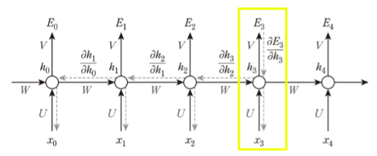

만약 위에서 $E_3$ 에 대한 에러함수를 구하기 위해 $\frac{\partial E_3}{\partial W}$ 을 구해야 한다면  
$V, U$ 의 경우 단순 기울기를 측정해서 처리하면(수식의 첫항)  
되지만 $W$ 의 경우 이전 $h_t$ 로 인해 영향을 받았기 때문에 각 $t$ 에 대한 $W, U$ 가중치에 대해 모두 처리를 해주어야 한다.   

$$
\begin{aligned}
\frac{\partial E_3}{\partial W} = &\frac{\partial E_3}{\partial h_3} * \frac{\partial h_3}{\partial U} \\
+&\frac{\partial E_3}{\partial h_3} * \frac{\partial h_3}{\partial h_2} * \frac{\partial h_2}{\partial U} \\
+&\frac{\partial E_3}{\partial h_3} * \frac{\partial h_3}{\partial h_2} * \frac{\partial h_2}{\partial h_1} * \frac{\partial h_1}{\partial U} \\
+&\frac{\partial E_3}{\partial h_3} * \frac{\partial h_3}{\partial h_2} * \frac{\partial h_2}{\partial h_1} * \frac{\partial h_1}{\partial h_0} * \frac{\partial h_0}{\partial U}
\end{aligned}
$$

시퀀스 데이터가 커질수록 과거시점의 입력값이 현제 예측값에 대해서 영향력이 옅어지고 
이후에 출력될 예측값은 더욱 얻어내기가 힘들어지는 문제가 발생한다.  


### Truncated BPTT

큰 시계열 데이터를 취급할 때는 흔히 신경망 연결을 적당한 길이로 끊는다.  

시간 크기가 커지는 것에 비례하여 `BPTT` 가 소비하는 컴퓨팅 자원이 증가하기 때문, 또한 크기가 커질수록 기울기도 불안정해진다.  

그런 이유로 `RNN` 계층을 시각개수로 나누어 **블록** 이라는 단위로 부른다.

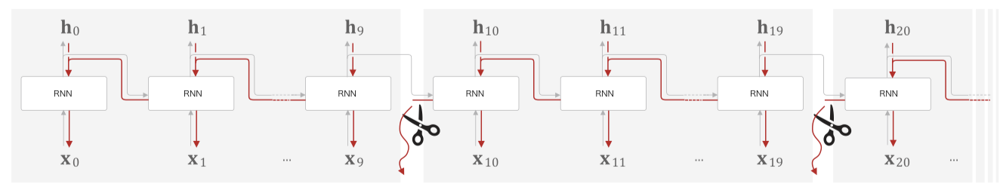

그림의 경우 길이 10개 단위로 블록을 구성했다.  
**Truncated BPTT 는 블록단위로 미래의 결과는 상관없이 독립적으로 진행한다**

순전파는 블록 상관없이 데이터가 흘러간다.  

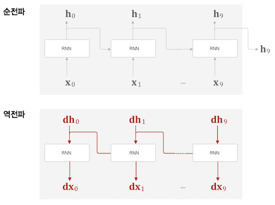

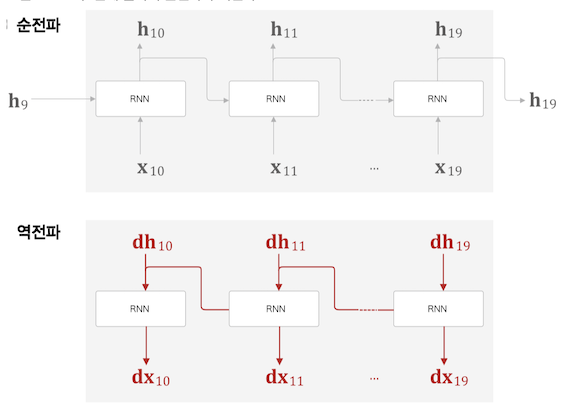


그런 이유로 위 그림처럼 `Truncated BPTT` 도 블록의 마지막 출력값 $h_9, h_{19}$ 데이터가 필요하기 때문에  
먼저 순전파를 실행한 후 역전파를 진행하는, 데이터를 계승하는 방식으로 학습을 진행한다.  

### Truncated BPTT + 미니배치

시계열 데이터 1000 개를 시각 10개 블록단위로 끊어 미니배치 개수를 2개로 설정하여 학습할 경우 아래 그림과 같다.  

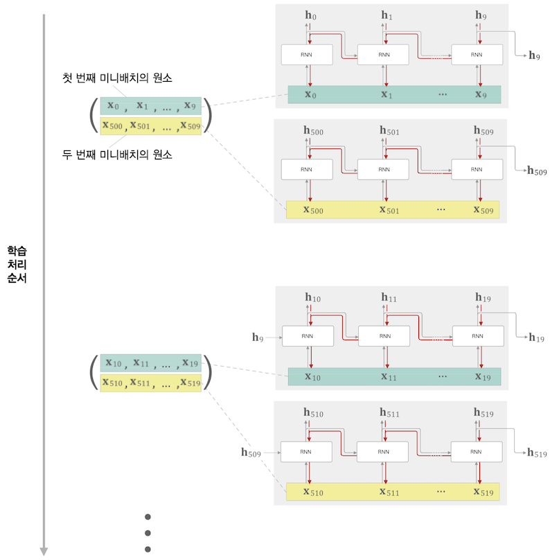

## Time RNN

다시한번 RNN 을 표현하는 수식과 그림을 보면  


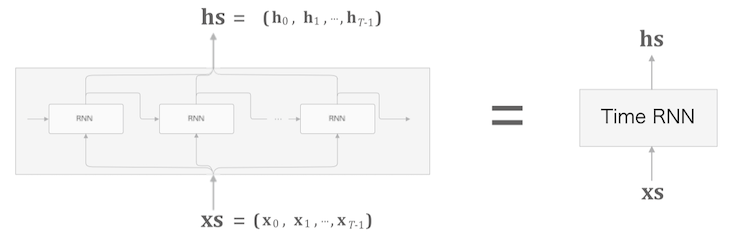


$h_t = \tanh(h_{t-1}W_h + x_tW_x+b)$

시계열 데이터 수가 $T$ 개인 데이터, 입력데이터($h$)와 출력데이터($x$)를 묶어 $xs, hs$ 로 표현하고  
늘여놓았던 `RNN` 을 합치면 오른쪽같이 간단한 그림으로 표현할 수 있다.  

미니 배치 크기가 $N$, 데이터차원 크기가 $H$ 라면 아래 그림과 같이 행렬이 구성된다.  

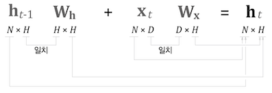  

`RNN` 계층 $T$ 개를 모아 `Time RNN` 계층을 만들고  
또 `Time RNN` 블럭을 여러개 모아 `Truncated BPTT` 위한 계층을 완성한다.  

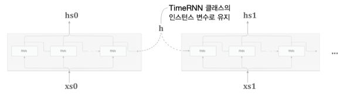

### 구현  

구현은 아래와 같다.  

```py
class RNN:
    def __init__(self, Wx, Wh, b):
        self.params = [Wx, Wh, b]
        self.grads = [np.zeros_like(Wx), np.zeros_like(Wh), np.zeros_like(b)]
        self.cache = None

    def forward(self, x, h_prev):
        Wx, Wh, b = self.params
        t = np.dot(h_prev, Wh) + np.dot(x, Wx) + b
        h_next = np.tanh(t)

        self.cache = (x, h_prev, h_next)
        return h_next

    def backward(self, dh_next):
        Wx, Wh, b = self.params
        x, h_prev, h_next = self.cache

        dt = dh_next * (1 - h_next ** 2)
        db = np.sum(dt, axis=0)
        dWh = np.dot(h_prev.T, dt)
        dh_prev = np.dot(dt, Wh.T)
        dWx = np.dot(x.T, dt)
        dx = np.dot(dt, Wx.T)

        self.grads[0][...] = dWx
        self.grads[1][...] = dWh
        self.grads[2][...] = db

        return dx, dh_prev
```

`RNN` $T$ 개 블록단위 `Time RNN` 구현

```py
class TimeRNN:
    def __init__(self, Wx, Wh, b, stateful=False):
        self.params = [Wx, Wh, b]
        self.grads = [np.zeros_like(Wx), np.zeros_like(Wh), np.zeros_like(b)]
        self.layers = None # RNN 계층을 리스트로 저장
        self.h, self.dh = None, None # forward 출력 h, backward 의 앞 블록 기울기
        self.stateful = stateful # 은닉 상태 유지 여부, 순전파 시에 데이터 인계 여부

    def set_state(self, h):
        self.h = h

    def reset_state(self):
        self.h = None

    def forward(self, xs): # xs: T 개의 시계열 데이터
        Wx, Wh, b = self.params
        N, T, D = xs.shape
        D, H = Wx.shape

        self.layers = []
        hs = np.empty((N, T, H), dtype='f') # 출력값 hs 초기화

        if not self.stateful or self.h is None:
            self.h = np.zeros((N, H), dtype='f') # 영행렬 초기화

        for t in range(T):
            layer = RNN(*self.params) # RNN for Wx Wh b
            self.h = layer.forward(xs[:, t, :], self.h)
            hs[:, t, :] = self.h
            self.layers.append(layer)

        return hs
```

그림처럼 최종 출력 $h$ 를 **은닉상태 인스턴스 변수**로 취급하고 다음 블록으로 인계한다.  
`stateful` 변수는 각 블록단위에서 상태값 $h$ 를 영행렬로 초기화 할지 말지는 결정한다.  

```py
# Time RNN Backward
def backward(self, dhs):
    Wx, Wh, b = self.params
    N, T, H = dhs.shape
    D, H = Wx.shape

    dxs = np.empty((N, T, D), dtype='f')
    dh = 0
    grads = [0, 0, 0]
    for t in reversed(range(T)):
        layer = self.layers[t]
        dx, dh = layer.backward(dhs[:, t, :] + dh)
        dxs[:, t, :] = dx

        for i, grad in enumerate(layer.grads):
            grads[i] += grad

    for i, grad in enumerate(grads):
        self.grads[i][...] = grad
    self.dh = dh

    return dxs
```


`RNN` 역전파  
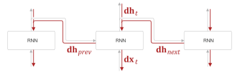  
  

`Time RNN` 역전파
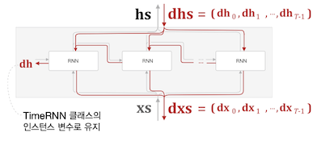


## LSTM 

LSTM(Long Short-Term Memory) 은 간단하게 **gate** 가 추가된 RNN.  

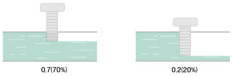

여기서 `gate`는 위 그림처럼 흐르는 물의 양을 조절하듯이  
출력값과 다음 시각으로 넘길 $h_t$ 를 조절하는 역할을 한다.  

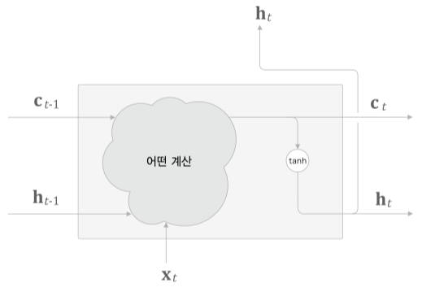

`LSTM` 인터페이스에 $c_t$ 가 추가된것을 볼 수 있다.  
**memory cell (기억셀) 이라 하며 LSTM 전용의 기억 메커니즘이다.**  

너무 자주 사용되다 보니 최근 `RNN` 과 `LSTM` 을 동일시 하기도 한다.  

$c_t$ 는 3개의 입력 $(c_{t-1}, h_{t-1}, x_t)$ 로부터 어떤 계산을 통해 출력되고    
$h_t$ 는 $c_t$ 로부터 $\mathrm{tanh}$ 연산을 통해 계산된다.  

LSTM 의 내부 구조를 좀더 상세히 표기하면 아래 그림과 같다.  

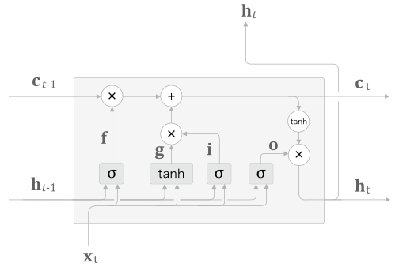

기억셀 내부에 아래 3개 gate 가 존재한다.  

- `output gate`  
- `forget gate`  
- `input gate`  

모든 `gate` 마다 가중치 형태의 MLP 구조이다.  

### output gate

$\mathrm{o}$ 기호로 표기된 부분으로 그림처럼 $h_{t-1}$, $x_t$ 와 시그모이드($\sigma$) 연산의 출력값이다.  

$$\mathrm{o= \sigma( x_t W_x^{(o)} + h_{t-1} W_h^{(o)} + b^{(o)} )}$$

다음 상태의 출력(output) 을 조절하다 보니 **output gate** 라 부른다.  

`output gate` 내부에 별도의 가중치들과 편향이 있다.  

또 $\mathrm{h_t}$ 는 $\mathrm{c_t}$ 와 $\mathrm{o}$ 의 곱으로 이루어지는데 행렬곱이 아닌 아마다르곱으로 원소별 곱 이다.  

$\mathrm{h_t = o \odot tanh(c_t)}$

### forget gate  

$\mathrm{f}$ 기호로 표기된 부분으로  
기억셀인 $\mathrm{c_t}$ 에서 쓸모 없는 부분을 잊도록 조작하다 보니 **forget gate**라고 부른다.  
가중치가 따로 있을 뿐 사실상 `output gate` 의 $\mathrm{o}$ 의 수식과 동일하다.  

$$\mathrm{f= \sigma( x_t W_x^{(f)} + h_{t-1} W_h^{(f)} + b^{(f)} )}$$

마찬가지로 $\mathrm{c_t}$ 결과값을 만들기 위해 `output gate`에서 사용했던 아마다르곱을 사용한다.  

### input gate  

$\mathrm{i}$ 기호로 표기된 부분으로  
`forget gate`와 마찬가지로 기억셀인 $\mathrm{c_t}$ 를 조작한다.  
하지만 역할은 정 반대로 새로운 정보를 기억셀에 추가하다 보니 **input gate**라고 부른다.  


`output gate`, `forget gate` 와 마찬가지로 수식이 동일하다.  

$$\mathrm{i= \sigma( x_t W_x^{(i)} + h_{t-1} W_h^{(i)} + b^{(i)} )}$$

그리고 새로운 기억 역할을 하는 $\mathrm{g}$ 를 추가한다. 

$$\mathrm{g = tanh( x_t W_x^{(g)} + h_{t-1} W_h^{(g)} + b^{(g)} )}$$

$\mathrm{i}$ 와 $\mathrm{g}$ 를 아마다르곱 하고 `forget gate` 의 결과값과 더해 최종적인 출력값인 $\mathrm{c_t}$ 로 사용한다.  

$\mathrm{c_t = f \odot c_{t-1} + g \odot i }$
 
> GRU(Gated Recurrent Unit)
GRU 는 2개 gate 를 사용하는 LSTM 셀의 간소화된 버전이라 할 수 있다.  
데이터 양에 따라 LSTM, GRU 둘중 하나를 사용한다고 알려져 있다.  

### 기울기 흐름  

`LSTM` 에서 기울기 소실이 발생하지 않는 이유는 $\mathrm{c_t}$ 의 역전파 과정에 있는데  

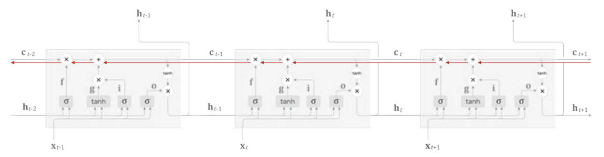

역전파 과정 그림을 보면 행렬의 아마다르곱과 덧셈만 있기 때문에 곱셈의 누적이 크게 이루어 지지 않는점,  
매 시각 다른 gate 값을 이용해 최종 출력값을 계산하는점  
기울기 소실과 연관성이 없어진다.  

### 개선점  

그림처럼 `LSTM` 계층을 2층 이상으로 쌓아 모델 생성  
일반적으로 2~4 정도일 때 좋을 결과를 얻음  

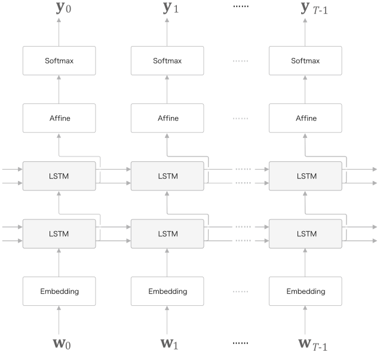

#### 드롭 아웃

`RNN` 은 일반적인 피드포워딩 신경망보다 쉽게 **과적합(Overfiting)** 을 일으킨다.  

과적합 해결을 위해 학습데이터 양을 늘리던가 아래 그림처럼 모델의 복잡도를 줄이는 **드롭아웃** 기법을 사용한다.  

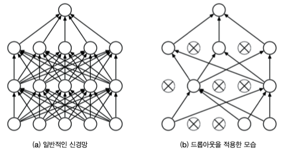

아래 그림처럼 드롭아웃 계층을 `RNN` 계층의 출력층의 깊이방향 혹은 시간방향에 추가할 수 있다.  

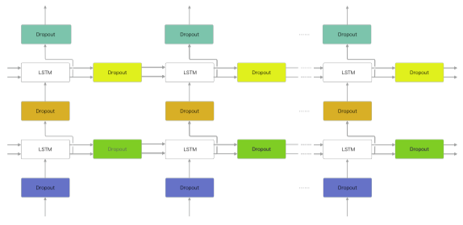

일반적으로 시간방향에 드롭아웃을 두는건 적합하지 않지만  
**변형 드롭아웃(Variational Dropout)** 의 경우 시간방향으로도 적용 가능하다.  

> 번형 드롭아웃: 데이터의 통과/차단을 결정하는 이진 형태의 무작위 패턴

#### 가중치 공유 (weight tying)

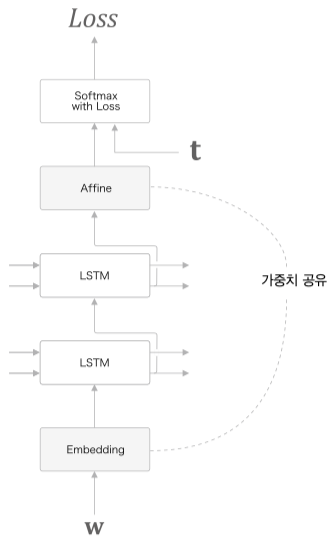

단순히 위 그림처럼 `Embedding` 계층의 가중치와 `Affine` 계층의 가중치를 공유하는 기법  

#### skip 연결

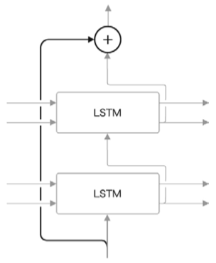

이미지 처리의 `ResNet` 에서 사용하는 기법이다.  

`LSTM` 계층을 여러개로 늘릴 때 사용하는 기법으로 skip connection 을 사용한다.
> `residual connection`, 혹은 `short cut` 이라고도 한다.  

**LSTM 게이트**가 기울기 소실을 대비하고  
**기울기 클리핑**으로 기울기 폭발을 대비한다고 했는데  
**skip 연결** 은 `RNN` 계열의 모델중 **깊이 방향에서 발생하는 기울기 소실 혹은 기울기 폭발을 방지**할 수 있다.  

### Bi-LSTM(양방향 LSTM)

문장을 `Encoder` 가 $\mathrm{hs}$ 로 만들 때, 좌측에서 우측으로 시각데이터가 흘러가기 때문에 우측의 단어들을 폭넓게 사용했다고는 할 수 없다.  

시계열 데이터 특성상 좌측의 데이터들의 Causality(인과관계) 가 우측에 영향을 끼치는 형태이기에 좌측부터 우측으로 흘러가지만  
Causality 가 뒤에있는 시계열 데이터도 있으며, 해당 데이터에 대해서는 `Bi-LSTM` 이 더 좋은 결과를 출력한다.  

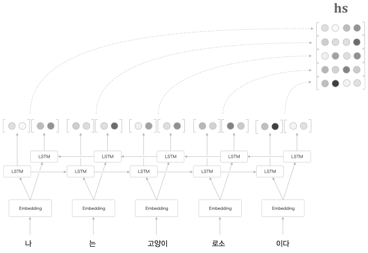

물론 `Bi-LSTM` 을 사용하려면 미래데이터에 대해 접근가능 해야한다.  


## RNN Language Model(RNNLM)  

`RNN` 을 이용하여 언어모델 `RNNLM` 을 구현해보자.  

좌측이 펼치기 전, 우측이 펼친 후이다.  

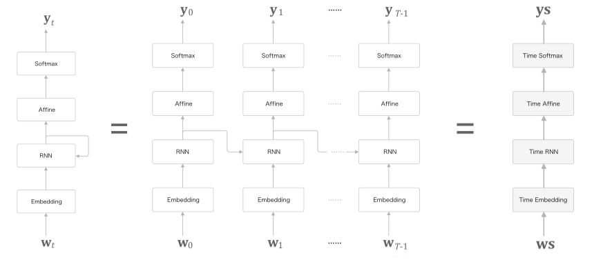

입력값은 단어의 index, 출력값 또한 단어 index 로 어떤 단어가 가장 연관성 있는지이다.  

```
you say goodbye and i say hello.
```

위 문장을 토대로 우리가 예층해야 할 결과로 아래 그림을 기대할 수 있다.  

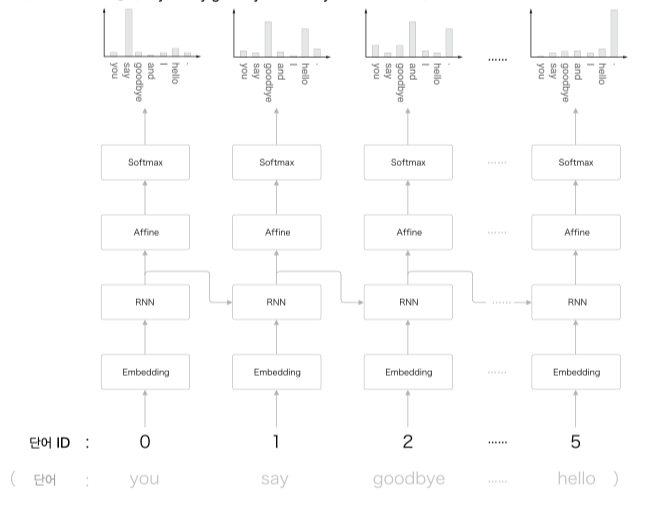

`say` 이후에 나올 단어를 이전 결과(context, $h_{prev}$) 를 토대로 `goodbye` 혹은 `hello` 로 예측할 수 있는 모델을 만드는 것.  

즉 `you say` 라는 맥락을 기억하는, 응집된 은닉벡터로 해당 데이터를 저장하고 있는 모델을 만드는 것이다.  

### Time Affine

가중치와 행렬곱 연산을 수행하는 `Affine` 계층의 경우 효율적인 계산을 위해 `numpy` 함수를 적극 활용하여 병렬로 계산한다.  

```py
class TimeAffine:
    def __init__(self, W, b):
        self.params = [W, b] # 가중치, 편향
        self.grads = [np.zeros_like(W), np.zeros_like(b)]
        self.x = None

    def forward(self, x):
        N, T, D = x.shape # 배치수, Time 수, 차원값
        W, b = self.params

        rx = x.reshape(N*T, -1)
        out = np.dot(rx, W) + b
        self.x = x
        return out.reshape(N, T, -1)
  
    def backward(self, dout):
        x = self.x
        N, T, D = x.shape
        W, b = self.params

        dout = dout.reshape(N*T, -1)
        rx = x.reshape(N*T, -1)

        db = np.sum(dout, axis=0)
        dW = np.dot(rx.T, dout)
        dx = np.dot(dout, W.T)
        dx = dx.reshape(*x.shape)

        self.grads[0][...] = dW
        self.grads[1][...] = db

        return dx
```

### Time Softmax


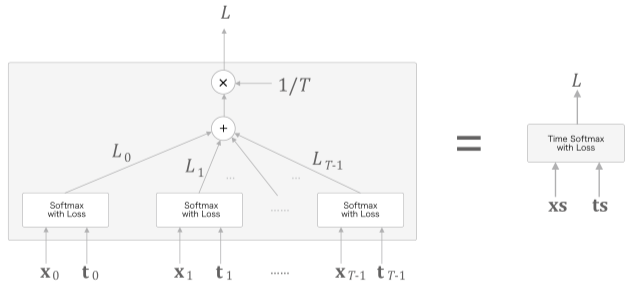

$\mathrm{x_n}$ 은 아래 `Affine`층에서 전달되는 점수, $\mathrm{t_n}$ 은 정답 레이블  
`Cross Entropy` 연산을 통해 `Loss` 값을 구하고 평균을 내어 `Time Softmax` 의 최종 손실로 구성한다.  

$$ L = \frac{1}{T} (L_0 + L_1 + ... + L_{T-1)}$$


```py
class TimeSoftmaxWithLoss:
    def __init__(self):
        self.params, self.grads = [], []
        self.cache = None
        self.ignore_label = -1

    def forward(self, xs, ts):
        N, T, V = xs.shape

        if ts.ndim == 3:  # 정답 레이블이 원핫 벡터인 경우
            ts = ts.argmax(axis=2)

        mask = (ts != self.ignore_label)

        # 배치용과 시계열용을 정리(reshape)
        xs = xs.reshape(N * T, V)
        ts = ts.reshape(N * T)
        mask = mask.reshape(N * T)

        ys = softmax(xs)
        ls = np.log(ys[np.arange(N * T), ts])
        ls *= mask  # ignore_label에 해당하는 데이터는 손실을 0으로 설정
        loss = -np.sum(ls)
        loss /= mask.sum()

        self.cache = (ts, ys, mask, (N, T, V))
        return loss

    def backward(self, dout=1):
        ts, ys, mask, (N, T, V) = self.cache

        dx = ys
        dx[np.arange(N * T), ts] -= 1
        dx *= dout
        dx /= mask.sum()
        dx *= mask[:, np.newaxis]  # ignore_label에 해당하는 데이터는 기울기를 0으로 설정

        dx = dx.reshape((N, T, V))

        return dx
```

### 구현 

지금까지 구현한 `TimeRNN`, `TimeAffine`, `TimeSoftmaxWithLoss` 을 기반으로 `RNNLM` 을 구현해본다.  

```py
class SimpleRnnlm:
    def __init__(self, vocab_size, wordvec_size, hidden_size):
        V, D, H = vocab_size, wordvec_size, hidden_size

        # 가중치 초기화
        embed_W = (np.random.randn(V, D) / 100).astype('f')
        # Xavier 초기값, 표준 편자가 1/sqrt(n)
        rnn_Wx = (np.random.randn(D, H) / np.sqrt(D)).astype('f')
        rnn_Wh = (np.random.randn(H, H) / np.sqrt(H)).astype('f')
        rnn_b = np.zeros(H).astype('f')
        affine_W = (np.random.randn(H, V) / np.sqrt(H)).astype('f')
        affine_b = np.zeros(V).astype('f')

        # 계층 생성
        self.layers = [
            TimeEmbedding(embed_W),
            TimeRNN(rnn_Wx, rnn_Wh, rnn_b, stateful=True),
            TimeAffine(affine_W, affine_b)
        ]
        self.loss_layer = TimeSoftmaxWithLoss()
        self.rnn_layer = self.layers[1]

        # 모든 가중치와 기울기를 리스트에 모은다.
        self.params, self.grads = [], []
        for layer in self.layers:
            self.params += layer.params
            self.grads += layer.grads

    def forward(self, xs, ts):
        for layer in self.layers:
            xs = layer.forward(xs)
        loss = self.loss_layer.forward(xs, ts)
        return loss

    def backward(self, dout=1):
        dout = self.loss_layer.backward(dout)
        for layer in reversed(self.layers):
            dout = layer.backward(dout)
        return dout

    def reset_state(self):
        self.rnn_layer.reset_state()
```

### 성능평가 - Perplexity(혼잡도)

`RNNLM` 은 주어진 단어로부터 다음에 출현할 단어의 확률분포를 출력한다.  
예측 성능 평가 척도로 `Perplexcity` 를 자주 이용하며 확률의 역수를 의미한다.  

예로 `i you` 다음에 `say` 가 나올 확률이 `0.8` 이라면 $\mathrm{perplexcity} = \frac{1}{0.8} = 1.25$ 로 계산할 수 있다.  
1에 가까울 수록, 작을 수록 좋은 성능 모델이라 할 수 있다.  

입력데이터가 1개가 아닌 $k$ 개라면 `Perplexcity` 식은 아래와 같다.    

$$
L = - \frac{1}{N}\sum_n\sum_k t_{nk}\log y_{nk}  \\ \ \\
\mathrm{perplexcity} = e^L
$$

$N$ 은 데이터의 총 개수, $k$ 는 차원수, $y_{nk}$ 는 `softmax` 의 출력값으로 확률분포를 나타낸다.  
$L$ 은 신경망의 `Cross Entropy(손실값)` 의 총합의 평균이다.  


## 문장 생성 예제

이전까지 RNN 과 LSTM 모듈을 통해 다음에 나올 단어 예측을 진행하였는데  
이번에는 문장생성을 목표로 한다.  

```
you say goodbye and i say hello.
```

위 말뭉치로 학습한 언어모델에 `I` 를 입력값으로 넣었을 때 `say` 단어가 높은 확률로 출력될것이다.  

이렇게 출력된 `say` 를 그다음 입력값으로 넣는다면 그다음에는 `hello` 가 출력될 확률이 높을 것인데  
이를 원하는 만큼 반복한다면 새로운 문장을 생성할 수 있을 것이다.  

```py
class RnnlmGen(Rnnlm):
    # start_id: 최초로 주는 단어의 ID
    # sample_size: 샘플링 단어 개수
    # skip_ids: 샘플링 하지 않을 단어 id list
    def generate(self, start_id, skip_ids=None, sample_size=100):
        word_ids = [start_id]

        x = start_id
        while len(word_ids) < sample_size:
            x = np.array(x).reshape(1, 1)
            score = self.predict(x)
            p = softmax(score.flatten())

            sampled = np.random.choice(len(p), size=1, p=p)
            if (skip_ids is None) or (sampled not in skip_ids):
                x = sampled
                word_ids.append(int(x))

        return word_ids

    def get_state(self):
        return self.lstm_layer.h, self.lstm_layer.c

    def set_state(self, state):
        self.lstm_layer.set_state(*state)

# main 코드 
corpus, word_to_id, id_to_word = ptb.load_data('train')
vocab_size = len(word_to_id)
corpus_size = len(corpus)

model = RnnlmGen()
model.load_params('../ch06/Rnnlm.pkl')

# start 문자와 skip 문자 설정
start_word = 'you'
start_id = word_to_id[start_word]
skip_words = ['N', '<unk>', '$']
skip_ids = [word_to_id[w] for w in skip_words]
# 문장 생성
word_ids = model.generate(start_id, skip_ids)
txt = ' '.join([id_to_word[i] for i in word_ids])
txt = txt.replace(' <eos>', '.\n')
print(txt)
```

```
you 've bought adds bottom.
later after mr. lawson 's european issue street here are details say to the second age of last july.
he says that.
but any time in august the somebody took out a case of listen to provide similar concessions to the health system.
for the past year ended increased march to place back at least and television company packages and tim malcolm d. calif. triggered an officer for investment management and mca inc.
and four audience said that exercising senior technology under the block over the next few months said
```

어색하지만 명사 형용사 동사 목적어의 순서가 어느정도 올바른 문장으로 출력되었다.  
