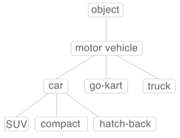
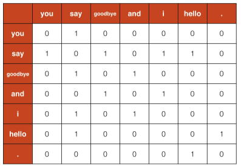
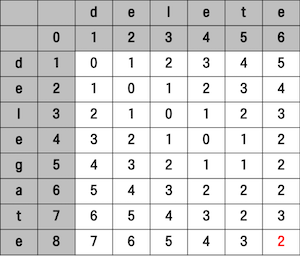
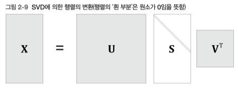
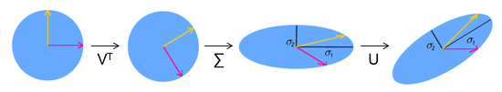
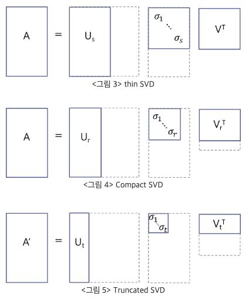

## 자연어 처리(Natural Language Processing)

말은 단어의 나열, 구성이다.  
즉 단어는 의미의 최소단위라 할 수 있다.  

프로그래밍 언어는 기계적이고 일련의 규칙이 있는 기계적인 측면에  
영어, 한국어와 같은 자연어는 규칙이 완화된 부드러운 언어라고 할 수 있다.  

컴퓨터에게 단어의 의미를 이해시키는 것이 자연어 처리의 첫 발이다.  

### 전처리

컴푸터에 바로 자연어를 입력시키지 않고 정제도니 데이터를 통해 자연어처리를 진행한다.  
아래와 같은 몇가지 단계를 거치게 한다.  

1. **tokenization**(토큰화)
2. **cleaning, stemming**(정제 및 추출)  
3. **encoding**(인코딩)  

`[토큰화, 정제 및 추출 과정]` 은 한번으로 끝나지 않고 계속 반복시킬 수 있다.  

학습데이터, 혹은 분석데이터로 입력받은 말뭉치를 바로 사용하지 않고  
항상 전처리 작업을 통해 정제된 데이터로 변환해야 한다.  


#### 토큰화(tokenization)  

영문장의 경우 `[공백, 계행, 컴마, 따옴표]` 등을 기준으로 토큰화해주면 된다.  
유명화 표준 토큰화 기준으로 `Treebank Tokenization` 가 있다.  

```py
from nltk.tokenize import TreebankWordTokenizer
s = "hi, my name can't hello,"
TreebankWordTokenizer().tokenize(s)
# ['hi', ',', 'my', 'name', 'ca', "n't", 'hello', ',']
```

#### 정제(cleaning)

아래와 같은 과정을 데이터를 없애는, 정제과정이라 할 수 있다.  

- 대소문자 구분 제거  
- 등장빈도가 적은 단어 제거(Removing Rare words)  
- 길이가 잛은 단어 제거(Removing words with a very short length)  
- 불용어 제거(Stopword)  

대세에 영향을 끼치지 않는, 자주 사용되지 않는 단어의 경우 정제(cleaning) 해야한다.  

길이가 짧은 단어의 경우 대부분 불용어에 해당한다.  
`[it, at, to, on, in, by]` 등  

불용어의 경우 아래와 같은 문맥에 큰 영향을 끼치지 않는 단어를 뜻한다.  
`[I, my, me, over, a, an, 관사, 조사, 접미사]` 등  

정제과정을 조건없이 처리할 경우 `US(unite state)` 를 `us(우리)` 로 인식되는 기현상이 발생할 수 있다.  

이런 이유로 정체 및 추출은 아직은 기계가 인식하긴 어려운 단계로 사람이 어느정도 rule 을 정해줄 필요가 있다.  

#### 추출(stemming)

추출은 여러방식이 있지만 가장 대표적인건 **어간(Stem)과 접사(Affic)를 분리 어간추출**이다.  

단어의 어간이라 할 수 있는 부분에서 [형용사, 명사]화 시키는 접사 부분을 지워버리는 과정이다.  

```
fomalize → formal
kindness → kind
electrical → electric
```

물론 해당 명사가 킬링워드일 경우는 어간추출을 하면 안되지만  
단순 스팸메일 구분이라던지 등의 작업에선 굳이 접사를 유지시킬 필요는 없다.  

어간추출을 위한 대표적인 알고리즘으로 **Porter Stemming 알고리즘** 이 있다.  

**표제어추출(Lemmatization)**

`Lemmatization` 은 **원형 복원** 이라는 뜻이기도 하다.  
**사전에 기반한** 단어의 표준화를 진행한다.  

```
is, are → be
playing → play
```

### 인코딩  

실제 컴퓨터가 단어의 뜻을 이해하진 않는다.  
인코딩 이라는 **단어를 숫자로 변경하는 과정**을 거쳐야한다.  

단어의 의미를 숫자로 파악할 수 있게 해주는 **인코딩 기법**은 대표적으로 아래 3가지가 있다.  

1. **시소러스기반** 기법  
2. **통계기반** 기법  
3. **추론기반** 기법  


## 시소러스(thesaurus)

시소러스는 단어를 의미에 따라 분류·배열한 일종의 **유의어(類義語) 사전, 단어 네트워크**이다.  



아래와 같이 단어 네트워크를 구성해두고 사용하면 된다.  

```
car = auth, automobile, machine, motocar
```


위처럼 유의어들간의 **그룹 관계**을 짖거나 단어간의 **상위/하위 관계**를 하나의 집합으로 만들면  
단어 사이의 연결을 정의, **단어 네트워크** 생성할 수 있다.  

단어 네트워크가 있으면 어느정도 컴퓨터에게 단어의 의미를 이해킬 수 있다.  
하지만 단어의 모음집을 **사람이 직접 구축**해야 하기 때문에 여러 단점이 있어 최근 딥러닝이 나온 시점부터는 잘 사용하지 않는다.  

1. 시대 변화에 대응하기 어렵다.  
2. 큰 인적 비용  
3. 단어간의 미묘한 차리 (부정 긍정 등)  

> WordNet: 프리스턴 대학교에서 1985 년부터 구축하기 시작한 전통 있는 시소러스, 지금까지도 많은 자연어 처리 분야에서 사용되고 있다.  

## 통계기반 기법

아래는 `text` 문자열을 통계기반 기법으로 표현하기 위해 인코딩 하는 과정이다.  

단순 단어 출현 순서에 의한 `index` 를 인코딩값으로 사용한다.  

아래 예제에산 예시를 위해 간단히 `단어-index map` 을 **corpus** 로 사용한다.  

```py
import numpy as np

text = 'You say goodbye and I say hello.'
text = text.lower()
text = text.replace('.', ' .')
print(text)
# 'you say goodbye and i say hello .'
words = text.split(' ')
print(words)
# ['you', 'say', 'goodbye', 'and', 'i', 'say', 'hello', '.']
word_to_id = {}
id_to_word = {}
for word in words:
    if word not in word_to_id:
        new_id = len(word_to_id)
        word_to_id[word] = new_id
        id_to_word[new_id] = word

print(id_to_word)
# {0: 'you', 1: 'say', 2: 'goodbye', 3: 'and', 4: 'i', 5: 'hello', 6:'.'}
print(word_to_id)
# {'you': 0, 'say': 1, 'goodbye': 2, 'and': 3, 'i': 4, 'hello': 5, '.': 6}

corpus = [word_to_id[w] for w in words]
corpus = np.array(corpus)
print(corpus)
# [0 1 2 3 4 1 5 6]
```

> **corpus(말뭉치)**: 자연어 처리 연구나 애플리케이션을 염두에 두고 수집된 텍스트 데이터  
단순 단어의 집합이 아닌 사람의 지식을 담겨져 있는 단어의 나열이다.  

통계 기반 기법에선 **corpus** 를 사용한다.  
구글 뉴스, 위키백과, 유명 소설 등을 말뭉치 데이터로 사용할 수 있다.  

> **PTB(Penn Treebank)** 데이터 셋  
벤치마크 측정시에 자주 사용되는 말뭉치 데이터 셋, 토마스 미콜로프의 웹페이지에서 다운 가능하다  
> <https://raw.githubusercontent.com/tomsercu/lstm/master/data/ptb.train.txt>  
> <https://raw.githubusercontent.com/tomsercu/lstm/master/data/ptb.test.txt>  
> <https://raw.githubusercontent.com/tomsercu/lstm/master/data/ptb.valid.txt>  

### TF-IDF

> Term Frequency - Inverse Document Frequence

단어가 얼마나 중요한지를 수치적으로 나타낸 가중치값이다.  


$$ TF-IDF =  tf(d,t) \times idf(d,t) $$

$$ idf(d, t) = \log\frac{N}{df(t)} $$

$tf(d,t)$: 특정 문서 $d$ 에서 특정단어 $t$ 의 등장횟수  
$df(t)$: 특정 단어 $t$ 가 등장한 문서개수  
$N$: 총 문서개수  

### Markov Chain

이미 $n-1$ 개의 단어가 주어진 상황에서 다음에 등장할 단어의 확률을 아래 수식처럼 표현할 수 있다.  

$$
P(w_n | w_1, w_2, \cdots, w_{n-1}) = \frac{P(w_1, \cdots, w_n)}{P(w_1, \cdots, w_{n-1})}
$$

$w_1 \rarr w_n$ 까지 모두 일치할 확률의 표본을 구하는것은 거의 0 에 수렴한다.  
`sparsity problem`(장기의존성 문제, 희소성 문제) 이라 부른다.  

또한 $w_1$ 이 $w_3, w_4$ 가 출력되는데 영향을 끼칠 수 도 있기 때문에 단편적으로만 확률을 구해선 안된다.  

`sparsity problem`을 해결하기위해 `n-gram` 문제를 사용할 수 있다.  
만약 `n-gram` 값을 2로 설정하면 아래 확률값을 구하기만 하면 된다.  

$$p(w_n | w_{n-2}, w_{n-1})$$

물론 `n-gram` 값이 작을수록 정확성을 떨어지는 모델이 된다.  

> 한글의 경우 단어순서가 달라도 상관없기 때문에 Markov chain 모델은 한글에서 사용하긴 힘들다.  

### 분산 표현, 분포 가설  

모든 색들은 하나의 벡터값(RGB) 으로 표현할 수 있다.  

단어또한 백터로 표현할 수 있는데 이를 **분산 표현(distributional representation)** 이라 한다.  

단어를 벡터로 표현하기 위한 가장 중요한 아이디어는 **단어의 의미가 주변 단어에 의해 형성된다는 것**  
이를 **분포 가설(distributional hypothesis)** 이라 한다.  

단어를 벡터로 표현하는 대부분의 연구가 **분포 가설**에 기초한다.  

즉 단어 자체에는 의미가 없고, 그 단어가 사용 된 **context(맥락)** 가 의미를 형성한다는 것  

예로 `I drink beer` `I guzzle beer` 두 문장에서 `drink, guzzle` 단어 앞에는 `I`, 뒤에는 `beer`가 출력된것으로 보아  
`[drink, guzlle]` 두 단어가 매우 가까운 의미인 것을 알 수 있다.  

즉 **주변의 다른 단어(context)** 가 단어에 대한 백터를 구하는 키값으로 사용될 수 있다.  
**context** 는 좌우의 각 N개 단어를 뜻하며 단어마다 맥락의 크기는 다를 수 있고 이 크기를 `window size` 라 한다.  

예를 들어보자.  

```
you say goodbye and i say hello.
```

위 문장에서 `window size` 를 1로 설정했을 때 각 단어의 맥락에 포함되는 빈도수를 차트로 표시하면 아래와 같다.  



코드로 표현하면 아래와 같다.  

```py
def create_co_matrix(corpus, vocab_size, window_size=1):
    '''동시발생 행렬 생성

    :param corpus: 말뭉치(단어 ID 목록)
    :param vocab_size: 어휘 수
    :param window_size: 윈도우 크기(윈도우 크기가 1이면 타깃 단어 좌우 한 단어씩이 맥락에 포함)
    :return: context 행렬
    '''
    corpus_size = len(corpus)
    co_matrix = np.zeros((vocab_size, vocab_size), dtype=np.int32)

    for idx, word_id in enumerate(corpus):
        for i in range(1, window_size + 1):
            left_idx = idx - i
            right_idx = idx + i

            if left_idx >= 0:
                left_word_id = corpus[left_idx]
                co_matrix[word_id, left_word_id] += 1

            if right_idx < corpus_size:
                right_word_id = corpus[right_idx]
                co_matrix[word_id, right_word_id] += 1

    return co_matrix
```


```py
text = "you say goodbye and i say hello."
corpus, word_to_id, id_to_word = preprocess(text)
vacap_size = len(word_to_id)
C = create_co_matrix(corpus, vacap_size)
print(C)
# [[0 1 0 0 0 0 0]
#  [1 0 1 0 1 1 0]
#  [0 1 0 1 0 0 0]
#  [0 0 1 0 1 0 0]
#  [0 1 0 1 0 0 0]
#  [0 1 0 0 0 0 1]
#  [0 0 0 0 0 1 0]]
```

출력된 `Corpus matrix` 가 각 단어의 백터 로 사용되게 된다.  

### 단어간 유사도  

백터간의 유사도는 **내적**이나 **유클리드 거리**를 사용해도 되지만  
단어벡터의 유사도는 대표적으로 **코사인 유사도(cosine similarity)** 를 사용한다.  

#### cosine similarity

$$
\mathrm{similarity}(x, y) 
 = \frac{x \cdot y}{||x|| \cdot ||y||} 
 = \frac{x_1y_1 + ... + x_ny_n}{\sqrt{x_1^2+...+x_n^2} \sqrt{y_1^2+...+y_n^2}}
$$

즉 자신과 비슷한 형태의 단어 배열을 가지고 있는 단어에게 높은 `similarity` 값이 출력되게 된다.  
코사인 유사도는 `-1 ~ 1` 사이의 값으로 출력된다.  

코드로 구현하면 아래와 같다  

```py
def cos_similarity(x, y, eps=1e-8):
    nx = x / (np.sqrt(np.sum(x ** 2)) + eps)
    ny = y / (np.sqrt(np.sum(y ** 2)) + eps)
    return np.dot(nx, ny)
```

모든 값이 `0` 일경우 `divide by zero` 에러가 발생함으로 작은 실수값 `1e-8 (0.00000001)` 을 분모에 더해준다.  

`you` 단어를 선택해서 다른 단어들에 대해 유사도를 검색해보자.  

```py
def most_similar(query, word_to_id, id_to_word, word_matrix, top=5):
    if query not in word_to_id:
        print('%s(을)를 찾을 수 없습니다.' % query)
        return

    print('\n[query] ' + query)
    query_id = word_to_id[query]
    query_vec = word_matrix[query_id]

    # 코사인 유사도 계산
    vocab_size = len(id_to_word)

    similarity = np.zeros(vocab_size)
    for i in range(vocab_size):
        similarity[i] = cos_similarity(word_matrix[i], query_vec)

    # 코사인 유사도를 기준으로 내림차순으로 출력
    count = 0
    for i in (-1 * similarity).argsort():
        if id_to_word[i] == query:
            continue
        print(' %s: %s' % (id_to_word[i], similarity[i]))

        count += 1
        if count >= top:
            return

most_similar('you', word_to_id, id_to_word, C, top=5)
# [query] you
#  goodbye: 0.7071067691154799
#  i: 0.7071067691154799
#  hello: 0.7071067691154799
#  say: 0.0
#  and: 0.0
```

이전에 구했던 단어백터 와 단어 인덱스를 전달하면 위와 같이 출력된다.  

> `i` 의 유사도가 높게 출력되는 것은 이해 되지만 `goodbye`, `hello` 의 유사도가 상당히 높게 나왔는데,  
> 이는 말뭉치가 너무 작기 때문이다.  

#### Levenshtein Distance  

**편집 거리(Edit Distance)** 라고도 불리는 알고리즘  

특정 단어에서 몇번 **삽입(Insertion), 삭제(Deletion), 대체(Replacement)** 해야 목표 단어로 변화되는지 구하는 방법이다.  

이 연산과정에서 **몇번** 을 `Levenshtein Distance` 라 하며 작을수록 두 단어가 비슷하다 할 수 있다.  

- 동일: 대각선 수  
- 변경: 대각선 수 + 1  
- 삽입: 상단수 + 1  
- 삭제: 좌측수 + 1  

아래 그림은 `[delete, delegate]` 두 단어의 편집거리를 구하는 그림  



#### Jaccard Distance

단어 A, B 를 문자배열로 만들어  
아래 식을 사용해 각 단어 리스트의 집한 연산을 통해 거리를 구할 수 있다.  

$$
J(A,B) = \frac{|A \cap B|}{|A \cup B|}
$$

### PMI (Pointwise Mutual Information: 점별 상호 정보량)

위에서 **분포 가설**에 의해 구한 **단어 백터**는 단어의 **동시발생 벡터** 이라 할 수 있고 두 단어의 연관성을 뜻하게 된다.  

예로 `the car` 처럼 자주 출현되는 `[the, car]` 고빈도 두 단어는 크게 연관은 없지만  
위와 같은 방식으로만 유사성을 구할경우 강한 관련성을 가지게 된다.  

> `car` 는 `drive` 와 같은 단어와 더 높은 관련성을 가져야 겠지만  
> 단순 빈도수로 인해 `the` 가 더 높은 관련성을 가는다는 것.  

이런 이유로 단순 **동시발생 백터**를 사용하지 않고 **PMI** 라는 단어 벡터를 사용한다.  

두 단어 $x, y$ 의 `PMI` 를 구하는 새로운 방법은 아래와 같다.  

$$
\mathrm{PMI}(x,y) = \log_2\frac{P(x,y)}{P(x)P(y)}
$$

전체 단어량에서 등장하는 단어의 빈도수를 분모에 넣어 해당 단어의 중요도를 하락시킨다.  

추가로 두 단어의 동시 발생횟수가 `0` 일 경우 $P(x,y) = 0$ 이 될경우  
$\log_2 0 = -\infin$ 임으로 `PMI` 지수를 0 으로 치환한다.  

$$
\mathrm{PPMI}(x,y) = \max(0, \mathrm{PMI}(x, y))
$$

> `Positive PMI` 라 함

코드로 각 단어벡터에 `PPMI` 연산 방법을 정의  

```py
def ppmi(C, verbose=False, eps = 1e-8):
    '''PPMI(점별 상호정보량) 생성

    :param C: 동시발생 행렬
    :param verbose: 진행 상황을 출력할지 여부
    :return:
    '''
    M = np.zeros_like(C, dtype=np.float32)
    N = np.sum(C)
    S = np.sum(C, axis=0)
    total = C.shape[0] * C.shape[1]
    cnt = 0

    for i in range(C.shape[0]):
        for j in range(C.shape[1]):
            pmi = np.log2(C[i, j] * N / (S[j]*S[i]) + eps)
            M[i, j] = max(0, pmi)

            if verbose:
                cnt += 1
                if cnt % (total//100 + 1) == 0:
                    print('%.1f%% 완료' % (100*cnt/total))
    return M

C = create_co_matrix(corpus, vacap_size)
PPMI = ppmi(C)
print(C)
# [[0 1 0 0 0 0 0]
#  [1 0 1 0 1 1 0]
#  [0 1 0 1 0 0 0]
#  [0 0 1 0 1 0 0]
#  [0 1 0 1 0 0 0]
#  [0 1 0 0 0 0 1]
#  [0 0 0 0 0 1 0]]
print(PPMI)
# [[0.        1.8073549 0.        0.        0.        0.        0.       ]
#  [1.8073549 0.        0.8073549 0.        0.8073549 0.8073549 0.       ]
#  [0.        0.8073549 0.        1.8073549 0.        0.        0.       ]
#  [0.        0.        1.8073549 0.        1.8073549 0.        0.       ]
#  [0.        0.8073549 0.        1.8073549 0.        0.        0.       ]
#  [0.        0.8073549 0.        0.        0.        0.        2.807355 ]
#  [0.        0.        0.        0.        0.        2.807355  0.       ]]
```

기존의 단어간의 `동시발생 단어 벡터` 와 `PPMI 단어 벡터`를 비교

하지만 이런식의 단어벡터 연산은 큰 문제가 있는데  
단어의 수가 늘어날 수록 벡터의 차원수가 늘어난다는 것.  

> 단순 7 단어 문장에 사용된 행렬 요소개수를 확인해보면 $7^2$ 로 늘어남을 알 수 있음


### SVD(Sigular Value Decomposition: 특이값 분해)  

말뭉치 안에 단어 중복되지 않은 단어 10000개가 존재할 경우 벡터의 개수가 10000 개가 되고 이를 연산하는 것은 현실적이지 못하다.  
이때문에 벡터의 차원수를 감소시키는 차원감소 기법중 하나인 `특이값 분해(SVD: Sigular Value Decomposition)` 를 사용한다.  

> <https://angeloyeo.github.io/2019/08/01/SVD.html>
> <https://darkpgmr.tistory.com/106>


임의의 행렬 $X$ 에 대하여 아래 수식과 같이 3가지 행렬 $U, S, V$ 의 곱으로 분해한다는 뜻.  


$$
X = USV^T \\
A = U \Sigma V^T
$$

> 문서에 따라 일부 기호를 다르게 표현한다.



$X$: $m \times n$ 임의의 행렬  
$U$: $m \times m$ 직교행렬  
$S$: $m \times n$ 대각행렬  
$V$: $n \times n$ 직교행렬  

기하학적으로 아래와 같다.  


다시말해 행렬 $X$ 는 $V^T$ 로 회전, $S(\Sigma)$ 으로 스케일 변환, $U$ 로 다시 회전하는 선형변환을 위한 행렬 이다.

> 직교행렬 (Orthogonal Matrix)
> <https://www.youtube.com/watch?v=lICAZ9Vqlq4>
아래 조건을 만족하는 행렬.  
$A A^T = A^T A = I $ 
선형대수학에서 직교행렬(Orthogonal Matrix)은 행벡터와 열벡터가 유클리드 공간의 정규 직교 기저를 이루는 실수 행렬이다.

$S(\Sigma)$ 는 $m$ 과 $n$ 크기에 따라 아래와 같이 구성될 수 있다.  

$$
\begin{pmatrix}
\sigma_1 & 0 & \cdots & 0  \\\\
0 & \sigma_2 & \cdots & 0  \\\\
{} & {}& \ddots & {}  \\\\
0 & 0 & \cdots & \ \sigma_n \\\\
0 & 0 & \cdots & \ 0 \\\\
\vdots & \vdots & \vdots & \vdots \\\\
0 & 0 & \cdots &  0
\end{pmatrix}  
\begin{pmatrix}
\sigma_1 & 0 & \cdots & 0 &0 & \cdots & 0 \\\\
0 & \sigma_2 & \cdots & 0 & 0 & \cdots & 0\\\\
{} & {}& \ddots & {}  & {} & {} & {}\\\\
0 & 0 & \cdots & \ \sigma_m & 0 & \cdots & 0
\end{pmatrix}
$$

이제 SVD 가 어떻게 차원축소를 하는지 알아보자.  

예를들어 직교 하는 두 벡터 $\vec{x},\vec{y}$ 의 백터집합을 행렬 $V$ 로 표현하고 
해당 벡터 집합을 행렬 $X$ 로 선형변환 했을때 백터 $\vec{A_x}, \vec{A_y}$ 가 출력된다고 해보자.  


$$
XV = \begin{bmatrix}
\vec{A_x}, \vec{A_y}
\end{bmatrix}
$$

백터 $\vec{x},\vec{y}$ 와 변환된 백터 $\vec{A_x}, \vec{A_y}$ 의 크기는 다를것이고 그 차이룰 `scaling factor` 혹은 `singular value(특이값)` 이라 부른다.  

특이값의 크기를 $\sigma_n$ 로 나타내며 행렬 $S(\Sigma)$ 표기하고 
그리고 $\vec{A_x}, \vec{A_y}$ 를 크기 1로 정규화하여 백터 $\vec{u_x}, \vec{u_y}$ 로 표현하고 백터들의 집합을 행렬 $U$ 로 나타내었을 때  
선형변환의 관점으로 아래처럼 구성할 수 있다.  

$$
XV = US
$$

직교행렬의 특성을 사용하여 아래처럼 식을 정리 할 수 있다.  


$$
XVV^T = USV^T \\
X = USV^T \\
X = \sigma_1 \vec u_1 \vec v_1^T + \sigma_2 \vec u_2 \vec v_2^T +\cdots+ \sigma_m \vec u_m \vec v_m^T \ (m < n)
$$

차원의 수를 줄이려면 아래 그림처럼 특이값 행렬의 크기를 조절하면 된다.


행렬 $X$ (그림에선 $A$) 를 일반적인 이미지로 구성하고 
특이값 행렬의 크기를 줄여서 입력되는 이미지를 확인하면 아래와 같이 변화된다.  


`SVD` 는 비단 이미지 행렬에서만 사용되는 것이 아니라  
단어벡터나 행렬로 표현할 수 있는 데이터에 적용 가능하다.  
