## 추론기반 기법

위에서도 말했듯이 통계기반 기법은 단어의 개수가 많을수록 거대한 단어 백터 행렬을 만들게 된다.  

때문에 최근에는 더 많은 데이터를 학습데이터로 삼아 학습할 수 있도록 신경망을 사용한 **추론 기반 기법** 을 사용한다.  

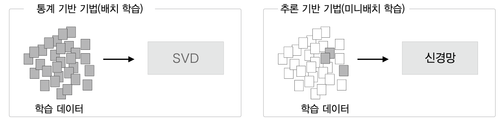

### 원핫 벡터

> 원핫 벡터를 원핫 표현이라고도 함

원핫 벡터는 단순히 단어 인덱스 위치의 원소를 1, 나머지는 0 으로 설정하는 방식이다.  

```
You say goodbye and I say hello
```

위 문장의 단어중 `You`, `goodbye` 를 `원핫백터` 로 표시하면 아래 그림과 같다.  

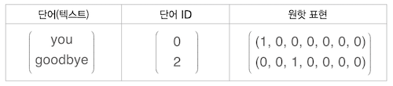

어쨋든 단어를 백터로 바꿨고 이를 단어의 `word2vec` 라 할 수 있다.  

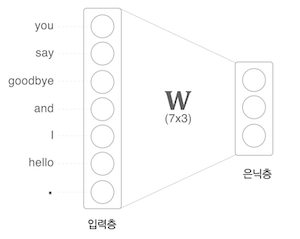

코드로 구현하면 아래와 같다.  

```py
import numpy as np
c = np.array([[1, 0, 0, 0, 0, 0, 0]]) # 입력

W = np.random.randn(7, 3) # 가중치
h = np.matmul(c, W) # 은닉층의 중간노드
print (h) 
# [[-0.70012195 0.25204755 -0.79774592]]
```

원핫 벡터의 문제는 여러가지다.  

- 단어 개수가 많아질 수 록 **메모리 문제**가 발생  
- 벡터값중 0 이 압도적으로 많기 때문에 **희소표현(Sparse Representation) 문제**가 발생  

또한 원핫벡터는 단순 위치정보이다 보니 단어의 유사도를 보존하지 않는다.  

## Word2Vec

이런 문제가 있다보니 웟핫 벡터 말고 단어를 벡터로 표현하는 다른 방법을 찾아야 했다.  
원핫 벡터의 문제점을 해결하기 위해 아래와 같은 조건을 만족해야 한다.  

- 밀집표현(Dense Representation) 을 사용하는 방식  
- 메모리 문제 해결을 위한 벡터차원 고정  

> **밀집표현**: 벡터 대부분 0대신 실수값으로 구성됨, 희소표현(Sparse Representation) 의 반의어  
> **워드 임베딩(word embedding)**: 단어 간 의미적 유사성을 벡터화하는 작업  
> **임베팅 벡터(embedding vector)**: 밀집표현으로 구성된 벡터를 뜻함  

원핫벡터의 경우 대부분이 0이고 일부만 1인 희소표현이다.  

단어 벡터 간 유의미한 유사도를 반영할 수 있도록 단어의 의미를 수치화 할 수 있는 방법이 필요한데  
이런 문제점을 해결한 것이 `Word2Vec` 방식이다.  

모든 단어에 카테고리를 지정해 학습실킬 순 없으니 문장 단위로 **각 단어들과의 관계를 기반으로 학습하는 것이 대부분**이다.  
그럼 사용되는 각 단어의 정보를 일정된 크기의 숫자(벡터)로 표기할 수 있다.  

기본이 되는 대표적인 방법은 아래 2가지  

- `CBOW` 모델은 **주변 단어**를 활용해 중간에 있는 단어를 예측한다.
- `Skip-Gram` 모델은 **현재 단어**를 활용해 주변에 있는 단어를 예측한다.  

### CBOW (continuous bag-of-words)

`CBOW` 모델은 **입력된 단어의 주변단어**(context) 를 사용하여 가장 연관성을 가지는 단어를 추측하는 용도의 신경망으로 직역하면 `지속 단어장` 이라 할 수 있다.  

예를 들어 아래 문장 중 `say` 를 중간값, 참고할 주변단어 개수 `N=1` 로 설정하여,  
양옆의 `you`, `goodbye` 를 주변단어로 학습데이터를 구축할 경우 아래 그림과 같다.  

```
You say goodbye and I say hello
```

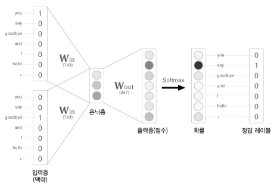

그림의 경우 2개 단어에 대한 단어백터를 $W_{in}, W_{out}, \mathrm{Softmax}$ 함수를 거쳐 가장 연관있는 단어를 추론하게 된다.  

> 여기선 예제표현을 위해 원핫 백터를 사용했지만 다른 정수인코딩을 통해 출력된 단어 백터를 사용하는 것이 정석  

만약 주변단어를 더 많이 설정하고 싶어 W$_{in}$ 에서 출력되는 단어의 값을 $h1, h2$ 라 표현 하면  
은닉층이 입력받는 값은 두 값의 평균이다. $\frac{1}{2}(h_1 + h_2)$  

출력층은 $W_{out}$ (3x7) 행렬곱으로 출력된 7 차원 백터로 각 단어의 **점수** 를 뜻하며 단어간의 연관성을 표현하는 백터로 사용한다.  

최종적으로 `you` 와 `goodbye` 단어 2개를 넣고 가장 연관성 있는 단어가 `say` 로 추론되어야 한다는 의미이다.  

아래는 `say` 를 중간값, 주변단어개수 `N=2` 로 설정했을 때 간략화한 그림이다.  

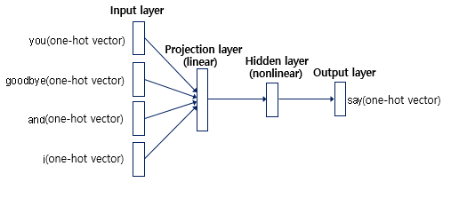

어쨋든 우리의 목표는 단어들을 `Word Embedding vector(Word2Vec)` 로 만드는 것  

여기서 은닉층에 해당하는 layer 를 `projection layer` 라 하는데(첫 그림의 경우 3x1)  
`projection layer` 를 `say` 란 중심단어의 대한 밀집표현 백터라 할 수 있다.  

**학습이 완료되었을 때 이 `Projection layer` 의 벡터값을 `Word Embedding vector` 라 할 수 있겠다.**  

처음 학습에는 원핫 벡터를 학습값, 예측값으로 사용했지만  
다음부턴 학습된 `Projection layer` 로 사용 가능하다.  

#### CBOW 학습  

말뭉치에 대한 학습 데이터는 아래 사진처럼 구성한다(2개의 단어에 대한 원핫백터를 넣은이유)  
양옆의 단어(context)를 입력값으로 선택하고 타깃 단어가 출력될 수 있는 모델을 생성하는것이 목표이다.  

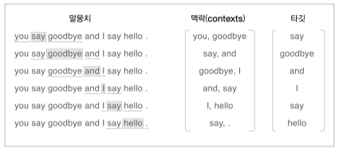

위 그림을 보면 `you`, `goodbye` 두 단어와 가장 연관선 있는 단어는 `say` 이다.  

정답 레이블 또한 `say` 의 원핫 벡터로 지정한 후 학습을 진행한다.  
학습은 일반적인 `Cross Entropy Error` 계층을 사용하여 완전결합 계층의 가중치인 $W_{in}, W_{out}$ 들을 조절한다.  

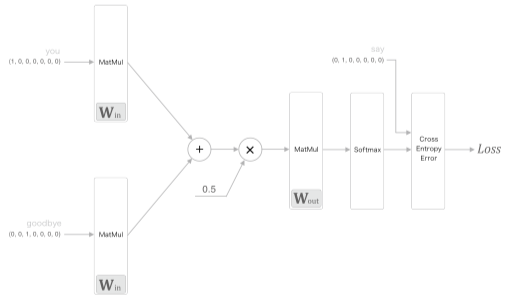


> 일반적인 딥러닝학습에서는 모든 가중치를 학습대상에 포함되지만 대부분 연구에서 입력 가중치 $W_{in}$ 만을 사용한다.  

```py
# coding: utf-8
import sys
sys.path.append('..')
import numpy as np
from common.layers import MatMul, SoftmaxWithLoss


class SimpleCBOW:
    def __init__(self, vocab_size, hidden_size):
        V, H = vocab_size, hidden_size

        # 가중치 초기화
        W_in = 0.01 * np.random.randn(V, H).astype('f')
        W_out = 0.01 * np.random.randn(H, V).astype('f')

        # 계층 생성
        self.in_layer0 = MatMul(W_in)
        self.in_layer1 = MatMul(W_in)
        self.out_layer = MatMul(W_out)
        self.loss_layer = SoftmaxWithLoss()

        # 모든 가중치와 기울기를 리스트에 모은다.
        layers = [self.in_layer0, self.in_layer1, self.out_layer]
        self.params, self.grads = [], []
        for layer in layers:
            self.params += layer.params
            self.grads += layer.grads

        # 인스턴스 변수에 단어의 분산 표현을 저장한다.
        self.word_vecs = W_in

    def forward(self, contexts, target):
        h0 = self.in_layer0.forward(contexts[:, 0])
        h1 = self.in_layer1.forward(contexts[:, 1])
        h = (h0 + h1) * 0.5
        score = self.out_layer.forward(h)
        loss = self.loss_layer.forward(score, target)
        return loss

    def backward(self, dout=1):
        ds = self.loss_layer.backward(dout)
        da = self.out_layer.backward(ds)
        da *= 0.5
        self.in_layer1.backward(da)
        self.in_layer0.backward(da)
        return None

class SoftmaxWithLoss:
    def __init__(self):
        self.params, self.grads = [], []
        self.y = None  # softmax의 출력
        self.t = None  # 정답 레이블

    def forward(self, x, t):
        self.t = t
        self.y = softmax(x)

        # 정답 레이블이 원핫 벡터일 경우 정답의 인덱스로 변환
        if self.t.size == self.y.size:
            self.t = self.t.argmax(axis=1)

        loss = cross_entropy_error(self.y, self.t)
        return loss

    def backward(self, dout=1):
        batch_size = self.t.shape[0]

        dx = self.y.copy()
        dx[np.arange(batch_size), self.t] -= 1
        dx *= dout
        dx = dx / batch_size

        return dx 
```

목표는 가장 손실값이 적은 $W_{in}$ 행렬을 구하는 것  
역전파를 그림으로 표현하면 아래와 같다.  

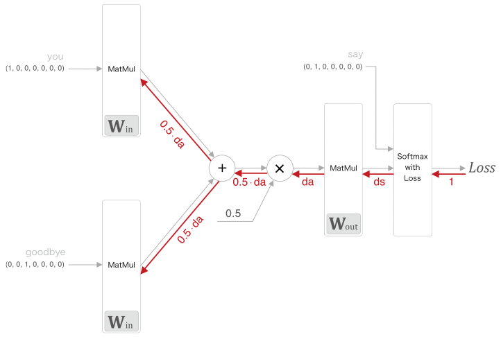

```py
# coding: utf-8
import sys
sys.path.append('..')  # 부모 디렉터리의 파일을 가져올 수 있도록 설정
from common.trainer import Trainer
from common.optimizer import Adam
from simple_cbow import SimpleCBOW
from common.util import preprocess, create_contexts_target, convert_one_hot


window_size = 1
hidden_size = 5
batch_size = 3
max_epoch = 1000

text = 'You say goodbye and I say hello.'
corpus, word_to_id, id_to_word = preprocess(text)

vocab_size = len(word_to_id)
contexts, target = create_contexts_target(corpus, window_size)
target = convert_one_hot(target, vocab_size)
contexts = convert_one_hot(contexts, vocab_size)

model = SimpleCBOW(vocab_size, hidden_size)
optimizer = Adam()
trainer = Trainer(model, optimizer)

trainer.fit(contexts, target, max_epoch, batch_size)
trainer.plot()

word_vecs = model.word_vecs # (5x7) 행렬 반환 W_in
# 행렬의 각 행 벡터가 단어의 word2vec 값
for word_id, word in id_to_word.items():
    print(word, word_vecs[word_id])
```

실제로 학습을 돌리면 아래와 같은 $W_{in}$ 이 나오고 각 단어의 인덱스를 기반으로 열벡터를 출력하였다.  

```
you [-1.1749326  1.2120602 -1.1711328 -1.1683513 -1.1166059]
say [ 1.2309499 -0.367042   1.238516   1.221913   1.1602981]
goodbye [-0.6956941   0.8612482  -0.721387   -0.7143741  -0.81281894]
and [ 0.91304606 -1.9012996   0.89655274  0.9373583   1.0937577 ]
i [-0.6829765  0.8541114 -0.7034645 -0.7197526 -0.8117175]
hello [-1.161014   1.2259955 -1.1638184 -1.1606017 -1.1285164]
. [1.182878   1.8289633  1.2051629  1.1582808  0.88485396]
```

#### CBOW 손실함수

`Softmax` 계층에서 `Cross Entropy Error` 를 이용해 `loss` 값을 계산하여 역전파 과정을 통해 $W_{in}$ 에서 단어의 `word2vec` 를 추출하는데  

이는 사실 확률표기법을 코드로 모델화 한것일 뿐이다, 통계표기법으로 `CBOW` 의 손실함수를 수식화 하여 정의해보자.  

$$ w_1, w_2, \cdots, w_{t-1}, w_t, w_{t+1}, \cdots, w_n $$

말뭉치를 단어 시퀀스 $w_n$ 으로 표기하고 위와 같이 형성되어 있을 떄  

$w_t$ 가 출현될 확률은 $P(w_t | w_{t−1} ,w_{t+1})$ 이라 할 수 있다. $w_{t−1} ,w_{t+1}$ 이 주어졌을 때 $w_t$ 가 일어난 확률을 뜻한다.  

전체 말뭉치에 대해 음의 로그가능도를 사용하여 손실함수로 사용한다.  

$$
L = - \frac{1}{T}\sum^T_{t=1} \log P(w_t | w_{t−1} ,w_{t+1})
$$

통계표기법으로 보면 `CBOW` 학습의 목표는 위 손실함수값을 가능한 작게 만드는 것.  

### SkipGram

`SkipGram` 는 `CBOW` 에서 다루는 context 와 타깃을 역전시킨 모델이다.  


한 단어로 부터 주변 단어(맥락)을 유추해 낸다.  

모델의 형식은 아래와 같다.  

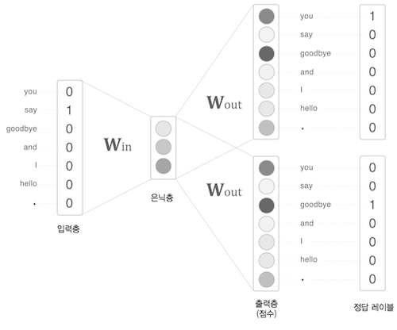

$w_t$ 로부터 맥락 $w_{t-1}, w_{t+1}$ 이 출현될 확률은 $P(w_{t−1} ,w_{t+1} | w_t)$ 이며  
이를 모델링한 방식이 `SkipGram` 모델이다. 

맥락의 단어들 사이에 관련성이 없다고 가정(조건부 독립) 했을때 아래와 같이 변형 가능하다.  

$$
P(w_{t−1} ,w_{t+1} | w_t) = P(w_{t−1}| w_t) + P(w_{t+1}| w_t)
$$

`CBOW` 와 같이 전체 말뭉치에 대해 음의 로그가능도를 사용해서 손실함수로 사용한다.  

$$ 
L = - \frac{1}{T}\sum^T_{t=1} [\log P(w_{t−1}| w_t) + \log P(w_{t+1}| w_t)]
$$

단어분산표현 정밀도면에서 `SkipGram` 모델이 `CBOW` 보다 더 우수하지만 학습 속도는 느리다.  

### NNLM(Neural Net Lagnage model)

`CBOW`, `SkipGram` 모두 주변단어를 입력값으로 뉴럴넷에 접목시켰듯이
예측할 앞단어 `n-gram` 개수의 단어를 입력값으로 사용하여 뉴럴넷 구현한 방식이 NNLM  

`n-gram` 문제를 뉴럴넷에 접목시킨것이 `NNLM` 모델이다.  

`NNLM` 은 `n-gram` 개수의 과거 정보만을 참조함으로 앞으로 나올 내용을 파악할 수 없음으로,  
단어의 함축(long-term)적인 값을 파악할 수 없다.  

### SGNS(Skipgram with Nagative Sampling)

기존 `Word2Vec` 을 위한 모델들은 출력값이 단어이고 벡터 값을 입력데이터, 출력데이터로 사용하다 보니 희소표현의 문제, 높은 연산량 처리문제가 있다.  
위에서 설명한 `SkipGram` 모델 학습 효율역시 마찬가지로 좋지 않다.  

여기에 `Nagative Sampling` 개념을 넣으면 학습효율을 높힐 수 있다.  

`SGNS` 모델은 `Word2Vec` 학습 과정에서 관련이 높은 단어들에 집중하는 것이다.  

예를들어 `for`, `hard` 두개의 주변관계인 단어를 입력값으로 넣으면 `0 ~ 1` 사이의 값이 출력되도록 하는 모델이다.  

즉 두 단어를 입력하면 **두 단어가 중심관계 혹은 주변관계인지 파악하는 모델**이 `SGNS` 이다.  
출력층의 개수가 1인 **이진분류** 문제이기 때문에 기존 `Word2Vec` 모델보단 학습 연산량이 적다.  


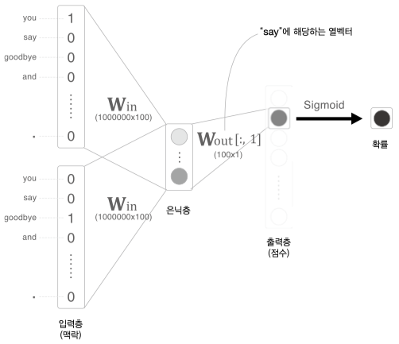

> 당연히 1에 가까우면 두 단어의 관계가 높다고 할 수 있다.  

아래와 같이 `[관계있는 단어, 관계없는 단어]` 조합을 말뭉치에서 Sampling 하는데  

**관계없는 단어를 샘플링**한다 하여 `Nagative Sampling` 이라 한다.  

```
[studied, for]  = 1
[hard, for]     = 1
[the, for]      = 1
[exam, for]     = 1
[sky, for]      = 0
[piano, for]    = 0
```

`Negative Sampling` 하는 방법은 확률분포에 의존한다.  
단어의 출현횟수를 기반으로 확률분포를 구하고 자주 등장하는 단어들을 샘플링 대상으로 삼는다.  

이때문에 희소한 단어는 선택되기가 어렵다.  

```py
words = ['you', 'say', 'goodbye', 'I', 'hello', '.']
np.random.choice(words, size=5, replace=False) # 중복x
# array(['say', 'you', 'goodbye', 'I', 'hello'], dtype='<U7')

p = [0.5, 0.1, 0.05, 0.2, 0.05, 0.1]
np.random.choice(words, p=p) # 확률분포 기반
# 'you'
```

가장 값이 높은 `you` 가 나올 확률이 높고 그다음으로 `I` 가 높음  

낮은 분포도의 단어의 확률을 약간 높이기 위해 배열 p 를 구할 때 기존 확률분포에 임의의 실수 `0.75` 를 제곱하여 수행한다.  

$$
P(w_i) = \frac{P(w_i)^{0.75}}{\sum^n_jP(w_j)^{0.75}}
$$

이렇게 구해진 단어들을 학습하는 과정은 아래 그림과 같다.  

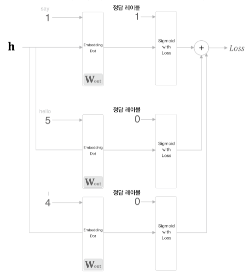

그림을 보면 학습시에 `say` 는 1, 그외의 `hello` 와 `I` 는 0 으로 처리하고  
`Cross Entropy Loss` 함수를 사용하여 `Loss` 를 구한다.  

$$ L = −(tlogy + (1− t)log(1− y)) $$

단어 리스트에 대한 확률분포를 생성하는 클래스 `UnigramSampler` 를 살펴보자.  

```py
class UnigramSampler:
    """ 
    corpus: 단어 id 리스트
    power: 확률분포 제곱값
    sample_size: 샘플링 수행 횟수
    """
    def __init__(self, corpus, power, sample_size):
        self.sample_size = sample_size
        self.vocab_size = None
        self.word_p = None

        # 확률분포 p 구하는 과정
        counts = collections.Counter()
        for word_id in corpus:
            counts[word_id] += 1

        vocab_size = len(counts)
        self.vocab_size = vocab_size

        self.word_p = np.zeros(vocab_size)
        for i in range(vocab_size):
            self.word_p[i] = counts[i]

        self.word_p = np.power(self.word_p, power)
        self.word_p /= np.sum(self.word_p)

    """
    target: 긍정적 샘플 단어 id 리스트
    """
    def get_negative_sample(self, target):
        batch_size = target.shape[0]
        negative_sample = np.zeros((batch_size, self.sample_size), dtype=np.int32)

        for i in range(batch_size):
            p = self.word_p.copy()
            target_idx = target[i]
            p[target_idx] = 0
            p /= p.sum()
            # p 로부터 sample_size 만큼 
            negative_sample[i, :] = np.random.choice(self.vocab_size, size=self.sample_size, replace=False, p=p)
        return negative_sample
```


```py
# You say hello and I say hello. 의 word id
corpus = np.array([0, 1, 2, 3, 4, 1, 2, 3])
power = 0.75
sample_size = 2
sampler = UnigramSampler(corpus, power, sample_size) 
target = np.array([1, 3, 0])
negative_sample = sampler.get_negative_sample(target) 
print(negative_sample) # [[0 3]
```


```py
class NegativeSamplingLoss:

    """ 
    W: 가중치
    corpus: 말뭉치 id 리스트
    power: 확률분포 제곱
    sample_size: 부정 샘플링 횟수
    """
    def __init__(self, W, corpus, power=0.75, sample_size=5):
        self.sample_size = sample_size
        self.sampler = UnigramSampler(corpus, power, sample_size)
        self.loss_layers = [SigmoidWithLoss() for _ in range(sample_size + 1)]
        self.embed_dot_layers = [EmbeddingDot(W) for _ in range(sample_size + 1)]

        self.params, self.grads = [], []
        for layer in self.embed_dot_layers:
            self.params += layer.params
            self.grads += layer.grads

    def forward(self, h, target):
        batch_size = target.shape[0]
        negative_sample = self.sampler.get_negative_sample(target)

        # 긍정적 예 순전파
        score = self.embed_dot_layers[0].forward(h, target)
        correct_label = np.ones(batch_size, dtype=np.int32)
        loss = self.loss_layers[0].forward(score, correct_label)

        # 부정적 예 순전파
        negative_label = np.zeros(batch_size, dtype=np.int32)
        for i in range(self.sample_size):
            negative_target = negative_sample[:, i]
            score = self.embed_dot_layers[1 + i].forward(h, negative_target)
            loss += self.loss_layers[1 + i].forward(score, negative_label)

        return loss

    def backward(self, dout=1):
        dh = 0
        for l0, l1 in zip(self.loss_layers, self.embed_dot_layers):
            dscore = l0.backward(dout)
            dh += l1.backward(dscore)

        return dh
```


### 최적화 - Embedding

> embedding: 끼워넣다  

만약 말뭉치에서 단어의 개수가 1000000개 단위, 은닉층의 뉴런개수가 100개일 경우 $W_{in}$ 은 `1000000x100` 크기의 행렬을 계산해야 한다.  
(출력 층도 마찬가지로 `100x1000000`)  

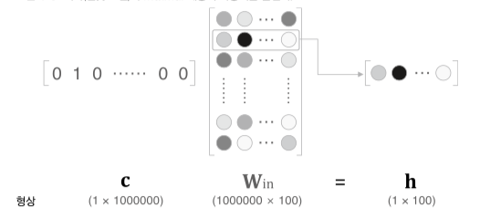

사실 원핫백터과 가중치 $W_{in}$ 은 서로 행렬곱을 할 필요가 없다.  
단어가 해당되는 원핫백터 index 외에는 모두 0이기 때문에 index 에 해당하는 $W_{in}$ 의 행백터만 추출해서 다음 계층으로 넘기면 된다.  

이 추출계층을 `Ebmedding` 계층이라 한다.  


순전파는 가중치 $W$ 의 특정 행백터만 추출만 하면 되고  
역전파는 앞단에서 전달받은 기울기를 다음층으로 그대로 흘려보내면 된다.(index 에 맞게) 

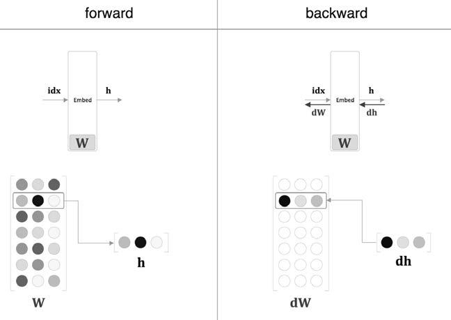

단 해당 단어의 `index` 를 제외한 $dW$ 의 모든 행백터는 0으로 초기화 한다.  

인스턴스 변수 idx 에는 단어ID(추출행)을 배열로 저장한다.  

`window size` 만큼의 원핫백터를 통해 가중치를 구하다 보니 동일한 단어가 포함될 수 있다.  
아래와 같이 단어 `index` 가 여러번 포함될 경우  

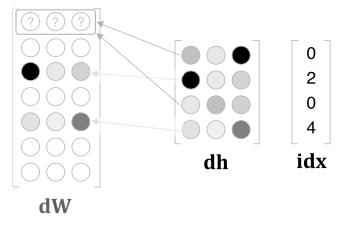

할당이 아닌 더하기를 사용해 $dW$ 를 구성한다.  

```py
class Embedding:
    def __init__(self, W):
        self.params = [W]
        self.grads = [np.zeros_like(W)]
        self.idx = None

    def forward(self, idx):
        W, = self.params
        self.idx = idx
        out = W[idx]
        return out

    def backward(self, dout):
        dW, = self.grads
        dW[...] = 0
        np.add.at(dW, self.idx, dout)
        return None
```

### GloVe

GloVe(global vectors for word representation)  
직역하면 단어 표현을 위한 전역 벡터  

**Co-occurrence matrix(동시출현 행렬)** 아이디어를 사용한 단어 통계방식을 사용한다.  

만약 아래 3가지 문장있을 때, 해당 문장의 모든 단어의 연관관계를 하나의 matrix 로 표현할 수 있다.  

```
I enjoy flying
I like NLP
I like deep learning
```

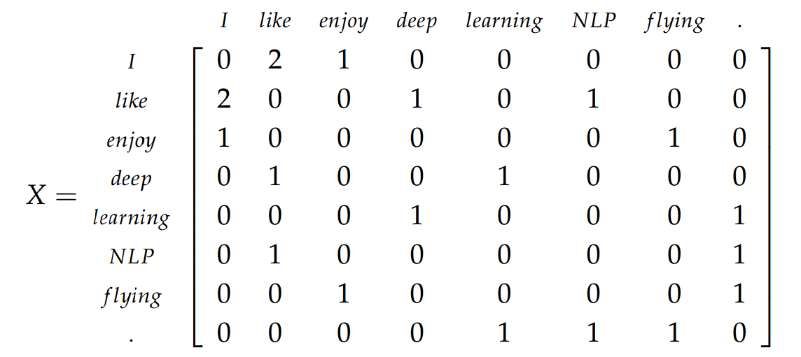  

해당 단어가 바로 옆에 단어를 카운팅하여 Co-occurrence matrix 행렬로 표현할 수 있다.  

그리고 단어 $i$ 이후 단어 $k$ 가 나올 확률은 아래와 같이 구할 수 있다.  

$$
P(k|i) = \frac{X_{i,k}}{\sum_j X_{i,j}} = \frac{X_{i,k}}{X_i}
$$

#### 손실함수

`GloVe` 의 손실함수는 아래와 같다.  

단어 $i, k$ 의 임베딩 벡터를 $w_i, w_k$ 로 표현,  
그리고 단어 $i$ 의 주변단어의 임베팅 벡터를 $\hat{w_j}$ 로 표현할 때  

두 단어 $w_i, w_k$ 의 내적값을 $p(k|i)$ 로 만드는 것이다.  

$$
w_i^T \cdot w_k \rarr \log P(k|i) 
$$

> 보통 뉴럴넷에서 쉽게 연산하기 위해 로그확률을 사용한다.  

이런 아이디어가 나올 수 있었던 과정은 아래와 같다.  

주변 단어벡터 $\hat{w_k}$ 가 있을 때 현재단어를 추측하기 위한 후보단어벡터를 $w_i, w_j$ 로 가정  

$$
f(w_i, w_j, \hat{w_k}) = \frac{P(i|k)}{P(j|k)}
$$

$f$ 값이 클수록 단어 $i$ 출현확률이 높은것이고  
$f$ 값이 작을수록 단어 $j$ 출현확률이 높은것이다.  

3개의 벡터를 입력값으로 넣어 하나의 스칼라값으로 출력하기 위해 모델을 아래와 같이 변경  


$$
f((w_i - w_j)^T, \hat{w_k}) = \frac{P(i|k)}{P(j|k)}
$$

두 백터 $(w_i - w_j)^T, \hat{w_k}$ 를 내적시킬 예정이다.  


함수의 준동형성 성질을 이용해 아래와 같이 변경


$$
\begin{aligned}
&f((w_i - w_j)^T \cdot \hat{w_k}) \\
&= \frac{f(w_i^T \cdot \hat{w_k})}{f(w_j^T \cdot \hat{w_k})} \\
&= \frac{P(i|k)}{P(j|k)}
\end{aligned}
$$

여기에 $f$ 를 지수함수 $\exp$ 로 사용한다 가정하면  

$$
\frac{\exp(w_i^T \cdot \hat{w_k})}{\exp(w_j^T \cdot \hat{w_k})} = \frac{P(i|k)}{P(j|k)}
$$

결국 맨 처음 알아봤던 아래식으로 변경 가능하다.  

$$
w_i^T \cdot \hat{w_k} = \log P(k|i) 
$$

손실함수를 계산하기 위해 수식을 풀어보면 아래와 같다.  

$$
w_i^T \cdot \hat{w_k} = \log P(k|i) = \log(\frac{X_{i,k}}{X_i}) \\
= \log X_{i,k} - \log X_i
$$

여기서 $i$ 와 $k$ 의 위치를 교환하면 아래와 같은데  

$$
w_k^T \cdot \hat{w_i} = \log X_{k,i} - \log X_{i,k} - \log X_k
$$

둘다 같은 벡터에 대한 내적이지만 두 값이 서로 일치하지 않는, 교환법칙이 성립하지 않는 문제가 발생했다.  

그래서 $\log X_i, \log X_k$ 값을 없애기 위해 bias 값을 사용하여 없에도록 가정한다.  

$$
w_i^T \cdot \hat{w_k} + b_i + \hat{b_k}= \log X_{i,k}
$$

그래서 손심할수는 아래와 같이 정의할 수 있다.  


$$
Loss = (w_i^T \cdot \hat{w_k} + b_i + \hat{b_k} - \log X_{i,k}) ^ 2
$$

#### 추가 고려사항  

로그확률 특성상 $\log 0$ 이 무한대 음수꼴임으로 아래와 같이 1을 더하줘야함  

$$
\log (1 + X_{i,k})
$$

단어개수는 많은데 문장개수가 충분하지 않은, 말뭉치가 충분하지 않을경우  
`Co-occurrence matrix` 의 대부분값이 0인 희소표현 문제가 발생함  

### FastText

학습데이터도 단어를 사용하는 것이 아닌, 단어의 문자 기준 `n-gram` 으로 토큰화 하여 학습데이터로 사용한다.  
`n-gram` 을 3으로 설정해서 mouse 단어를 나눌경우 아래와 같다.  

```
mouse -> [mo, mou, ous, use, se]
```

`FastText` 는 Facebook 에서 개발한 Word2Vec 알고리즘으로  
단어를 더 쪼갠 **subword** 개념을 사용하는 모델이다.  

학습데이터가 늘어나 더 많은 리소스를 필요로하겠지만 이런 아이디어를 도입하면서 아래와 같은 문제들을 해결할 수 있다.  

**1. OOV(Out of Vocabulary)**

학습용 corpus 에 존재하지 않아 모르는 단어에 대해 어느정도 단어를 벡터값으로 처리 할 수 있다.  
어간(Stem), 접사(Affic)를 분리하는 어간추출 방식을 사용하는 것도 이 `OOV 문제`를 해결하기 위한것이라 할 수 있다.  

**2. Rare Words**

`FastText` 는 `Rare Word 문제` 에 대해서도 강하다.  

빈도수가 적은 단어들은 정제, 추출 과정에서 제외되거나,  
학습한다 하더라도 충분한 학습도 되지 않기에 결과가 좋지않다.  

**3. Typo Error**

입력된 단어의 오타 문제에 대해서도 강하다,  
어떻게 보면 오타 단어도 Rare Words 라 생각할 수 있음으로.  

## 사전훈련모델  

충분한 데이터셋이 존재하지 않을경우 underfitting 문제가 발생하는데  
이를 해결하기 위해 pretrain 되어있는 모델을 가져와 사용한다.  

CBOW, GloVe, FastText 등으로 훈련된 사전모델들이 존재한다.  

보통 차원은 512 를 많이 쓰고 사전에 학습된 `Pretrained Embeddings` 이 있음  
