## 1D-CNN

> <https://wikidocs.net/80437>

`N X M` 크기의 이미지에 필터와 합성곱 연산을 수행하는 것이 CNN 모델인데  
이를 자연어처리에 적용한 것이 1D-CNN 모델  

이미지가 아닌 Wored2Vec 이 그 자리를 대체할 뿐이다.  

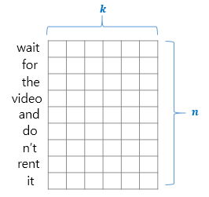 

아래는 `2 x K` 행렬의 필터를 예시로 행렬곱 연산하는 그림이다.  

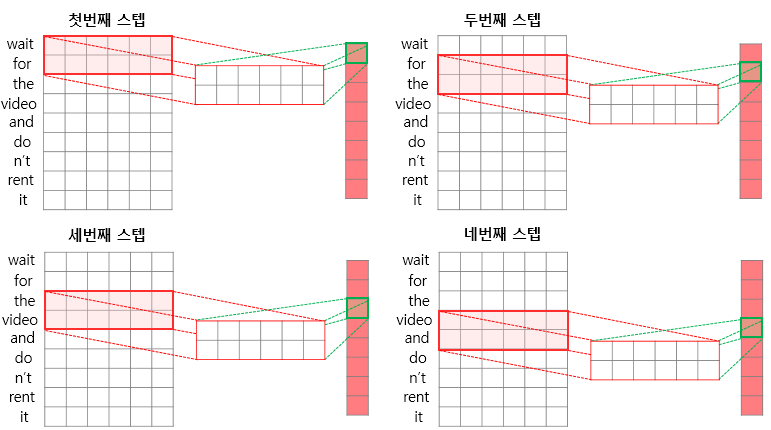 

`2 x K` 행렬를 사용한다는 것은 2개 단어의 상관성만 구하는 것이기에  
`1D-CNN` 도 기타 `CNN` 과 마찬자기로 다양한 종류의 필터를 통해 다양한 `feature map` 을 출력해낸다.  

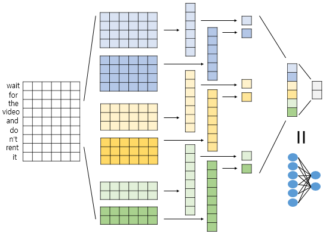 

- 감정 분석 (sentiment classification)  
- 질문 유형 분석 (question type classification)  
- 객관/주관 유형 분석 (subjectivity)  

## seq2seq

**sequence to sequence (시계열에서 시계열로)**

세상에 넘처나는 시계열 데이터(언어, 음성, 동영상 등)를 다른 시계열 데이터로 변경할 때 `RNN` 모델중 하나인 `seq2seq` 방법을 사용한다.  

아래 그림은 기존의 RNN 기반 기계번역의 대표적 예시로 독일어 입력을 영어로 번역한다.  

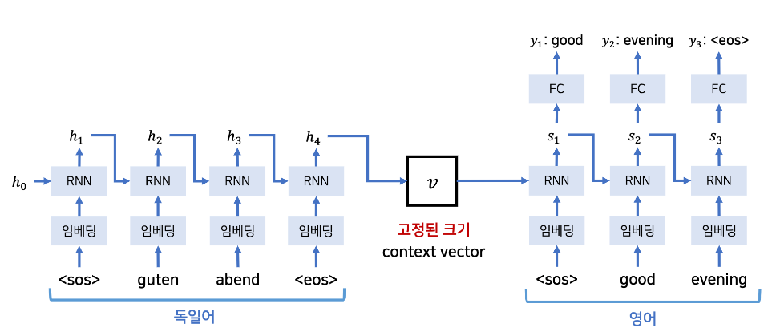

번역기와 같은 기능은 시계열 데이터 하나(단어 하나) 만 보고 번역되는 것이 아닌  
**문장 전체를 보고** 번역해야 하기 때문에 모든 시계열 데이터가 저장되어 있는 **마지막 은닉 상태 $h$** 를 **context vector** 라 표현하고 이를 통해 번역을 처리한다.  

`seq2seq` 는 **Encoder-Decoder 모델** 이라고도 하며 좀더 간단히 표현하면 아래 그림과 같다.  

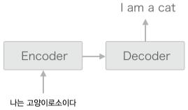

즉 `seq2seq` 는 `Encoder` 와 `Decoder` 2개의 `RNN` 을 연결한 모델이라 할 수 있고  
**문장생성 모델** 을 `Decoder` 로 사용하여 번역된 문장을 생성해간다 볼 수 있다.  

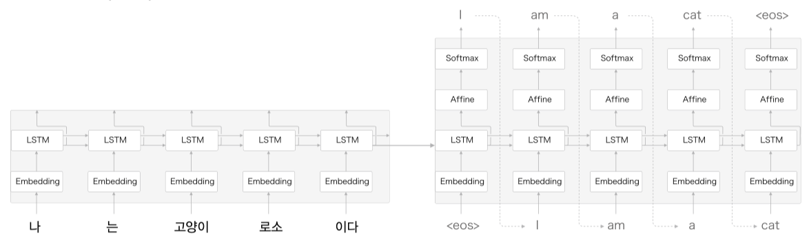

아래와 같은 분야에서 다방면으로 활용된다.  

- **기계 번역** : ‘한 언어의 문장’을 ‘다른 언어의 문장’으로 변환  
- **자동 요약** : ‘긴 문장’을 ‘짧게 요약된 문장’으로 변환  
- **질의응답** : ‘질문’을 ‘응답’으로 변환  
- **메일 자동 응답** : ‘받은 메일의 문장’을 ‘답변 글’로 변환  

하지만 `seq2seq` 의 단점은 고정된 크기의 `context vector` 를 만드는 과정에서 성능하락이 발생한다.  

**Peeky(엿보기)** 기법을 사용해 성능하락을 조금이라도 줄이려고 시도할 수 있다.  
모든 `Decoder RNN`, `Affine(FC)` 계층에 에 `context vector` 를 전달하기도 한다.  

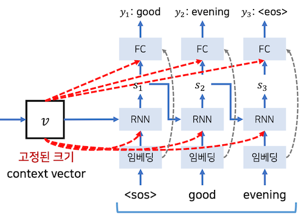  

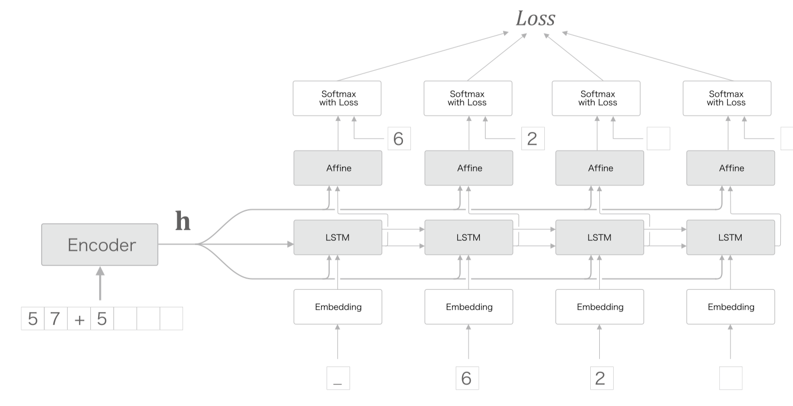  

그로 인해 `Affine` 계층 입력값이 2개가 되는데, 실제로는 두 입력값을 `concatenate`(연결) 하는 것을 의마한다.  

```py
np.concatenate((hs, out), axis=2)
```

### 기타 응용

#### Image Captioning

Decoder 부분을 응용해서 **Image Captioning** 이라는 방법을 사용해 이미지를 문장으로 변경할 수 도 있다.  

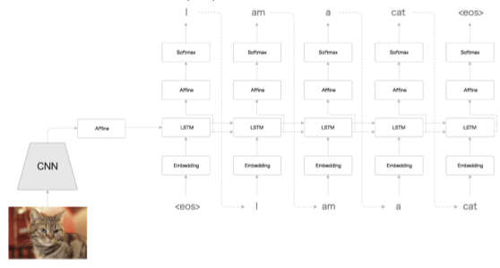

이미지를 `Encoder` 에 넣어 벡터로 변환하고, 출력된 벡터를 다시 `Decoder` 에 넣어 문장을 출력한다.  

#### 입력 데이터의 반전 - Reverse

예로 `나 는 고양이 로소 이다` 를 `I am a cat` 으로 번역하는 문제에서 입력값은 반전하면  
`이다 로소 고양이 는 나` 와 같다.  

해당 값이 Encoding 데이터로 표기될 단어 `나` 와 Decoding 데이터로 표기될 `I` 의 거리가 모델 구조상 딱 붙어있게 된다.  

반전 덕분에 변환 후 단어어 가까워 지면서 기울기가 더 잘 전달되어 학습 호율이 좋아진다 생각하면 된다.  

물론 전체 단어 평균은 동일하다.  

### Teacher Force Training  

`seq2seq` 모델을 학습할 때에는 `input` 에 `Ground Truth` 값을 사전에 알려준다.  

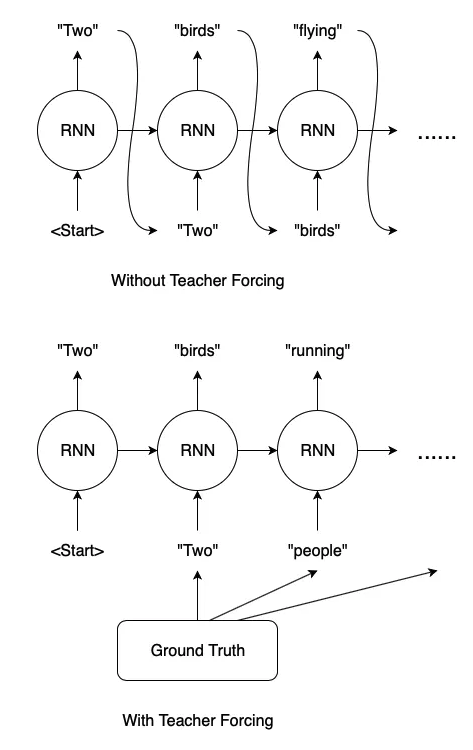  

`Wihtout Teacher Forcing` 부분에선 출력된 `output` 값을 그대로 다음 시퀀스의 `input` 으로 사용하지만  
실제 학습시 이런방식을 사용할 경우 연쇄적으로 오류값이 전달되어 학습이 불가능하다.  

`With Teacher Forcing` 부분처럼 이전 `input` 값에 미리 `Ground Truth` 를 전달한다.  

## Attention

`seq2seq` 를 이용한 번역기 예제에서 입력된 **문장 전체의 `context vector`** 를 이용해 번역된 문장을 생성해 나간다.  

문장 전체를 보기때문에 좋은점도 있지만, 사실 사람이 번역할땐 문장 전체를 보기보단 해당 연관단어 주변만 보고 번역하는 경우가 많다.  

그래서 출력된 내용이 좀더 집중해야할 입력데이터 영역을 찾는 아이디어가 `Attention` 메커니즘이다.  

### Attention Score

> <https://wikidocs.net/22893>

`seq2seq` 의 문제점은 아무리 긴 시계열 데이터라도  
`Encoder` 를 통해 나오면 고정된 크기의 벡터값이라는 것.  

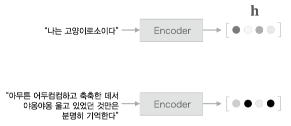

`Attention` 은 입력데이터의 집중할 부분을 찾아내야 하기 때문에 `context vector` 와 **출력된 모든 은닉 상태 $h$ 를 사용한다**.  

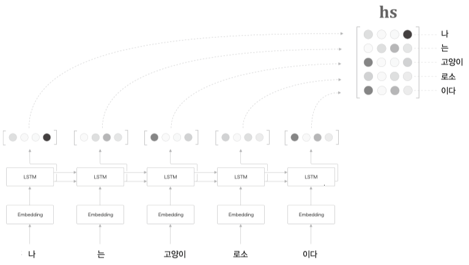

그림처럼 모든 은닉 상태 $h$ 를 `concatenate` 하여 $hs$ 를 만든다.  

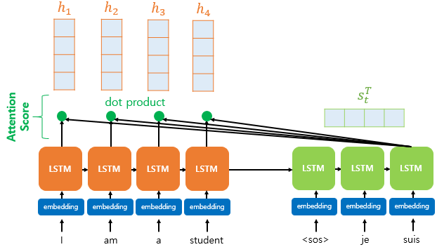  

$hs$ 의 각 행벡터는 Decoder 의 은닉상태 $s$ 와 내적을 수행하고 
$s$ 와 $h$ 의 유사도라 할 수있는 내적값을 `Attention Score` 라 한다.  

`Attention Score` 를 확률로 표기할 수 있기 때문에 아래와 같이 시각화도 가능  

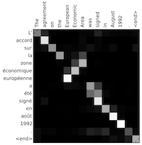

### Attention Value

출력된 `Attention Score` 는 `softmax` 과정을 거쳐 `Attention Distribution` 값으로 나타나게 되는데  

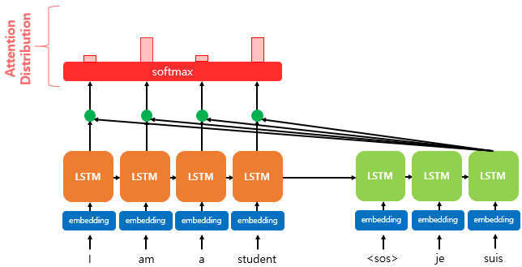  

`softmax` 과정을 거쳤기 때문에 `Attention Distribution` 의 총합은 1 이된다.  
`Attention Distribution` 는 $hs$ 의 가중치로 사용되어 아래와 같이 `weighted sum` 연산을 수행한다.  

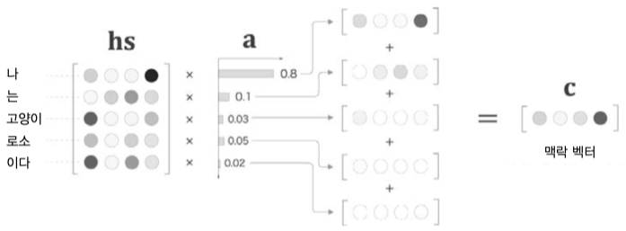

`Attention Score` 값이 높은 은닉백터 $h$ 는 유지되고  
`Attention Score` 값이 낮은 은닉벡터 $h$ 는 희미해진다.  

이렇게 구한값을 `Attention Value` 라 부르고 `context vector` 로 사용한다.  

- **Q(Query)**: 구할 시점의 디코더 $h$
- **K(Keys)**: 모든 시점의 인코더 $h$
- **V(Values)**: 모든 $a$(Attention Score) X $h_i$


$$
\mathrm{Attetion(Q,K,V)=softmax(QK^T)V=AttentionValue}
$$


`Attention Value` 와 Decoder 의 은닉상태 $h$ 는 `concatenate` 되어 $v^t$ 로 만들고 FC 의 입력값으로 사용한다.   

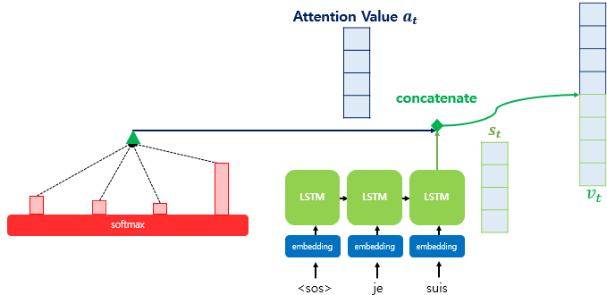  


### 응용

#### 구글 신경망 기계 번역 (GNMT: Google Neural Machine Translation)


GNMT 의 계층 구성그림이다.  

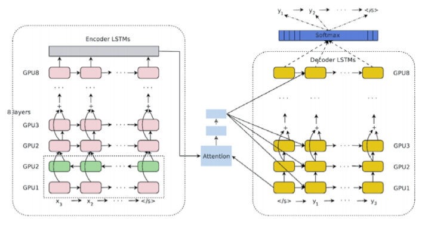

LSTM 의 다층화, 양항향, skip 연결등이 보이며  
Attention 계층이 포함되어 있는것을 볼 수 있다.  
