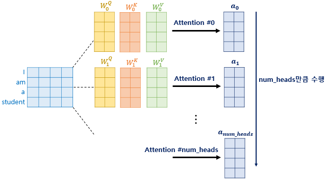
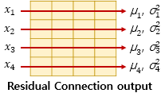

## Transformer

> <https://www.youtube.com/watch?v=mxGCEWOxfe8>  
> <https://wikidocs.net/31379>  
> <http://jalammar.github.io/illustrated-transformer/>
> <https://arxiv.org/abs/1706.03762>  

`Attention` 모델은 모든 은닉 상태 $hs$ 를 사용하면서 높은 성능을 보여줬는데  
여전히 `RNN`을 사용하는 모델이다 보니 학습이 느리고, 고질적인 문제인 기울기 폭발 혹은 기울기 소실 문제가 발생한다.  

> RNN 특성상 시각의 순서에 따라 연산이 이루어지다 보니 병렬연산이 불가능해 학습이 느리다.  

이때문에 `RNN` 을 사용하지 않고 `Attention` 기법만으로 사용하는 모델이 `Transformer` 이다.  

`Transformer` 을 기점으로 자연어처리에서 더이상 `RNN` 을 사용하지 않고 `Attention` 기법만을 사용한다.  

모델그림은 아래와 같이 인코더와 디코더 사용한다.  

그림처럼 `Transformer` 는 3가지 종류의 `Attention` 이 있는데 하나씩 알아볼 예정  

## Encoder 

인코더는 크게 아래와 같이 나눌 수 있다.  

- Input Embedding
- Multi head Attention(Encoder self attention)
- Add & Norm(Residual Learning)
- Position wise FFNN

### Input Embedding

각 단어에 대한 `Embedding Vector` 를 사용하기 위해 `Input Embedding Matrix` 를 정의하고  
RNN 처럼 순서에 대한 처리를 위해 단어별 위치정보값인 `Positional Encoding` 값을 더해준다.  

입력단어들을 한번에 `Encoder` 에 넣어 병렬연산이 가능하다.  

$$
PE_{(pos, 2i)}   =\sin(pos/10000^{2i/d_{model}}) \\
PE_{(pos, 2i+1)} =\cos(pos/10000^{2i/d_{model}})
$$

여기서 $[d_{model}, pos, i]$ 값은 아래 참고  

`Positional Encoding` 을 위한 행렬값을 연산해 두고 위치정보값으로 사용한다.  
값은 항상 -1 ~ 1 사이의 값이고  

### Multi head Attention(Encoder self attention)

기존 `Attention` 모델에선 `Encoder` 의 은닉상태들을 모아 $hs$ 를 구성하고  
`Decoder` 의 은닉상태와 내적을 통해 `Attention Score` 를 구했었다.  

하지만 `Transformer Encoder` 에선 입력된 단어들끼리 `Attenction Score` 를 구한다.  
그래서 `self-attention` 이라 부른다.  

그림과 같이 `Encoder` 의 `Multi head Attention` 에 3가지 벡터 $Q, K, V$ 가 input 으로 들어가는데  
`Embedding Vector` 에 `Positional Encoding` 된 값을 행렬과 `Linear` 연산한 것이다.  

즉 동일한 `Embedding Vector` 가 가중치 $W^Q, W^K, W^V$ 에 의해서 $Q, K, V$ 로 출력되고 `Multi head Attention` input 으로 들어간다.  

행렬곱 연산이다보니 아래와 같이 입력된 `Embedding Vector` 를 한번에 연산한 수 있다.  

그리고 Multi head 란 이름처럼 가중치 $W^Q, W^K, W^V$ 는 head 의 개수만큼 존재한다.  

> 논문에선 8개를 사용했다.  

출력된 여러개의 `Attention Value` 들은 `concat` 되어 가중치 $W^o$ 와 `linear` 연산을 거치고  
하나의 `Multi head Attention` 이 종료된다.  

`Multi head Attention` 과 `Add & Norm`(아래에서 소개) 과정은 layer 수 만큼 반복하고  
각 layer 의 가중치들은 모두 별개의 값들이다.  

> 논문에선 layer 수를 6개로 설정하여 인코더 층을 구성했다.  

#### Scaled Dot Product Attention

`Multi head Attention` 내부 `Scaled Dot Product Attention` 은 아래와 같다.  
여기서부턴 기존의 `Attention` 모델과 비슷한 방향으로 흘러간다.  

$Q, K$  를 행렬곱(MatMul) 하면 `Attention Score` 가 출력된다.  
$Q, K$ 모두 같은 입력에서 $W^Q, W^K$ 를 통해 출력된 값인데 자기들(self) 끼리 행렬곱을 진행한다.  

그리고 $\sqrt{d_k}$ 로 `Scale` 하고 `Softmax` 하면 `Attention Distribution` 가 출력되고 가중치로 사용한다.  
이 가중치에 의해 $V$ 의 특정 행벡터를 희미해지고, 특정 행벡터는 진해질것이다.  
이렇게 가중치에 의해 변화된 $V$ 를 `Attention Value` 로 사용한다.  

여기서 설명하지 않은 부분이 `Mask(optional)` 인데, 아래와 같이 `<pad>` 를 행렬에 추가하는 것이다.  

`<pad>` 에 0이 아닌 값이 설정되어 있다면 해당 열, 해당 행은 모두 마스킹한다.  

### Add & Norm(Residual connection)  

`Resnet` 과 같이 `Residual connection` 기법을 사용하기 때문에  
`Multi head Attention` 변경이전의 데이터 `Add` 하여 학습데이터로 사용한다.  

정규화 과정은 아래와 같이 각 행벡터의 평균, 분산값을 구한 후  

각 행렬 요소값에 아래와 같은 연산을 취해 정규화 한다.  

$$
\hat{x}_{i,k} = \frac{x_{i,k} - \mu_i}{\sqrt{\sigma^2_i + \epsilon}}
$$

> $\epsilon$ 은 분모가 0 되는것을 방지하기 위한 작은값  

여기에 편향과 비슷하게 사용되는 2개의 벡터 $\gamma, \beta$ 를 사용한다.  
초기값은 각각 1과 0이다.  

$$
\gamma = [1, 1, \cdots, 1] \\
\beta = [0, 0, \cdots, 0] \\
$$

최종적으로 아래와 같이 정규화과정이 이루어지고 $\gamma, \beta$ 는 학습들 통해 변화한다.  

$$
\mathrm{LayerNorm}(x_{i}) = \gamma \hat{x}_i + \beta
$$

### Position wise FFNN(feedforward neural network)

`Fully connected Layer` 라 볼 수 있다.  
$x$ 는 `Multi head Attention` 과 `Add & Norm` 를 통해 출력된 값.  

Position wise FFNN 에는 아래 2개의 가중치가 존재한다.  

$$
W_1(d_{model}, d_{ff}) \\
W_2(d_{ff}, d_{model})
$$

논문에서 사용한 $d_{model}$ 은 512, $d_{ff}$ 는 하이퍼파라미터로 2048 을 사용한다.  

## Decoder  

> 보통 `Decoder layer` 개수도 `Encoder layer` 개수만큼 있음  

Encoder 는 모든 단어에 대해 Attention 연산을 수행함으로 양방향 연산이 이루어진다.  
Deocder 는 순차적으로 입력된 단어에 대해 Attention 연산을 수행함으로 전체적으로 보면 단방향 연산이라 할 수 있다.  

  

디코더는 크게 아래와 같이 나눌 수 있다.  

- Output Embedding  
- Masked Multi head Attention(Self Attention)  
- Multi Head Attention(Encoder Decoder Attention)  
- Add & Norm(Residual Learning)  
- Position wise FFNN  
- Final Linear and Softmax Layer  

여기서 Encoder 에서 설명하지 않은 아래 3개 구성요소에 대해서 설명한다.  

- Output Embedding  
- Masked Multi head Attention(Self Attention)  
- Multi Head Attention(Encoder Decoder Attention)  

### Output Embedding

Encoder 에서는 한번에 `Embedding Vector` 를 넣었지만  
Decoder 에서는 그럴수 없다.  

아래 그림처럼 seq2seq 와 비슷하게 이전 시간에 출력된 단어를 다음 입력 `Embedding Vector` 로 사용한다.  

#### Teacher Force Training

학습시에는 `seq2seq` 학습방법과 똑같이 학습시에는 출력한 문장에 해당하는 단어 행렬을 한번에 입력하는 `Teacher Force Training` 기법을 사용한다.  

하지만 RNN 을 사용하는 `seq2seq` 와 다르게 `Transformer` 모델은 입력한 `Embedding Vector` 배열들 간 Attention 연산을 하다보니 첫번째 `Embedding Vector` 가 미래 출력될 `Embedding Vector` 와 헹렬곱 연산을 해버리게 된다.  

그렇기에 학습시에는 아래와 같이 정답 `Embedding Vector` 행렬에 `Attnetion Score` 를 구한 값에  
`look-ahead mask` 를 도입해 미래에 있는 단어들은 참고하지 못하도록 마스킹한다.  

### Multi Head Attention

Decoder 에는 2종류의 `Multi Head Attention` 이 존재한다.  

- Masked Self Attention  
- Encoder Decoder Attention  

첫번째로 만나는 `Masked Self Attention` 의 경우 `look-ahead mask` 처리한 `Attention Score` 를 입력받는다 하여 `Masked Multi head Attention` 이라 부른다.

`Masked Multi head Attention` 는 `Encoder` 의 `Multi head Attention` 처럼 초기 입력되는 `Embedding Vector` $Q, K, V$ 값이 동일하다(가중치만 다를뿐).  

두번째로 만나는 `Encoder Decoder Attention` 의 경우 `Encoder` 의 **마지막 레이어의 출력값**을 받아 `Multi Head Attention` 에 사용한다.  

**Query** : 디코더 행렬  
**Key = Value** : 인코더 행렬  