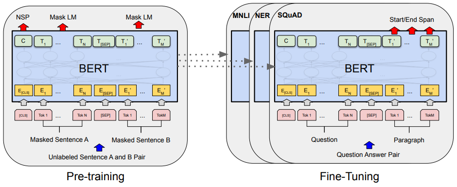
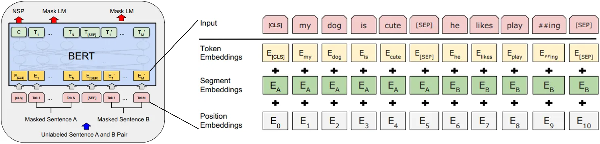
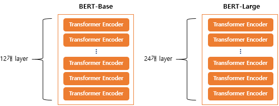
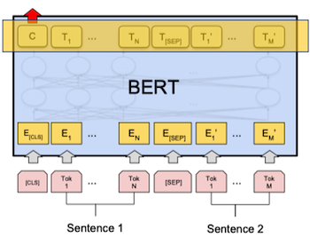
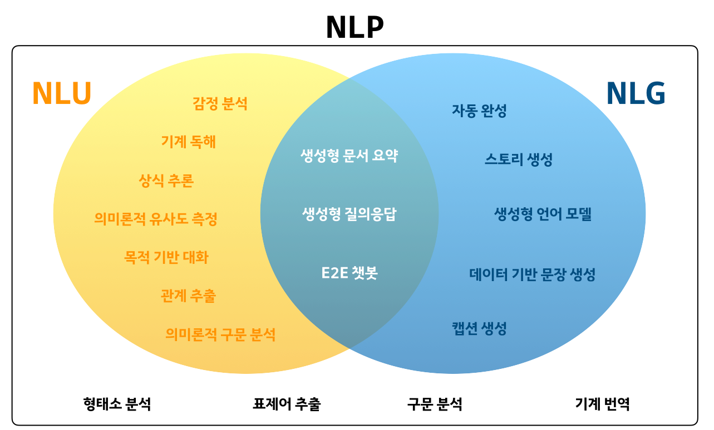
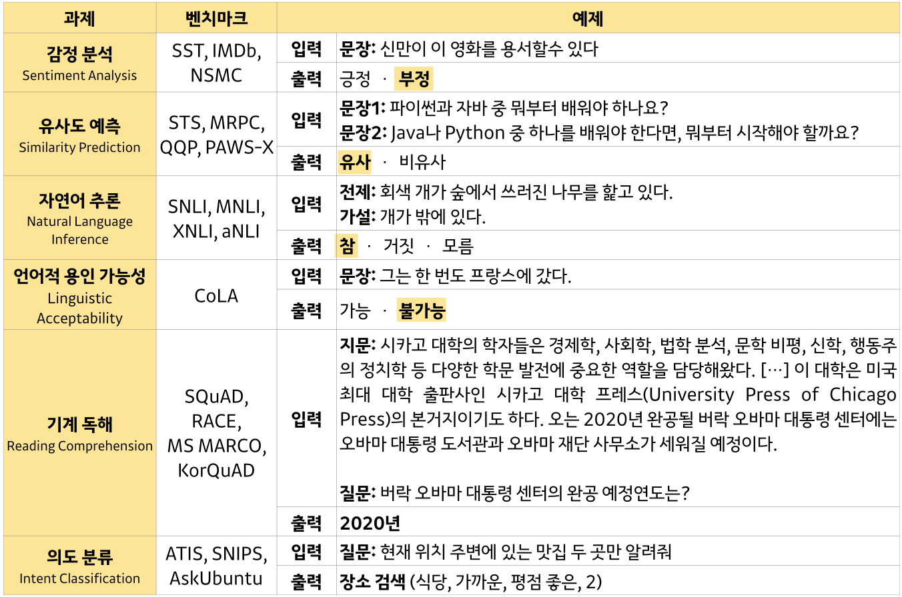
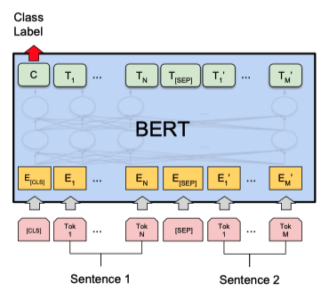
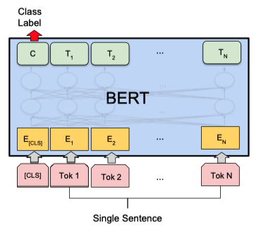
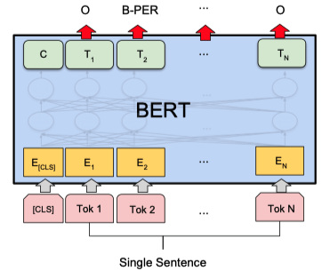
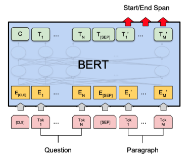

## BERT

> Bidirectional Encoder Representations from Transformers(BERT)  
> <https://arxiv.org/abs/1810.04805>  
> <https://www.youtube.com/watch?v=30SvdoA6ApE>  
> <https://youtu.be/Rf7wvs8ZbP4?t=24630>  
> <https://wikidocs.net/115055>  

`BERT` 는 학습단계와 Fine Tunning(전이학습) 단계로 나뉜다.  

좌측에서 여러 과정을 통해 학습을 수행하고  
우측에서 해결하고자 하는 문제해 대해 전이학습을 진행한다.  

  

### Input Embeddings

`Pre-traning` 단계의 BERT 구조를 보면 2개의 문장이 한쌍으로 들어간다.  

`[Maksed Sentence A, Maksed Sentence B]`

학습을 위한 전처리 단계로 `Embedding Vector` 로 만드는 아래 3가지 과정을 거친다.  

- Token Embeddings  
- Segment Embeddings  
- Position Embeddings  

  

`Token Embedding` 은 서브워드 토크나이저를 사용한다.  
문자열을 단어단위, 단어의 서브워드단위 로 쪼갠 후 `Embedding Vector` 를 구한다.  

`Segment Embeddings` 은 입력된 두 **문장에 대한 `Embedding Vector`** 를 구한다.  
문장 겨계로 레이블이 $\mathrm{[E_A, E_B]}$ 2개로 나뉜다.  

세번째 `Position Embeddings` 은 입력된 `Embedding Vector` 의 순서정보에 대해 

이렇게 3개의 `Embedding Vector` 로 나눈 후 서로 합쳐서 최종적으로 `BERT` 모델의 입력값으로 사용호니다.   

### Next Sentence Prediction(NSP)

입력된 두 문장이 서로 연결된 문장인지 prediction 한다.  
`[false, true]` 두가지 출력으로 나뉘는 `binary` 문제이다.  

### Mask Language Model(MLM)

입력된 두 문장의 일부 단어(15%) 정보를 mask(가리고)하고 해당 단어를 prediction 한다.  

```
I love ___ for always   정답: you
It's so ___ today       정답: cold
```

이 15% 정보가 모두 masking 되는것은 아니고 아래 비율에 맞춰 데이터를 변조한다.  

- 80% masking(정보 삭제)  
- 10% Random word 로 치환  
- 10% 원래 단어 그대로 유지  

만약 학습이 잘 된 모델이라면 `masking` 처리된 단어에 `[빈값, 랜덤값, 유지값]` 이 들어가더라도 정상적인 값을 출력할 수 있어야 한다.  

### 학습 과정  

corpus 로부터 `NSP` 와 `MLM` 의 학습을 위한 데이터셋을 구성할 수 있음으로
쉽게 `supervised learning` 환경으로 구성할 수 있다.  

그리고 모든 입력된 문장에 대해서 `Transformer Encoder Block` 을 통해 `Attention` 연산을 수행함으로 단어 흐름방향 상관없이 학습한다 할 수 있다.  
이런 이유로 모델 이름에 `Bidirectional Encoder` 가 들어간다.  

- 12개의 Transformer Encoder Block
- 12개의 Self-Attention heads
- 768 개의 hidden size

논문에선 12개의 `Transformer Block` 을 사용했는데 그림과 같이 24개 사용하는 방법도 제공한다.  

  

### Fine Tunning  

아래 그림과 같이 `Pre-traning` 단계에서 학습했던 가중치들을 건들이지 않고  
맨위의 마지막 layer 만 다시 학습하는 단계를 거치는 방식이다.  

  

`BERT` 의 `Pre-tranning` 이 완료되면 `Fine Tunning` 을 통해 아래와 같은 task 들을 해결할 수 있다.  

#### Tasks

> <https://hryang06.github.io/nlp/NLP/>

**NLP(Natural Language Processing) 자연어 처리** 에서 아래 그림과 같은 task 를 수행하고자 한다.  

  

크게 아래 2가지 항목으로 나눌 수 있다.  

- **NLU(Natural Language Understanding)**
  자연어 이해, 자연어 형태의 문장을 이해하는 기술
  사람-기계 상호작용이 필수인 경우 NLU는 핵심 기술
- **NLG(Natural Language Generation)**
  자연어 생성, 자연어 문장을 생성하는 기술

이런 자연어 처리 task 를 학습하고 성능평가 할 수 있는 `data set` 들이 다수 존재하는데  

**언어 모델 성능 평가 (dataset)**

  

#### Sentence Pair Classification Tasks

**문장 두 개의 관계 분류**  
입력된 두 문장이 pair 인지 분류하는 task    

아래 그림에서 2개의 문장이 들어가고 `Class Label` 출력값에 binary 분류정보가 출력된다.  

  

아래 data set 을 사용해 학습, 테스트 가능  
`[MNLS, QQP, QNLI, STS-B, MRPC, RTE, SWAG]`

#### Single Sentence Classification Tasks

**문장 한 개 분류**  
문장이 주어졌을 때 해당 문장이 어떤 분야에 속하는지 분류하는 task  

아래 그림에서 1개의 문장이 들어가고 `Class Label` 출력값에 분류정보가 출력된다.  

  

아래 data set 을 사용해 학습, 테스트 가능  
`[SST-2, CoLA]`  

#### Single Sentence Tagging Tasks

**문장 내 단어 라벨링**  
각 단어의 품사(명사, 동사, 형용사, 부사 등) 정보를 Tagging 해준다.  

  

아래 data set 을 사용해 학습, 테스트 가능  
`[CoNLL-2003 NER]`  

#### Quesiton & Answering

**묻고 답하기**  
질문 문장과 응답문장이 포함된 문장을 입력했을 때, 응답 문장이 어디에 위치하는지 출력해준다.  

  

아래 data set 을 사용해 학습, 테스트 가능  
`[SQuAD v1.1]`  
