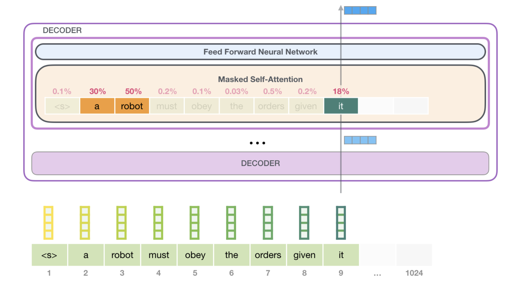
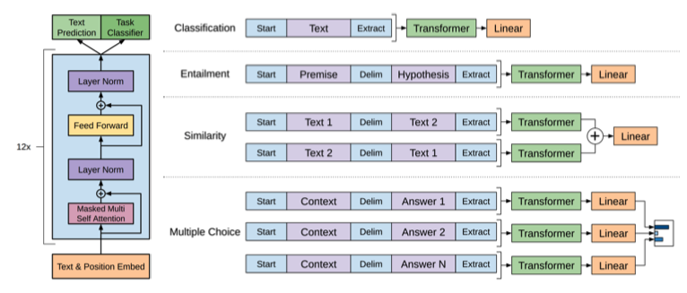
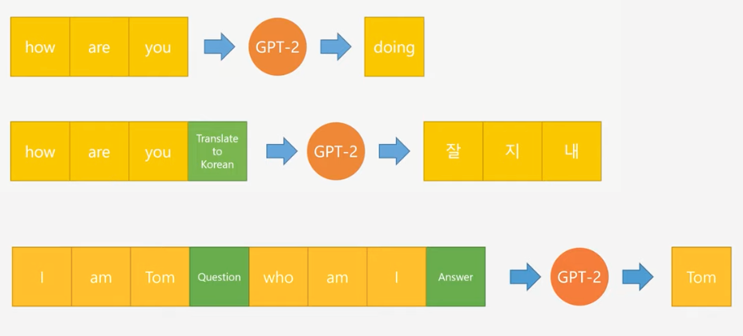
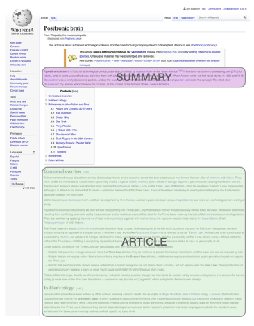
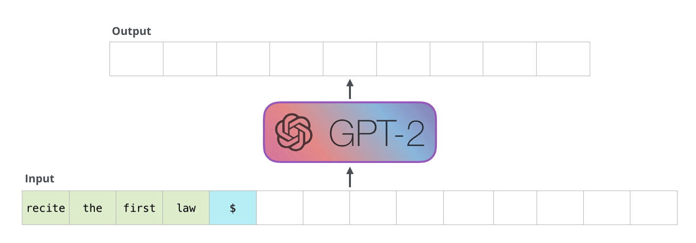
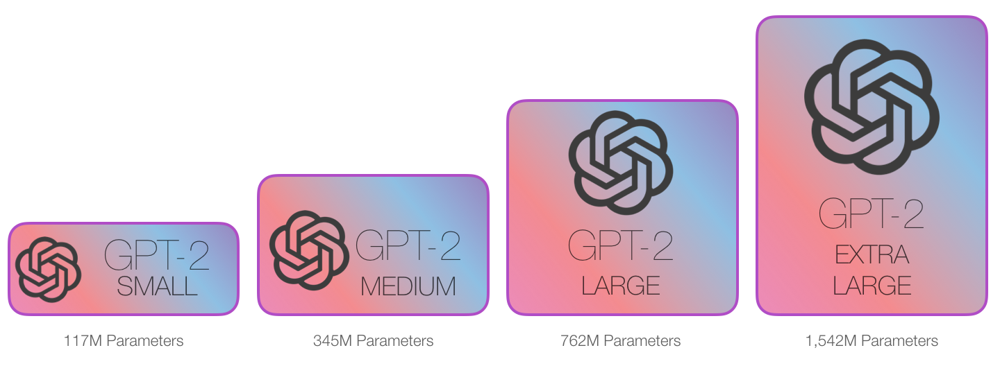
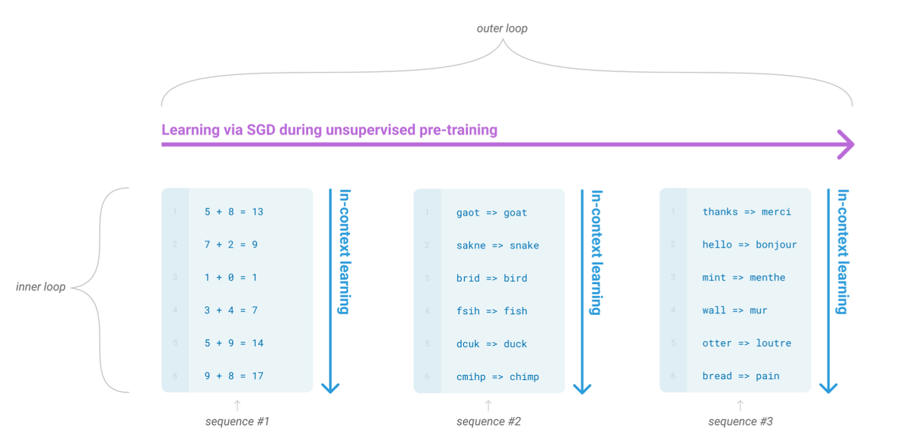
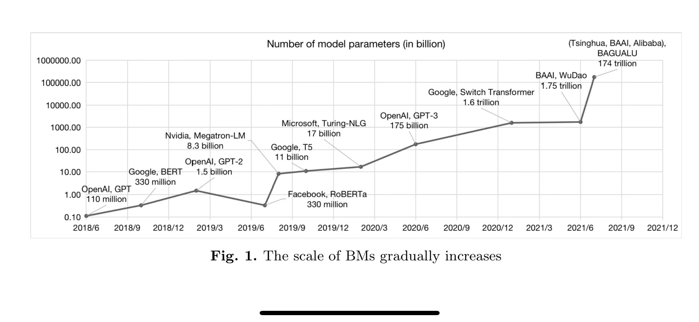

## GPT-1

> Generative Pre-Training of a Langauage Model  
> 2018 June OpenAI <https://openai.com/research/language-unsupervised>  
> <https://www.youtube.com/watch?v=FeEmmylAF0o>  

`Langauage Model(LM)` 은 입력된 단어의 다음 단어를 예측하는데 많이 사용하는 모델.  

`GPT-1` 또한 BERT 와 마찬가지로 `[Pre-Traning, Fine Tuning]` 2가지 학습단계로 나누어진다.  

### Pre-Training

대량의 `corpus` 를 기반으로 입력된 단어를 기반으로 다음 단어를 예측하는 문제를 학습한다.  
학습을 통해 우리가 알고있는, 알지못하는 자연어의 특성을 가지는 훌륭한 모델 생성이 가능하다.  

논문에서 `GPT` 는 아래그림 같이 `Transformer Decoder` 가 12개 연결된 모델을 사용한다.  

  

`LM` 특성상 방대한 양의 `corpus` 를 `labeling` 없이 `Unsupervised Pre-Training` 한다.  

### Fine Tunning

아래 4가지 task 에 좋은 성능을 보여준다.  
이미 이런 문제를 해결하기 위한 대량의 dataset 이 존재함으로 쉽게 Supervised Learning 을 수행할 수 있다.  

- Natural Langauge Inference-Entailment(자연어 전제가설 추론)
- Question Answering(질의응답)
- Semantic Similarity(문장유사도 분석)
- Classification(분류)

기존 BERT 구조와 다른점은 처리하고자 하는 task 에 따라  
입력 데이터 부분, 마지막 layer 구성이 변경된다는 점이다.  

  

## GPT-2

> Language Models are Unsupervised Multitask Learners  
> 2019 Feb OpenAI <https://openai.com/research/better-language-models>  
> <https://www.youtube.com/watch?v=3n6157XNYyw>  
> <https://jalammar.github.io/illustrated-gpt2/>  

`GPT-1` 에서 `[Pre-Traning, Fine Tuning]` 2가지 학습단계로 나누었는데  
`GPT-2` 에선 `Fine Tuning` 단계를 삭제했다.  

`Fine Tuning` 은 학습에 사용되는 비용도 문제이지만 task 별로 별개의 모델을 구성해야한다는 마이너한 문제도 있다.  

### task 학습

`GPT-2` 는 입력 단어(문장)과 실행할 task 를 같이 넣어 다양한 task 를 하나의 모델에서 처리할 수 있는 LM 이다.  
그래서 학습시에 아래와 같이 어떤 task 를 처리하고 그것에 대한 응답이 무엇진지 까지 학습데이터로 넣는다.  


  

  

  

### 입력 데이터

`GPT-2` 는 `Autoregressive Language Model` 이라 부르는데  
 **과거의 출력값은 현재의 입력값에 사용한다** 라는 의미로 기존 배웠던 `RNN`, `Transformer Decoder` 가 이에 해당한다.  

  

### 모델 크기  

그런면에서 `GPT-2` 는 `GPT-1` 에 비해 좀더 일반화 되었다 말할 수 있지만  
사실 두 모델의 구조는 크게 차이가 나진 않는다.  

모델 크기가 10배, `Unsupervised Pre-Training` 학습량도 10배로 증가했을 뿐이다.  

> 이런 학습에 대한 데이터는 Raddit 과 같은 서비스에서 Answer Question 값을 가져와 학습에 사용했다고 한다.  
> 그리고 모든 `task` 에 대해 응답할 수 있도록 각 task 별로 학습을 진행해야 한다.  

  

  


`GPT-2 MEDIUM` 에 해당하는게 `BERT-Large`  
OpenAI 가 자랑하는 생성모델의 크기는 그의 5배인 `GPT-2 EXTRA LARGE` 이다.  

GPT-2의 가장 작은 모델은 500MB, 큰모델은 6.5GB 이상의 저장 공간을 차지한다.  

`Decoder layer` 개수와 함께 `Embedding Vector` 차원 개수도 1600까지 들어난다.  


## GPT-3

> Language Models are Few-Shot Learners  
> 2020 Jul Open AI <https://arxiv.org/abs/2005.14165>
> <https://www.youtube.com/watch?v=p24JUVgDkQk>
> <https://jalammar.github.io/how-gpt3-works-visualizations-animations/>

`GPT-3` 를 

### In-context learning

아래 그림과 같이 SGD(경사하강법) 을 통해 학습이 이루어지는 와중에  
`In-context learning` sequence 을 볼 수 있는데 [덧셈, 오탈자, 번역] 이 들어오는 것을 알 수 있다. 

  

meta learning 의 일종으로 다양한 분야의 패턴을 읽고 학습하는 능력을 키울 수 있다.  

GPT-3 에선 meta learning 과 같이 context 를 기반으로 학습해서 dataset 에 치우치지 않고 좀더 일반화된 성능을 가지는 모델을 In-context learning(문맥내 학습)을 통해 만들고자 한다.  

#### Few shot learning


기존 `Fine tunning` 은 task 별로 라벨링된 대량이 dataset 을 기반으로 학습을 진행했다.  
`GPT-3` 에선 `Fine tunning` 대신 `Few shot learning` 을 채택했다.  

아래 3가지 방식이 존재하는데 하나씩 알아보자. 

- `Zero shot learning`  
- `One shot learning`  
- `Few shot learning`  

**Zero shot learning** 은 예시 없이 task 가 주어졌을때 수행가능한 경우를 의미한다.

```
Prompt: 빨간 사과가 영어로 뭐야?

GPT: "Red Apple"
```

`GPT` 같은 언어모델들이 `unsupervised learning` 을 수행하나,  
`GPT-2` 이후부터 `task` 에 대한 학습이 이루어졌기에 대부분의 nlp task 들은 별도의 in-context learning 없이 zero-shot 으로 수행가능합니다. 번역이나, 요약, 분류등의 task 등이 zero-shot 으로 수행가능한 부분들입니다.

**One shot learning** 은 하나의 예시를 들어주고 task 를 수행하는경우를 말합니다.

```
Prompt: 빨간 사과는 red 사과라고 할께.
노란 바나나는?

GPT: 노란 바나나는 "yellow 바나나"입니다.
```

**Few shot learning** 은 예시를 여럿주고 task 를 수행하는 경우를 말합니다.

```
Prompt: 빨간 사과는 red 사과라고 할께,
노란 바나나는 yellow 바나나야,
그럼 노란 사과는?

GPT: 노란 사과는 "yellow 사과"입니다.
```

이런 데이터들이 example 에 해당하는 문자열은 inference 단계에서 제공되고 

### 모델크기  

  

2019년 11월 OpenAI 에서 GPT-2 를 다운로드할 수 있도록 공개해두었으며  
아래 깃허브에서 다운로드 가능하다.  

> <https://github.com/openai/gpt-2>

> `GPT-2 124M` 가 498MB 크기인것으로 봐서 `GPT-3 175B` 크기는 720GB 정도일듯  
> 
> `GPT-3 175B` 를 학습에 필요한 총 학습 연산량은 `3.14E+23 flops`.  
> V100 GPU(28 Tflops)로 355년 필요  
> Azure 클라우드 비용으로 환산한 GPT-3의 학습 비용은 $420만~$860만  
> 출처: <https://moon-walker.medium.com/ai-service를-위한-현실적인-접근-방법-3-massive-ai-inference-94f75b0fc64f>
