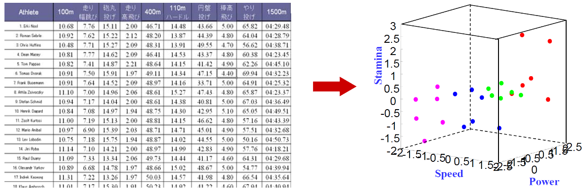
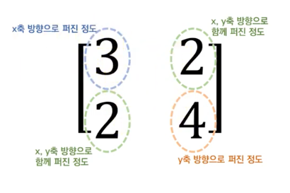
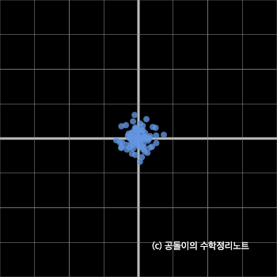
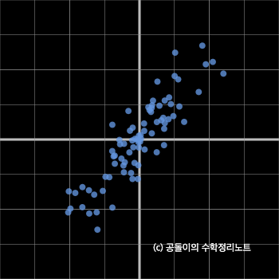
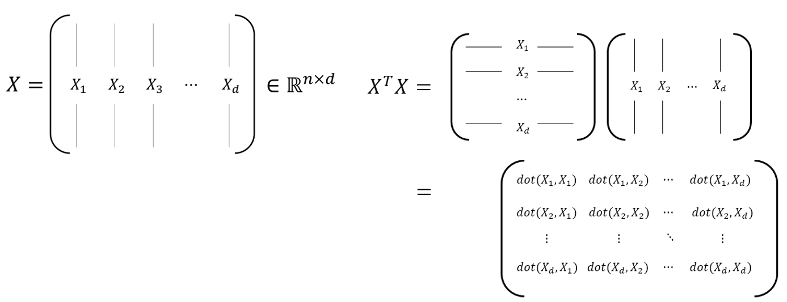
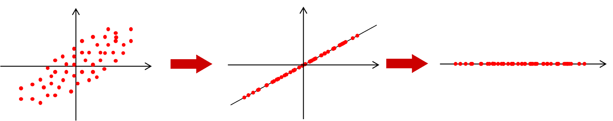
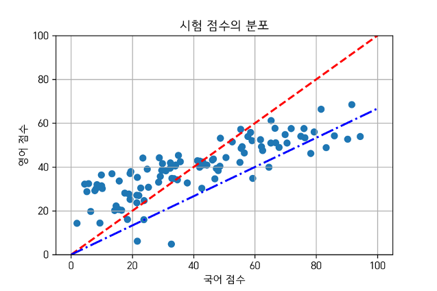
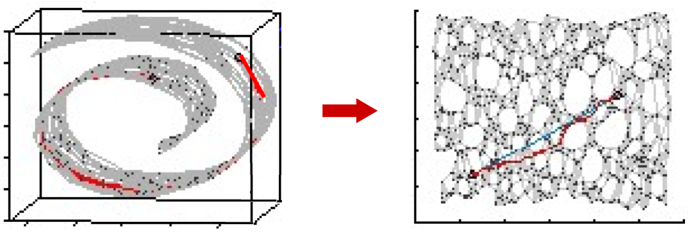

## Dimension Reduction (차원축소)

차원축소를 통해 데이터가 눈에 보이게(Observable) 측정(measure) 할 수 있다.  

위 달리기 기록 차원(칼럼)이 10이 넘는데 3차원(힘, 속도, 스테미너)으로 visualization 할 수 있을까?
아래에서 소개하는 여러 접근방법으로 차원축소 방법을 지원한다.  

가장 대표적인 차원 축소 방법론으로 PCA, ISOMAP 등이 있다.  

대부분의 차원축소 방법론은 **상관관계(Correlation matrix)** 가 높은 변수들을 묶어서 처리하는  
**공분산(Covariance matrix)** 개념을 사용한다.  

### Covariance Matrix(공분산 행렬)

공분산 행렬의 기하학적 의미는 아래 사진과 같다. 

해당 행렬과 데이터(백터) 를 곱해 선형변환을 해주면 

위처럼 공모양의 데이터가 공분산 행렬 값에 의해 펼쳐지게 된다.  

### 공분산 구하기

수식으로 표현하면 아래와 같다.  

$n \times d$ 로 구성된 행렬 $X$ 가 있다.  

$n$ 는 데이터의 개수(row)  
$d$ 는 속성의 개수(feature)    

키와 몸무게를 예로 들면 아래와 같은 열백터 2개로 이루어진 행렬이 존재할 것이다.  

$$
\begin{bmatrix}
170 & 70 \\
150 & 45 \\
160 & 55 \\
180 & 60 \\
172 & 80
\end{bmatrix}
$$

해당 데이터를 바로 쓰지 않고 보통 feature 의 각 데이터의 속성별 mean(평균) 값을 빼서 사용한다  

$$
X = D - mean(D) = 
\begin{bmatrix}
170 & 70 \\
150 & 45 \\
160 & 55 \\
180 & 60 \\
172 & 80
\end{bmatrix} -
\begin{bmatrix}
166 & 62 \\
166 & 62 \\
166 & 62 \\
166 & 62 \\
166 & 62
\end{bmatrix} = 
\begin{bmatrix}
4 & 8 \\
-16 & -17 \\
-6 & -7 \\
14 & -2 \\
6 & 18
\end{bmatrix}
$$

즉 feature 의 편차들만 모아 다시 열백터로 구성한것  
이 값들을 가지고 공분산 행렬을 구할 수 있다.  

$$
\sum = \frac{1}{n} X^TX
$$

위 그림을 보면 속성의 편차들을 모은 백터를 서로 내적시킨다.  

대각선에 있는 내적값은 같은 편차집합백터를 내적(제곱)한 것이기에 feature의 분산값이다.

$$
X^TX = 
\begin{bmatrix}
4 & -16 & -6 & 14 & 6 \\
8 & -17 & -7 & -2 & 18
\end{bmatrix}
\begin{bmatrix}
4 & 8 \\
-16 & -17 \\
-6 & -7 \\
14 & -2 \\
6 & 18
\end{bmatrix} = 
\begin{bmatrix}
540 &426 \\
426 & 730
\end{bmatrix}
$$

## PCA (Principal Component Analysis: 주요 구성 요소 분석)

아래같은 n차원 데이터를 일차원으로 변경할 수 있을까?

  

분포에 따른 함수축을 만들면서 2차원적으로 어느정도 떨어져 있는지는 알수 없게되지만,  
어떤 길이에 데이터가 몰려있는지 더 단순하게 알수 있게된다.  

중요한(주요 구성) 데이터만을 사용하기에 데이터 로스는 생기지만 단순함과 효율성은 증가한다.  

차원의 수가 너무 많아 데이터 분석이 어렵다면 가장 큰 특성을 가지는 feature 만을 가지고 분석하겠다는 차원 축소 방법론이다.  

예로 국어점수, 영어점수가 있는 2차원 데이터를 1차원 직선으로 분석하고 싶다면  
우리가 가장 nomal 하게 생각할 수 있는 것은 국어점수와 영어점수를 더해 평균을 내는것.  

만약 시험 난이도에 따라 가중치를 부여하할 수 도있을것이다.  

아래 사진의 경우 빨간선이 모두 같은 가중치를 부여했을때 평균을 내는 선  
파란선이 각 점수에 영어에 0.6, 수학에 0.4 가중치를 줄 경우 나타내는 선  

만약 점수를 그래프상의 백터로 나타낸다면 백터의 `projection` 으로도 볼 수 있다.  

> projection, 특정 방향으로의 단위백터와 내적

$(국어점수, 영어점수) \cdot (가중치1, 가중치2)$  

우리의 목표는 데이터를 백터에 정사영 했을때 가장 큰 분산값을 가질 수 있는 백터를 찾는 것이다.  

projection 하기위한 그래프로 평균그래프나 가중치 그래프는 좋지 못하다.  
현재 그래프는 중심축이 0,0 우측 상방 에 모든 데이터가 출력되는 형식인데
데이터들의 중간에 중심축을 가지는 벡터를 찾는것이 가장 좋은 방법일 것이다.
아니면 데이터를 중심축쪽으로 끌어 내리던가  

뭐가 되었든 데이터 구조를 바꾸기 위해선 공분산 행렬을 사용해야 한다.  

## ISOMAP

nonlinear dimensionality reduction method: 비선형적 차원 감소 함수

isometric: 등축 투영법 이라는 3차월 물체는 2차원 그림으로 표현할 때 사용하는 기법, 중고등학교에서 정육면체 그릴때 자주 사용함.
대부분의 데이터는 2차원같이 단순한 형식의 선형적으로 표현할 수 없다.  

위와 같은 양피지처럼 생긴 3차원 정보를 2차원 정보로 변경할때 고려해야 할 점은 여러가지다
위와 같은 경우 대표적으로 고려할 점은 `Local Distance, Euclidean Distance` 이다.
`Local Distance` 는 양피지를 폈을때 점과 점의 거리
`Euclidean Distance` 는 단순 좌표 `x1,y1,z1` 과 `x2,y2,z2` 의 거리라 할 수 있다.  
위 그림에서 변환된 2차원 데이터는 `Local Distance`를 기반으로 고려해 변환한 것이다.  

Descriptive Analytics 에서 사용하는 분석기법의 목적은 대부분 데이터의 설명 혹은 전처리에 관한 내용이다.

